---

---

# MCS调度系统操作手册

| 文件名称 | MCS调度系统操作手册 |
|--------|------------|
| 部门   | 机器人事业部 |
| 版本 |      |
| 密级 | 公开/保密 |

## 修改记录

| 版本号 | 修改日期 | 修改人 | 概述 | 详细说明 |
|-----|------|-----|----|------|
|     |      |     |    |      |

## 一、概述
### 1. 系统概述
随着光伏行业机器人的发展，对于物料调配和设备联机业务的需求越来越复杂，逐渐发展出一套系统来分离机器人调度和物料调度设备联机，降低系统复杂度，分而治之，从而诞生了MCS。MCS主要包含合理分派任务，掌握物料的流向，产线划分，产能平衡控制等功能。

#### 1.1 系统运行示意图

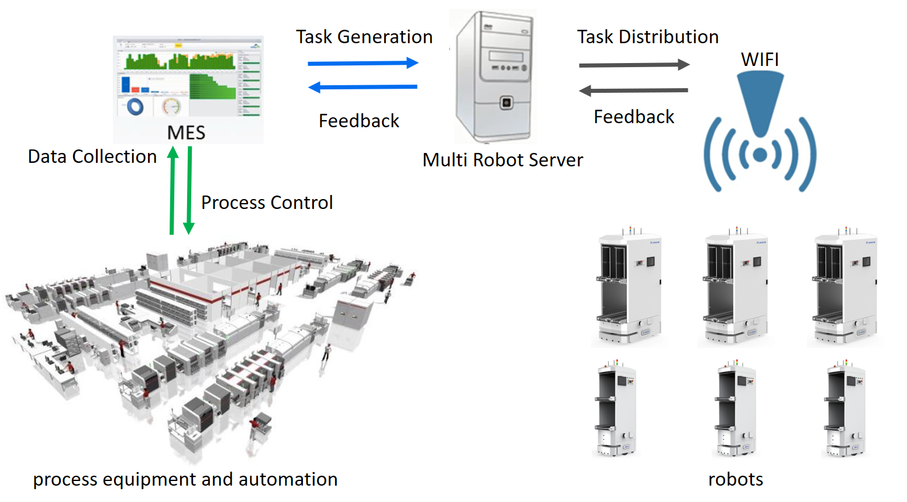

### 2. 系统功能

#### 2.1 功能分解

MCS主要负责采集机台信息、生成任务

RMS主要负责采集机器人信息、接收分配任务

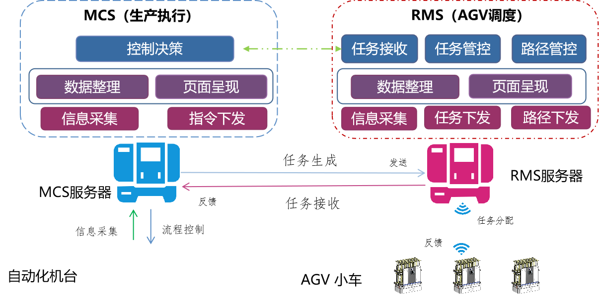

#### 2.2 功能清单

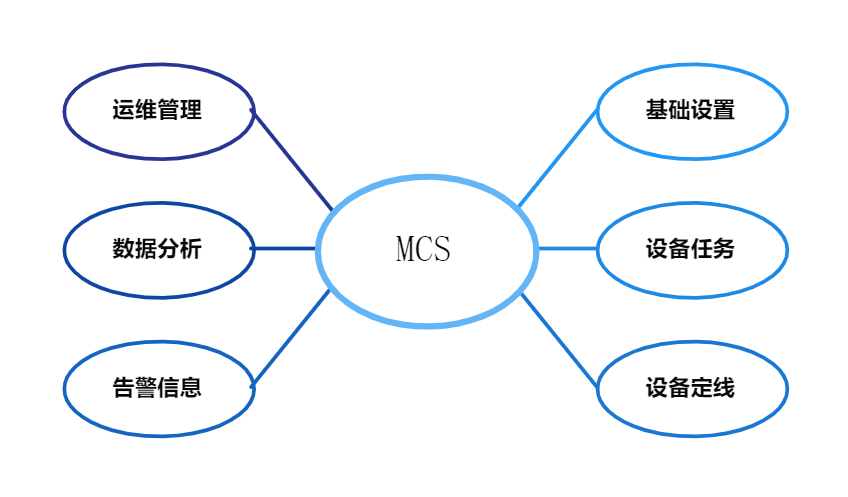

### 3. 专业术语解释
如果文档中使用了术语或缩略语，需对其进行定义或解释。

### 4. 用户说明
| 用户 | 使用场景 | 特征 | 权限 |
| ---- | ---- | ---- | ---- |
|      |      |      |      |

### 5. 限制性列表
推荐使用谷歌浏览器。

## 二、操作步骤
### 1. 系统登录
#### 1.1 系统登录
1. 在网址输入框输入已部署好的系统前端的网址（端口：8100）如：淮安捷泰：http://172.25.90.247:8100/login 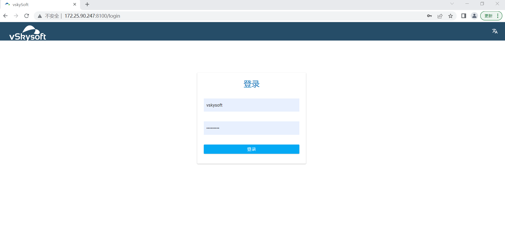
2. 输入用户名和密码进入系统后，选择`企业应用 -- MCS`进入调度页面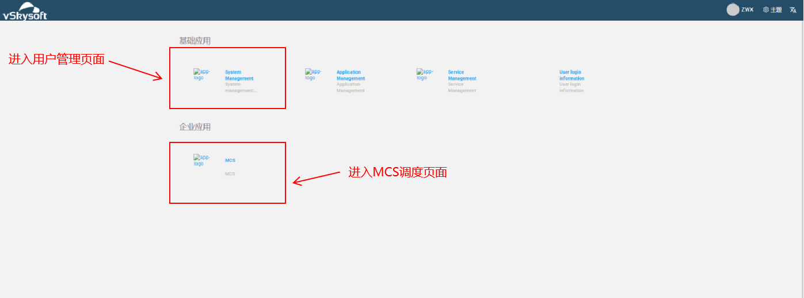
#### 1.2 用户管理

##### 1.2.1 添加新用户（管理员权限的账户可进入)

1. 进入用户管理页面，选择用户管理
2. 点击“+”添加新用户
3. 填写用户信息
4. 保存后，输入的手机号这一栏将作为登录用的用户名，密码默认为 123456（登录后可修改密码 ）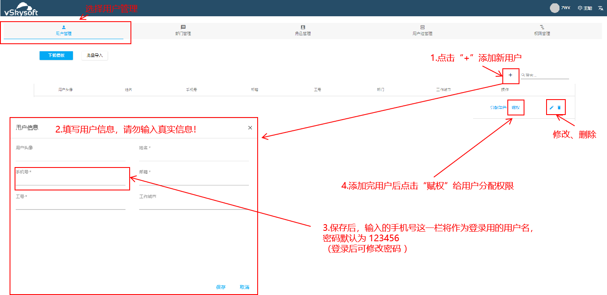
5. 添加完用户后点击“赋权”给用户分配权限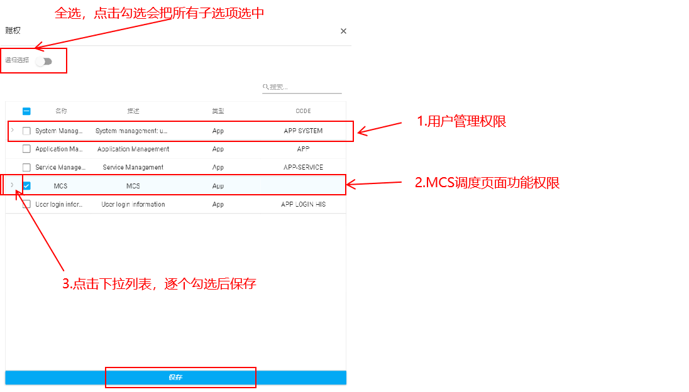

##### 1.2.2 修改密码

1. 用户登录后，点击右上角的头像
2. 修改密码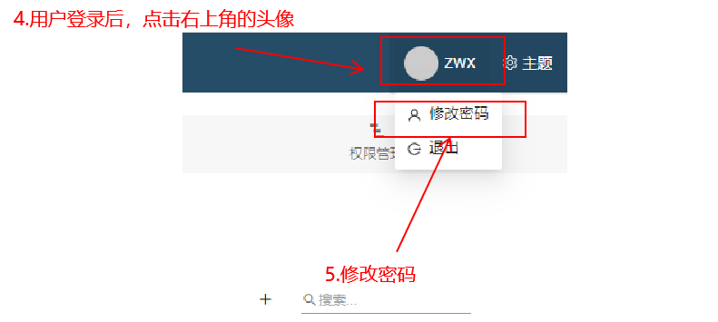

### 2. 基础配置

#### 2.1 工段配置

工艺流程中的花篮流转

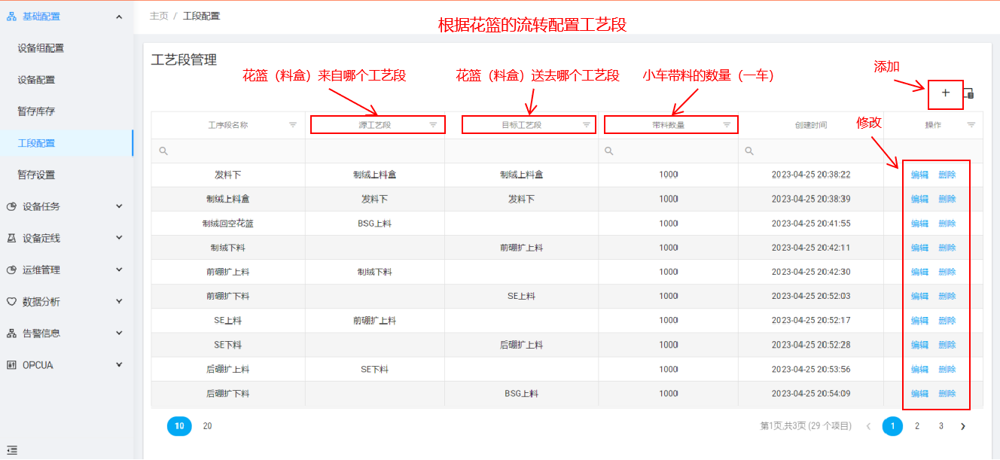

1. 先添加完所有工艺段，包含名称和带料数量其他先不填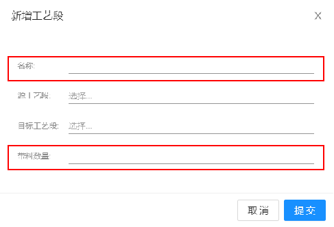
2. 添加完工艺段后点击编辑，选择源工艺段和目标工艺段（根据花篮流转图）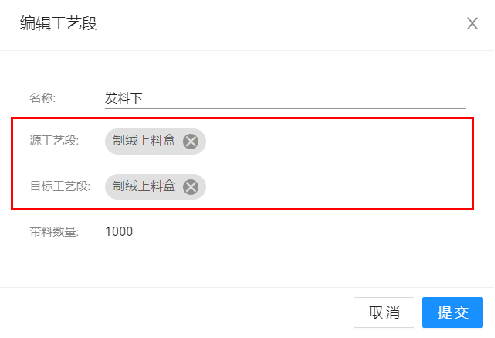
3. 点击提交按钮

#### 2.2 设备配置

配置对接口属性

##### 2.2.1 添加设备

1. 基础配置 --->  设备配置  ------> 点击  “+”  添加设备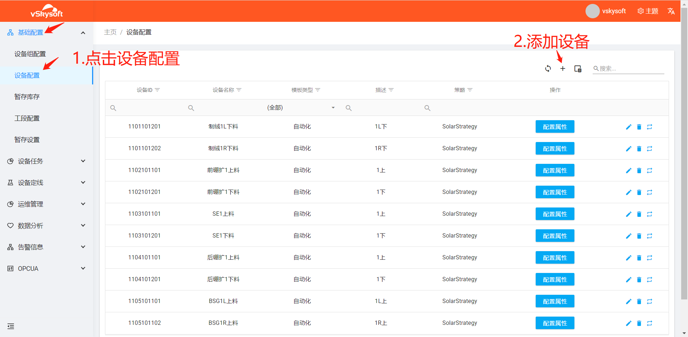

2. 设备对接口配置，确认设备ID和设备名称，配置完后点击“提交”，继续配置对接口属性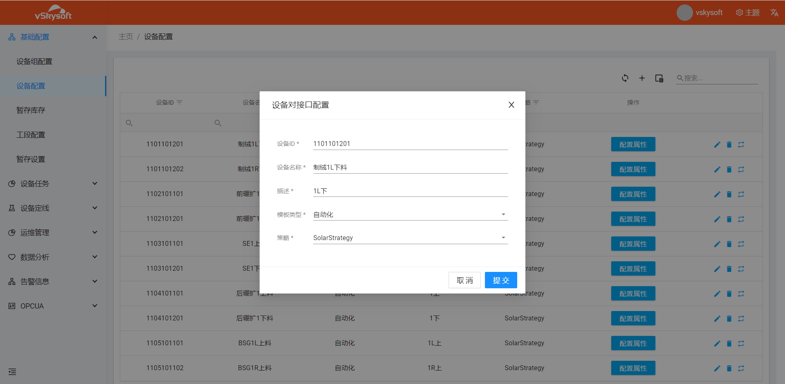

   ###### 对接口属性参数说明

   | 属性     | 说明                                                         | 可选值                                                       |
   | -------- | ------------------------------------------------------------ | ------------------------------------------------------------ |
   | 设备ID   | 如制绒1L下料 设备ID :11 01 1 01 21，其中11 为厂家号，车间固定时，其值不变；01 为工艺段序号 例如: 碱抛为05 ALD为09；1 为设备类型，自动化为1；01 为设备编号，04为同工艺段第四台设备；2 上下料，1为上料2为下料；01 为保留，通常1 2 代表设备的A侧和B侧对接口或L(左)侧和R(右)侧3为空花篮；特殊如: 发料(118811) 和缓存 (110030111) 缓存站ID最后一位代表层数 |                                                              |
   | 设备名称 | 机台名，以现场实际情况为准                                   |                                                              |
   | 描述     | 一般为机台号+上下料，主要用于定线页面的显示                  |                                                              |
   | 模板类型 | 下拉列表选择，对应机台类型                                   | 自动化：自动化机台 暂存: 缓存站  QC: 未知 (暂未定义) |
   | 策略     | 下拉列表选择                                                 | 自动化机台通常为 SolarStrategy (模板类型选择: 自动化)  单口缓存站通常为 OneDockStrategy (模板类型选择: 暂存)  双口缓存站为 TwoDockStrategy (模板类型选择: 暂存) |

##### 2.2.2 配置属性

配置设备对接口属性，确认是否是上（下）料口、所处工艺段、轨道动作以及花篮类型等

1. 添加完设备后点击配置属性
2. 在配置属性页面点击右边的按钮修改属性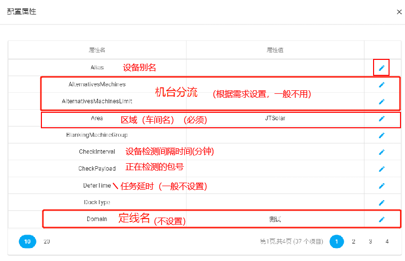 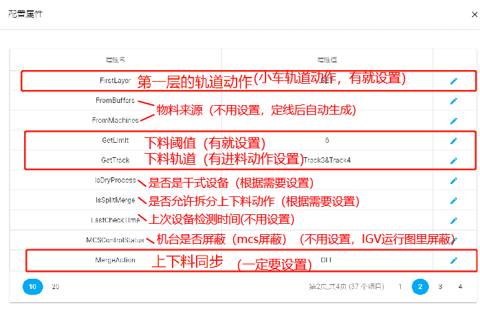 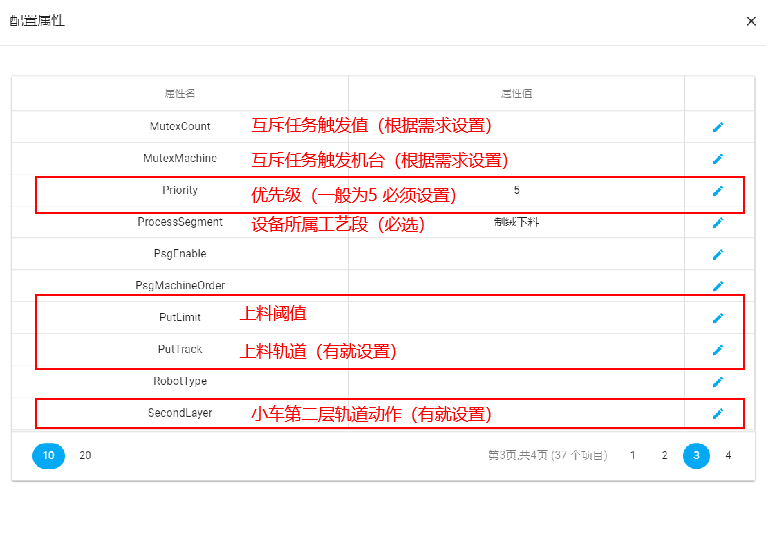 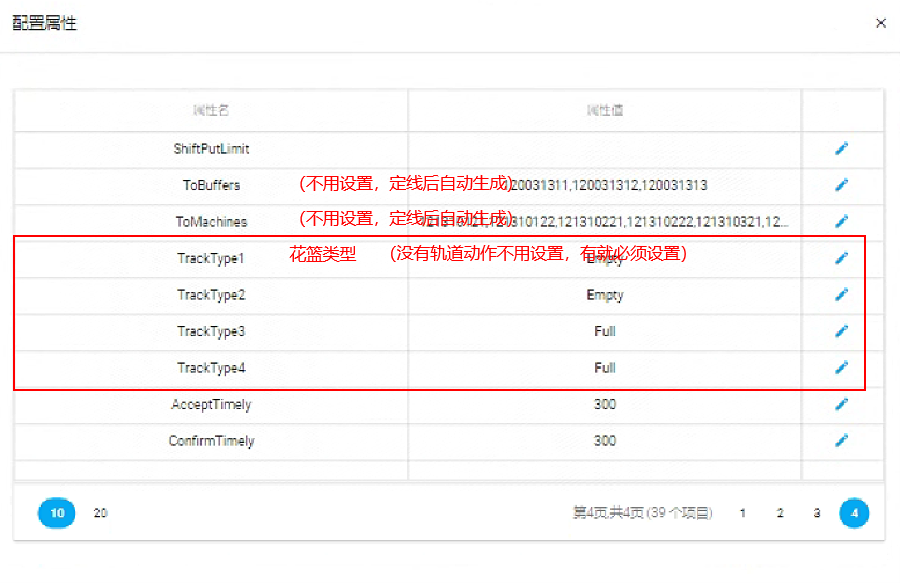

**配置属性参数说明**

| 属性                      | 说明                                                         | 可选值                                                       |
| ------------------------- | ------------------------------------------------------------ | ------------------------------------------------------------ |
| AlternativesMachines      | 备选机台，填设备id（分流）                                   |                                                              |
| AlternativesMachinesLimit | 备选机台间值（值/2 = 限制等候的机器人数，实际机器人数大于该值时，多出的机器人到指定机台送料） |                                                              |
| Area                      | 区域，车间内该值固定                                         |                                                              |
| BlankingMachineGroup      | 控制此设备的下料设备，用处: 由下料数量控制上料进料           |                                                              |
| CheckInterval             | 设备检测间隔时间（单位: 分钟）                               |                                                              |
| CheckPayload              | 设备正在检测的包号，设备已有检测包号或设备有任务时不生成检测任务 |                                                              |
| DeferTime                 | 任务延迟设置 （单位:秒）                                     |                                                              |
| DockType                  | 设备轨道类型                                                 | 单轨single 双轨Double                                   |
| FirstLayer                | 机器人第一层轨道动作（没有轨道动作就不用设置，若设置错了可以改成OFF | GET（进料）  PUT（出料）                                |
| FromBuffers               | 设备可以上哪些暂存站接下来的料（值为设备组里的）可以设置多个暂存站(以英文逗号分隔) |                                                              |
| FromMachines              | 设备可以上哪些设备下的料（值为设备组里的）可以设置多个设备(以英文逗号分隔) |                                                              |
| GetLimit                  | 此机台设备下料满足（大于或等于）多少个花篮时，产生下料任务（设置为11或以上，因为下料轨道最大装10个花篮，所以不会产生任务，相当于屏蔽该设备的下料任务） |                                                              |
| GetTrack                  | 进料轨道                                                     | Track1：机器人的左上一轨道进料动作（面对机器人）  Track2：机器人的右上一轨道进料动作（面对机器人）  Track3：机器人的左下一轨道进料动作（面对机器人）  Track4：机器人的右下一轨道进料动作（面对机器人）  Track1&Track2：机器人的第二层轨道进料动作（面对机器人）  Track3&Track4：机器人的第一层轨道进料动作（面对机器人） |
| IsSplitMerge              | 是否允许拆分上下料动作                                       |                                                              |
| MergeAction               | 使上下料同步进行，并以PUT或GET动作为主（上下料同步进行时，一般以传输满料那一层的轨道动作为主；若是单进或者单出设置成OFF） | GET：以GetLimit来发任务发上下料同步的任务（以GET为主）  PUT：以PutLimit来发任务发上下料同步的任务（以PUT为主）  OFF：关闭 |
| IsDryProcess              | 是否干式设备(干式设备可限制出料，湿式不可，必须直接出料)     | True（干区）  False（湿区）                             |
| MutexCount                | 互斥任务触发值，当上下料轨道上的花篮数大于该值时优先产生下料任务，小于该值时优先产生上料任务 |                                                              |
| MutexMachine              | 互斥机台（一般是上下料距离过近的机台设置）                   |                                                              |
| Priority                  | 优先级（默认值为5，值越大优先级越大）                        |                                                              |
| ProcessSegment            | 设备所属工艺段（与 基础配置-工段配置 关联）                  |                                                              |
| PsgEnable                 | 激活Psg特殊功能（暂时无此需求）                              | True（启用）  False（关闭）                             |
| PsgMachineOrder           | 可送Psg设备顺序（暂时无此需求）                              |                                                              |
| PutLimit                  | 此机台上料花篮数少于多少个时，产生上料任务（设置为-1相当于屏蔽该设备的上料） |                                                              |
| PutTrack                  | 出料轨道                                                     | Track1：机器人的左上一轨道出料动作（面对机器人）  Track2：机器人的右上一轨道出料动作（面对机器人）  Track3：机器人的左下一轨道出料动作（面对机器人）  Track4：机器人的右下一轨道出料动作（面对机器人）  Track1&Track2：机器人的第二层轨道出料动作（面对机器人）  Track3&Track4：机器人的第一层轨道出料动作（面对机器人） |
| SecondLayer               | 机器人第二层轨道动作（没有轨道动作就不用设置，若设置错了可以改成OFF） | GET（进料）  PUT（出料）                                |
| ToBuffers                 | 该设备下料可以送往哪些暂存站（值为设备组里的）可以设置多个暂存站（以英文逗号分隔） |                                                              |
| ToMachines                | 该设备下料可以送往哪些设备（值为设备组里的）可以设置多个设备（以英文逗号分隔） | TrackType1：左上一轨道花篮类型（面对机器人）  TrackType2：右上一轨道花篮类型（面对机器人） TrackType3：左下一轨道花篮类型（面对机器人） TrackType4：右下一轨道花篮类型（面对机器人）（没有轨道动作不用设置，若设置错了可以选OFF）Empty：空花篮，Full：满花篮 |
| AcceptTimely              | 分配及时时间(单位:秒)，用以判断该设备任务接收是否及时。任务创建时间与接收时间间隔，若小于此时间，则为及时。最终在“及时率”报表展现。 |                                                              |
| ConfirmTimely             | 移动及时时间(单位:秒)，用以判断该设备任务接收是否及时。接收时间与机器人到位时间间隔，若小于此时间，则为及时。最终在“及时率”报表展现。 |                                                              |

##### 2.2.3 机台互斥功能的配置

此功能主要用于一些特殊机台，由于上下料对接口离得过近，需要添加互斥功能，使得上下料的任务不会在同一时间生成导致机器人运行不顺畅。

互斥功能的配置在设备配置项为 `基础配置-设备配置` 中 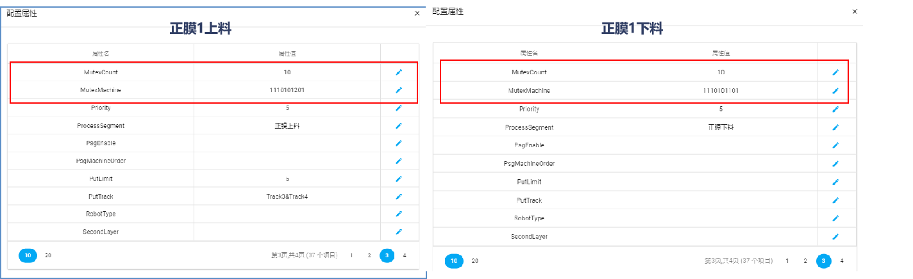

**互斥配置属性参数说明**

| 属性                     | 说明                                                         | 可选值 |
| ------------------------ | ------------------------------------------------------------ | ------ |
| MutexCount（互斥生效值） | 当MutexCount设置在上料对接口时，上下料轨道花篮数之和小于等于互斥值时，只生成上料任务；当MutexCount设置在下料对接口时，上下料轨道花篮数之和大于等于互斥值时，只生成下料任务； |        |
| MutexMachine（互斥机台） | 与当前机台对接口互斥的另一个对接口的设备ID，两边都要设置互斥（注：互斥仅用于同一机台的上下料对接口  如：正膜1上料 和 正膜1下料） |        |

##### 2.2.4 缓存配置

暂存的每一层都要单独配置，如果是双口暂存，则上下料口对应的每一层也都要单独配置 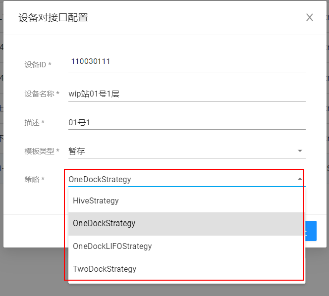

**设备对接口配置属性参数说明**

| 属性     | 说明                                                   | 可选值                               |
| -------- | ------------------------------------------------------ | ------------------------------------ |
| 设备ID   | 缓存站每一层都有一个ID                                 |                                      |
| 设备名称 | 暂存1第一层（每一层都是一个设备）                      |                                      |
| 描述     | 略，主要在定线页面显示                                 |                                      |
| 模板类型 |                                                        | 自动化：自动化机台 暂存：缓存站 |
| 策略     | 单口暂存选 OneDockStrategy，双口暂存选 TwoDockStrategy |                                      |

##### 2.2.5 配置缓存属性

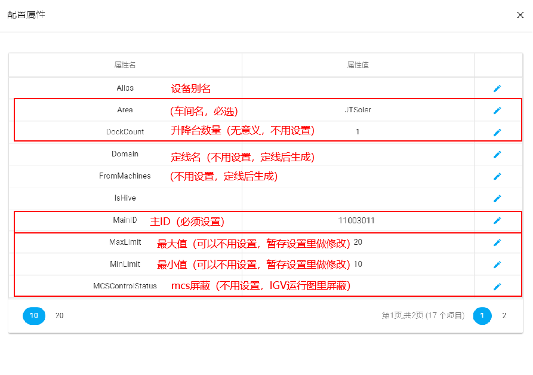 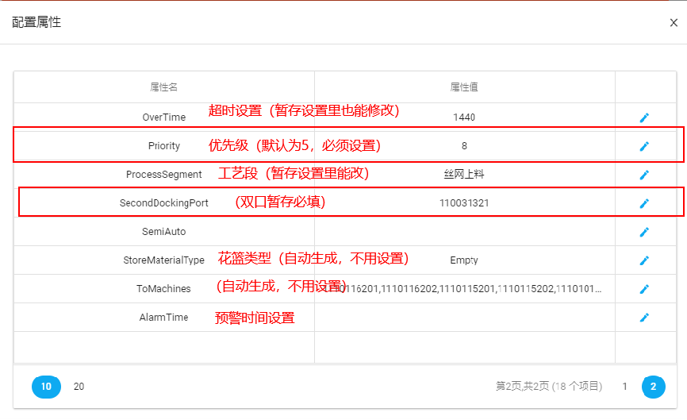

**缓存配置属性参数说明**

| 属性              | 说明                                                         | 可选值                       |
| ----------------- | ------------------------------------------------------------ | ---------------------------- |
| DockCount         | 该暂存的升降台数量                                           |                              |
| MainID            | 主ID（一个暂存一个ID，每个暂存的层ID是在该ID后加上层数）     |                              |
| FromMachines      | 该暂存可以存放哪些机台下的料（值为暂存组里的）可以设置多个设备(以英文逗号分隔) |                              |
| MaxLimit          | 进料阈值，机器人携带该组设备中料的车数（缓存所处工艺段相同包号的车数）【按照轨道计算需要机器人数 X2】大于该值时，将产生往该缓存站中送的任务，如图，即大于10车时，缓存产生上料任务 |                              |
| MinLimit          | 出料阈值，机器人携带该组设备中料的车数（缓存所处工艺段相同包号的车数）【按照轨道计算需要机器人数 X2】小于该值时，将产生从该缓存站中取料的任务，如图，即小于5车时，机器人产生下料任务 |                              |
| OverTime          | 超时设置，单位为分钟，存放该暂存的料超过该时间会优先送去做任务 |                              |
| Priority          | 优先级，默认为5，值越高优先级越大，一般不超过7。缓存组里优先级高的缓存会先接到任务。 |                              |
| ProcessSegment    | 缓存所处工艺段，存放该工艺段的料                             |                              |
| StoreMaterialType | 存放的花篮类型（不填时默认为满花篮）                         | Full 满花篮 Empty 空花篮 |
| ToMachine         | 从该暂存接的料，可以送去哪些机台上料（值为暂存组里的）不用配，定线后会显示 |                              |
| SecondDockingPort | 双口暂存专用，填与该层对应另一边的上（下）料对接口的id，例如 110030511（wip站05号1层）对应的SecondDockingPort为110030521 |                              |
| AlarmTime         | 预警时间设置，单位为分钟，存放该暂存的料超过该时间会在“大暂存预警”页面警示 |                              |

#### 2.3 暂存设置

点击“编辑”修改暂存设置，配置暂存属性

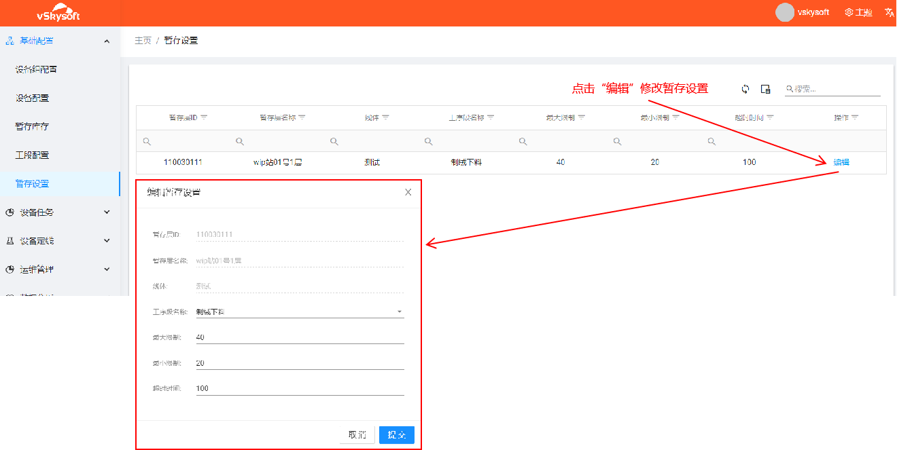

**暂存属性说明**

| 属性       | 说明                                                         | 可选值 |
| ---------- | ------------------------------------------------------------ | ------ |
| 工艺段名称 | 与设备配置里的ProcessSegment关联，缓存所处工艺段，存放该工艺段的料 |        |
| 最大限制   | 与MaxLimit关联，进料阈值                                     |        |
| 最小限制   | 与MinLimit关联，出料阈值                                     |        |
| 超时时间   | OverTime，超时设置，单位为分钟                               |        |

#### 2.4 暂存库存

配置暂存每一层能放几车料以及花篮类型，如果为双口暂存则多预留出一层

1. 暂存信息在`数据分析-暂存信息`里显示

2. 点击“+”添加暂存库存状态

3. 添加暂存库存状态后，暂存中有料的话，存储时间会是暂存物料送进去的时间，无料的话，时间会更新为1900/1/1

   注：每一层都要配置，每一层的AB轨道都要配置

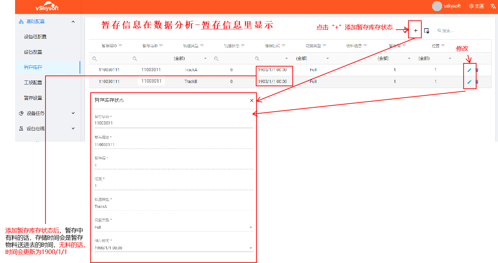

**暂存库存属性说明**

| 属性     | 说明                                                         | 可选值                          |
| -------- | ------------------------------------------------------------ | ------------------------------- |
| 暂存层ID | 暂存ID后加上层数                                             |                                 |
| 暂存ID   | 一个暂存一个ID                                               |                                 |
| 暂存层   | 第几层                                                       |                                 |
| 位置     | 暂存存放料每一车占一个位置，如果是双口暂存则多预留一个位置给升降台（先进先出的原理按U字型排序） |                                 |
| 轨道类型 |                                                              | TrackA：A轨道 TrackB：B轨道 |
| 花篮类型 |                                                              | Empty：空花篮 Full：满花篮  |

#### 2.5 设备组配置

定线自动生成，定线组里相同工序段内的所有机台或暂存为一组

点击“+”添加设备组（不用手动添加，定线后自动生成）

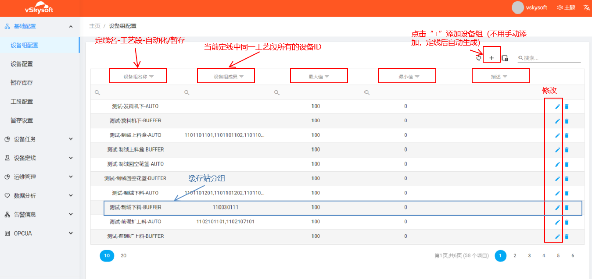

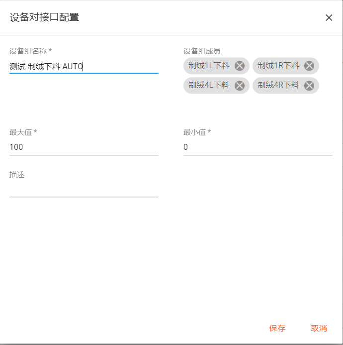

**设备组属性说明**

| 属性       | 说明                                                         | 可选值 |
| ---------- | ------------------------------------------------------------ | ------ |
| 设备组名称 | 组名（自定义）定线后自动生成                                 |        |
| 设备组成员 | 组成员（多选，列表为已加的所有设备）                         |        |
| maxValue   | 机器人携带该组下料数大于该值时，这些自动化机台将不再产生任务（缓存站分组中，机器人携带该组设备中料的车数【按照轨道计算需要机器人数 X2】大于该值时，将产生往暂存中送的任务） |        |
| minValue   | 目前无实际意义（缓存站分组中，机器人携带该组设备中料的车数【按照轨道计算需要机器人数 X2】实际数量小于该值时，将产生从暂存中取料的任务） |        |
| 描述       | 自定义描述                                                   |        |

注：暂存需要每一台每一层都做一个分组作为基础（最大值和最小值起作用），当该暂存的指定层存放的物料空闲在制2大于maxvalue（最大值）时，会往该暂存的指定层送物料；若空闲在制2小于minvalue（最小值）时，将会从该暂存指定层接出物料。  2为【按照轨道计算需要机器人数 X2】
暂存配置里最大值和最小值生效优先级大于设备组配置

### 3. 设备任务

#### 3.1 实时任务

正在进行的任务，MCS根据采集到的机台信息判断满足条件则生成任务

- 搜索：一般可以搜索机台查找任务，或者搜索机器人号
- 取消任务： 找到想要取消的任务对应的取消键，点击取消按钮后可点击刷新按钮，查看任务是否已取消成功。（不能直接取消，先在mcs里取消，再去rms里取消对应任务）如果是双口暂存则不能取消任务，必须等任务做完。
- 任务状态 ：
  - SendSuccess ：成功发送任务到rms
  - Cancel：任务取消
  -  Fail：任务失败
  - MESProcessed：MCS系统发出任务，但未发送到RMS系统，无法正常叫车
  - WaitingCancel：等待被取消
  - Confirmed：机器人已到达机台，并且二次确认
  - Accepted：已被rms接收

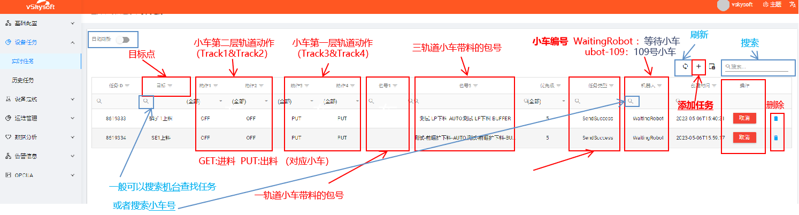

#### 3.2 添加任务

1. 点击“+”添加任务，手动发任务
2. 保存后，刷新页面看是否发送成功，查看任务状态是否为 SendSuccess 如果是就发送成功
3. 一般任务状态变化为：Create->MESProcessed->SendSuccess

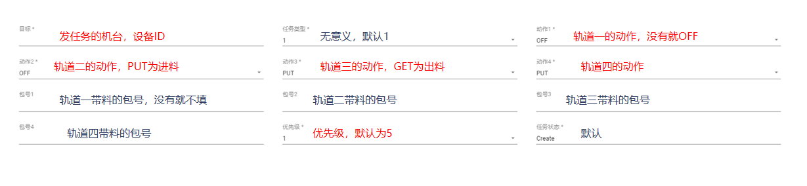

**任务属性说明**

| 属性     | 说明                         | 可选值 |
| -------- | ---------------------------- | ------ |
| 目标     | 发任务的机台，设备ID         |        |
| 任务类型 | 无意义，默认1                |        |
| 动作1    | 轨道一的动作，没有就OFF      |        |
| 动作2    | 轨道二的动作，PUT为进料      |        |
| 动作3    | 轨道三的动作，GET为出料      |        |
| 动作4    | 轨道四的动作                 |        |
| 包号1    | 轨道一带料的包号，没有就不填 |        |
| 包号2    | 轨道二带料的包号             |        |
| 包号3    | 轨道三带料的包号             |        |
| 包号4    | 轨道四带料的包号             |        |
| 优先级   | 优先级，默认为5              |        |
| 任务状态 | 默认                         |        |

#### 3.3 历史任务

已经结束的任务，其中包括失败的任务

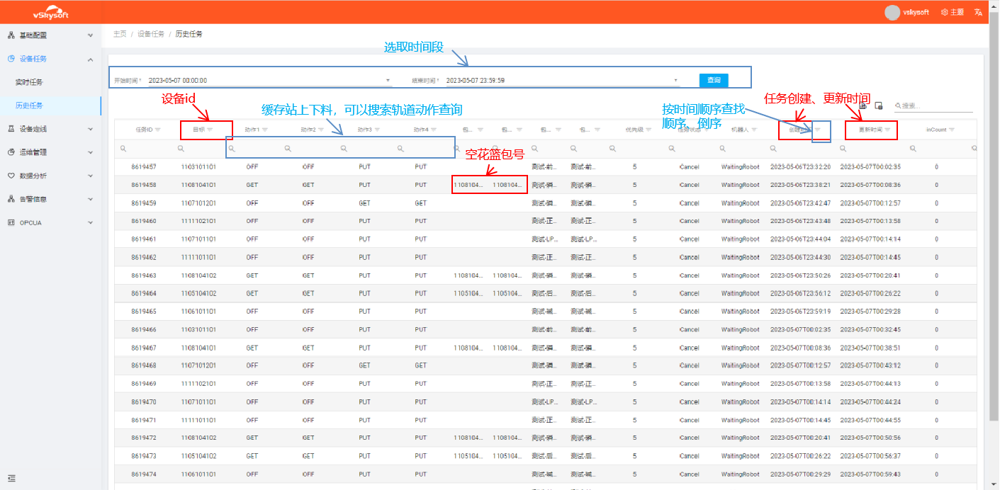

### 4. 设备定线

#### 4.1 当前定线

在当前定线中我们可以查看到当前已定的线别只能查看，不能添加、删除和修改，（分配权限时可以允许用户使用该功能）

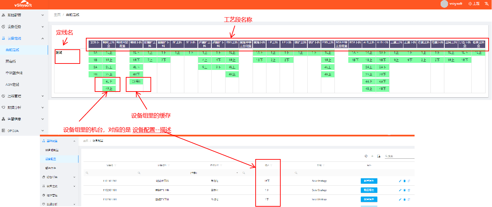

#### 4.2 预定线

机器人只能运输到定线中指定的机台，不能运输到其他定线或者未定线中的机台。因工艺需要，定线可使机器人运输到指定线别机台，以达到不混料的目的

在预定线中，会有每个工艺段的一列，在这一列的最下方有该工艺段所有自动化机台。选择需要定线的线别，双击需要定线的自动化机台即可加入该线别，并依次点击暂存、 使用，即完成定线。  (注：任何线别的自动化，做出任何动作后，都需要暂存使用后才可生效)

同一时间内，预定线页面只允许一位用户进入查看和修改

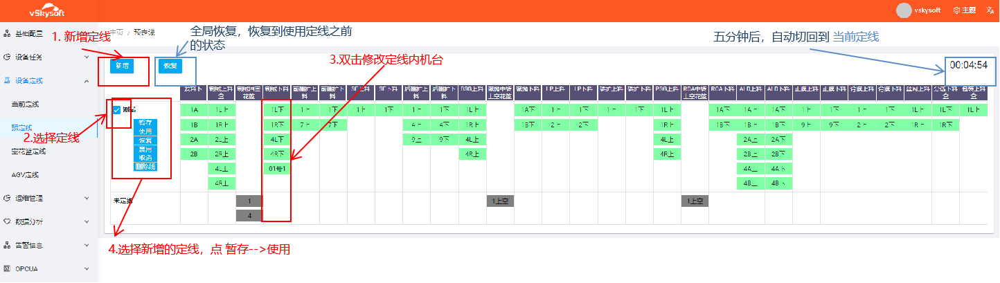

##### 4.2.1 定线操作步骤

1. 点击“新增”
2. 输入名称（保存后不能修改）
3. 保存
4. 选择该定线
5. 双击选择机台，移动到定线
6. 点击“暂存”保存修改，上方会显示暂存成功
7. 点击“使用”，启用定线上方会显示使用成功

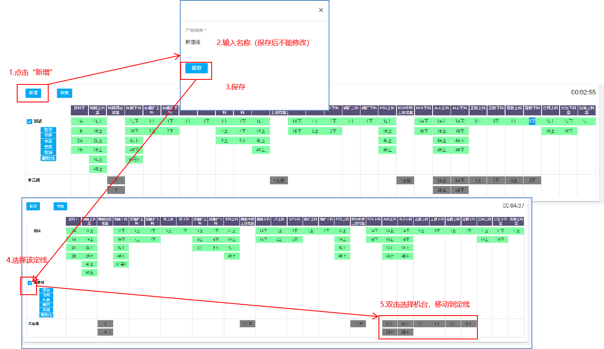 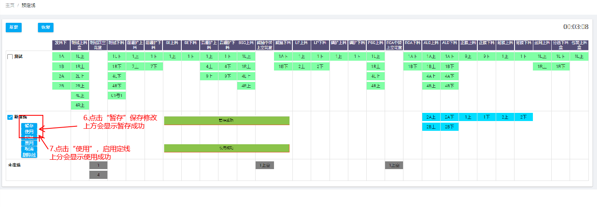

**定线状态说明**

- 暂存：保存修改，但是不会生效
- 使用：使用当前定线，修改的内容会启用
- 恢复：当前定线恢复到修改之前的状态（暂存后也能恢复，使用定线后恢复不了）
- 禁用：禁止使用当前定线
- 取消：撤回当前的修改（暂存后不能取消）
- 删除线：删除当前定线（启用状态下不可直接删除，需先禁用再删除）

#### 4.3 空花篮定线

选择该工序段的机台空花篮运送到同循环内接收空花篮的机台，空花篮的机台是根据设备配置中已配置的 TrackType 自行识别，其中：Empty（空花篮），Fulll（满花篮）

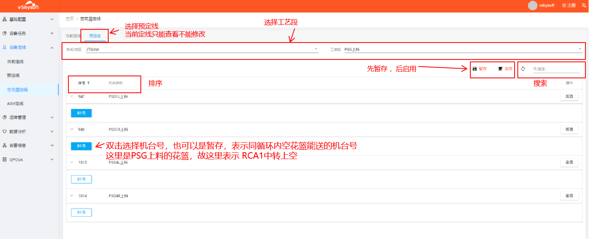

### 5. 数据分析

#### 5.1 实时监控

在`数据分析-实时监控`中我们可以查看到OPC点位状态监控，主要查看点位更新时间是否及时（对应IGV实时运行图）

**实时监控字段说明**

| 字段     | 说明                                                         |
| -------- | ------------------------------------------------------------ |
| 数量     | 轨道花篮数                                                   |
| 状态     | T:有任务 F:没有任务                                     |
| 服务状态 | Connected:已连接 空白：未连接（检查opc是否能连，配置是否正确） |
| 更新时间 | 点位更新时间                                                 |

#### 5.2 暂存信息

选择`数据分析-大暂存信息`，用于统计暂存里是否有料、存放料的时间、是否超时

暂存信息里暂存在`基础配置---暂存库存`里配置

超时的时间由`设备配置-暂存配置`中`overtime`触发，当进料时间超过`overtime`设置的时间时，即变为红色

预警的时间由`设备配置-暂存配置`中`alarmtime`触发，当进料时间超过`alarmtime`设置的时间时，即变为黄色

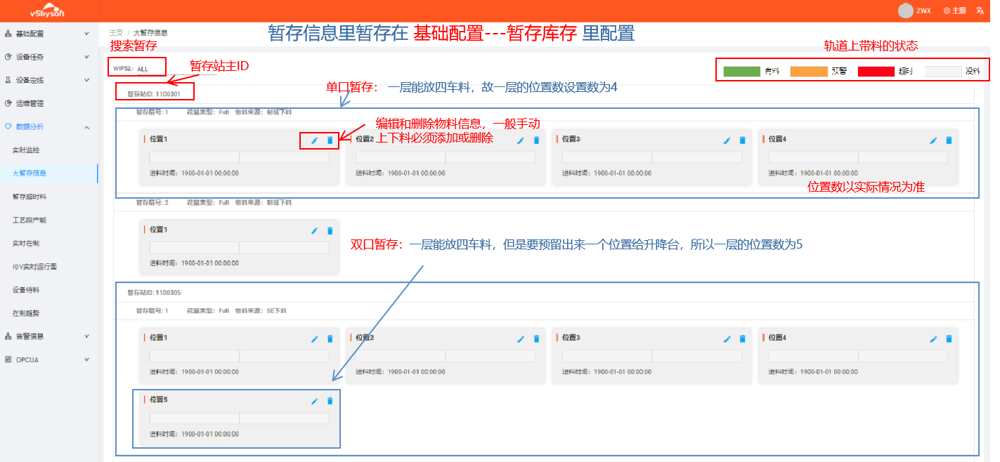

#### 5.3 暂存超时料

选择`数据分析-暂存超时料`， 可通过数据以及柱状图看到现场暂存站内有多少超时物料

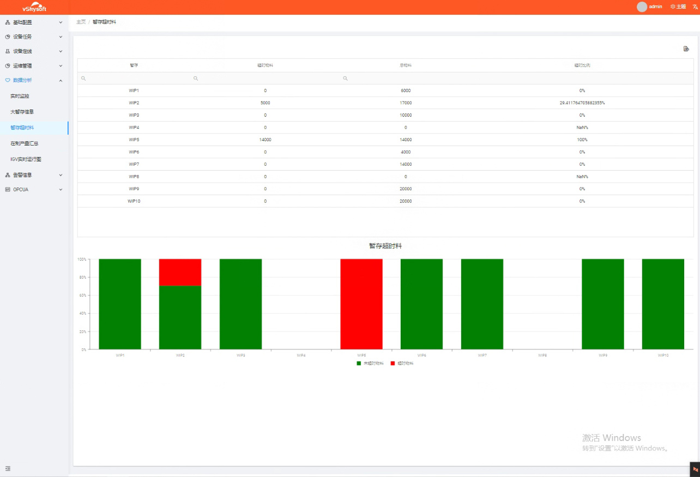

#### 5.4 工艺段产能

选择`数据分析-工艺段产能 `，可根据所需查询的时间设置“开始时间”与“结束时间”，并点击查询（注：该功能仅限于机器人搬运的产能，手动搬运的花篮无法核算）

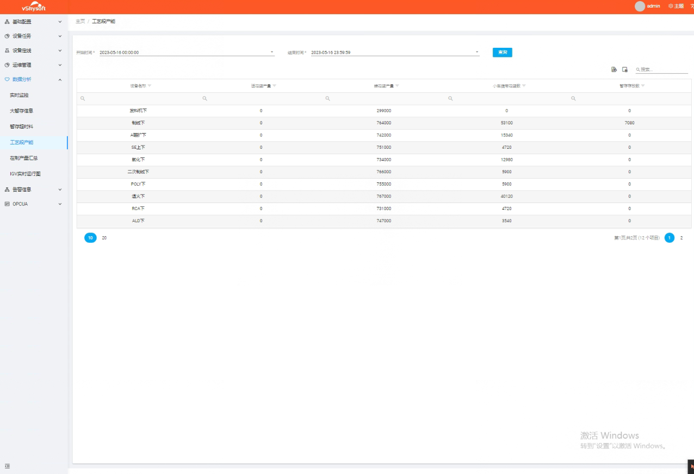

#### 5.5 在制产量汇总

选择`数据分析-在制产量汇总 `，该功能是针对有多条线别时的数据分析，下方数据表格汇集了每条线别的在制产量

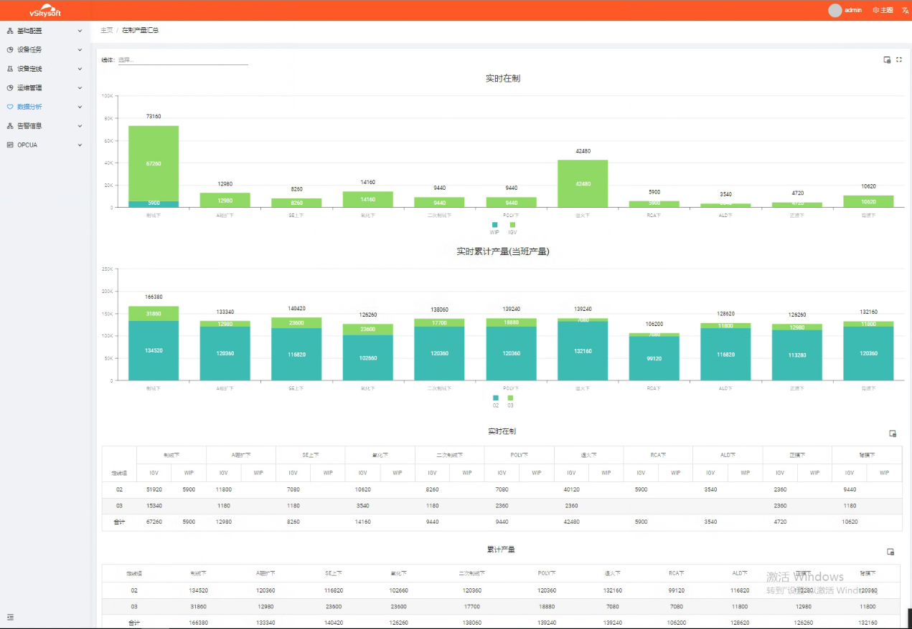

#### 5.6 IGV实时运行图

选择`数据分析-IGV实时运行图`，该功能可监控所有机台的任务状态、轨道花篮数、屏蔽状态

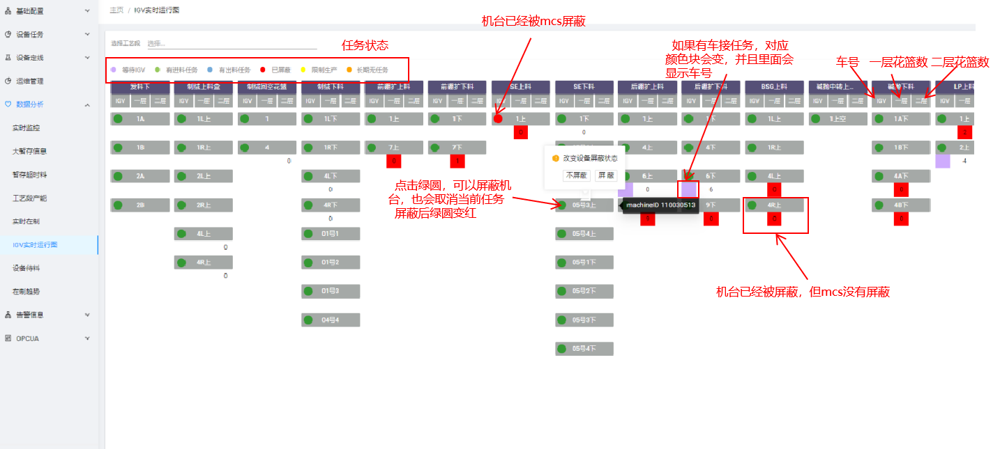

#### 5.7 定线分流

在`数据分析-定线分流`中，该功能主要用于特殊定线内，某一工艺段产能偏高时候，多出的物料往其他定线内的机台输送的作用

**定线分流字段说明**

| 字段         | 说明                                       |
| ------------ | ------------------------------------------ |
| 设备名称     | 分流设备名称                               |
| 本线设备     | 分流设备所处工艺的上个工艺段中所有机台的ID |
| 分流来源设备 | 被分流的设备组中的所有机台的ID             |

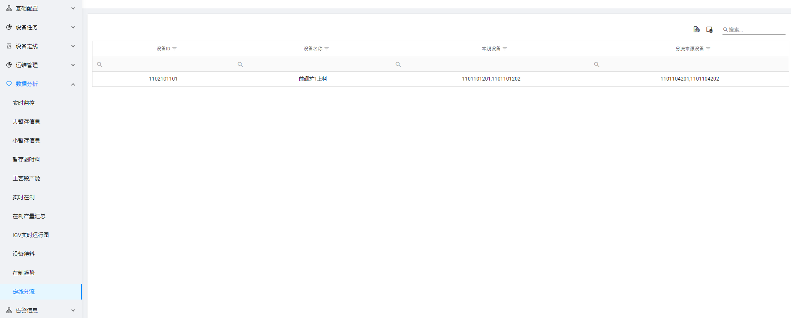

如下，有测试线制绒4对应前硼扩7 ，当制绒4下的料堆积时，可分流到前硼扩1或者测试分流线其他机台
只需在测试分流的线的前硼扩机台 `设备配置-配置属性` 中设置`AlternativesMachines`（需要分流的设备组名）、`AlternativesMachinesLimit`（分流阈值）

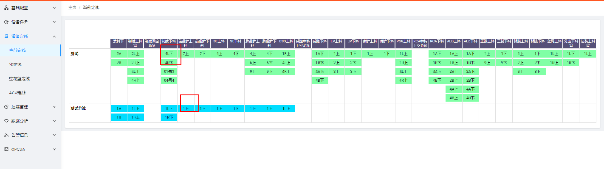

**分流属性配置说明**

| 属性                      | 说明                                                         |
| ------------------------- | ------------------------------------------------------------ |
| AlternativesMachines      | 被分流机台，一般为下料对接口（需要分流的设备组名）如上述测试线的制绒需要分流，只需在测试线之外的前硼扩上料机台属性配置中，手动输入需分流的设备组名（测试-制绒下料-AUTO） |
| AlternativesMachinesLimit | 分流阈值，等待的车数（带同一包号）$\times$ 2 ，大于该值时，进行分流假设扩散1下料有4车，出现了压料的情况可以设置超过两车时，进行分流 值=2（车数）$\times$2（轨道数） |

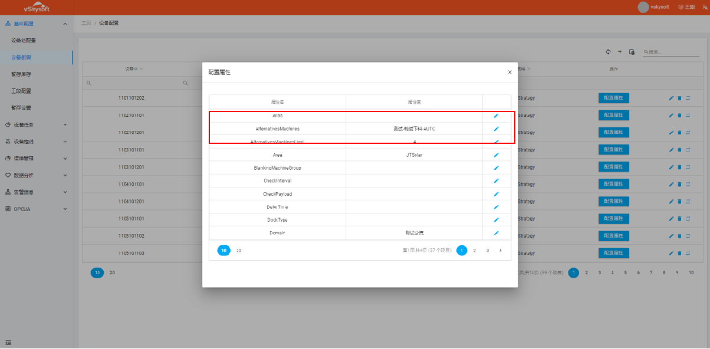

#### 5.8 及时率

在`数据分析-及时率`中，该功能主要用于展示各设备的稼动信息以及及时率信息。

需提前在要统计稼动信息的机台`设备配置-配置属性`中设置AcceptTimely（分配及时时间  单位:秒）、ConfirmTimely（移动及时时间  单位:秒）

**及时率统计字段说明**

| 字段         | 说明                                                         |
| ------------ | ------------------------------------------------------------ |
| 平均分配时长 | 多条任务从创建到分配给机器人的平均时长                         |
| 平均移动时长 | 多条任务从分配给机器人到机器人到位的平均时长                     |
| 分配及时率   | 以分配时长与分配及时时间对比计算是否及时。从而计算出多条任务的分配及时率 |
| 移动及时率   | 以移动时长与移动及时时间对比计算是否及时。从而计算出多条任务的移动及时率 |

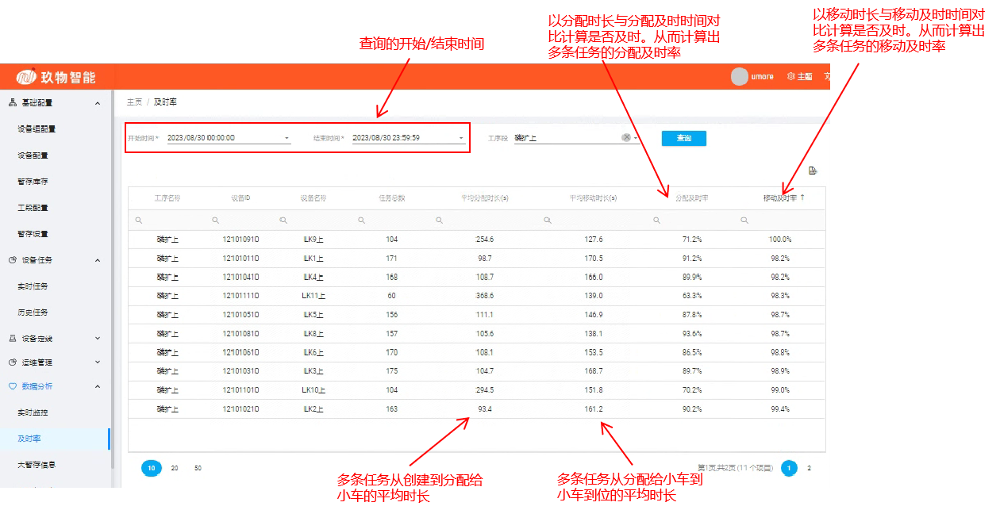 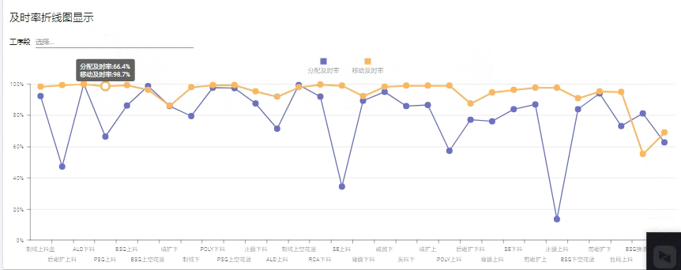

#### 5.9 实时在制

展示各工艺段实时在制品情况

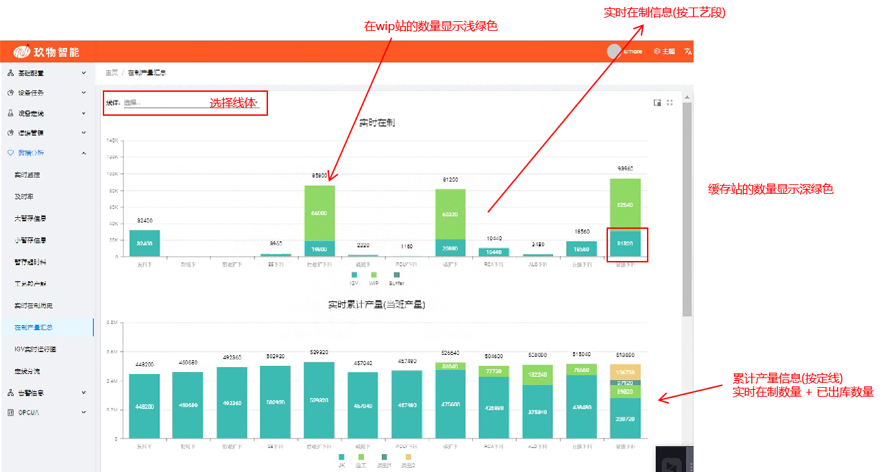 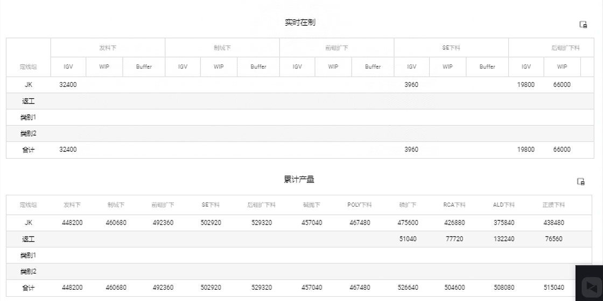

#### 5.10 实时在制历史

实时在制信息在过去各时间点的信息情况

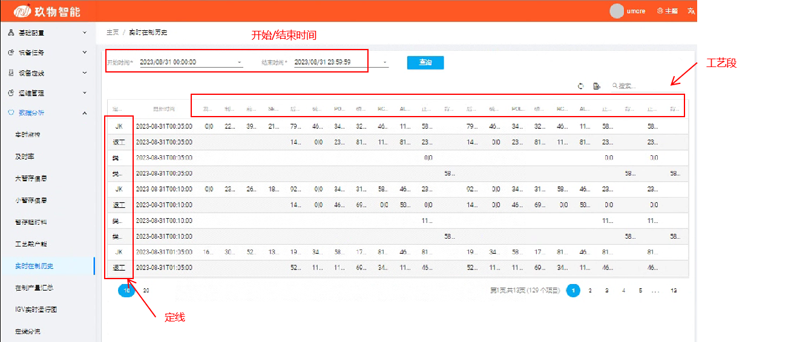

### 6. 其他功能

#### 6.1 运维管理

查看用户操作记录

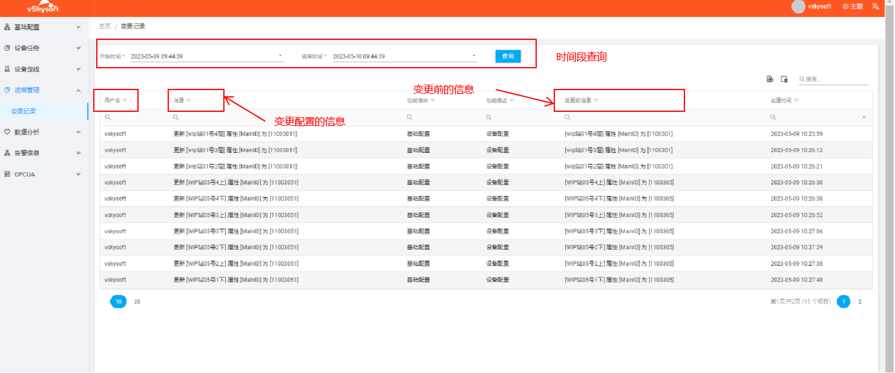

#### 6.2 暂存告警

实时显示暂存状态，是否报警、报错信息

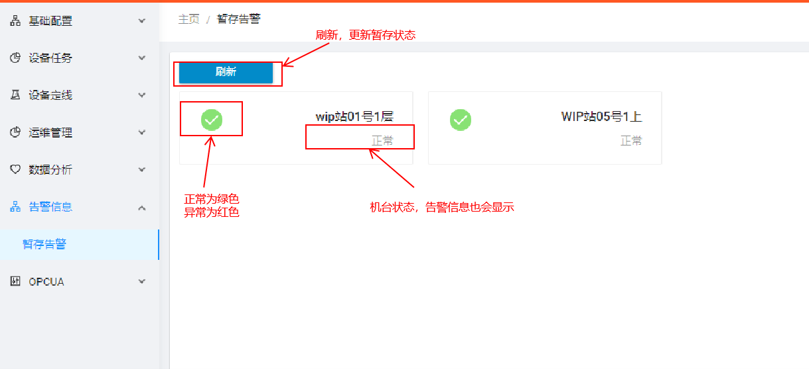

### 7. OPC配置

####  7.1 OPCUA

用于MCS系统的数据采集，获取机台状态，并在IGV实时运行图里显示

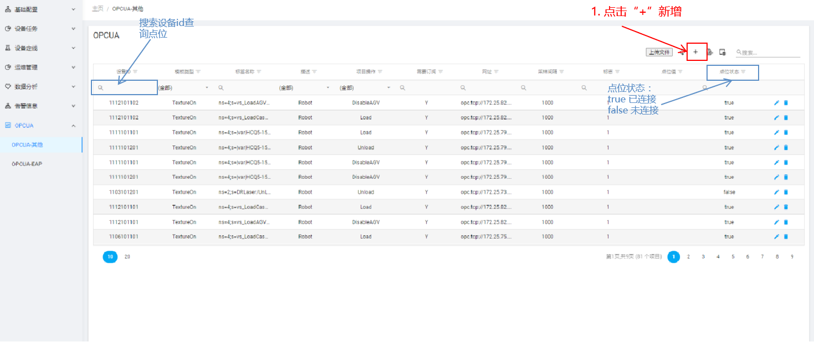

#### 7.2 配置OPC

1. 点击“+”新增 
2. 找到OPC地址及点位标签，首先在IP配置表中找到对应的机台，确认机台IP，一般同一机台只有一个IP（SE设备上下料分别使用不同的IP，碱抛、RCA中转和下料分别使用不同IP），然后OPC为 opc.tcp://localhost:4840 ，localhost用IP地址代替如图 前硼扩上下料的OPC地址都为opc.tcp://172.25.80.25:4840 
3. 打开 Softing OPC UA Client 在 `Project -- add Session `双击创建，然后在右侧`Endpoint Url `这栏输入OPC地址 ：opc.tcp://172.25.80.25:4840 ，最后点击下方`Validate Connection `查看是否连接成功，若是成功点击 OK 进入
4. 在 Configuration下找到对应的文件位置 此处 `vs_LoadCasNum` 为上料花篮点位数量右侧 `Properties`下 `Node Id -- Value` ， `Value`值为标签，复制粘贴到标签名称中（如果找不到窗口，在View下查看视图是否打开）
5. 配置完成后点击保存，刷新一下点位状态，查看是否为true，如果为true则能读取到点位信息，如果为false则表示无法读取，需要查看配置以及网络是否出错。若确认配置无误可以联系自动化机台的厂商协助解决

**OPC配置字段说明**

| 字段     | 说明                                                         |
| -------- | ------------------------------------------------------------ |
| 设备id   | 基础配置--设备配置--设备id                                   |
| 标签名称 | 在OPC UA Client里查找对应的文件位置， 复制Node Id 的 Value值， (一般自动化厂商会提供对应的文件位置) |
| 项目操作 | 进料轨道的花篮数 选 Load 出料轨道的花篮数 选 Unload 轨道的屏蔽点位   选 DisableAGV |
| 网址     | opc地址，一般为opc.tcp://localhost:4840，localhost用机台分配的ip替代，端口号默认4840（例外，SE2机台的端口号为9347，opc.tcp://172.25.73.2:9347） |
| 标志     | 对应的层数 ，1代表第一层，2代表第二层                        |
| 模板类型 | 默认选 TextureOn                                             |
| 描述     | 默认选 Robot（自动化）如果为告警信息，如暂存告警，则选 Alarm |
| 需要订阅 | 默认 Y （大写，代表启用）                                    |
| 采样间隔 | 读取点位信息的时间间隔，单位ms，默认 1000 （1000ms）         |

注：以上填空不允许有空格，有空格必定导致读取不了点位

## 三、常见问题Q&A

