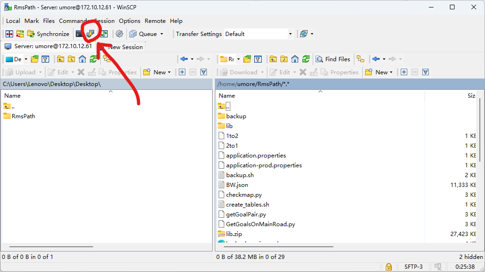
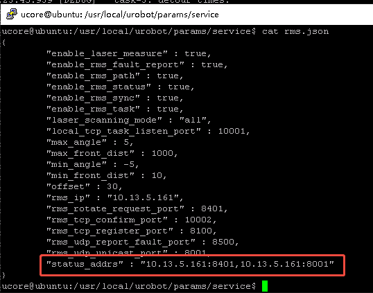
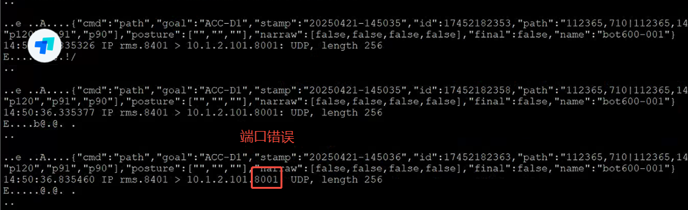
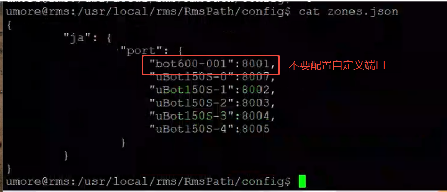
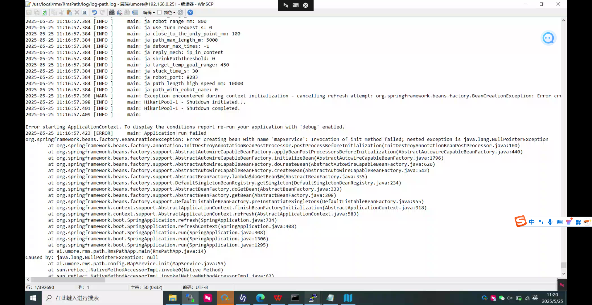
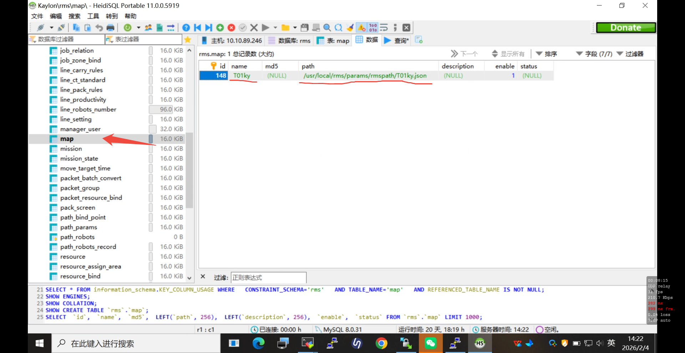
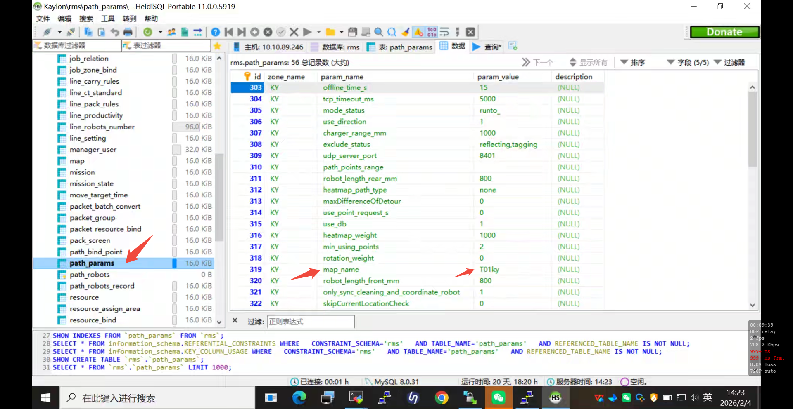
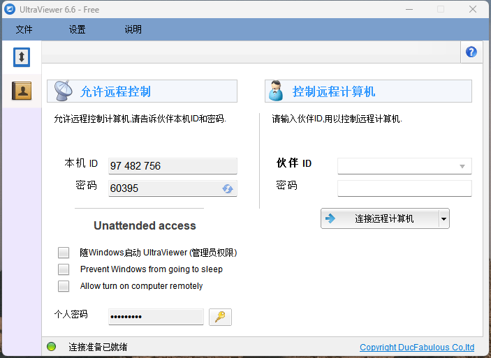

# RmsPath 更新指南

| 文件名称 | RmsPath 部署指南 |
| ---- |--------------|
| 部门   | 软件算法部        |
| 版本   | 2.3          |
| 密级   | 公开           |

## 修改记录

| 版本号 | 修改日期       | 修改人 | 概述     | 详细说明             |
| --- |------------|-----|--------|------------------|
| 1.0 | 2024-09-02 | 钱永儒 | 新增文档   |                  |
| 1.1 | 2025-03-11 | 林祥序 | 整理补充文档 |                  |
| 2.0 | 2025-07-02 | 林祥序 | 归档线上仓库 | 格式整理，补充规范 header |
| 2.1 | 2025-09-23 | 林祥序 | 更新补充   | 新增运行异常           |
| 2.2 | 2025-09-23 | 林祥序 | 添加运行异常 | 新增异常处理           |
| 2.3 | 2026-03-13  | 林祥序 | 格式调整   | 格式调整，校对          |


---

# RmsPath 部署与常见问题

## I. 部署步骤

### 1.1 安装包准备

1. 从开发人员处拿到安装包 RmsPath_init.zip

2. 下载到本地桌面

3. 解压 RmsPath_init.zip

4. 打开 WinSCP 或其他文件传输工具

5. 在 WinSCP 中登录到服务器里

   

6. 将 RmsPath_init 文件夹拖曳到右边 /home/umore/ 目录下

7. 检查 RmsPath_init 文件夹的内容，确保没有嵌套（解压过程中可能导致文件夹嵌套）
## II. 程序更新

1. 在 WinSCP 中打开 putty

   

2. 输入密码

3. 输入指令切换目录
	```bash
	cd RmsPath_init
	```


4. 输入指令查看目录 ~/RmsPath 的内容，确保文件夹没有嵌套
	```bash
	ls
	```


5. 输入指令赋予权限
	```bash
	sudo chmod a+x init.sh
	```


6. 用 ls命令查看目录内容，这两个文件显示为**绿色**就是成功赋予权限了

7. 输入指令执行脚本，程序安装并启动
	```bash
	./init.sh
	```


8. 输入指令查看日志
	```bash
	tail -f log-path.log
	```


9. ctrl-c 停止日志滚动


## III. 问题收录

### 3.1 服务无法启动

**现象**：没有日志输出

**问题排查**：检查Java是否安装

1. 检查是否有 java
	```bash
	java -version
	```

2. java 离线安装包：https://drive.weixin.qq.com/s?k=AJMABQdxAA825EfyfSAUUAnwYqAKM
3. 切换到包含安装包的目录
	```bash
	cd /path/to/java/package
	```

4. 解压文件到目录 /opt/
	```bash
	tar -xzf openjdk-8u44-linux-x64.tar.gz -C /opt/
	```

5. 编辑 ~/.bashrc 配置环境变量
	```bash
	export JAVA_HOME=/opt/openjdk-<version>
	export PATH=$JAVA_HOME/bin:$PATH
	```

6. 加载文件
	```bash
	source ~/.bashrc
	```
7. 检查 java 是否在默认路径上 /usr/bin/java，如果不在，构建软链接
	```bash
	sudo ln -s /opt/jdk/.../bin/java usr/bin/java
	```

### 3.2 服务报错

**现象**： JsonNull

1. **解决方案**：检查依赖包是否有重复
	- 比如服务器上原本已经有程序了，却用 init.sh 再复制了一份

2. **解决方案**：检查地图文件的大小是否正常
	- 服务器的容量满了之后，可能导致地图文件上传异常，**文件存在但是大小为零**
	- 查看硬盘占用空间：```df -h```

### 3.3 RmsPath 无法接收 UDP 状态包

**现象**:  log日志里不能接受到小车的状态

**解决方案**：排查是否能接收小车发送给Path服务的状态包

**机器人配置**

1. 参考机器人目录 `/usr/local/urobot/params/service/rms.json`

2. 检查现场`urobot`版本是否支持udp直发（BOT START(6.87.12.13以上）

3. 检查首6行的 `enable_laser_measure`, `enable_rms_fault_report`, `enable_rms_path`,...,`enable_rms_task` 是否为 `true`

4. 增加`"status_addrs" : "10.12.14.2:8401,10.12.14.2:8001"`（10.12.14.2改为现场服务器ip地址）

   

5. `rms.json`参数增加完成，机器人重启
	```bash
	sudo systemctl restart urobot.service
	```

6. 执行以下指令 查看是否有数据发出
	```bash
	sudo tcpdump -i wlan0 udp port 8001 -A
	sudo tcpdump -i wlan0 udp port 8401 -A
	```

7. rms.json 参数需要批量传给所有机器人重启生效
8. 如果现场有环境监测机器人`status_addrs`多增加一个`8301`，重启机器人生效

**RmsPath 参数配置**

| 参数名称                                    | 参数值 |
| --------------------------------------- | --- |
| only_sync_cleaning_and_coordinate_robot | 1   |
| use_db                                  | 0   |

⚠注意
必须所有机器人全部更新好配置全部重启完成后，才能修改服务器配置
现场改 rms.json 时，注意标点符号格式不能出错
修改后可https://jsonlint.com/检查json格式是否正确

**防火墙配置**

- iptables 中的规则会阻止服务器接收 UDP 包
	```bash
	REJECT     all  --  *      *       0.0.0.0/0            0.0.0.0/0            reject-with icmp-host-prohibited
	```

- 使用下列语句
	```bash
	sudo iptables -L -v -n | grep 8401
	sudo iptables -L -v -n | grep reject
	```

**其他原因**

- 虽然小车发送了 UDP 包，但是服务器收不到：部分现场对网络有严格管控，必须由客户 IT 进行相应的配置，服务器才能接收到 UDP 包

### 3.4 机器人无法接收 UDP 路径包

1. 通过抓包进行检查

	```bash
	sudo tcpdump src host <服务器IP> -A
	```

2. 一般路径包的发送地址（机器人默认的接收端口：8283）：

	```bash
	IP rms.8401 > <机器人IP>:8283
	```

	

3. 检查数据库配置的全局端口：

	```bash
	mysql -u umore -p
	select rms;
	select * from path_params where param_name="robot_port";
	```


检查 zones.json 文件，确保没有配置自定义端口
	```bash
	cd /usr/local/rms/RmsPath/config
	cat zones.json
	```

⚠️注意
一般状况下，机器人不用配置自定义端口




（zones.json 的自定义端口是用于扫地机的）

### 3.5 关于地图的常见错误

3.5.1 服务启动报错关键词：
**Error creating bean with name 'mapService'**



**地图检查**

检查以下几个部分：
1. 数据库 rms.path_params map_name 上面写的内容，比如说 JA
	```mysql
	SELECT * FROM path_params WHERE param_name = 'map_name';
	
	# 输出示例：
	+-----+-----------+------------+-------------+--------------+
	| id  | zone_name | param_name | param_value | description  |
	+-----+-----------+------------+-------------+--------------+
	| 112 | ja        | map_name   | JA          | 地图名称      |
	+-----+-----------+------------+-------------+--------------+
	
	```

2. 数据库 rms.map 上面有没有对应的地图名字和路径，比如说 JA
	```mysql
	SELECT * FROM map WHERE name = '<地图名称>';
	```

3. 文件夹 /usr/local/rms/params/rmspath/ 里面有没有对应的地图文件（后缀 .json）

**RMS 网页端：RmsPath 地图列表：文件已存在**

1. 打开目录 /usr/local/rms/params/rmspath/
2. 备份当前地图，删除该目录下的地图文件
3. 通过网页端重新上传

---

**数据库软件配置地图**

1. 打开数据库软件，如：HeidiSQL，DataGrip
2. 输入服务器 IP，账号 `umore`，密码 ，数据库名称 `rms`，登录数据库
3. 打开 `map` 数据表，根据地图文件名称输入地图 `name`, `path`

	

4. 打开 `path_params` 数据表，修改参数 `map_name`，**注意两个数据表的地图名称要对应**。

	

5. 重启 rms-path 服务应用更新

---

**终端指令配置地图**

1. 地图文件复制到目录 /usr/local/rms/params/rmspath/
2. 打开服务器终端
3. 打开数据库
	```bash
	mysql -uumore -p
	```

4. 输入密码，打开 rms 数据库
	```mysql
	use rms;
	```

5. 更新 map 表
	```mysql
	INSERT INTO map (name, path)
	VALUES ('<地图名>', '/usr/local/rms/params/rmspath/<地图名>.json');
	```

6. 更新 path_params 表
	```mysql
	UPDATE path_params
	SET param_value = '<地图名>'
	WHERE param_name = 'map_name';
	```

7. 检查修改，确认地图名、文件路径没有写错
	```mysql
	SELECT * FROM map WHERE name = '<地图名>';
	
	SELECT * FROM path_params WHERE param_name = 'map_name';
	```


### 3.6 no path

1. 检查路径是否连续
2. 检查屏蔽点
3. 检查目标点 allowPass 选项
	1. 勾选：节点为机台/设备，机器人不可以经过该节点
4. 检查路径点 liftWarehouse 选项
	1. 勾选：节点为库位，不顶升的车才可以经过该节点

### 3.7 机器人 offline

检查是否有发送udp包

检查服务器时区
1. 修改时区
	```bash
	sudo timedatectl set-timezone Asia/Shanghai
	```

2. 重启服务
	```bash
	sudo systemctl restart mysql
	sudo systemctl restart rms-status
	```


## IV. 日志配置

```xml
<rollingPolicy class="ch.qos.logback.core.rolling.SizeAndTimeBasedRollingPolicy">  
    <fileNamePattern>${LOG_HOME}/${FILE_NAME_BAK}-%d{yyyyMMdd}.%i.log.zip</fileNamePattern>  
    <maxHistory>5</maxHistory>  
    <maxFileSize>64MB</maxFileSize>  
    <totalSizeCap>1GB</totalSizeCap>  
</rollingPolicy>
```


## 国外现场远程软件
- 免费版本的 ToDesk 和向日葵不支持国外连接

- 安装：[UltraViewer](https://drive.weixin.qq.com/s?k=AJMABQdxAA8fHyVKjDAUUAnwYqAKM)

  
