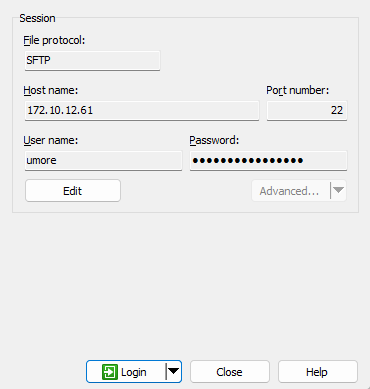
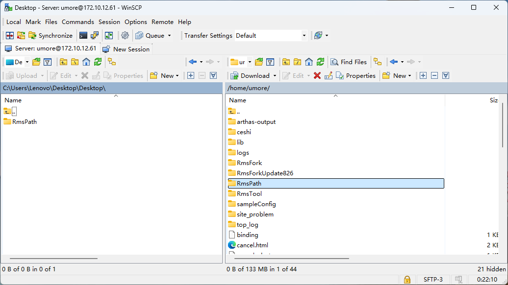
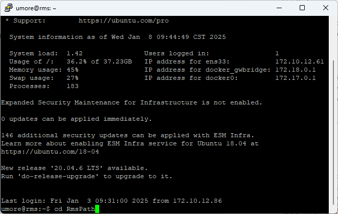
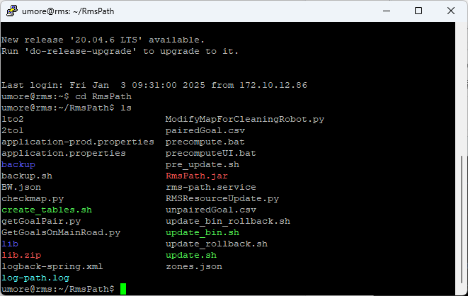

# RmsPath 更新指南

| 文件名称 | RmsPath 更新指南 |
| ---- | ------------ |
| 部门   | 软件算法部        |
| 版本   | 2.0          |
| 密级   | 公开           |

## 修改记录

| 版本号 | 修改日期       | 修改人 | 概述     | 详细说明             |
| --- | ---------- | --- | ------ | ---------------- |
| 1.0 | 2024-09-02 | 钱永儒 | 新增文档   |                  |
| 1.1 | 2025-03-11 | 林祥序 | 整理补充文档 |                  |
| 2.0 | 2025-07-02 | 林祥序 | 归档线上仓库 | 格式整理，补充规范 header |


---

## 一、概述

本文件详细说明了程序的更新流程，包括更新前的准备事项、更新步骤以及更新后的验证方式。文档同时整理了更新过程中常见的问题及其解决方法，旨在提升更新效率，降低操作风险，确保系统平稳过渡至新版本。


## 二、更新包准备

1. 从开发人员处拿到更新包 RmsPath.zip

2. 下载到本地桌面

3. 解压 RmsPath.zip

4. 打开 WinSCP 或其他文件传输工具

5. 在 WinSCP 中登录到服务器里

   

6. 将 RmsPath 文件夹拖曳到右边==/home/umore/== 目录下；若存在==名字重复的目录==，可以将旧的目录重命名以作区分

   

7. 检查 RmsPath 文件夹的内容，确保没有嵌套（解压过程中可能导致文件夹嵌套）

   

## 三、程序更新

1. 在 WinSCP 中打开 putty

   

2. 输入密码

3. 输入指令切换目录

```bash
cd RmsPath
```




4. 输入指令查看目录 ~/RmsPath 的内容，**确保文件夹没有嵌套**

```
ls
```



5.  输入指令赋予权限

```
sudo chmod a+x update.sh
sudo chmod a+x update_rollback.sh
```

6. 用 ls查看目录内容，这两个文件显示为绿色就是成功赋予权限了

7. 输入指令执行脚本，程序预备更新

```
sudo ./update.sh
```

8. 输入指令重启服务

```
sudo systemctl restart rms-path
```

9. 输入指令查看日志

```
tail -f log-path.log
```

10. ctrl-c 停止日志滚动

## 四、程序回退

1. 转到目录

```
cd ~/RmsPath_<版本>
```

2. ==输入指令回退程序==

```
sudo ./update_rollback.sh
```

注意：回退脚本会直接重启程序

3. 回退后可通过二、8. 查看日志


## 五、问题收录