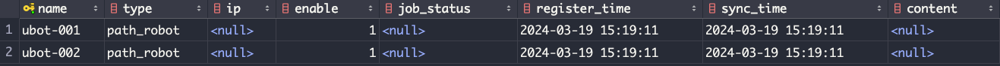
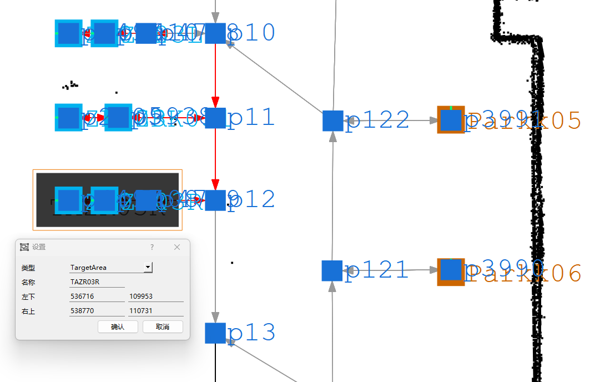

# RmsPath 节点屏蔽

| 文件名称 | RmsPath 节点屏蔽 |
| ---- | ------------ |
| 部门   | 软件算法部        |
| 版本   | 2.0          |
| 密级   | 公开           |

## 修改记录

| 版本号 | 修改日期       | 修改人 | 概述     | 详细说明             |
| --- | ---------- | --- |--------|------------------|
| 1.0 | 2024-03-27 | 钱永儒 | 新增文档   |                  |
| 1.1 | 2025-01-10 | 林祥序 | 整理补充   |                  |
| 2.0 | 2025-07-02 | 林祥序 | 归档线上仓库 | 格式整理，补充规范 header |
|2.1 | 2026-03-05 | 林祥序 | 新增屏蔽节点 | 按料架类型屏蔽点         |

---

## 一、概述

本文件主要介绍路径屏蔽机制的更新流程。内容涵盖路径节点与路径边的屏蔽操作，以及对死锁解锁功能中节点可用性的控制。同时，文档还说明了如何设置目标区域，并实现对不在指定区域内的屏蔽节点或终点的车辆进行过滤。支持按机器人名称、类型、工作区等维度进行灵活配置与屏蔽，以满足不同场景下的调度需求。

## 二、屏蔽节点

某些节点可以设置为不可以让机器人使用，即机器人永远不会使用到该节点。

设置方法为在 path_params 表格中添加 exclude_points 参数。

### 2.1 为某一机器人单独屏蔽节点

> 格式：robot : p1, p2, p3, p4
>

即以机器人名称开头，英文冒号后接各个节点的名称，节点之间以逗号隔开。示例：假设不想让机器人 ubot-001 使用节点 p23, p56, p91，不想让机器人 ubot-002 使用节点 p23, p76, p873，则在参数中添加以下两行：

|参数名称|参数值|
|---|---|
|exclude_points|ubot-001:p23,p56,p91|
|exclude_points|ubot-002:p23,p76,p873|

### 2.2 为某一类机器人屏蔽节点

> 格式：type:<机器人的类型>: p1, p2, p3, p4
>

即以type开头,第一个英文冒号后配置机器人的类型，机器人类型可以从robot表的type处查找，第二个英文冒号后为需要屏蔽的节点，各节点以逗号隔开。

假设现在需要给所有的 path_robot 屏蔽节点 p1, p2, p3，从下表可以看到 ubot-001 和 ubot-002 都为 path_robot：

以前需要分别对 ubot-001 和 ubot-002 分别屏蔽点 p1, p2, p3，现在只需要屏蔽 path_robot 这一类型的所有机器人，

则在参数中添加以下一行：

|参数名称|参数值|
|---|---|
|exclude_points|type:path_robot:p1,p2,p3|

### 2.3 根据工作区屏蔽节点

> 格式：zone:<工作区>:点位
>

及以zone为开头，第一个英文冒号后配置对应的工作区，第二个英文冒号后面为需要屏蔽的节点，各节点之间以逗号隔开。

| 参数名称           | 参数值              |
| -------------- | ---------------- |
| exclude_points | zone:JW:p1,p2,p3 |

即代表对工作区JW内的所有机器人都屏蔽点p1,p2,p3

### 2.4 根据目标点屏蔽节点

> 格式：goal:<目标点名称1>,<目标点名称2>:<点位>,<点位2>
>

以 goal 为开头，第一个英文冒号后配置对应的目标点名称，第二个英文冒号后面为需要屏蔽的节点，各目标点和节点之间以逗号隔开。

|参数名称|参数值|
|---|---|
|exclude_points|goal:TB012,TB013:p1,p2,p3|

即代表对前往目标点 TB012，TB013 的所有机器人都屏蔽点 p1,p2,p3

### 2.5 根据料架类型屏蔽点

> 支持版本：>= v8.02.?  
> 变更说明：新增于 v8.02.?

> 格式：shelveType:<料架类型名称>:<点位>,<点位2>,...

以 shelveType 为开头，第一个英文冒号后配置对应的料架名称，第二个英文冒号后面为需要屏蔽的节点，各节点之间以逗号隔开。

|参数名称| 参数值                             |
|---|---------------------------------|
|exclude_points| shelveType:shelveTypeA:p1,p2,p3 |

即代表对背负料架 shelveTypeA 的所有机器人都屏蔽点 p1,p2,p3

## 三、屏蔽路径

某些路径可以设置为不可以让机器人使用，即机器人永远不会使用到该节点。

设置方法为在 path_params 表格中添加 exclude_edges 参数

### 3.1 为某一机器人单独屏蔽路径

格式：robot : p1-p2, p2-p3, p3-p4

即以机器人名称开头，英文冒号后接各个路径的名称，路径由节点中间加英文“-”构成，各路径之间以逗号隔开。

示例：假设不想让机器人 ubot-001 使用路径 p7-p6, p8–p7

则在参数中添加以下一行：

|参数名称|参数值|
|---|---|
|exclude_edges|ubot-001:p1-p6,p8-p7|

### 3.2 为某一类机器人屏蔽路径

> 格式：type:<机器人的类型>:p1-p2,p3-p4
>

即以 type 开头,第一个英文冒号后配置机器人的类型，机器人类型可以从 robot 表的 type 处查找，第二个英文冒号后为需要屏蔽的路径，路径由节点中间加英文“-”构成，各路径之间以逗号隔开。

以前需要分别对 ubot-001 和 ubot-002 分别屏蔽路径 p7-p6, p8–p7，现在只需要屏蔽 path_robot 这一类型的所有机器人，

则在参数中添加以下一行：

|参数名称|参数值|
|---|---|
|exclude_edges|type:path_robot:p7-p6,p8-p7|

### 3.3 根据工作区屏蔽路径

> 格式：zone:<工作区>:p1-p2,p2-p3
>
> 及以zone为开头，第一个英文冒号后配置对应的工作区，第二个英文冒号后面为需要屏蔽的路径，各节点之间以逗号隔开。
>

|参数名称|参数值|
|---|---|
|exclude_edges|zone:JW:p1-p2,p2-p3,p3-p4|

及代表对工作区JW内的所有机器人都屏蔽边p1-p2,p2-p3,p3-p4

## 四、屏蔽死锁解锁点

在死锁以后，会随机挑选一个机器人，寻找一个点来解开死锁，有时解锁点会被判定到机台点，因此为了防止在机台之内空间过小机器人不能避让的情况，需要屏蔽点位，让机器人解锁的时候不要进入机台下方。

设置方法为在 path_params 表格中添加 deadlock_exclude_points参数，现在提供三种方法用以屏蔽死锁解锁点，配置方案参考屏蔽节点

==(支持为某一机器人单独屏蔽，为某一类机器人屏蔽，根据工作区屏蔽)==

|描述|参数名称|参数值|
|---|---|---|
|为某一机器人单独屏蔽|deadlock_exclude_points|ubot-001:p23,p56,p91|
|为某一类机器人屏蔽|deadlock_exclude_points|type:path_robot:p1,p2,p3|
|根据工作区屏蔽|deadlock_exclude_points|zone:JW:p1,p2,p3|

## 五、目标区

对区域内的路径节点进行条件屏蔽，若机器人的起点和目标点不在目标区域内，则为该机器人规划路径时屏蔽目标区内的所有节点。

### 5.1 应用场景

机台前的窄通道：在不影响主路使用的前提，限制机器人进入机台前的路径节点

### 5.2 配置方法

-  在 JunionManager 中，选择禁区（或其他任意区）框定该目标区域，双击该区域进行手动填写

-  类型：TargetArea

- 名称：（不重复，不为空）

## 六、放行节点

（尚未开发，这是一个占位符）

## 七、放行路径

### 7.4 根据目标点放行路径

> 格式：goal:<目标点名称1>,<目标点名称2>:<路径边1>,<路径边2>

以 goal 为开头，第一个英文冒号后配置对应的目标点名称，第二个英文冒号后面为需要放行的路径边，各目标点和路径边之间以逗号隔开。

| 参数名称        | 参数值                          |
| ----------- | ---------------------------- |
| allow_edges | goal:TB012,TB013:p1-p2,p2-p3 |

即代表对前往目标点 TB012，TB013 的所有机器人都放行边 p1-p2,p2-p3，**其余目标点的机器人无法经过该路径边**

**注：放行的路径边具有方向**
