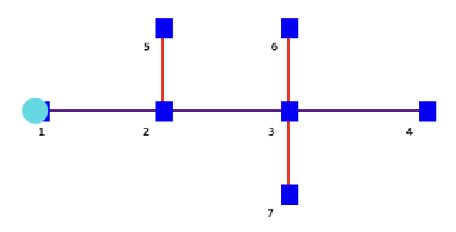
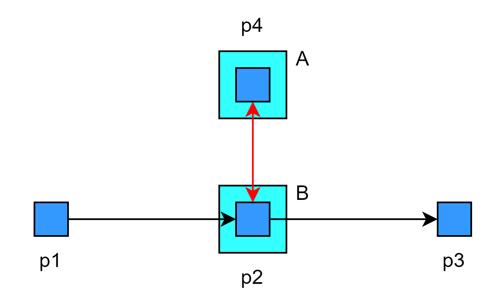

# RmsPath 节点绑定

| 文件名称 | RmsPath 节点绑定 |
| ---- | ------------ |
| 部门   | 软件算法部        |
| 版本   | 2.0          |
| 密级   | 公开           |

## 修改记录

| 版本号 | 修改日期       | 修改人 | 概述     | 详细说明             |
| --- | ---------- | --- | ------ | ---------------- |
| 1.0 | 2024-03-27 | 钱永儒 | 新增文档   |                  |
| 1.1 | 2025-03-11 | 林祥序 | 补充整理   |                  |
| 2.0 | 2025-07-02 | 林祥序 | 归档线上仓库 | 格式整理，补充规范 header |

---

## 一、概述

本文件解释了不同类型的路径节点绑定方式，包括各绑定类型的定义、适用场景以及触发条件。文档详细说明了在实际调度或路径规划中，不同绑定方式如何影响机器人行为，并列举了典型的触发情况，帮助用户更准确地配置与理解路径节点的使用规则。

## 二、绑定类型

节点绑定的种类有
1. strong
2. medium
3. weak
4. target
5. edge
6. type:<机器人类型>
7. weak_directed
8. bindingArea
9. lift_state:<料架名字>:<中/强绑定>
10. rotation

添加一行记录表示将两个节点绑定，绑定时有三个字段需要输入 point1, point2, bind_type：

point1：第一个节点名称，比如 p1

point2：第二个节点名称，比如 p2

bind_type：输入 weak, medium, strong, target，如果不输入，默认为 weak

插入后，p1 和 p2 就已经绑定了。

## 三、强/中/弱绑定
### 3.1 strong 强绑定和 weak 弱绑定的区别为：

- 绑定的限制：强绑定可以绑定两个无关联的节点，弱绑定只能绑定相邻的点。如上图所示，强绑定可以绑定 1 和 2~7，但是弱绑定的话，1 只能和 2 绑定，2 可以和 1、3、5 绑定。
- 占用的条件不同：
	- 强绑定只需要机器人在 p1，无论是在做什么，都会同时占用 p1 和 p2，其他机器人都无法使用 p1 和 p2；
	- 弱绑定只有机器人正在 runto，runto 的路径同时包含 p1 和 p2 时，如果机器人此次路径有 p1，那么 p2 也会被包含在机器人此次路径中，其他机器人无法使用 p2。

如上图所示，假设机器人当前路径是 1->2->3->4，节点绑定关系为：

>1-2-strong #节点 1 和节点 2 强绑定  
1-3-strong #强绑定可以绑定不连接在一起的两个节点  
1-4-strong #节点 1 和节点 4 强绑定  
1-5-strong #节点 1 和节点 5 强绑定  
1-6-strong #节点 1 和节点 6 强绑定  
1-7-strong #节点 1 和节点 7 强绑定

强绑定和弱绑定都具有传递性，即 1 和 2 绑定（2 和 1 也是绑定的），1 和 3 绑定，那么其实 2 和 3 也是绑定的。

按照上述绑定关系，其实 1~7 的节点，两两之间都是互相绑定的。因为是强绑定关系，那么只要有一个机器人占用了其中任何一个点，那么这些节点其他机器人是无法使用的。

如果是弱绑定关系，即：

>1-2-weak #节点 1 和节点 2 弱绑定  
2-3-weak #节点 2 和节点 3 弱绑定  
2-5-weak #节点 2 和节点 5 弱绑定  
3-6-weak #节点 3 和节点 6 弱绑定  
3-4-weak #节点 3 和节点 4 弱绑定  
3-7-weak #节点 3 和节点 7 弱绑定

此时如果机器人路径为 1->2->3->4，那么其他机器人使用 5、6、7 节点时没有影响。

- 适用环境：
	- 强绑定适用于区域互斥的情况，比如这个区域内只能有一个机器人进入，这个机台只能同时只有一个机器人对接等等；
	- 弱绑定适用于比较狭窄的双向通道，需要防止两个对向的机器人同时进入这个通道导致互相堵死，将这个通道弱绑定后，机器人通行时就会要么获取这个通道的所有节点，要么一个节点都不使用，让已经占用了节点的先通过。

### 3.2 medium 中绑定和 strong 强绑定

中绑定是基于强绑定开发而来：中绑定和强榜定一样都可以绑定两个无关联的点，如上图中绑定可以绑定1和2~7任意节点。但是中绑定和强绑定的区别在于中绑定不存在传递性。即1和2绑定，2和 3绑定，但是1和3不是绑定。

假设p1-p2-P3都通过中绑定绑定。

>1-2-medium #当机器人在p1时，p1与p2绑定  
2-3-medium #当机器人在p2时，p2与p3绑定，同时时p1与p2绑定  
3-4-medium #当机器人在p3时，p2与p3绑定，p1与p2不绑定，此时机器人可以同时停在p1和p3上。  
为了方便观察中绑定和强绑定的区别，假设此时p1-p2-P3都通过强绑定绑定  
1-2-strong #当机器人在p1时，p1与p2绑定  
2-3-strong #当机器人在p2时，p2与p3绑定，同时时p1与p2绑定  
3-4-strong #当机器人在p3时，p3与p2绑定，由于其传递性，所以p3与p1也处于绑定状态，机器人不能同时停在p1和p3区域。  

假设两种绑定混合时

>1-2-strong  
2-3-medium # 两个机器人可以同时停在 p1 和 p3 上

## 四、target 目标绑定

- 有别于 strong, medium, weak，目标绑定有目标的路径节点（如图中的 p2）
- 目标绑定的设置，是在区分机器人是经过p2还是以p2为目标点的情况下进行绑定
- **p2-p4, target：以 p2 为目标点的机器人会看 p4 有没有机器人**
- 假设绑定 p2-p4, target，则其应用主要是针对：
	- 当节点 p4 有机器人 ubot-001 时，会绑定目标节点 B。
	- 此时，若机器人 ubot-002 的目标是 B，则无法到达 p2
	- 通过目标绑定，避免因为 p2 的目标 B 有机器人，导致 p4 中的机器人无法离开
	- 若机器人的目标节点不是 B，只是为了经过路径 p1-p2-p3，则不被目标绑定所影响
- 注意： **目标绑定具有指向性**，p2-p4 绑定的含义为：“如果有机器人在p4的目标点，其他机器人就不能去p2的目标点”，**反之不成立**，因此绑定 p2-p4 不等于绑定 p4-p2

## 五、edge 边绑定

边和点的绑定，通过配置可以配置机器人在某一边是同时占用另外的点，或者占用某一点时占用对应的边。在配置时，将bind改为edge即可生效。

参考下列案例，现在有edgebinding如下，格式为point1:需要绑定的边，point2:需要绑定的点，bind_type:edge

| point1 | point2 | bind_type |
| ------ | ------ | --------- |
| p15-p8 | p5     | edge      |
| p8-p9  | p5     | edge      |
| p9-p10 | p5     | edge      |

以下列图为例，

当002优先接到任务前往A点时，如果机器人占据p15-p10之间，则p5被占据此时003不能前往B。

当002经过p10-p11，p5 被释放，003可以前往B。

反之

当003优先接到任务前往B点时，如果机器人占据p5，则p15-p10的所有路径被占据，此时002不能前往A。

当002离开p5，p15-p10被释放，002可以前往A。

## 六、type:* 根据机器人类型绑定：

通过配置可以为某一类型的机器人进行绑定，绑定效果为中绑定。

在配置绑定时将 bind 改为 type:<机器人类型>即可生效。!

| point1 | point2 | bind_type    |
| ------ | ------ | ------------ |
| p1     | p2     | type:Flex500 |

如上图所示，p1 和 p2 的中绑定只会为 Flex500 类型的机器人生效。

## 七、weak_directed 单向弱绑定

单向弱绑定，一般的weak bind是双向都弱绑了。这个directed是单向的，p1到p2弱绑。p2到p1没有绑定，

绑定格式参考如下：

| point1 | point2 | bind_type     |
| ------ | ------ | ------------- |
| p1     | p2     | weak_directed |

## 八、bindingArea 绑定区

在地图中新增一个绑定区，将区域内所有相邻的节点进行指定类型的绑定。

| 参数名称         | 参数描述                               |
| ------------ |------------------------------------|
| 名称           | （非必填）                              |
| bindingType  | 绑定类型：weak/medium/strong/type:<机器人类型> |
| bindingParam | （空）                                |

## 九、lift_state:\*:\* 背负货架类型绑定

>适配版本：v7.01.5

背负式机器人的货架类型较多，存在大体积货架。在背负大体积货架时，需要生效的绑定。

目前适配中/强绑定，也可以通过`绑定区`配置。

| point1 | point2 | bind_type                         |
| ------ | ------ | --------------------------------- |
| p1     | p2     | lift_state:<货架名称>:<strong/medium> |

## 十、rotation 旋转绑定

> 适配版本：v7.02

| point1 | point2 | bind_type |
| ------ | ------ | --------- |
| p1     | p2     | rotation  |

### 自动旋转绑定配置

> 适配版本：v7.02.2

| 参数名称                      | 参数值                                     | 参数说明       |
| ------------------------- | --------------------------------------- | ---------- |
| auto_rotate_binding_robot | 指定具体机器人例子：  ubot-001,ubot-002     | 自动旋转锁点的机器人 |
| auto_rotate_binding_robot | 指定某类型机器人例子：  type:Flex500,uBot300 | 自动旋转锁点的机器人 |
| auto_rotate_binding_robot | 指定某区域机器人例子：  zone:JW              | 自动旋转锁点的机器人 |