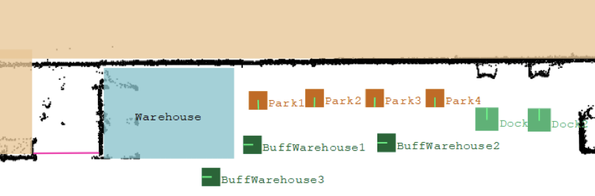
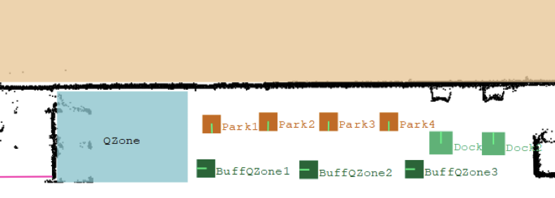

# RmsPath 单机器人区域

| 文件名称 | RmsPath 单机器人区域 |
| ---- | -------------- |
| 部门   | 软件算法部          |
| 版本   | 2.0            |
| 密级   | 公开             |

## 修改记录

| 版本号 | 修改日期       | 修改人 | 概述     | 详细说明             |
| --- | ---------- | --- | ------ | ---------------- |
| 1.0 | 2024-03-27 | 钱永儒 | 新增文档   |                  |
| 1.1 | 2025-03-11 | 林祥序 | 补充整理   |                  |
| 2.0 | 2025-07-02 | 林祥序 | 归档线上仓库 | 格式整理，补充规范 header |

---

## 一、概述

本文件介绍了单机器人区域功能的配置与使用场景。该功能适用于需控制某一区域内同一时间仅允许单个机器人进入的情况，其他机器人需在区域外的指定等待点停留。单机器人区域通常与 Buffer 点配合使用，当区域被占用时，申请进入的机器人将优先调度至 Buffer 点等待，以避免通道阻塞。文档同时说明了单机器人区域的 buffer 类型配置方式及分配时机设置，便于实现更精细的调度控制。

## 二、单机区配置

### 2.1 命名配置法

- 命名方法：RmsPath 是根据 SingleZone 和 Buffer 点的名称来绑定的，Buffer 点的名称必须是 Buff+SingleZone 名称+后缀，如下表所示：

| 无序单机区名称   | 无序 Buffer 名称                                        |
| --------- | --------------------------------------------------- |
| Warehouse | BuffWarehouse1, BuffWarehouse2, BuffWarehouse3, ... |

单机区分为两种类型——有序和无序，有序和无序指的是 Buffer 点之间的优先级。上表所示的单机区是无序的单机区。

### 2.2 参数配置法

>适配版本：v7.01.4

- 参数名：bufferType
- 描述：buffer 类型

| 参数值     | 描述                              |
| ------- | ------------------------------- |
| default | Buffer 无序的单机区                   |
| queue   | Buffer 有序的单机区（不适用于1个Buffer的单机区） |

- 参数名：allocationTiming
- 描述：分配时机

| 参数值        | 描述                            |
| ---------- | ----------------------------- |
| on_request | 默认值，按申请时间顺序分配单机区占用            |
| on_arrival | 按实际到达单机区的顺序进行分配，后来者重新规划到buff点 |

- 通过 xManager 配置新版单机区，详情参考[【xManager配置】](./0406_对外交互_xManager配置.md)
- 配置方法：使用 Manager 在地图中添加 SingleZone 和 Buffer。

## 三、Buffer 类型

### 3.1 无序的单机区

- 无序的单机区必须不能以 Q 开头

- Buffer 点之间没有顺序，机器人在想要去单机区的时候只要单机区没被占用，都可以进入。如果单机区被占用了，则会随即抢占 Buffer 点。

- 若该无序单机区存在多个 Buffer 点，机器人优先占用距离本体最近且空闲的 Buffer 点。

- 若多个 Buffer 点中有多台机器人在等待占用单机区，则遵循先进先出 (FIFO) 原则分配机器人对单机区的占用。

无序的单机区如下图所示：

### 3.2 有序的单机区

>适配版本：v6.05.5
- 有序的单机区名称必须以 Q 开头

| 有序单机区名称 | 有序 Buffer 名称                            |
| ------- | --------------------------------------- |
| QZone   | BuffQZone1, BuffQZone2, BuffQZone3, ... |

- 机器人会遵循 Buff3 → Buff2 → Buff1 → SingleZone 的顺序依次前进：如果进入单机区，则肯定是 1 号 buffer 点的机器人进入或者单机区和 buffer 点都是空的；如果机器人当前在 3 号 buffer，必须等到 2 号 buffer 空闲才能往前走到 2 号 buffer；

- 初次想要去 SingleZone 的依次查看 3、2、1、SingleZone 是否空闲，如果 2 号被占用了，无论 1 号、SingleZone 是否空，都只能去 3 号 Buffer 等待。

- 强烈建议有序单机区的 Buffer 放在单机区的同一侧，避免机器人在 Buffer 之间移动的时候绕远路。

- 只有一个Buff点的单机区，不需要用有序单机区

有序的单机区如下图所示：

## 四、分配时机

>适配版本：v7.01.4

分配时机 allocationTiming 参数：

| 参数值        | 描述                                 |
| ---------- | ---------------------------------- |
| on_request | 默认值，按申请时间顺序分配单机区占用                 |
| on_arrival | （未上线）按实际到达单机区的顺序进行分配，后来者重新规划到buff点 |

### 4.1 申请分配

- 根据机器人申请单机区的顺序占用单机区，不计算机器人距离单机区的远近
- 后申请的机器人即便距离比较靠近，也会分配到 buffer 进行等待

### 4.2 到达分配

- 若单机区和 buffer 为空，多个前往单机区的机器人不会提前规划到 buffer，他们可以一起往单机区的方向行驶
- 直到单机区被某个机器人占用，其他机器人才规划到 buffer 进行等待

## 五、通过多个单机区

- 若机器人的路径中，存在穿越多个单机区的规划，首次路径规划中，机器人会对通过的第一个单机区进行请求。

- 穿越一个单机区之后，机器人会在离开单机区后的第一个节点，发出对下一个单机区占用的请求。

- 若下一个单机区没被占用，则占用下一个单机区，并前往该单机区。

- 若下一个单机区被占用了，则规划前往该单机区的 Buffer 点。

- 若无 Buffer 点或 Buffer 点都被占用了，则机器人会停在原地等待下一个单机区或者 Buffer 点被释放。