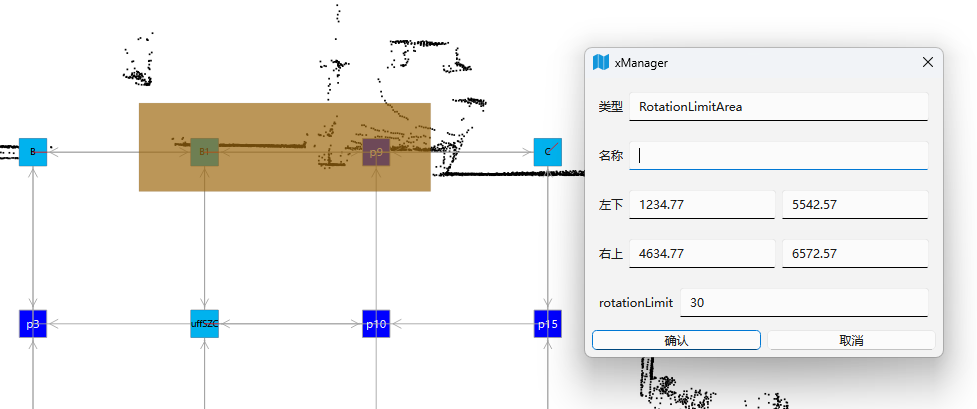

# RmsPath 旋转角度限制（未上线）

| 文件名称 | RmsPath 旋转角度限制 |
| ---- | -------------- |
| 部门   | 软件算法部          |
| 版本   | 2.0            |
| 密级   | 公开             |

## 修改记录

| 版本号 | 修改日期       | 修改人 | 概述     | 详细说明             |
| --- | ---------- | --- | ------ | ---------------- |
| 1.0 | 2025-03-26 | 林祥序 | 新增文档   |                  |
| 2.0 | 2025-07-02 | 林祥序 | 归档线上仓库 | 格式整理，补充规范 header |

---

## 一、概述

## 二、旋转角度限制区

- 参考[【xManager 相关配置】](./0406_对外交互_xManager配置)配置新类型的区域

- xManager 中配置旋转角度限制区

	- 参数 rotationLimit：区域内的旋转角度 < rotationLimit

- 示例如下：

- 旋转限制区参数 30°，使得机器人只能直行通过区域内的节点，无法旋转 90° 转弯

- 假设限制区参数 120°，则机器人可以旋转拐弯，但是无法原地调头

## 三、节点属性配置

## 四、 旋转权重

在路径规划和分配的时候，将旋转角度 * 权重纳入路径长度中

- 在路径规划的时候，减少机器人旋转的次数；

- 在路径分配的时候，缩短旋转机器人所分配到的路径长度