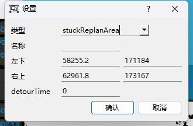

# RmsPath 绕路/重规划功能

| 文件名称 | RmsPath 绕路/重规划功能 |
| ---- | ---------------- |
| 部门   | 软件算法部            |
| 版本   | 2.0              |
| 密级   | 公开               |

## 修改记录

| 版本号 | 修改日期       | 修改人 | 概述     | 详细说明             |
| --- | ---------- | --- | ------ | ---------------- |
| 1.0 | 2024-03-27 | 钱永儒 | 新增文档   |                  |
| 1.1 | 2025-01-09 | 林祥序 | 补充整理   |                  |
| 2.0 | 2025-07-02 | 林祥序 | 归档线上仓库 | 格式整理，补充规范 header |

---

## 一、概述

本文件介绍了机器人绕路机制的配置与控制逻辑。内容涵盖绕路的触发条件、相关参数设置、自定义绕路参数区域的使用方式，以及如何配置禁止绕路的机器人名单。同时，文档还说明了如何禁用在特定场景下的 stuck 路径重规划功能，以实现更精准的路径控制策略，适应复杂运行环境下的调度需求。

## 二、Detour/DetourActive

- 目前存在两种主要的触发情况：

>情况1. 被动触发：机器人A被另外两个机器人前后包夹，使得A即阻挡别的机器人，也被其他机器人阻挡
情况2. 主动触发：机器人卡在一个路径点不动，无关卡住的原因

- detour：当 detour 为 0 时，表示绕路功能关闭，当 detour 为非 0 的任何整数时，此时 detour 为情况1触发绕路功能所需的秒数。当机器人停止 detour 秒时开始绕路。这里的 detour 从阻挡机器人停止就开始计算，而不是从阻挡另一台机器人时开始计算。

- 有以下特殊情况需要说明：
	1. 当机器人停止且没有被前后包夹时，不会触发情况1绕路程序。
	2. 只有存在路径可以绕路时，机器人才会开始绕路，如果不存在路径可以绕路，绕路车不会进行绕路。

- detour_active：当 detour_active 为 0 时，情况2主动触发的绕路功能关闭；当 detour_active 为非 0 的任何整数时，表示情况2时触发绕路功能所需的秒数为 (detour + detour_active)。detour_active 参数补充了外部原因卡住机器人，绕路功能的主动触发。
- exclude_detour_robot: 禁止绕路的机器人
- detour_robot_s: 自定义机器人绕路参数
- 当存在多个绕路参数时，参考以下优先级：

绕路参数优先级：
1. exclude_detour_robot 禁止绕路机器人（大于）
2. stuckReplanArea 局部范围参数（大于）
3. detour_robot_s 自定义机器人全图绕路参数（大于）
4. detour 全局绕路参数

## 三、stuckReplanArea

自定义绕路区：范围内的绕路触发时间（stuckReplanArea.detourTime）和全局的绕路触发时间（detour）不同

## 四、参数配置

绕路参数：

| 参数名称                  | 单位  | 参数说明                                                                                                                                       |
| --------------------- | --- | ------------------------------------------------------------------------------------------------------------------------------------------ |
| detour                | 秒   | 等于0，表示绕路功能关闭；  大于0，表示绕路功能开启，表示情况1的绕路触发时间                                                                                             |
| detour_active         | 秒   | 等于0，表示主动绕路功能关闭；  **主动绕路开启的前提：detour > 0 或者 stuckReplanArea.detourTime > 0**  大于0，表示主动绕路功能开启，情况2的绕路触发时间为 detour + detour_active |
| detour_graph_type     | 无   | 选填 relax/strict ，默认为 relax ，表示触发 detour 绕路时，机器人阻挡和被阻挡关系的紧凑程度                                                                               |
| maxDifferenceOfDetour | 米   | 当绕路路线 - 剩余路径的距离 > maxDifferenceOfDetour不进行绕路                                                                                               |

### 4.1 禁止 detour 绕路机器人

exclude_detour_robot：禁止绕路的机器人

如果想**禁止单独的机器人**：

| 参数名称                 | 参数值                |
| -------------------- | ------------------ |
| exclude_detour_robot | ubot-001, ubot-002 |

如果想**禁止某些类型**的机器人绕路：
>格式：type:<车的类型1>,<车的类型2>

| 参数名称                 | 参数值                 |
| -------------------- | ------------------- |
| exclude_detour_robot | type:Bot600,Flex500 |

禁止类型为Bot600和Flex500的机器人绕路

### 4.2 自定义机器人 detour 绕路参数

参数名称：detour_robot_s

>格式：<车>:<detour 绕路秒数>

优先级：stuckReplanArea 区域定义 detour 参数 > 机器人自定义 detour 参数 > detourFlag 全局参数

| 描述        | 参数名称           | 参数值                     |
| --------- | -------------- | ----------------------- |
| 设定指定的机器人  | detour_robot_s | ubot-001,ubot-002:5     |
| 设定某类型的机器人 | detour_robot_s | type:Flex500,uBot100:10 |
| 设定某区域的机器人 | detour_robot_s | zone:JW:15              |

### 4.3 禁止触发 stuck 路径重规划

exclude_stuck_robot：禁止触发 stuck 的机器人

如果想**禁止单独的机器人**：

| 参数名称                | 参数值                |
| ------------------- | ------------------ |
| exclude_stuck_robot | ubot-001, ubot-002 |

如果想**禁止某些类型**的机器人触发 stuck：

>格式：type:<车的类型1>,<车的类型2>

| 参数名称                | 参数值                 |
| ------------------- | ------------------- |
| exclude_stuck_robot | type:Bot600,Flex500 |

禁止类型为Bot600和Flex500的机器人 stuck