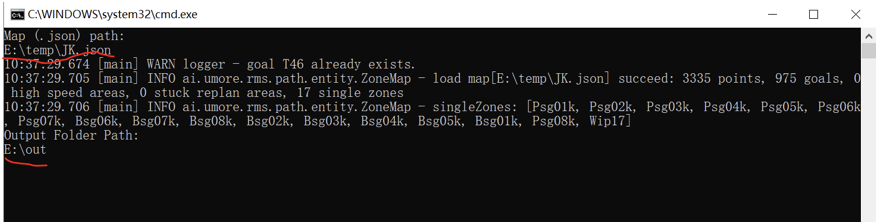
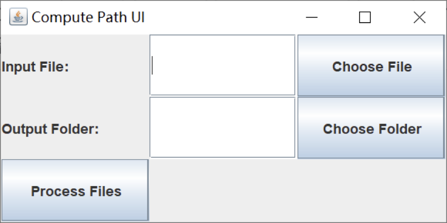

# RmsPath 扫地机配置

| 文件名称 | RmsPath 扫地机配置 |
| ---- | ------------- |
| 部门   | 软件算法部         |
| 版本   | 2.0           |
| 密级   | 公开            |

## 修改记录

| 版本号 | 修改日期       | 修改人 | 概述     | 详细说明             |
| --- | ---------- | --- | ------ | ---------------- |
| 1.0 | 2023-12-07 | 钱永儒 | 新增文档   |                  |
| 1.1 | 2025-01-10 | 林祥序 | 补充整理   |                  |
| 2.0 | 2025-07-02 | 林祥序 | 归档线上仓库 | 格式整理，补充规范 header |


---

## 一、概述

本文件说明了扫地机的配置方法，涵盖确认扫地机类型、设置关键参数、编辑配置文件以及添加扫地路线的具体步骤。通过本指南，用户可完成不同类型扫地机的初始化配置与路径设定，确保其在指定区域内高效、规范地执行清扫任务。

## 二、确认扫地机信息

1. 确认扫地机厂家
2. 确认扫地机名称

本配置仅适用于玖物自家的扫地机，其他厂家的扫地机请咨询交管组

## 三、设置初始化参数

加入洗地机参数，参数值为扫地机器人名称

| 参数名称             | 参数值      |
| ---------------- | -------- |
| cleaning_robot   | cbot-001 |
| cleaning_robot   | cbot-002 |
| coordinate_robot | <扫地机名称>  |

## 四、配置文件 zones.json

1. 查看服务器里的 `/usr/local/rms/RmsPath/config/application.properties` 文件中的
```
planner.zone=<区域名称>
```

2. 编辑服务器里的 `/usr/local/rms/RmsPath/config/zones.json` 文件。

在对应的工作区里给每台扫地机添加 "port" 字段。

如下图的 "ja" 区（根据上面 3.1. 所查的区域名称），此处的 cbot-001, cbot-002（根据 1.2.）代表扫地机名字，根据现场需要配置的洗地机作出对应修改。

```java
{	
	"dry": {		
		"port": {		    
			"dry": 8283,		    
			"uBot150S-0":8001,		    
			"uBot150S-1":8002,		    
			"uBot150S-2":8003,		    
			"uBot150S-3":8004,		    
			"uBot150S-4":8005		
		}	
	},    
	"ja": {         
		"port": {            
			"cbot-001": 7790,            
			"cbot-001": 7790        
		}    
	}
}
```

## 五、添加扫地路线

### 5.1 前置准备

1. 首先在地图里添加扫地区，且扫地区名称不为空
2. 在本地电脑下载安装 Java：[Java 下载链接](https://www.oracle.com/hk/java/technologies/downloads/#jdk21-windows)
3. 可以通过两种方法生成路径：4.2 或 4.3

### 5.2 win 命令行生成

在解压后的 RmsPath 文件夹中，双击执行里面的 `precompute.bat`

输入地图文件路径 Map (.json) path 和输出路径 (Output Folder Path)，如图所示：



输完后他就会把扫地机的清扫路径文件输出到"输出路径"里。

### 5.3 使用 UI 生成

在本地电脑，双击执行的 `RmsPath.zip` 里的 `precomputeUI.bat`


1. 选择输入文件
	1. 点击"Choose File"以选择输入文件。
	2. 导航到文件并点击"Open"。
	3. 文件路径将显示在"Input File"字段中。

2. 选择输出文件夹
	1. 点击"Choose Folder"以选择输出目录。
	2. 导航到文件夹并点击"Open"。
	3. 文件夹路径将显示在"Output Folder"字段中。

3. 处理文件
	1. 查看所选路径。
	2. 点击"Process Files"以执行文件处理。
	3. 等待完成；成功消息将弹出。

## 5.4. 后置操作

1. 检查所有路径文件 `.json` 不为空
2. 将生成路径放置在服务器 `/usr/local/rms/precompute/` 目录下
3. 检查配置文件 `/usr/local/rms/RmsPath/config/application.properties` 是否有：

```
planner.pathdir=/usr/local/rms/precompute
```

## 六、其他注意事项

### 6.1 高仙洗地机

1. 最新的地图要传到洗地机上
2. 高仙的洗地机要写参数 `coordinate_robot`