# RmsPath 门控安装指南

| 文件名称 | RmsPath 门控安装指南 |
| ---- | -------------- |
| 部门   | 软件算法部          |
| 版本   | 2.0            |
| 密级   | 公开             |

## 修改记录

| 版本号 | 修改日期       | 修改人 | 概述     | 详细说明                             |
| --- | ---------- | --- | ------ | -------------------------------- |
| 1.0 | 2024-08-19 | 钱永儒 | 新增文档   |                                  |
| 2.0 | 2025-07-02 | 林祥序 | 归档线上仓库 | 格式整理，补充规范 header                 |
| 2.1 | 2025-07-14 | 林祥序 | 更新 3.1 | 接口测试方法                           |
| 2.2 | 2025-09-09 | 林祥序 | 梯控功能补充 | 1. 自动绑定，目标点角度 <br>2. 排版调整：分类地图参数 |
| 2.3 | 2025-11-24 | 何进  | 新增门类型  | EdgeLinkDoor配置归档                 |
| 2.4 | 2025-12-19 | 林祥序 | 新增门类型  | EdgesLinkDoor 配置归档               |
| 2.5 | 2025-02-04 | 林祥序 | 新增门类型 | EdgePolicyDoor 配置归档 |

---

## 一、概述

本文件为门控安装与调试的完整指南，涵盖从事前准备到系统联调的各个环节。内容包括控制接口测试、地图与程序配置方法、相关接口文档说明，以及实际部署过程中常见问题的整理与解决方案，帮助技术人员高效完成门控设备的接入与调试工作，确保系统稳定运行。

## 二、事前准备：设备和 Rms 配置

参考任务调度二组的文档：[门控和梯控程序程序说明](https://doc.weixin.qq.com/doc/w3_AHYAhgZHANMq4sAx9sBQXabse7A58?scode=AJMABQdxAA8b67yN9BAHYAhgZHANM)

## 三、设备控制接口测试

### 3.1 TMC 模拟测试程序

- 通过模拟程序测试梯控和门控的接口
- 模拟程序负责人：李捷
- **截图测试结果**

### ~~3.2 第三方软件测试~~

1. 使用第三方 API 测试软件：
	1. [Postman 下载](https://www.postman.com/downloads/)
	2. [Apipost 网页版](https://www.apipost.cn/)【如果之前没有下载，推荐使用网页版】

2. Postman 操作：
	1. 登录账户 umore2path 密码 um-robot
	2. 新建HTTP请求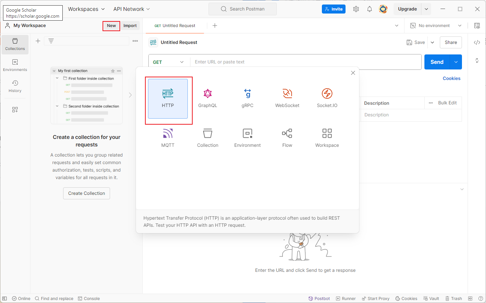

	3. 选择 POST 请求，输入门控 IP 地址和端口，选择 Body 参数中的 raw，设置格式尾@ JSON，输入以下指令 (1.2)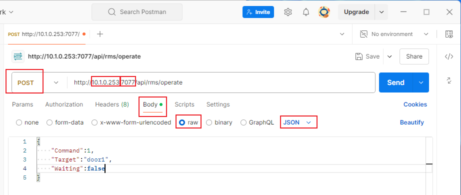

3. Apipost 操作

	1. 点击右上角【立即使用】
	2. 点击左侧栏目【+新建】，选择【HTTP】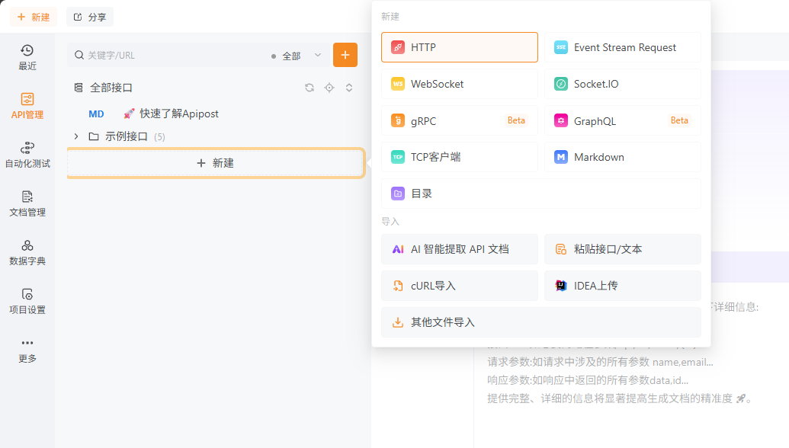

### ~~3.3 编写指令~~

#### ~~3.3.1 门控~~

- 门控 HTTP 接口 `POST http://<ip>:<port>/api/rms/Operate`

- 当 Command 为 1 时为开门指令，当 Command 为 2 时为关门指令，Target 设置为门的名字（地图，门控，Target三者相同） 
```json
{    
	"Command": 1,   
	"Target": "door1"
}
```

- 门控查状态 `GET http://<ip>:<port>/api/rms/QueryStatus?Target=<doorName>`

#### ~~3.3.2 梯控~~

- 电梯 HTTP 接口 `POST http://<ip>:<port>/api/Elevator/ReportFromRms`

- 电梯门外呼叫指令：给定机器人名称 Robot，请求的边 requestEntity，请求的电梯编号 target，请求的楼层编号 floor

```json
{  
	"Robot": "ubot-001",
	"requestEntityType": "AdvancedEdge",
	"requestEntity": "p1-p2", //p1为电梯外的点，p2为电梯内的点  
	"timing": "before",  
	"extra": {
		"action": "call",      
		"target": "<LiftName>", //电梯名字，<门控区域的名字>      
		"floor": "<floorName>" //楼层名字，从地图中拿      
	}
}
```
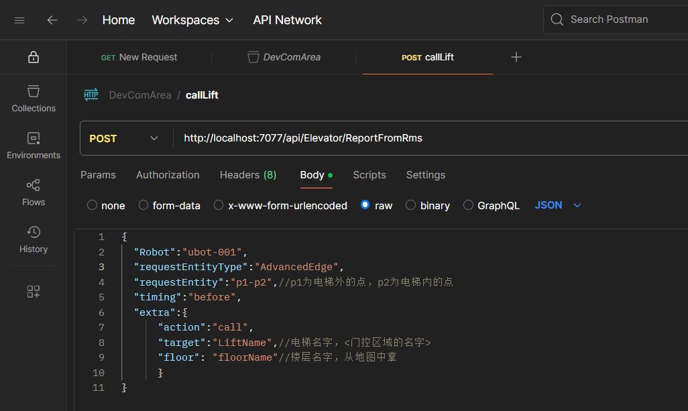


- 电梯离开指令：

```json
{  
	"Robot": "ubot-001",  
	"requestEntityType": "AdvancedEdge",  
	"requestEntity": "p1-p2", //p1为电梯外的点，p2为电梯内的点  
	"timing": "before",  
	"extra": {      
		"action": "leave",      
		"target": "<LiftName>", //电梯名字，<门控区域的名字>      
	}
}
```

### 3.3 检查返回结果

- 当返回为请求未能发送或者404，检查网络问题或ip和端口是否正确

- 当返回为 “code” : 200，则表明操作成功，检查door是否进行对应状态变化

- 当返回为 "code" : 500，检查对应门控配置是否正确

### 3.4 服务器终端测试

1. 打开 putty 或 MobaXterm，连接服务器终端

2. 发送指令

```bash
curl -X POST <地址> -H "Content-Type: application/json" -d '<请求体>'
```

门控为例

```bash
# 请求开门
curl -X POST http://<ip>:<port>/api/rms/Operate -H "Content-Type: application/json" -d '{"Command":1,"Target":"door1","Waiting":false}'
```

```bash
# 查询门状态
curl "http://<ip>:<port>/api/rms/QueryStatus?Target=<doorName>"
```

梯控为例

- 根据调度提供的信息，修改 ip, port, LiftName, floorName 等相关参数
- 根据电梯所在的节点修改 requestEntity

```bash
curl -X POST http://<ip>:<port>/api/Elevator/ReportFromRms -H "Content-Type: application/json" -d '{"Robot": "ubot-001","requestEntityType": "AdvancedEdge","requestEntity": "p1-p2","timing": "before","extra": {"action": "call","target": "<LiftName>","floor": "<floorName>"}'
```

## 四、地图参数

>⚠️ 使用 JunionManager 版本 5.1.0.6（或其他可支持 DevComArea 的版本）

1. DevComArea 是一个和外部设备交互的区域，以下简称“门控区”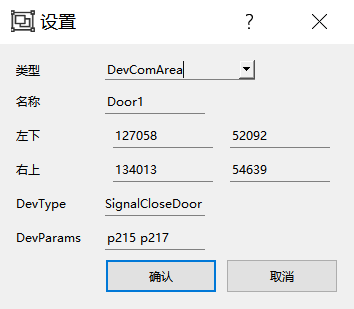

2. 各个参数如下：

| 参数名称      | 参数描述                                                                   |
| --------- | ---------------------------------------------------------------------- |
| 名称        | 门（或设备）的名称，地图上门控区的名称要和 MCS 对应的名称匹配                                      |
| 左下、右上     | 门控区的范围                                                                 |
| DevType   | 门（或设备）的类型，目前支持的类型包括：SignalDoor, SignalCloseDoor, Doub8leDoor, LiftDoor |
| DevParams | 门（或设备）的参数，针对不同的类型提供参数输入，具体如 3.                                         |
3. 门类型应用场景
	a.  SignalDoor

	b.  SignalCloseDoor

	c.  DoubleDoor

	d.  KeepOpenDoor：

		i.  小车在门控区内，会每秒呼叫开门

		ii.  无法查询门状态，通过时间参数判断门状态

		iii.  门自动关闭

	e.  LiftDoor：

		i.  用于控制电梯门，呼叫电梯、移动电梯、电梯关门

	f.  EdgeLinkDoor

		i.  仅需配置过门边，即门前后两个相邻点

		ii.  车需要开门时，则进区域就请求开门，车仅从门前经过虽然有可能在区域内但不会开门

		iii.  可通过调整区域大小控制开门时机的提前量

		iv.  若门会自动关，则需在数据库配置参数：edge_link_door_keep_open为true即可保证在穿门过程中或者还没进门时一直请求开门
	g.  EdgesLinkDoor
			
		i.  **适用于多通道**，需配置过门边集合，即门前后两个相邻点组合

		ii.  车需要开门时，则进区域就请求开门，车仅从门前经过虽然有可能在区域内但不会开门

		iii.  可通过调整区域大小控制开门时机的提前量

		iv.  若门会自动关，则需在数据库配置参数：edge_link_door_keep_open为true即可保证在穿门过程中或者还没进门时一直请求开门

### 4.1 SignalDoor

| DevType 设备类型    | DevParams 设备参数                    | 参数描述                                                                                                                                                  |
| --------------- | --------------------------------- | ----------------------------------------------------------------------------------------------------------------------------------------------------- |
| SignalDoor      | <路径点1>                            | 门前面的路径点名称，如：p1                                                                                                                                        |

### 4.2 SignalCloseDoor

| DevType 设备类型    | DevParams 设备参数 | 参数描述                              |
| --------------- | -------------- | --------------------------------- |
| SignalCloseDoor | <路径点1> <路径点2>  | 路径点n：进入门控区的第一个点<br><br>- 多个点用空格分开 |

1. 双向单通道画法
	1. 门控区内有四个节点，机器人会在进入门控区的第一个点（p1346 或 p1349），呼叫开门并等待开门
	
	2. 假设机器人在 p1346 叫开门，门开后机器人才会经过 p1347, p1348, p1349
	
	3. 填写 DevParams：<进入门控区的第一个点>
	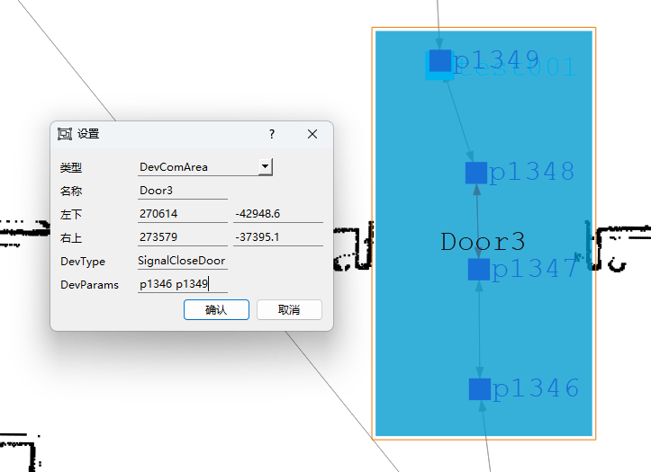


	

2. 单向双通道画法
	1. 朝向门的路径，门前面至少两个点
	2. 机器人会在进入门控区内的第一个点（p7708 或 p7710）呼叫开门并等待开门
	3. 填写 DevParams：<进入门控区的第一个点>
	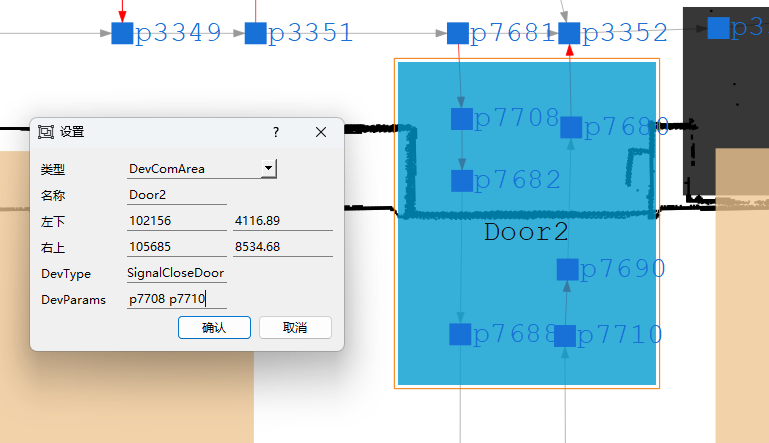


### 4.3 DoubleDoor

场景描述：风淋门
区域规则：每个区域需保持**至少门前两个点，门后两个点**，适用于风淋门，门区域在绘制时，可以叠加

| DevType 设备类型 | DevParams 设备参数 | 参数描述        |
| ------------ | -------------- | ----------- |
| DoubleDoor   | <路径点1><路径点2>   | 门前后的两个点<br> |

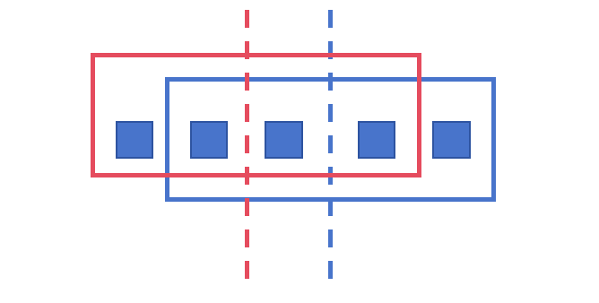

门口区域比较窄的时候，可能的变形体：
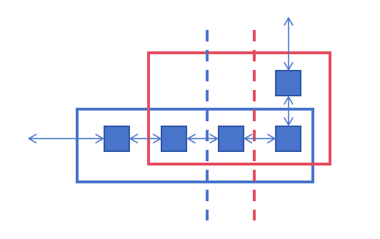

- 图中红框对应红色虚线的门，蓝框对应蓝色虚线的门
- 红色门控区的参数些红色门左右的节点，蓝色门控区的参数写蓝色门左右的节点

### 4.4 KeepOpenDoor
> 适配版本：v7.01.3

场景描述：
1. 机器人在门控区内，会每秒呼叫开门
2. 无法查询门状态，通过时间参数判断门状态
3. 门自动关闭

| DevType 设备类型 | DevParams 设备参数                    | 参数描述                                                                                                                                                  |
| ------------ | --------------------------------- | ----------------------------------------------------------------------------------------------------------------------------------------------------- |
| KeepOpenDoor | <门前路径点> <门后路径点> <开门延迟时间> <超时关门时间> | - 参数写门前后的两个点，顺序不限，门位于这两点之间，且机器人停在点上不会碰到门<br><br>- 区域内的路径点数量不限<br><br>- 开门延迟时间（秒）：呼叫开门时间点 + 开门延迟时间之后允许机器人经过门<br><br>- 超时关门时间（秒）：一段时间没有呼叫开门之后，不允许机器人经过门 |


1.  参考填写例子：

DevParams: <限制移动点1> <限制移动点2> <开门延迟时间> <超时关门时间>

- 假设限制移动点为 p65 p66，则机器人从 p63 进门控区时，会停在 p65 等待开门
- 令 <开门延迟时间> 小于 <超时关门时间>
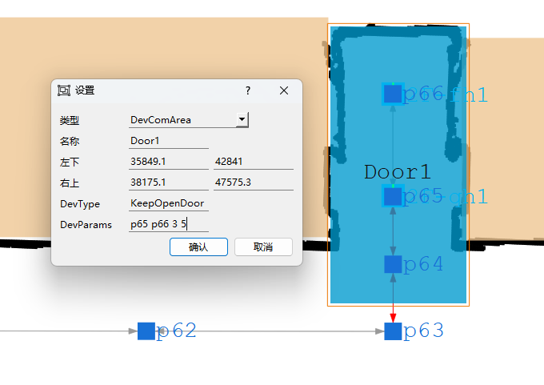


### 4.5 LiftDoor
> 适配版本：v7.01.3

场景描述：用于控制电梯门，呼叫电梯、移动电梯、电梯关门

| DevType 设备类型    | DevParams 设备参数                    | 参数描述                                                                                                                                                  |
| --------------- | --------------------------------- | ----------------------------------------------------------------------------------------------------------------------------------------------------- |
| LiftDoor        | <楼层编号>                            | 具体和 MCS 确认                                                                                                                                            |

1. 多个楼层的地图拼在一张地图上

2. 设备交互区用于电梯门的交互，注意电梯门控区**至少有两个**

3. 同一部电梯的梯控区用同一个名称（根据调度配置的名称，比如 E001），**梯控区名称内不含“-”**

4. 梯控区内有且仅有两个节点，一个是电梯内节点，一个是电梯外节点

5. 设置机器人重定位时的车头朝向
	1. 方法一（JunionManager 适用）：每个电梯内节点，根据机器人头的朝向，添加角度 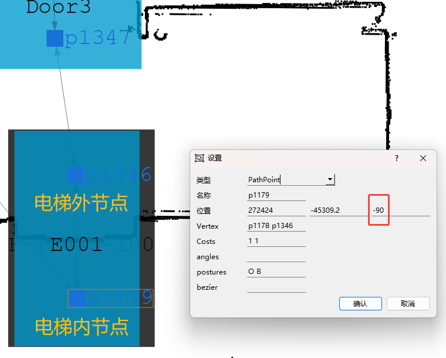
	2. 方法二（xManager 适用）：在电梯内节点处，新增目标点，根据机器人车头朝向添加角度，勾选 allowPass 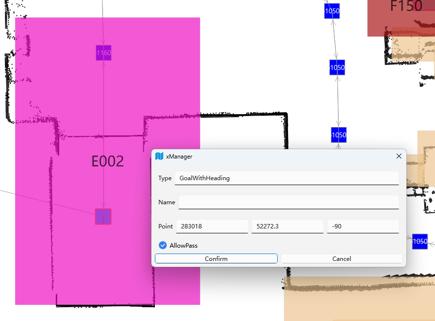

6. 不同楼层的电梯内的节点相连，并配置重定位属性

	1. 方法一：设置 path 参数 relocate_edges（详见下一节程序配置、参数配置）

	2. 或方法二（暂不推荐）：后续 xManager 全面普及之后，可直接用 xManager 设路径连接类型 RELOCATE. 注意：xManager 所产出的地图是新格式地图，可能不兼容用 JunionManager 进行修改

		xManager 虚拟节点配置：
		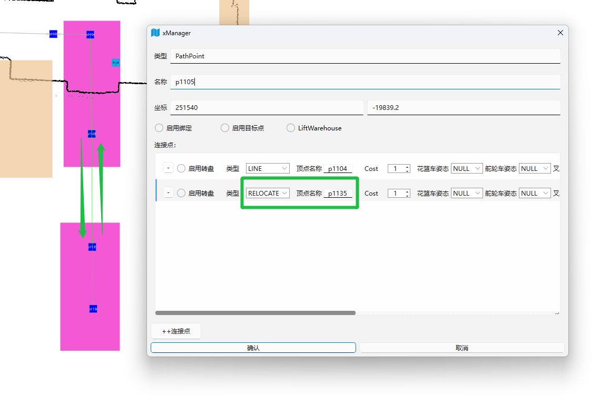

7. 电梯的楼层编号参考调度服务界面的【楼层数】
   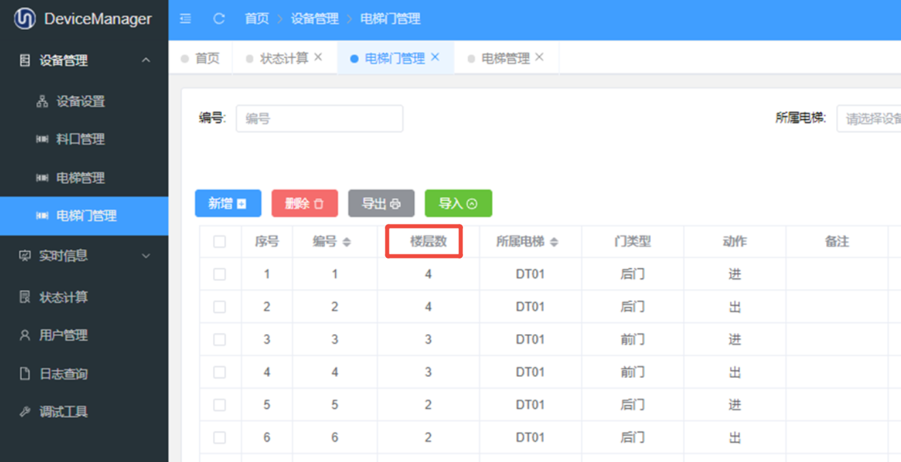

8. 如果电梯是单门的，且机器人需要倒退离开电梯，可加上机器人尾朝前的姿态

9. 补充说明：关于电梯内障碍物检测
	1. 电梯开门后，机器人进入电梯前，会进行电梯内障碍物检测
	2. 若发现电梯内有障碍物，会发送关电梯门请求，并在原地不动
	3. Path 将停止发送呼叫电梯，改为请求关门，并持续请求关门一段时间
	4. 过了一段时间后，Path 解除关门请求，继续发送呼叫电梯

10. 非必须配置项（详看 5.2 Path 参数配置）
	1. 电梯开门后，机器人延迟 x 秒进入电梯
		1. 应用场景：让电梯内的人离开
	2. 机器人主动请求关门，关门后 x 秒重新开始呼叫电梯
		1. 应用场景：人机混用，电梯内可能有其他料车

11. 关于梯控区的**自动绑定**
	1. 有向弱绑定：由于机器人判断电梯所限制，Path 会自动进行有向弱绑定【电梯外节点 -> 梯控区外节点】，使得机器人离开电梯时，必定会同时获取电梯外节点及相连的梯控区外节点。
	2. 强绑定：同名不同层的梯控区表示同一部电梯，这些同名梯控区内的所有节点进行强绑定

12. 关于梯控区的自动配置
	1. 死锁解锁点屏蔽：机器人解锁的时候，不能进入梯控区
	2. stuck 功能关闭：机器人在梯控区内，不能触发 stuck - 重新规划

### 4.6 EdgeLinkDoor
1. 参考案例：devParam填写门前后两个点，空格隔开，如下图：门在p205和p206之间
	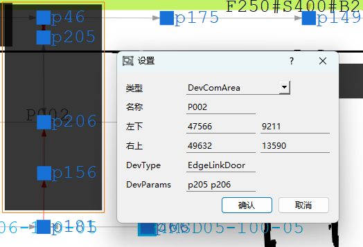
2. 若门会自动关，则需在path_params配置参数：edge_link_door_keep_open为true即可保证在还没进门和穿门过程中一直发送开门请求

### 4.7 EdgesLinkDoor

| DevType 设备类型  | DevParams 设备参数              | 参数描述                  |
| ------------- | --------------------------- | --------------------- |
| EdgesLinkDoor | <路径点1>-<路径点2> <路径点3>-<路径点4> | 门前后的边（不考虑方向），空格隔开<br> |
1. 适用于多通道门
2. 参考案例：devParam填写门前后的边，空格隔开，如下图：门在p5-p6，p9-p10之间
	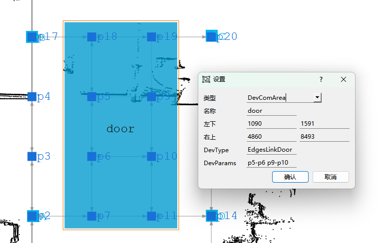
3. 若门会自动关，则需在path_params配置参数：edge_link_door_keep_open为true即可保证在还没进门和穿门过程中一直发送开门请求


### 4.8 EdgePolicyDoor

| 名称       | DevType 设备类型   | DevParams 设备参数 |
| -------- | -------------- | -------------- |
| （填写区域名称） | EdgePolicyDoor |                |
适用于复杂情况，通过配置文件对门控区内的规则进行定义

- 程序配置
	- 修改配置文件 `/usr/local/rms/RmsPath/config/application.properties` 
		- 新增 `planner.config.devComConfig=${spring.config.location}devComConfig.json`
	- 新增配置文件 `/usr/local/rms/RmsPath/config/devComConfig.json` 

- `devComConfig.json` 配置文件参考 5.3 小节


### 4.x 多区合并
1. 为支持不规则区域，绘制区域时可以用多个矩形拼凑
2. 绘制时应保证矩形两两相交，避免车在行驶中途不属于任何一个矩形内
3. **多个相同名称的矩形组成一个整体区域，绘制时应配置一样DevType、DevParams，否则区域整体失效**
4. 案例，该现场希望做一个L型门区，当车到p44附近时就申请开门，如下图做两个EdgeLinkDoor，名称都是P002，且参数配置一样
	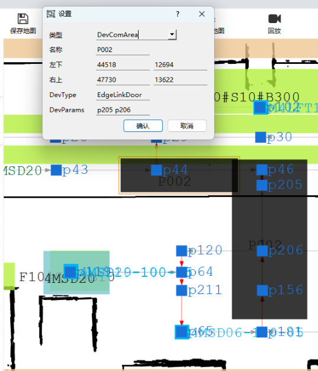
	
	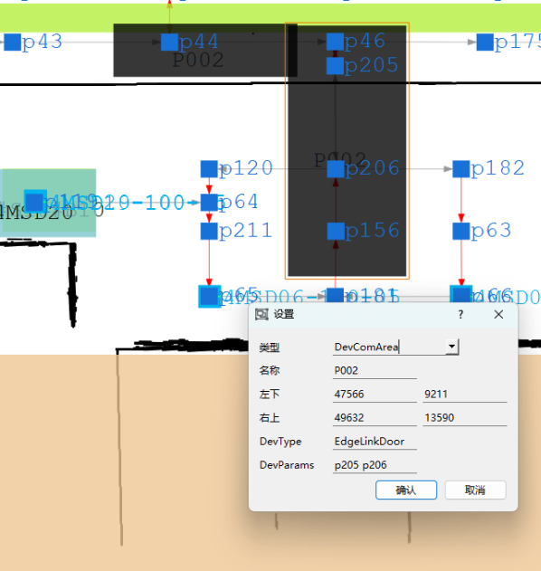
## 五、程序配置

### 5.1 `application.properties` 配置文件

`/usr/local/rms/RmsPath/config/application.properties` 中的参数配置

```
# 示例：
doorcontrol.baseurl=http://127.0.0.1:7077
liftControl.baseurl=http://127.0.0.1:7077
DoorControlTask=true
```

- 门控 doorcontrol.baseurl 的 IP 和端口

- 梯控 liftControl.baseurl 的 IP 和端口

- IP 和端口由调度提供

- DoorControlTask：true 为开启功能

#### 可选配置

```
# 发送电梯关门的定时间隔，不填写时默认值 5000ms
liftControl.scheduleClose=3000
```

### 5.2 Path 参数配置

#### 梯控设备交互区 LiftDoor


| 参数名            | 参数值                             |
| -------------- | ------------------------------- |
| relocate_edges | <电梯节点1>-<电梯节点2>,<电梯节点2>-<电梯节点3> |


- 示例：p1178-p1179,p1179-p1120
- 描述：**【必须配置】** 设置两两电梯节点之间的重定位连接，给机器人发送重定位请求来调整机器人在地图上的位置，程序自动设定双向虚拟边类型

| 参数名                | 参数值  |
| ------------------ | ---- |
| close_lift_delay_s | <秒数> |

- 示例：5（默认值：0）

- 描述：（可选配置）机器人主动发送关门请求之后，过了 close_lift_delay_s 秒之后，重新开始呼叫电梯

| 参数名                | 参数值                                                           |
| ------------------ | ------------------------------------------------------------- |
| enter_lift_delay_s | <梯控区名称1>-<梯控区楼层1>:<延迟时间1(秒)>,<梯控区名称2>-<梯控区楼层2>:<延迟时间2(秒)>,... |


- 示例：DT01-1:5,DT01-2:5

- 描述：（可选配置）电梯门开之后，等待 enter_lift_delay_s 秒后，才发送路径进入电梯

| 参数名                 | 参数值   |
| ------------------- | ----- |
| schedule_close_lift | 0 或 1 |


- 默认值：0
- 描述：（可选配置）定时给没有机器人用的电梯发送关门请求，默认发送间隔 5s，0 表示关闭功能，1 表示打开功能

### 5.3 EdgePolicyDoor 配置文件

示例：
```json
{  
  "name": "Suzhou InnoLight",  
  "desc": "门控区门控类型 EdgePolicyDoor 的配置文件",  
  "areas": [  
    {  
      "name": "FLM1",  
      "doors": [  
        {  
          "name": "Door1",  
          "commonPolicies": {  
            "openPolicies": [{ "name": "OTHER_DOOR_CLOSE" }],  
            "closePolicies": []  
          },  
          "edges": [  
            {  
              "startNode": "p10132",  
              "endNode": "p10131",  
              "desc": "进入风淋间方向的过门边",  
              "priority": 2,  
              "openPolicies": [],  
              "closePolicies": [  
                { "name": "CLOSE_TIMING", "timing": "ON_NODE", "node": "p10131", "threshold": 500 }  
              ]  
            },  
            {  
              "startNode": "p10131",  
              "endNode": "p10132",  
              "desc": "离开风淋间方向的过门边",  
              "priority": 4,  
              "openPolicies": [],  
              "closePolicies": [  
                { "name": "CLOSE_TIMING", "timing": "AFTER_NODE", "node": "p10132" }  
              ]  
            }  
          ]  
        },  
        {  
          "name": "Door2",  
          "commonPolicies": {  
            "openPolicies": [{ "name": "OTHER_DOOR_CLOSE" }],  
            "closePolicies": []  
          },  
          "edges": [  
            {  
              "startNode": "p10130",  
              "endNode": "p10131",  
              "desc": "进入风淋间方向的过门边",  
              "priority": 1,  
              "closePolicies": [  
                { "name": "CLOSE_TIMING", "timing": "ON_NODE", "node": "p10131", "threshold": 500 }  
              ]  
            },  
            {  
              "startNode": "p10131",  
              "endNode": "p10130",  
              "desc": "离开风淋间方向的过门边",  
              "priority": 3,  
              "openPolicies": [  
                { "name": "DELAY_SECS", "trigger": "FIRST_REACH_START_NODE", "delay": 50, "reset": 70 }  
              ],  
              "closePolicies": [  
                { "name": "CLOSE_TIMING", "timing": "AFTER_NODE", "node": "p10130" }  
              ]  
            }  
          ]  
        }  
      ]  
    }  
  ]  
}

```

字段描述

#### EdgePolicyDoor 配置字段表

| 字段名称    | 类型            | 是否必须  | 描述                                      |
| ------- | ------------- | ----- | --------------------------------------- |
| `name`  | `string`      | 否     | 配置文件名称/项目名，例如站点名（`Suzhou InnoLight`）    |
| `desc`  | `string`      | 否     | 配置文件说明（例如：门控区门控类型 EdgePolicyDoor 的配置文件） |
| `areas` | `array<Area>` | **是** | 门控区域列表                                  |

#### Area（`areas[]`）字段

|字段名称|类型|是否必须|描述|
|---|---|---|---|
|`areas[].name`|`string`|**是**|门控区域名称（对应地图里的门控区/DevicesCommunicationArea 名称），如 `FLM1`|
|`areas[].doors`|`array<Door>`|**是**|区域内门列表（同一区域可包含多扇门，如风淋门 Door1/Door2）|

#### Door（`areas[].doors[]`）字段

| 字段名称                                           | 类型                 | 是否必须  | 描述                                         |
| ---------------------------------------------- | ------------------ | ----- | ------------------------------------------ |
| `areas[].doors[].name`                         | `string`           | **是** | 门名称（全局唯一），用于呼叫门，如 `Door1`/`Door2`          |
| `areas[].doors[].commonPolicies`               | `CommonPolicies`   | 否     | 门的公共策略（对门下所有 edge 生效的默认策略）                 |
| `areas[].doors[].commonPolicies.openPolicies`  | `array<PolicyRef>` | 否     | 公共开门策略列表（例如 `OTHER_DOOR_CLOSE`）            |
| `areas[].doors[].commonPolicies.closePolicies` | `array<PolicyRef>` | 否     | 公共关门策略列表（示例里为空数组）                          |
| `areas[].doors[].edges`                        | `array<Edge>`      | **是** | 门的有向过门边列表（每条 edge 可配置不同优先级、开关策略，支持进/出不同逻辑） |

#### Edge（`areas[].doors[].edges[]`）字段

| 字段名称                                    | 类型                 | 是否必须    | 描述                                                        |
| --------------------------------------- | ------------------ | ------- | --------------------------------------------------------- |
| `areas[].doors[].edges[].startNode`     | `string`           | **是**   | 有向边起点节点（from），如 `p10132`                                  |
| `areas[].doors[].edges[].endNode`       | `string`           | **是**   | 有向边终点节点（to），如 `p10131`                                    |
| `areas[].doors[].edges[].desc`          | `string`           | 否       | 过门边说明（便于阅读/排查），如“进入风淋间方向的过门边”                             |
| `areas[].doors[].edges[].priority`      | `int`              | 否（建议必填） | 该有向边的优先级：区域内多方向/多门同时请求时，用于选择优先处理的 edge（值越大优先级越高）          |
| `areas[].doors[].edges[].openPolicies`  | `array<PolicyRef>` | 否       | 该 edge 的开门策略列表（会与 door.commonPolicies.openPolicies 组合使用）  |
| `areas[].doors[].edges[].closePolicies` | `array<PolicyRef>` | 否       | 该 edge 的关门策略列表（会与 door.commonPolicies.closePolicies 组合使用） |

---

#### Policy：OTHER_DOOR_CLOSE

|字段名称|类型|是否必须|描述|
|---|---|---|---|
|`*.policies[].name="OTHER_DOOR_CLOSE"`|`string`|**是**|互锁策略：开门前要求“其他门关闭”（风淋门典型需求）|
|（无额外字段）|||当前示例无额外参数|

---

#### Policy：DELAY_SECS

|字段名称|类型|是否必须|描述|
|---|---|---|---|
|`*.policies[].name="DELAY_SECS"`|`string`|**是**|延迟策略：满足 trigger 后开始计时，delay 到期后在 reset 窗口内允许通过（你当前实现支持 reset 前可反复 true）|
|`*.policies[].trigger`|`string`|**是**|触发方式（示例：`FIRST_REACH_START_NODE`）|
|`*.policies[].delay`|`int`|**是**|延迟秒数（delayUntil = now + delay）|
|`*.policies[].reset`|`int`|**是**|重置窗口秒数（resetUntil = now + reset；reset 到期后允许重新触发新一轮 delay/reset）|

---

#### Policy：CLOSE_TIMING

| 字段名称                               | 类型       | 是否必须  | 描述                                                          |
| ---------------------------------- | -------- | ----- | ----------------------------------------------------------- |
| `*.policies[].name="CLOSE_TIMING"` | `string` | **是** | 关门时机策略：根据机器人路径/占用节点判断何时触发关门                                 |
| `*.policies[].timing`              | `string` | **是** | 时机类型（示例：`ON_NODE` / `AFTER_NODE`）                           |
| `*.policies[].node`                | `string` | **是** | 关联节点名称（示例：`p10131` / `p10132` / `p10130`）                   |
| `*.policies[].threshold`           | `int`    | 否     | 阈值（单位通常是 mm）；示例里 ON_NODE 使用了 `threshold: 500`，AFTER_NODE 未给 |

## 六、接口

### 6.1 门控接口

#### 开关门接口

描述

| 请求地址 | http://ip:port/api/rms/Operate |
| ---- | ------------------------------ |
| 请求类型 | Post                           |
| 内容格式 | application/json               |

请求体

| 参数      | 类型     | 必填  | 描述ji  | 备注             |
| ------- | ------ | --- | ----- | -------------- |
| Command | int    | 是   | 指令    | 1.Open，2.Close |
| Target  | string | 是   | 门name |                |

响应体

| 参数      | 类型     | 必填  | 描述   | 备注            |
| ------- | ------ | --- | ---- | ------------- |
| Code    | int    | 是   | 状态码  | 200：成功，500：失败 |
| Message | string | 是   | 结果描述 |               |

#### 状态接口

描述

| 请求地址 | http://ip:port/api/rms/QueryStatus |
| ---- | ---------------------------------- |
| 请求类型 | Get                                |
| 内容格式 | application/json                   |

请求体

| 参数     | 类型     | 必填  | 描述    | 备注  |
| ------ | ------ | --- | ----- | --- |
| Target | string | 是   | 门name |     |

响应体

| 参数      | 类型     | 必填  | 描述     | 备注                                |
| ------- | ------ | --- | ------ | --------------------------------- |
| Code    | int    | 是   | 状态码    | 200：成功，500：失败                     |
| Data    | int    | 是   | 数据：门状态 | 1：开门、2：开门中，3、关门，4、关门中，0：请求失败的时候传0 |
| Message | string | 是   | 结果描述   |                                   |

### 6.2 梯控接口

通过某些线路前会向外部系统申请通行权。当外部系统允许通过时才会通过该路线。

| 请求地址 | http://<ip>:<port>/api/Elevator/ReportFromRms |
| ---- | --------------------------------------------- |
| 请求类型 | Post                                          |
| 内容格式 | application/json                              |

交管系统会向指定 URL 发送 HTTP POST，为 JsonObject。包含以下字段

请求体

| 参数                | 类型     | 必填  | 描述                                                 |
| ----------------- | ------ | --- | -------------------------------------------------- |
| Robot             | string | 是   | 机器人名                                               |
| requestEntityType | string | 是   | requestEntity的类型，可以是“AdvancedPoint”或"AdvancedEdge" |
| requestEntity     | string | 是   | 申请路径的ID                                            |
| timing            | string | 是   | 现在有"before"和“after”。以后功能拓展用                        |
| **extra**         | 用户自定义  | 是   | 用户自定义类型和数据。为配置externalSystem.json时指定的常量。           |

拓展请求体 **extra**

1. 呼叫/移动电梯

| 参数     | 类型     | 必填  | 描述            |
| ------ | ------ | --- | ------------- |
| target | string | 是   | 电梯编号          |
| action | string | 是   | "call"/"move" |
| floor  | string | 是   | 楼层编号          |

2. 离开电梯

| 参数     | 类型     | 必填  | 描述      |
| ------ | ------ | --- | ------- |
| target | string | 是   | 电梯编号    |
| action | string | 是   | "leave" |

响应体

| 参数     | 类型      | 必填  | 描述     |
| ------ | ------- | --- | ------ |
| result | boolean | 是   | 是否允许行走 |

## 七、问题收录

| 类别       | 问题                                                                                               | 解决方法                                                         |
| -------- | ------------------------------------------------------------------------------------------------ | ------------------------------------------------------------ |
| xManager | 闪退报错：错误应用程序路径 `C:\Users\Administrator\Desktop\...\梯控path使用说明\xManager_202502121725\xManager.exe` | 目录不要用中文                                                      |
| xManager | 部分区域消失                                                                                           | 更新配置文件 `cache/settings/settings_map.json`                    |
| Postman  | 内网无法使用 Postman                                                                                   | 使用服务器终端发送测试指令                                                |
| 门控服务     | 返回字段不匹配（目前 Path 是接收 int 类型返回）                                                                    | 找到门控服务的配置 `appsettings.json`，修改字段 `DoorStatusIsString=false` |
