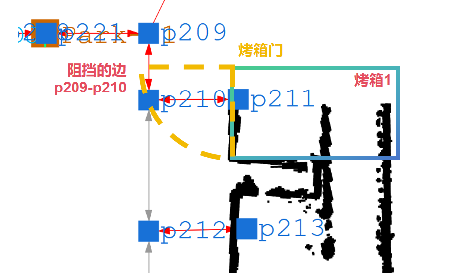

# RmsPath 传感器配置

| 文件名称 | RmsPath 传感器配置 |
| ---- | ------------- |
| 部门   | 软件算法部         |
| 版本   | 1.0           |
| 密级   | 公开            |

## 修改记录

| 版本号 | 修改日期       | 修改人 | 概述   | 详细说明     |
| --- | ---------- | --- | ---- | -------- |
| 1.0 | 2025-09-26 | 林祥序 | 新增文档 | 新增烤箱门传感器 |


---

## 一、概述

本文件为传感框架应用配置，用于把外部环境信号转化为路径下发/规划的实时决策。它持续采集并维护各类现场状态，在路径规划或路径下发阶段，快速给出“可通过 / 不可通过 / 需绕行”的结论；

同时支持多信号综合判断与数据新鲜度校验，确保当信息过期或异常时默认以安全为先。通过将复杂的现场变化折叠为清晰的通行判断，框架提升了调度的安全性与效率，并为新增信号源留出标准化接入能力。

## 二、总体配置

1. 修改配置文件 `/usr/local/rms/RmsPath/config/application.properties`
	1. 新增字段指向传感器配置文件：`planner.config.sensorConfig=${spring.config.location}sensorConfig.json`
	2. 新增字段开启传感器服务 `SensorTask=true`
2. 新增配置文件`/usr/local/rms/RmsPath/config/sensorConfig.json`，**配置文件的具体写法参照各个具体传感器**


具体传感器列表

| 名称                 | 创建日期    | 应用现场 |
| ------------------ | ------- | ---- |
| 烤箱门 OvenDoorSensor | 2025年9月 | 旭创   |


## 三、烤箱门 OvenDoorSensor

> 未上线

### 应用场景与说明

- 旭创现场的烤箱设备具有以下特点：
	- 烤箱门关闭的时候，不影响机器人的行走路线
	- 烤箱门开启的时候，阻挡机器人经过烤箱门所在的路径边
- RmsPath 通过 Http 接口与 MCS 服务交互，定时查询烤箱门的状态
- RmsPath 根据烤箱门状态判断是否下发路径
	- 其中当门状态为【开】或者【未知】时，不允许机器人通过对应的路径边

### 配置字段

| 字段             | 类型              | 单位  | 默认值  | 必填  | 说明                         |
| -------------- | --------------- | --- | ---- | --- | -------------------------- |
| desc           | string          | 无   | 无    | 否   | 配置的简要说明                    |
| baseUrl        | string          | 无   | 无    | 是   | 根地址                        |
| path           | string          | 无   | 无    | 是   | 具体路径                       |
| ttlMs          | int             | 毫秒  | 1500 | 否   | 状态有效期，需 `> queryTimeoutMs` |
| queryTimeoutMs | int             | 毫秒  | 1000 | 否   | 单次请求超时                     |
| sensors        | array\<object\> | 无   | 无    | 是   | 烤箱门配置，详见下表                 |

对于 **sensors**

| 字段         | 类型              | 单位  | 默认值 | 必填  | 说明                             |
| ---------- | --------------- | --- | --- | --- | ------------------------------ |
| name       | string          | 无   | 无   | 是   | 对应 MCS 服务的烤箱名称，全局唯一            |
| checkEdges | array\<string\> | 无   | 无   | 是   | 烤箱开门阻挡的路径边，格式为 "p1-p2"，表示单向路径边 |

**地图示例**（注：为了易于阅读，删除了地图中的目标点，并拖动了 p211, p213 路径点）



**配置示例**

```json
{  
  "OvenDoorSensor": {  
    "desc": "...",  
    "baseUrl":"http://127.0.0.1:8000",  
    "path": "/api/oven/status",  
    "ttlMs": 1500,  
    "queryTimeoutMs": 1000,  
    "sensors": [  
      {  
        "name": "Oven001",  
        "checkEdges": ["p209-p210", "p210-p209"]  
      },  
      {  
        "name": "Oven002",  
        "checkEdges": ["p210-p212", "p212-p210"]  
      },  
      {  
        "name": "Oven003",  
        "checkEdges": ["p212-p214", "p214-p212"]  
      }  
    ]  
  }  
}
```
