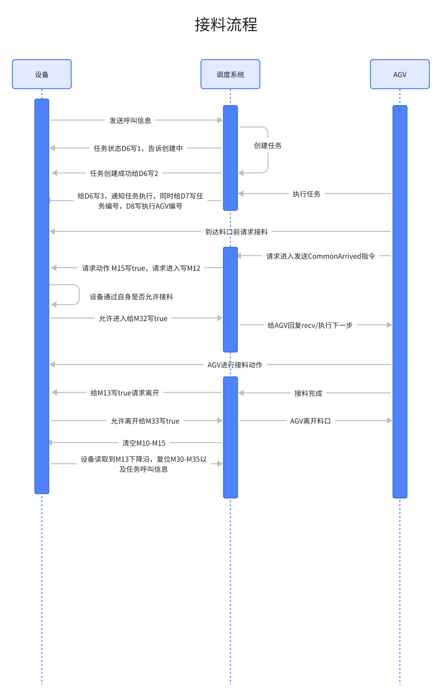
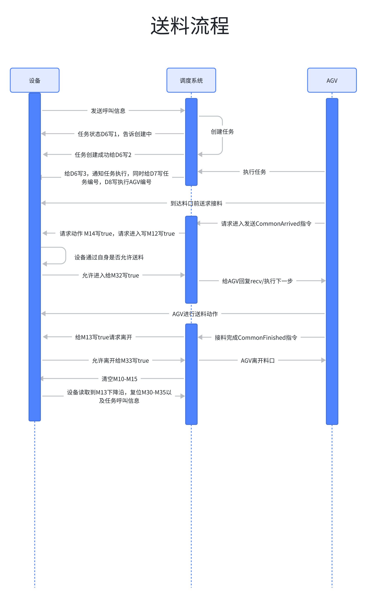

## 1、寄存器分类

在目前玖物3.0版的调度系统里，需要设备通过寄存器与调度系统通信，从功能角度上来说主要包含两种类型的寄存器，一种是用于产生的任务的寄存器，一种是用于过程交互的寄存器

任务产生一般分为两种情况，一种情况是设备主动呼叫，一种是调度系统监控设备的数目情况动态产生。

请根据现场情况动态配置使用情况，是采用设备主动呼叫，还是采用调度系统根据设备内的产品数目动态产生，请提前在方案前定好。

### 1.1 寄存器原则

所有的寄存器必须遵循以下几个原则

1. 不论寄存器采用`bool`还是`int`,必须是连续的数目，且用于表示`设备`和`AGV`的必须分开，如果设备的是`M0-M3或者D0-D3` ，那么`AGV`的需要隔开，`M4-M6/D4-D6`.**本系统推荐交互信号全部采用bool点的形式**。

2. 每个料口的寄存器必须是独立的一组，如果一个设备有3个料口，3个料口的寄存器地址必须是独立的。

3. 不推荐采用`bool`和`int`混用的方式，如表示设备都采用了`int`但是屏蔽设备是否采用`AGV`的对接信号，从理论上说采用`bool`更好，但是也支持`int`的`0和1`表示

4. 交互信号，必须分开，且信号保持的，不允许一步一个复位的原则，必须等全部完成，或者异常了才能复位，这样做主要为了方便排查错误原因。

5. 理论上`AGV`的寄存器必须由调度系统写，设备不能操作，设备的寄存器，只能由设备写。但是涉及到复位的，可能需要设备全部置位，这个需要实事先说明。但是**手动复位的功能，必须要设备能够全部复位**。

6. 对于串行的设备，呼叫信号必须互斥，所谓的互斥，就是上个任务还未完成，不能给下一个任务的呼叫信号，如果给了，直接判定设备的呼叫逻辑不严格，设备负主要责任。

## 2.任务产生

前面已经说过，任务产生一般分为两种情况，一种情况是设备主动呼叫，一种是调度系统根据设备的数目情况动态产生，细分的话目前主要有三种

1. 设备主动呼叫

2. 根据产品数目呼叫

3. 设备主动呼叫 + 产品数目

但是不论哪一种，推荐设置以下寄存器,以下寄存器地址只是举例说明使用，不做实际配置的要求。

地址说明：

* 如上推荐 D1 是作为一个开关，表示是否屏蔽AGV，如果屏蔽AGV，AGV调度系统不会理会该设备发出的任何信号。

* D2和 D5在对一个料口而言最好只存在一个，详细看下面的呼叫方式说明，一般是通过D2 或者D5 结合D3的发出一个任务。

* D4是对任务的一种扩展，如果一个设备连续下几种不同的产品，且送的地方不同，需要使用D4

* D6-D8是对调度系统给设备的反馈信息，主要是增强人机交互的功能可以根据现场需要是否添加。D6这里写了必须，最好能给出一个，方便排查问题。需要说明的是D7和D8 是字符串形式，可能不止16位，需要特别注意，最好现场测下长度，再给出具体的地址。

* D6-D11 是因为有的设备为了提高效率会同时接料和送料，所以区分开来，例如玻璃机，接空的是同一个车，送满的是另外一个车，所以为了区分用两套地址，**D6-D11，最好只做显示，方便人机交互，不参与对接流程的判断。**

* D9\~D11 只在存在"一个料口同时发出接送任务"的情况下出现,例如玻璃机会同时发出`下空盘`任务和`上满盘`任务, 如果料口正常流程中只会存在一个未完成的任务,则只需要D6\~D8一组任务状态参数寄存器

### 2.1 设备主动呼叫

设备主动呼叫的方式相对简单，就是设备给出相对应的呼叫信号，调度系统根据呼叫信号进行任务产生。我们在1.1章节中已经说过，任务响应通知是必须的，如果调度系统收到信号了，会根据任务状态通知到相关的寄存器。

对于送料可以是D2=1  D3=1 下料的话 D2=1 和D3=2 对于先上后下，和先下后上，调度系统会创建两个一个送料任务和接料任务，同时创建两个，根据先上后下，还是先下后上，顺序执行，车在执行的时候，会给出是送和接的动作信号，详细的看下面的第4部分任务的状态。 也就是D2是做呼叫的，D3设置这次的任务类型，但是禁止，在上次任务还是没有完成，就改呼叫类型。

### 2.2 根据产品数目呼叫

* 当`实时产品数目寄存器的值` 大于/小于 `设定值`的时候, 触发叫料, 生成任务。

* 此种任务触发方式适用于`设备生成节拍固定的场景`。

  * 如果设备生成节拍不固定, 例如组件生成中的分档机，业务设定20片是满拖，可以拉料，设置了18片的时候触发任务，呼叫`AGV`去接料。但是实际生产过程中，最后两片要等3-5个小时才能出来，导致`AGV`长时间等待，造成极大生产力的浪费。这种情况更推荐采用 `设备主动呼叫`或者2.3的`设备主动呼叫 + 产品数目`的方式

* 这里同样要结合`任务类型寄存器`(D3)

  * 例如:假设设置的触发值是5

    * D3为1, 则当数目大于5触发接料任务

    * D3为2, 则当数目小于5触发送料任务

### 2.3 根据产品数目呼叫

针对2.2中的情况，可以采用此种方法，呼叫还是设备主动呼叫，数目只是作为调度系统调整优先级的一个参数。

## 3.任务的取消

&#x20;任务取消主要分为两种，设备主动取消和调度系统主动取消。

&#x20;但是调度系统一般不会主动取消任务，除非发生异常的时候，人工中断任务，复位寄存器。或者人工根据情况判断在系统里关闭任务，

&#x20;当人工主动关闭任务的时候，调度系统会将`任务通知寄存器、分配AGV寄存器`全部复位成`0或者false`。(除此之外，也会复位掉对接状态寄存器，后面讲)

&#x20;设备的取消分为两种情况

1. 设备通过配置一个寄存器主动取消

2. 根据设备呼叫的，当设备如果产生接满料，物料数目突然变成0，那么调度系统会取消接满料的任务，这个情况说明人工干预了

3. 根据设备呼叫的，当设备如果产生送料， 物料数目突然变大满料，那么调度系统会取消送料的任务，这个情况说明人工干预了

## 4.状态寄存器

状态寄存器用于确认对接过程中信息的，必须全部是`bool`要求如下，`PLC`和`AGV`必须分开。且每个保持16个，且保持连续。

