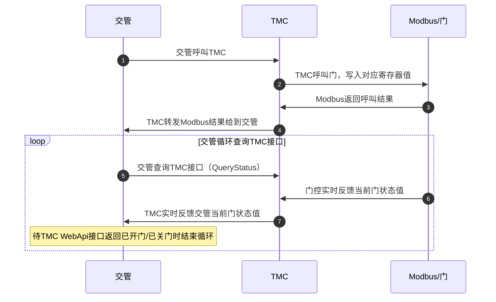
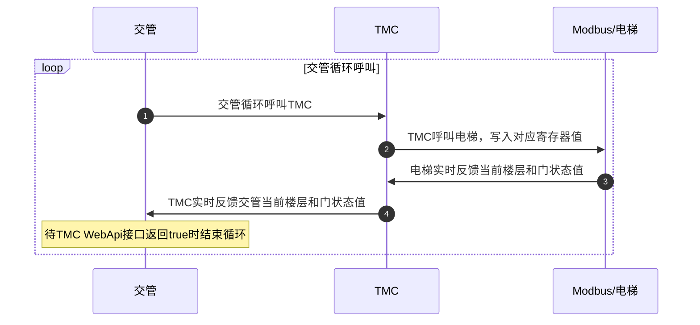

# 梯控门控模块（TMC）
| 文件名称 | 梯控门控模块         |
| -------- | -------------------- |
| 部门     | 软件算法部/调度组    |
| 版本     | 1.0                  |
| 密级     | 保密（部门内部公开） |

## 修改记录

| 版本号 | 修改日期   | 修改人 | 概述                 | 详细说明                                     |
| ------ | ---------- | ------ | -------------------- | -------------------------------------------- |
| 1.0    | 2025-06-12 | 孟亚军 | 通用梯控门控模块整理 | 详细描述梯控门控模块的输入输出，接口，使用等 |

---

## 一、概述

​        基于各个现场业务场景的不同，AGV需要过卷帘门或上下电梯等，由于业务场景比较相通，比如开门、关门、控制状态查询等，才有了门控梯控作为独立模块设计，可以实现不同厂家的协议（具体的协议后面章节会讲），并对外提供统一的 WebApi 接口，实现系统间的解耦。

- 如接送料在多个区域，多个区域之间一般会有卷帘门，AGV需要自动呼叫（打开）卷帘门，过去之后再复位（关闭）卷帘门;
- 还有接送料在不同的楼层，AGV到电梯前需要自动呼叫电梯到当前楼层，进入电梯后关闭电梯门并呼叫目标楼层，到达目标楼层后出电梯后释放电梯;

## 二、输入输出

### 呼叫时序图

#### 门控




#### 梯控



**首次调用接口执行呼叫电梯，后续调用接口执行查询逻辑，查询电梯是否到达呼叫楼层并开门。**

### **门控接口**

#### **1、开关门接口**

描述

| 请求地址 | http://ip:port/api/rms/Operate |
| -------- | ------------------------------ |
| 请求类型 | Post                           |
| 内容格式 | application/json               |


请求体

| **参数** | **类型** | **必填** | **描述** | **备注**        |
| -------- | -------- | -------- | -------- | --------------- |
| Command  | int      | 是       | 指令     | 1.Open，2.Close |
| Target   | string   | 是       | 门name   |                 |


响应体

| **参数** | **类型** | **必填** | **描述** | **备注**             |
| -------- | -------- | -------- | -------- | -------------------- |
| Code     | int      | 是       | 状态码   | 200：成功，500：失败 |
| Message  | string   | 是       | 结果描述 |                      |


#### **2、状态接口**

描述

| 请求地址 | http://ip:port/api/rms/QueryStatus |
| -------- | -------------------------------------- |
| 请求类型 | Get                                    |
| 内容格式 | application/json                       |


请求体

| **参数** | **类型** | **必填** | **描述** | **备注** |
| -------- | -------- | -------- | -------- | -------- |
| Target   | string   | 是       | 门name   |          |


响应体

| **参数** | **类型** | **必填** | **描述**     | **备注**                                                     |
| -------- | -------- | -------- | ------------ | ------------------------------------------------------------ |
| Code     | int      | 是       | 状态码       | 200：成功，500：失败                                         |
| Data     | int      | 是       | 数据：门状态 | 1：开门、2：开门中，3、关门，4、关门中，0：请求失败的时候传0 |
| Message  | string   | 是       | 结果描述     |                                                              |


### **梯控接口**

#### 1、呼叫和查询电梯状态接口

通过某些线路前会向外部系统申请通行权。当外部系统允许通过时才会通过该路线。

| 请求地址 | http://ip:port/api/Elevator/ReportFromRms |
| -------- | --------------------------------------------- |
| 请求类型 | Post                                          |
| 内容格式 | application/json                              |


交管系统会向指定URL发送HTTP POST，为JsonObject。包含以下字段

请求体

| **参数**          | **类型**   | **必填** | **描述**                                                     |
| ----------------- | ---------- | -------- | ------------------------------------------------------------ |
| Robot             | string     | 是       | 机器人名                                                     |
| requestEntityType | string     | 是       | requestEntity的类型，可以是“AdvancedPoint”或"AdvancedEdge"   |
| requestEntity     | string     | 是       | 申请路径的ID                                                 |
| timing            | string     | 是       | 现在有"before"和“after”。以后功能拓展用                      |
| **extra**         | 用户自定义 | 是       | 用户自定义类型和数据。为配置externalSystem.json时指定的常量。 |


拓展请求体 **extra**

​            1.     呼叫/移动电梯

| **参数** | **类型** | **必填** | **描述**      |
| -------- | -------- | -------- | ------------- |
| target   | string   | 是       | 电梯编号      |
| action   | string   | 是       | "call"/"move" |
| floor    | string   | 是       | 楼层编号      |


​            2.     离开电梯

| **参数** | **类型** | **必填** | **描述** |
| -------- | -------- | -------- | -------- |
| target   | string   | 是       | 电梯编号 |
| action   | string   | 是       | "leave"  |


响应体

| **参数** | **类型** | **必填** | **描述**     |
| -------- | -------- | -------- | ------------ |
| result   | boolean  | 是       | 是否允许行走 |


#### 2、查询电梯状态接口

通过某些线路前会向外部系统申请通行权。当外部系统允许通过时才会通过该路线。

| 请求地址 | http://<ip>:<port>/api/Elevator/QueryFromRms |
| -------- | -------------------------------------------- |
| 请求类型 | Post                                         |
| 内容格式 | application/json                             |


交管系统会向指定URL发送HTTP POST，为JsonObject。包含以下字段

请求体

| **参数**          | **类型**   | **必填** | **描述**                                                     |
| ----------------- | ---------- | -------- | ------------------------------------------------------------ |
| Robot             | string     | 是       | 机器人名                                                     |
| requestEntityType | string     | 是       | requestEntity的类型，可以是“AdvancedPoint”或"AdvancedEdge"   |
| requestEntity     | string     | 是       | 申请路径的ID                                                 |
| timing            | string     | 是       | 现在有"before"和“after”。以后功能拓展用                      |
| **extra**         | 用户自定义 | 是       | 用户自定义类型和数据。为配置externalSystem.json时指定的常量。 |


拓展请求体 **extra**

​            1.     呼叫/移动电梯

| **参数** | **类型** | **必填** | **描述**      |
| -------- | -------- | -------- | ------------- |
| target   | string   | 是       | 电梯编号      |
| action   | string   | 是       | "call"/"move" |
| floor    | string   | 是       | 楼层编号      |


​            2.     离开电梯

| **参数** | **类型** | **必填** | **描述** |
| -------- | -------- | -------- | -------- |
| target   | string   | 是       | 电梯编号 |
| action   | string   | 是       | "leave"  |


响应体

| **参数** | **类型** | **必填** | **描述**     |
| -------- | -------- | -------- | ------------ |
| result   | boolean  | 是       | 是否允许行走 |

## 三、协议/消息格式

### 协议类型

门/电梯目前常用的通讯协议：ModbusTcp、OpcUA

####  ModbusTcp

不管门还是电梯，一般厂商都支持 Modbus 协议，配置对应的寄存器地址即可。

#### OpcUA

用 OPCUAHelper 工具查找寄存器对应的节点地址，当然 Modbus 也需要配置以下几个寄存器地址

- 门控：配置对应的开门、关门、查询门控状态的寄存器地址
- 梯控：配置对应的楼层、门状态、电梯状态、运行状态、AGV模式、心跳寄存器

### 目前使用的几种监控方法

- 标准设备的通信方式（门控）

- 按位计算的设备操作类（门控）

  根据配置的数据类型，进行位比较

- 塔石的门控（门控）

- 鲁邦通电梯协议（梯控）

符合以上协议类型的设备，TMC 可配置相应的监控方法进行通信

## 四、设计

### 接口定义

#### IDeviceOperator 接口定义

设备操作，不同的协议可以通过实现接口IDeviceOperator的异步方法，如目前使用的门控协议塔石、梯控协议鲁邦通等，实现开门、关门、查询状态的异步接口即可。


### 内部流程

#### 寄存器属性分类

- 梯控


- 门控


#### 类关系图


门控和梯控都继承抽象类：Facilities，Facilities外键Device->DeviceId

1.门控配置表

- TransferPort：具体的门控寄存器配置表 
- Device：门本身属性如 IP、Port 对应设备表 
- StatusInfo：开门状态和关门状态多条件组合配置表 

2.梯控配置表

Elevator：具体的梯控寄存器配置表，还有包含电梯的运行状态（RunningStatus）：上、下、停止，电梯状态（ElevatorStatus）：报警等

DoorInfo：门配置表，如门类型（DoorType）：表示前门或后门，动作（EnterAction）：进门或出门

## 五、部署

### 环境配置

TMC门/梯控软件可以部署在Linux/Window。  

### 安装

#### Windows 部署  

windows可以部署成windows服务，配置为windows服务如下设置，以管理身份运行CMD

```bash
#创建服务
sc create TMCManager binPath=软件所在的路径 start=auto
#启动服务
net start TMCManager
#停止服务
net stop TMCManager
#查看服务状态
sc query TMCManager
```

  执行成功后就会创建一个名为TMCManager的服务，需要更新程序时，先停止服务，更新完文件后再重启。

#### Linux 部署  

linux部署成守护进程，将下面的指令粘贴到txt文本文件中，保存一个名为：TMCManager.service的文件 ，然后放到：/etc/systemd/system文件目录下

```bash
[Unit]
Description=TMCManager Program
After=network.target
[Service]
#这里是软件存放的目录
WorkingDirectory=/usr/local/JunionSeerRobotManager
#这里是目录下软件可执行程序的目录。
ExecStart=/usr/local/JunionSeerRobotManager/JunionSeerRobotManager
Restart=on-failure
RestartSec=2s
KillMode=process
[Install]
WantedBy=multi-user.target
```

授权和服务状态查询

```
#授权
sudo chmod u+x /usr/local/JunionSeerRobotManager/JunionSeerRobotManager
#开机自启
sudo systemctl daemon-reload
sudo systemctl enable TMCManager.service 
sudo systemctl start TMCManager.service
#服务状态查询
sudo systemctl status TMCManager.service
```

## 六、使用

### 配置和参数说明

这部分见：[门控和梯控程序说明](/RCS/tmc/门控和梯控程序说明.pdf)

## 七、常见问题

### 1.设备未连接成功

设备未连接成功，先检查设备的协议对不对，然后检查设备的站号对不对，注意站号是十进制，不是16进制，然后检查地址，同样注意地址是不是十进制，设备文档往往的是16进制，例如0x10是 十进制的16, 0x11是十进制的17。

### 2.调用不成功

调用不成功，检查配置的检测地址和上面写的判断逻辑对不对，另外注意门的编号对不对。一般门控都是modbus的，注意下输入信号都是离散寄存器地址。

### 3.数据格式不兼容

门控的系统设置里有的现场版本是字符串返回的是opening等这些，有些现场是int ，请在配置文件里设置下，如下 true 就是字符串，false 就是int