# 搭建配置模块

**搭建配置**模块为RMS基础设施数据的维护模块，在项目实施的前期需要经常使用。包括机器人、资源、库区、地图、系统五个部分的基础设施数据。

## 机器人

### 机器人配置

该页面维护机器人的基础数据，包括机器人名称、IP、所属机器人类型、所属工作区、启用状态及扩展字段。

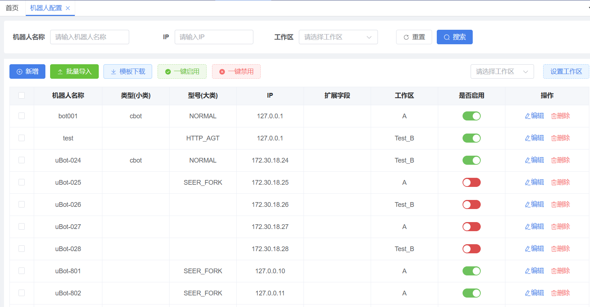

**筛选区**
筛选条件：机器人名称，机器人IP，工作区。

**列表字段**
机器人名称，类型，型号，IP，扩展字段，工作区，能否启用。

**常用操作**

- 新增：点击“新增”，填写机器人信息后保存。
- 编辑：点击列表中的“编辑”修改机器人信息。
- 删除：点击“删除”移除机器人。
- 启用/禁用：通过列表中的开关单独切换。
- 批量导入：支持上传 `.xls`、`.xlsx`、`.csv` 文件批量导入机器人。
- 下载模板：点击“下载模板”获取导入模板。
- 批量启用：勾选多条机器人记录后点击“快速启用”。
- 批量禁用：勾选多条机器人记录后点击“快速禁用”。
- 批量设置工作区：先勾选机器人，再在右侧选择工作区，点击“设置工作区”。

**使用说明**

- 编辑已有机器人时，机器人名称不可修改。
- 扩展字段可按需新增多组键值，字段类型由“扩展字段”页面预先定义。扩展字段用途在于给不同车增加特殊逻辑。
- 批量设置工作区、批量启用、批量禁用前，需先勾选目标机器人。

### 机器人类型配置

用于维护机器人类型档案，为机器人配置页面提供类型下拉数据。各类型用于调度判断和车的对接方式，常用的机器人大类有:
NORMAL: 调度直接发送routes name方式发送任务到小车；
JUNION_FORK: 玖物叉车，任务发送方式为经由RmsFork转发；
SEER_FORK: 仙工叉车，任务发送方式为经由RmsFork转发。
机器人小类用于细分区别标注，暂无特殊逻辑。
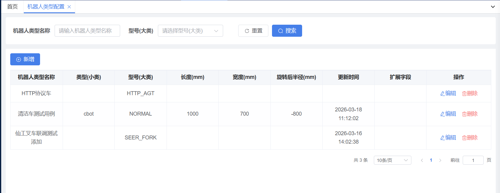

**筛选区**
筛选条件：机器人类型名称，类别。

**列表字段**
机器人类型名称，子类型，类别，长度(mm)，宽度(mm)，旋转半径(mm)，更新时间，扩展字段。

**常用操作**

- 新增机器人类型
- 编辑机器人类型
- 删除机器人类型

**使用说明**

- 类别来自系统预配置选项，当前可选择值包括NORMAL/JUNION_FORK/SEER_FORK
- 扩展字段可按需新增多组键值，字段类型由“扩展字段”页面预先定义。扩展字段用途在于给不同车型增加特殊逻辑。注意这里是给一类车增加特殊逻辑，而【机器人配置】中的扩展字段是给具体的车增加特殊逻辑。

### 充电策略配置

该页面维护按时间段生效的充电参数，用于不同时间启用不同的充电参数。
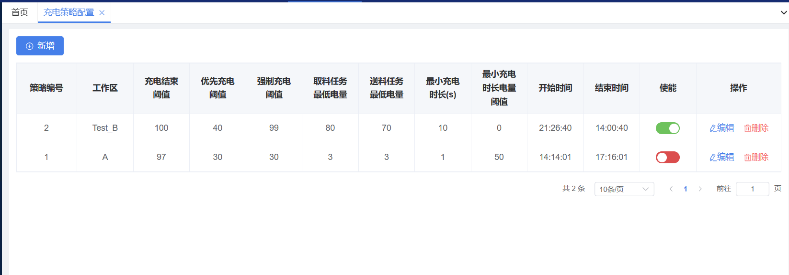
**列表字段**

- 策略编号
- 工作区
- 充电结束阈值，对应于全局的配置参数：full_plus_battery
- 优先充电阈值，对应于全局的配置参数：full_battery
- 强制充电阈值，对应于全局的配置参数：low_battery_limit
- 取料任务最低电量，对应于全局的配置参数：get_low_battery
- 送料任务最低电量，对应于全局的配置参数：put_low_battery
- 最小充电时长(s)，对应于全局的配置参数：min_dock_time
- 最小充电时长电量阈值，对应于全局的配置参数：min_dock_battery
- 开始时间：该组参数生效的开始时间
- 结束时间：该组参数生效的结束时间
- 使能

**常用操作**
新增、编辑、删除、使能开关

**使用说明**

- 该功能的目的在于按峰谷时间段启用不同的充电规则，例如低电价时可以采用更激进的充电策略。
- 各列表字段对应的参数的使用关系可以查询RMS3的充电策略汇总文档。

### 批量切换地图

用于将指定地图批量下发给一个或多个机器人。
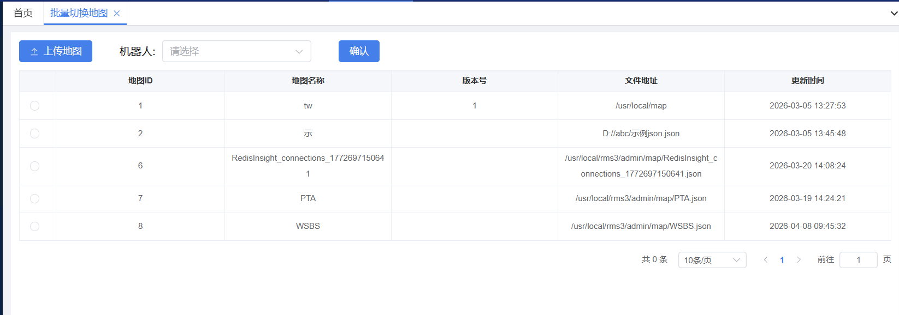
**筛选区**
上传地图：支持将直接上传的地图传到机器人。
机器人选择：可按类型或者具体名称勾选机器人。

**操作说明**

- 支持直接勾选已有地图下发至机器人。
- 支持直接上传地图下发至机器人。
- 地图列表数据来源于【地图配置】页面。

**工作区配置**
用于维护工作区基础信息，并建立工作区与地图、服务器连接信息的关系。工作区是一组资源根据地理特点抽象分开的一个属性，一般情况下不同工作区的机器人、资源、任务互不干涉。
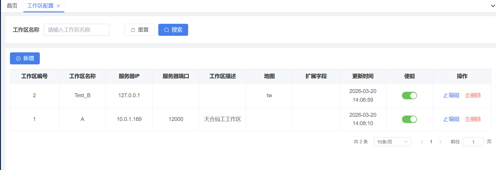
**筛选区**
筛选条件：工作区名称

**列表字段**

- 工作区编号
- 工作区名称
- 服务器IP：如果该区域有叉车类机器人，或者交管程序明确使用RmsFork，则需要配置服务器IP为RmsFork程序的IP。
- 服务器端口：如果该区域有叉车类机器人，或者交管程序明确使用RmsFork，则需要配置服务器端口为RmsFork程序接收任务的端口。
- 工作区描述
- 地图
- 扩展字段：来源于系统配置/扩展字段的预定义。
- 更新时间
- 使能

**使用说明**

- 工作区的设计考量一般以地理隔开、互不涉及为前提。
- 叉车类机器人的工作区或者交管程序明确使用RmsFork则必须配置服务器IP和端口。
- 不同工作区的任务在分配调度时为并行执行。

## 资源配置

该模块用于维护资源点位或资源对象信息。资源包括停车点，充电点，机台设备料口。
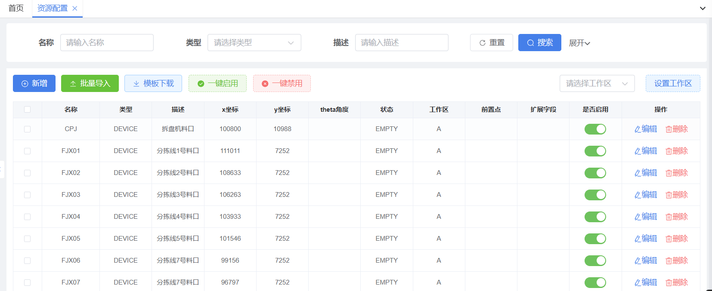

**筛选区**
筛选条件：名称，类型，描述，工作区，使能。

**列表字段**

- 名称
- 类型：PARK-停车点；DOCK-充电点；DEVICE-机台设备料口。
- 描述
- x坐标：资源点在地图中的位置坐标。
- y坐标：资源点在地图中的位置坐标。
- theta角度：资源点在地图中的位姿角度。
- 状态：当前资源的占用状态：EMPTY-空置 ASSIGNED-已分配  OCCUPIED-已被占用。
- 工作区
- 前置点：某些特殊车型对接某个机台时需要先驶至前置点再做别的调整动作。
- 扩展字段：扩展特殊逻辑。
- 是否启用

**使用说明**

- 支持单记录新增也支持批量新增，批量新增时需下载模板并填写关键数据再进行上传。
- 使能切换支持批量选择后操作。
- 工作区的设置支持批量选择后操作。

## 库区

### 库区配置

库区是用来对库位进行物料分区的一种手段，一个库区，对应多个库位。目前仅预留拓展。

### 库位配置

用于维护具体库位信息。库位是用来暂存物料的地点。
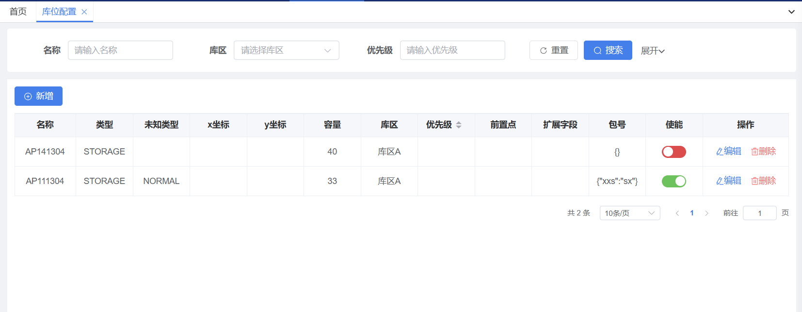
**筛选区**
筛选条件：名称，所属库区，优先级，包号，是否使能。

**列表字段**

- 名称
- 类型：用于拓展不同的库位逻辑。
- x坐标
- y坐标
- 容量：库位接纳物料数不会超过容量。
- 库区
- 优先级：同批可用库位优先级高者会先使用。
- 前置点：叉车驶进库位时，需先驶至前置点，从前置点到库位中心这部分可能有特殊动作，故需要给库位配置前置点。
- 扩展字段：预留拓展。
- 包号：当前库位存放的物料的包号信息。同一库位存放的物料包号一样
- 使能

**使用说明**

- “包裹内容”支持通过编辑按钮打开键值对窗口进行维护。
- 扩展字段支持选择预定义字段，并根据字段类型录入数值、布尔值、字符串、列表、JSON、日期等内容。

## 地图配置

维护服务器上的地图文件。
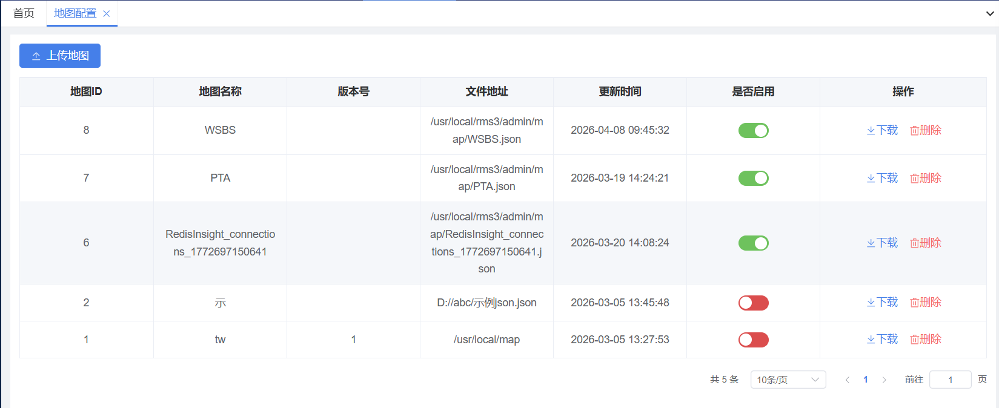**使用说明**

- 上传路径默认在/usr/local/rms3/admin/map/下。
- 相同文件名称不允许重复上传。

## 系统配置

### 系统参数

维护调度分配逻辑中的参数，具体参数作用建议在参数描述中明确写出。
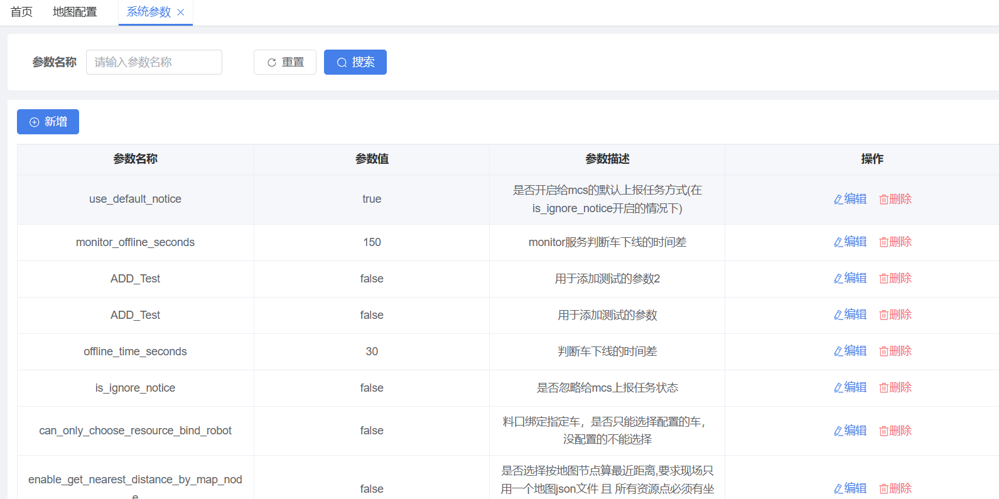

### 数据字典

用于维护系统字典项，供下拉选项或枚举值使用。暂无特殊逻辑。

### 扩展字段

为适配非标准需求，机器人、区域、资源点可能存在一些特殊逻辑，可以在该页面维护一些配置字段，以用于类似现场复用配置。
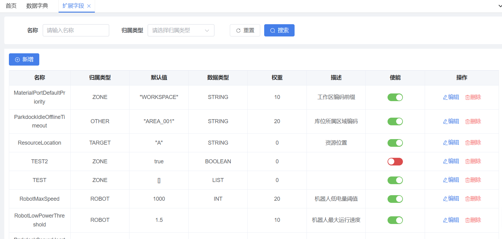
**筛选区**
筛选条件：名称，归属类型

**列表字段**

- 名称
- 归属类型：表示该扩展字段可用于哪些对象，ZONE-工作区，TARGET-资源点，ROBOT-机器人，OTHER-其他对象
- 默认值
- 数据类型
- 权重
- 描述
- 使能

### 报警类型

该页面维护报警类型的定义，包括报警的国际化多语言描述，报警的解决方案等信息。
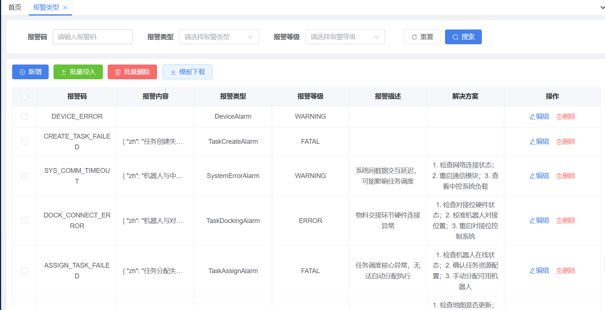
**筛选区**
筛选字段：报警码，报警类型，报警等级

**列表字段**

- 报警码
- 报警内容：该字段维护报警的国际化多语言描述
- 报警类型：RobotAlarm-机器人本体告警；TaskAssignAlarm-任务分配告警；TaskDockingAlarm-任务对接告警；SystemErrorAlarm-系统错误告警；TaskCreateAlarm-任务创建告警；DeviceAlarm-设备告警。
- 报警等级：WARNING-警告 < ERROR-错误 < FATAL-致命错误；
- 报警描述
- 解决方案

**使用说明**

- 报警内容支持 JSON 格式编辑，也支持通过键值对编辑窗口维护。
- 报警等级当前前端可选值包括 `ERROR`、`WARNING`、`FATAL`。
- 编辑时报警码不可修改。
- 批量删除前需要先勾选目标记录。

### 授权管理

该页面可以查看调度服务的证书到期时间，当证书到期后，程序会停止调度。该页面可以直接上传证书文件。
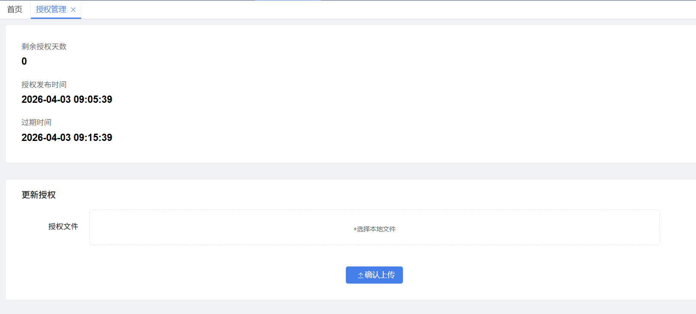
**使用说明**

- 仅支持上传 `.crt` 授权文件。
- 页面一次仅允许选择一个文件，重新选择会覆盖上一个文件。
- 选择文件后，点击“确认上传”完成授权更新。
- 证书生成方法可参考RMS3证书生成工具使用文档。

## 建议使用顺序

建议按以下顺序维护基础数据：

1. 地图配置

2. 工作区配置

3. 扩展字段

4. 器人类型配置

5. 机器人配置

6. 资源配置

7. 库区配置

8. 库位配置

9. 系统参数、数据字典、报警类型、授权管理

   

# 运营管理模块

## 服务运行监控

### 首页

本页面为**服务运行监控（首页）**，用于实时展示CPU、内存、服务器、Java虚拟机及磁盘等核心资源的运行状态，帮助运维人员快速掌握系统健康度与资源消耗情况。

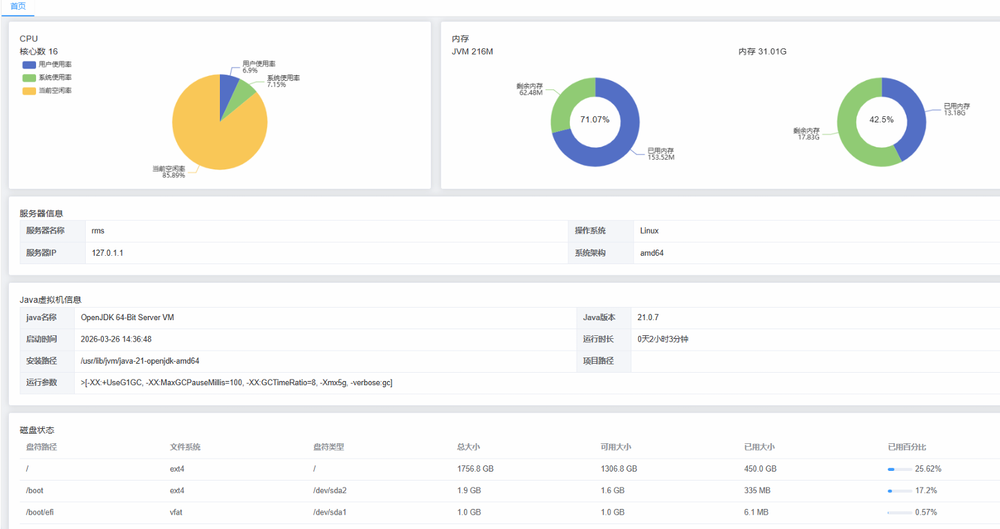

## 任务管理

### 实时任务

**实时任务**页面是用于集中展示系统中所有实时任务的状态与详情，支持多维度查询与任务干预，帮助运维人员实时掌握任务执行进度、处理异常任务，保障业务流程高效运转。

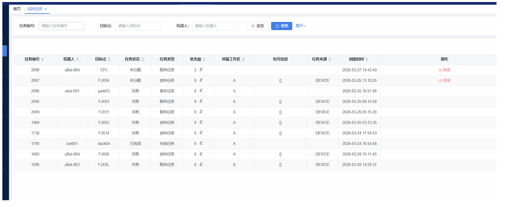

**筛选区**

筛选条件：查询任务编号、目标点、机器人、任务状态、任务类型、工作区

操作按钮：重置（清空条件）、搜索（查询数据）

**优先级修改**

点击数字处，修改任务的优先级级别

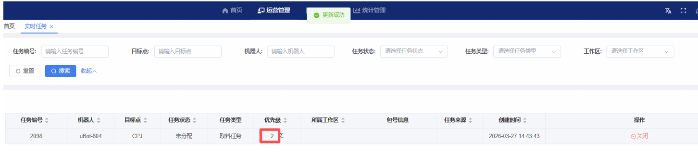

**关闭操作**

选择机器人上不保留物料，放料任务将清空物料包号

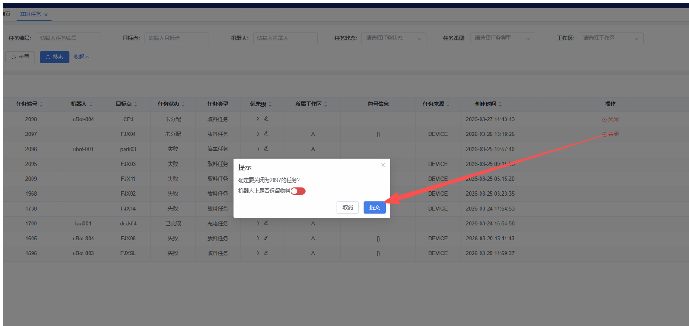

### 历史任务管理

本页面为**历史任务管理**模块，用于查询、统计和导出机器人历史任务数据，支持多维度筛选与任务量分析，满足运维与业务复盘需求。

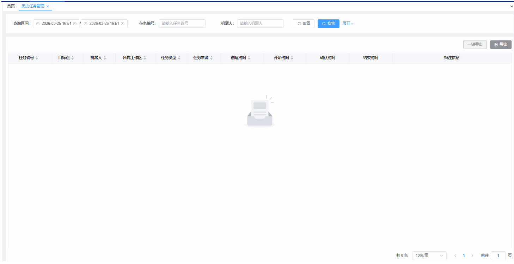

1. **筛选区**

   筛选条件：查询时间区间、任务编号、机器人名称、任务类型、工作区

   操作按钮：重置（清空条件）、搜索（查询数据）

2. **数据表格**

   用于展示目标点维度的任务统计数据：

   列表信息：任务编号、目标点、机器人、所属工作区、任务类型、任务来源、创建时间、开始时间、确认时间、结束时间、备注信息

3. **导出功能**

   支持将当前筛选结果导出为文件，用于离线分析或存档

## 机器人管理

### 实时AGV

本页面为**实时 AGV 监控模块**，用于集中展示和管理所有 AGV 设备的运行状态

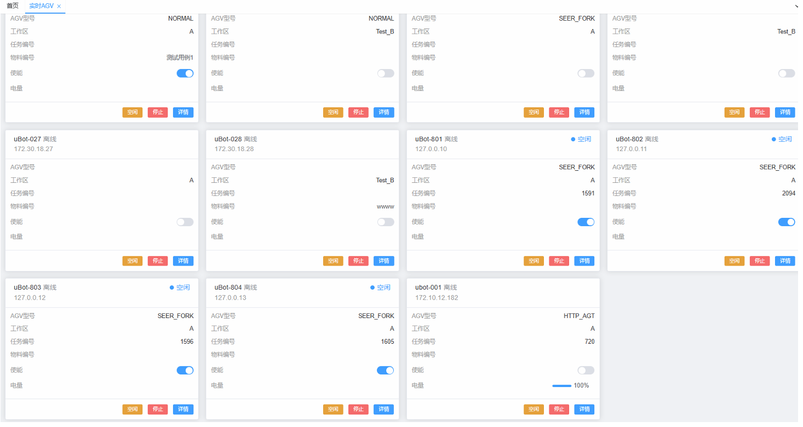

1. **设备状态可视化**

   **设备基础信息**：展示每台 AGV 的名称、IP 地址、型号、所属工作区等核心信息

   **在线状态**：直观标记设备在线 / 离线状态（如 “uBot-027 离线”）

   **运行状态**：通过标签展示当前状态（如 “空闲”），便于快速识别设备可用性

   **关键业务数据**：实时显示当前任务编号、物料编号、使能状态及电量信息（如电量 100%）

2. **设备控制操作**

   提供**空闲**、**停止**等快捷操作按钮，可直接对 AGV 下发状态控制指令。

   提供**详情**按钮，支持查看单台 AGV 的完整运行数据与历史记录。

   支持**使能开关**，可启用 / 禁用 AGV 设备

   点击详情按钮后，可编辑AGV 身上的物料信息，下拉框选择目前物料表里面存在的物料名称，点击确认,可将包号信息绑定到机器人身上

   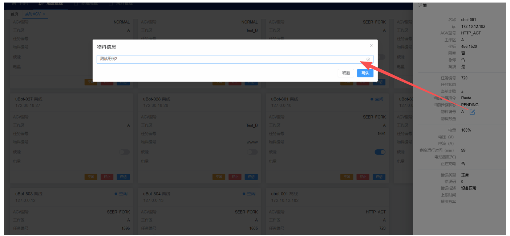

### 电池标定信息

本页面为**电池标定信息管理模块**，用于记录、查询和管理机器人电池电量标定的数据，支持多维度筛选、数据导出与标定解除操作，为电池性能分析与电量校准提供数据支撑。

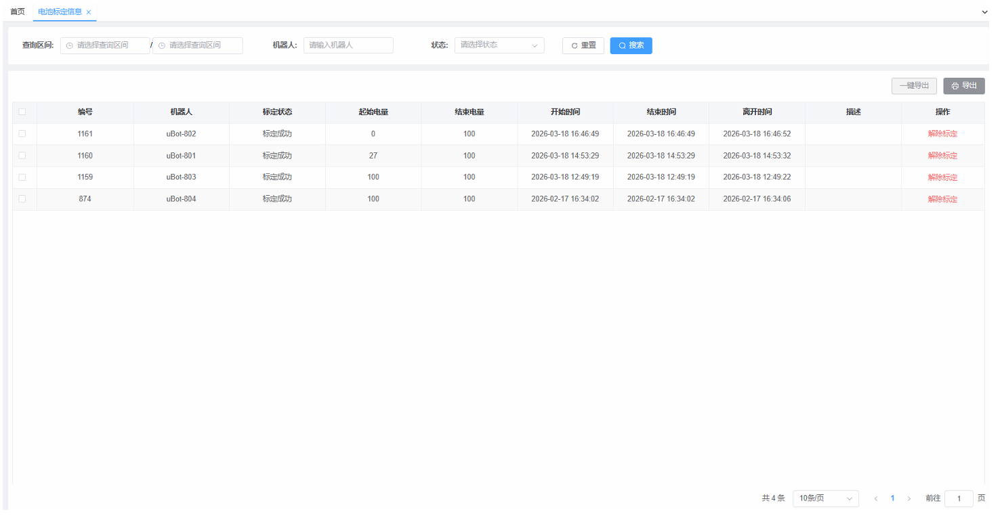

**筛选区**

1.筛选条件：查询时间区间、机器人名称、状态

2.操作按钮：重置（清空条件）、搜索（查询数据）

**导出功能**

支持将当前筛选结果导出为文件，用于离线分析或存档

**解除标定**

选择指定的机器人，点击解除标定，可以将机器人改为非标定状态

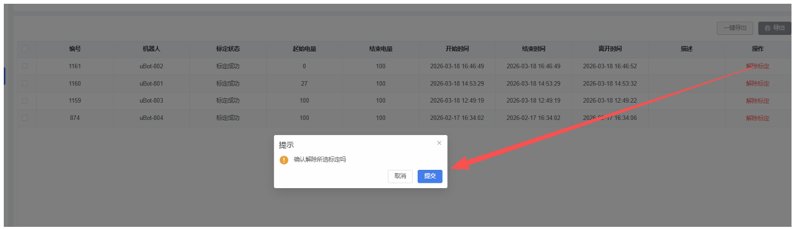

### 交通信息

**交通信息**页面用于展示机器人的交通阻塞与执行任务交通信息，帮助运维人员实时掌握机器人通行状态、阻塞关系与后续任务规划，保障多机器人协同调度的顺畅与高效。

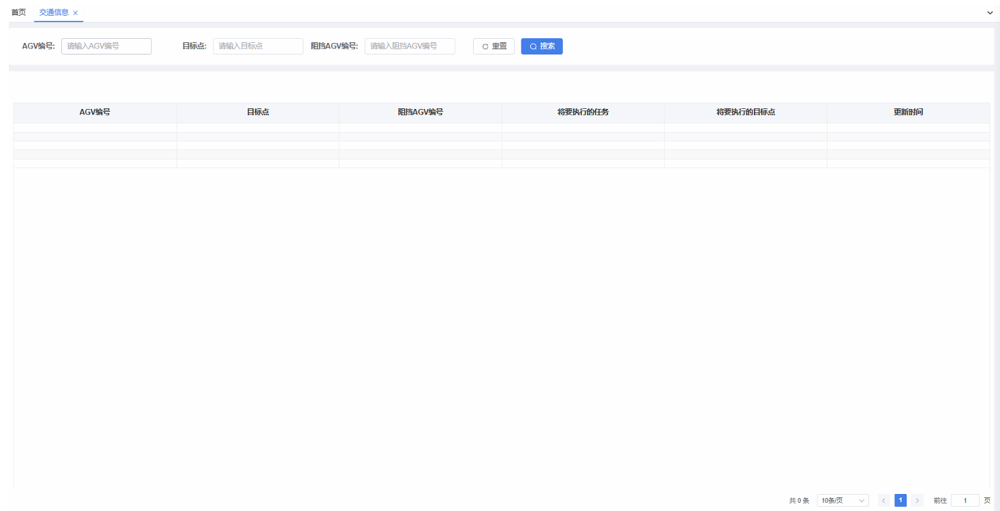

**筛选区**

1.筛选条件：查询AGV编号、目标点、阻挡AGV编号

2.操作按钮：重置（清空条件）、搜索（查询数据）

## 资源点管理

### 充电点管理

**充电点管理**页面是用于集中管理机器人充电点资源，支持充电点信息查询、状态监控与启用控制，保障机器人充电调度的高效与稳定

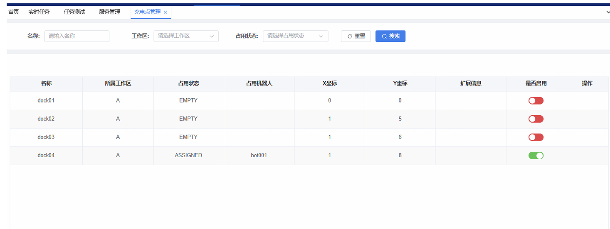

**筛选区**

1.筛选条件：查询名称、机器人名称、状态

2.操作按钮：重置（清空条件）、搜索（查询数据）

**是否启用**

切换开关，变更操作的资源点是否被占用

### 停车点管理

**停车点管理**页面是用于集中管理机器人停车点资源，支持停车点信息查询、状态监控、占用释放与启用控制，保障机器人闲置时的有序停靠与调度效率

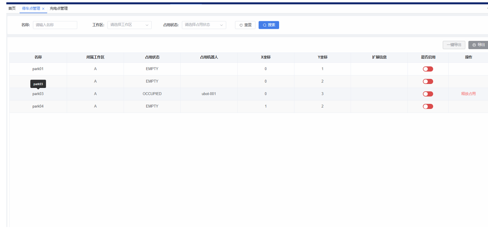

**筛选区**

1.筛选条件：查询名称、所属工作区、占用状态

2.操作按钮：重置（清空条件）、搜索（查询数据）

**是否启用**

切换开关，变更操作的资源点是否被占用

**释放占用操作**

当资源属于被占用状态，操作列可以选择释放占用操作

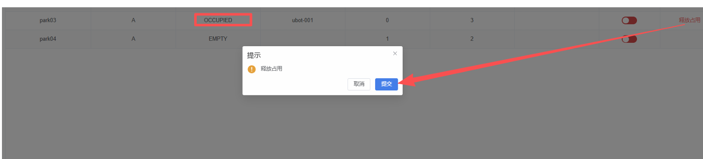

## 库位管理

### 库位概览

**库位概览**页面用于展示仓库库位的实时状态与容量信息，支持多维度筛选查询，方便仓储管理人员快速掌握库位占用情况，进行库存调度与管理

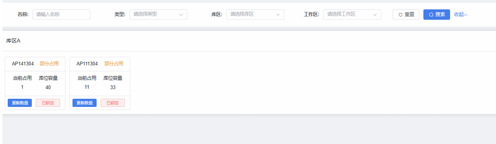

**筛选区**

1.筛选条件：查询名称、库区、工作区

2.操作按钮：重置（清空条件）、搜索（查询数据）

**更新数量操作**

点击更新按钮，在输入框里面输入当前占用数量，点击确认更新

**锁定操作**

点击锁定/已锁定可以更改库位的占用状态

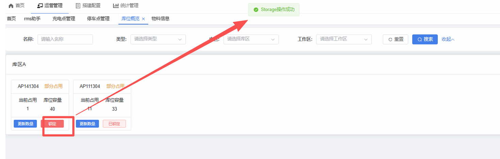

### 物料信息

**物料信息**页面是用于管理仓库内物料的基础信息、库存数量及库位关联关系。支持物料的新增、查询、修改、删除及数据导出等操作，为仓储管理人员提供物料全生命周期管理能力。

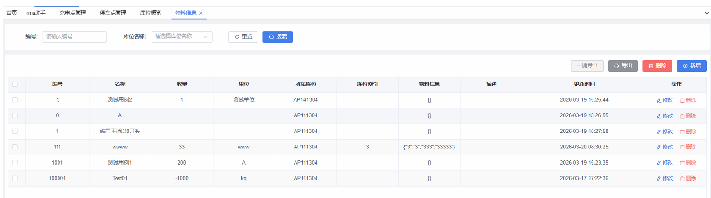

**筛选区**

1.筛选条件：查询编号、库位名称

2.操作按钮：重置（清空条件）、搜索（查询数据）

**导出功能**

支持将当前筛选结果导出为文件，用于离线分析或存档

**一键删除**

选择多个物料，选择删除，可以删除物料

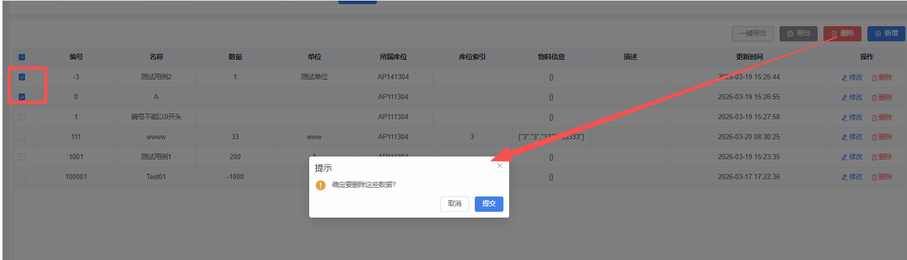

**新增**

点击新增按钮，输入新增物料的信息，点击确认

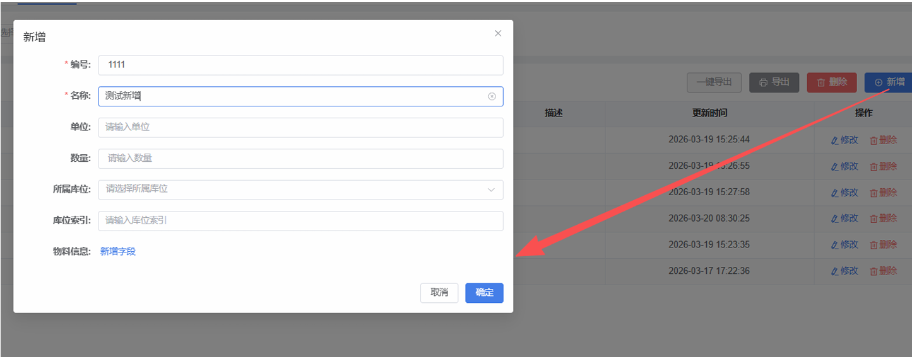

**单个物料修改**

单个物料操作按钮选择修改按钮，修改需要修改的物料信息，点击确定

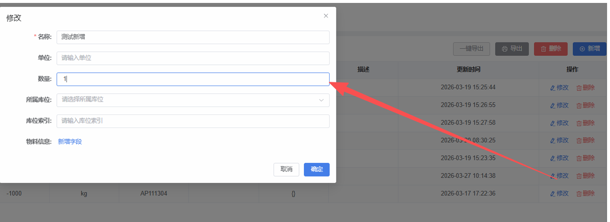

**单个物料删除**

在需要删除的物料操作列，点击删除按钮，提交删除

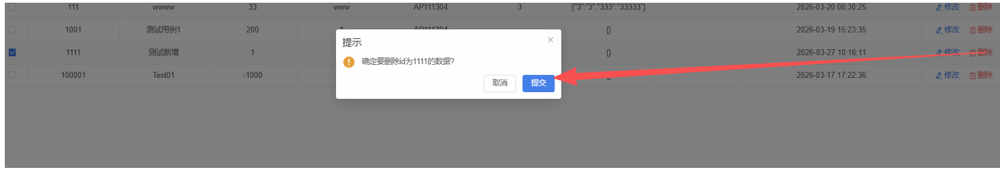

## 分配管理

### **物料包号绑定**

**物料包号绑定**页面是用于建立物料包号与停车点/充电点关联关系的核心模块，当为机器人分配充电或者停车点的时候，优先级寻找包号能匹配上的最佳资源，为 机器人的停车/充电任务提供精准的资源点调度依据。

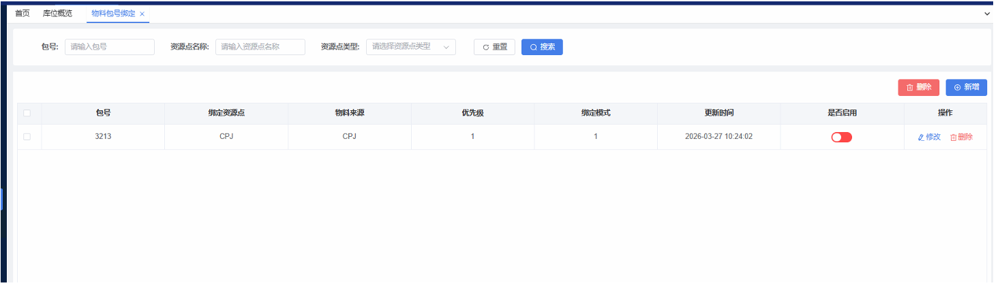

**筛选区**

1.筛选条件：查询包号、资源点名称

2.操作按钮：重置（清空条件）、搜索（查询数据）

**删除**

点击删除，可以删除绑定记录

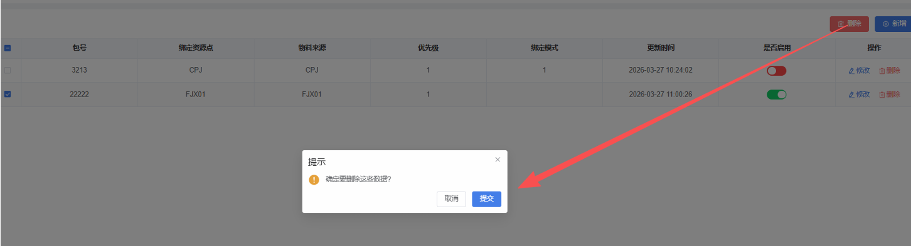

**新增**

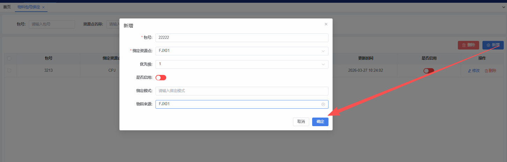

### 启用

切换是否启用

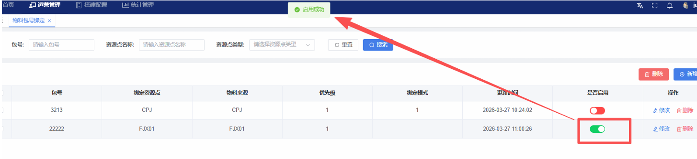

### **对接口互斥**

**接口互斥管理**页面用于配置两个机台口之间的互斥规则，通过定义互斥类型与启用状态，控制机台的并发调用逻辑，避免业务冲突与资源竞争，保障系统稳定运行。

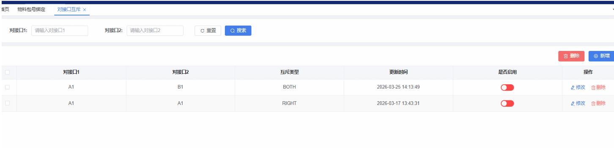

**筛选区**

1.筛选条件：查询对接口1、对接口2

2.操作按钮：重置（清空条件）、搜索（查询数据）

**删除**

点击删除，可以删除对接口互斥记录

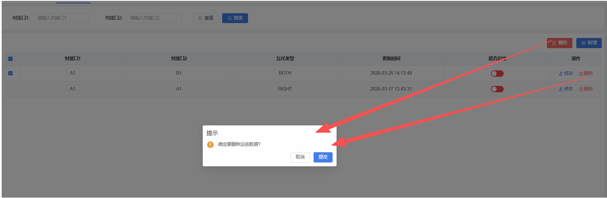

**修改**

点击修改，修改对接口,互斥类型，是否启用开关

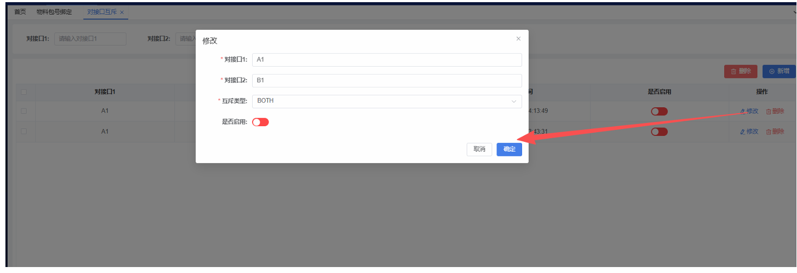

## 报警管理

**报警管理**页面是监控模块，用于集中展示和管理系统内各类报警事件，支持多维度查询、数据导出及报警信息追溯，帮助运维人员快速定位问题、处理异常，保障系统与设备稳定运行。

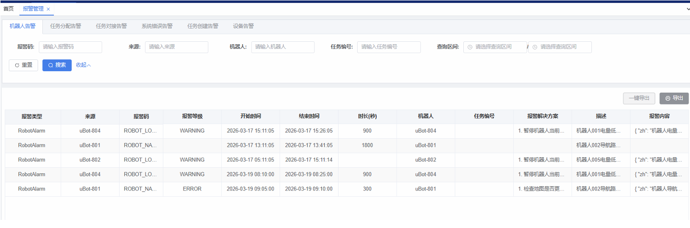

**筛选区**

1.筛选条件：查询报警码、来源、来源机器人

2.操作按钮：重置（清空条件）、搜索（查询数据）

**导出功能**

支持将当前筛选结果导出为文件，用于离线分析或存档

## 服务管理

**服务管理**页面是用于可视化监控和控制系统后台服务的运行状态，支持服务启停、重启操作，帮助运维人员实时掌握服务健康状况，保障系统稳定运行。

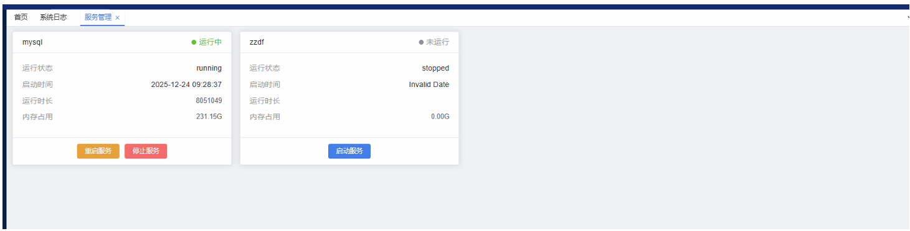

**服务来源**

若要添加服务，需要再sys_module表里面添加配置

## 日志管理

### **系统日志**

**系统日志**页面是用于集中管理系统服务的日志文件，支持日志查询、下载与导出操作，为问题排查、系统审计和故障分析提供关键数据支撑，保障系统稳定运行

**日志来源**

是由前端根据现场对应服务的日志路径，写死路径，查询路径下的日志文件

### **操作日志**

**操作日志**页面是 用于记录和追溯用户 / 系统在各业务模块的操作行为，支持多维度查询与数据导出，为安全审计、问题溯源、操作复盘提供完整数据依据，保障系统操作可追溯、可审计

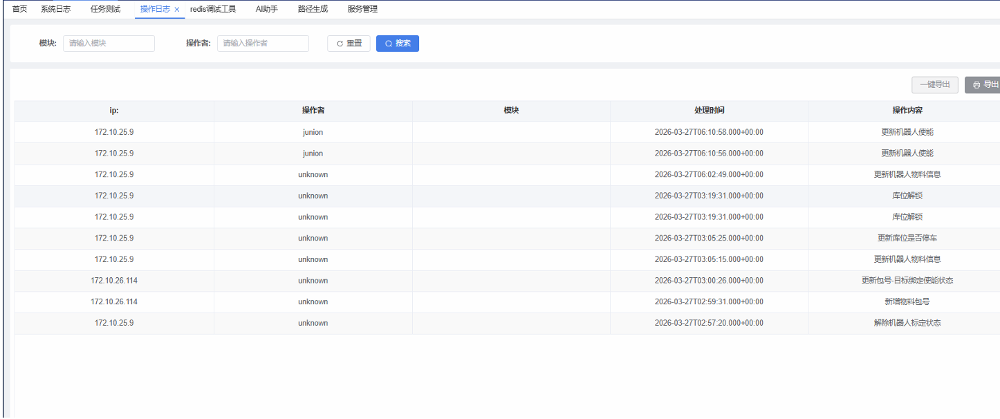

**筛选区**

1.筛选条件：查询报警码、来源、来源机器人

2.操作按钮：重置（清空条件）、搜索（查询数据）

**导出功能**

支持将当前筛选结果导出为文件，用于离线分析或存档

## 调试工具

### **任务测试**

**任务测试**页面是用于手动创建测试任务，模拟真实业务场景下的机器人任务执行流程，验证任务调度、路径规划、设备交互等核心功能

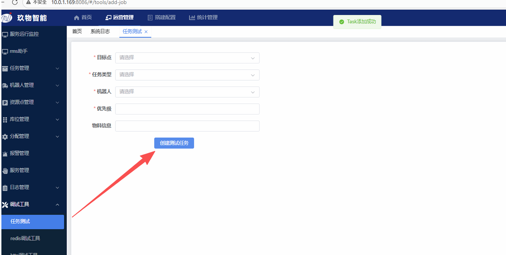

### **redis调试工具**

**Redis 调试工具**是 系统提供的开发 / 运维调试模块，用于可视化管理 Redis 缓存数据，支持键值查询、修改与删除操作，方便开发 / 运维人员快速排查缓存问题、验证数据状态，保障系统缓存层的稳定性与一致性。

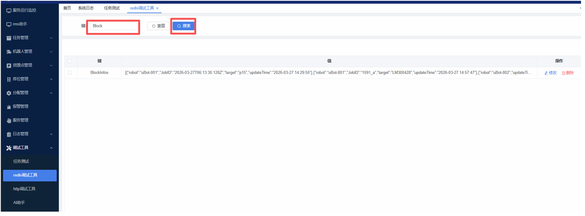

输入redis的key查询，进行修改、删除操作

### **http调试工具**

**HTTP 调试工具**是 系统内置的接口调试模块，用于模拟发送 HTTP 请求，支持自定义请求方法、URL、请求头与请求体，可直接查看接口响应结果，为开发 / 联调 / 运维人员提供便捷的接口测试能力，用于验证接口逻辑、排查通信问题与调试业务流程

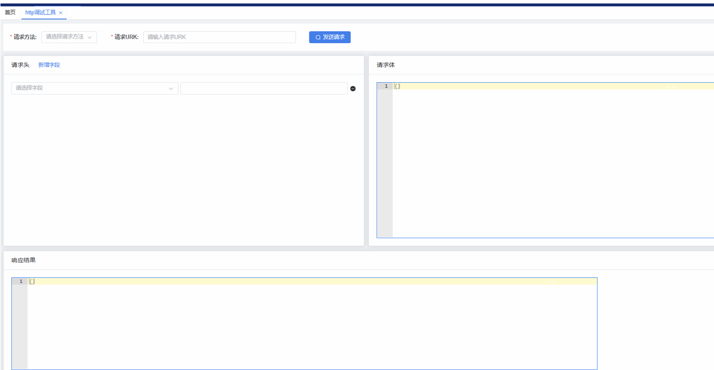

### **AI助手**

AI助手是内嵌智能助手，帮忙解答疑问

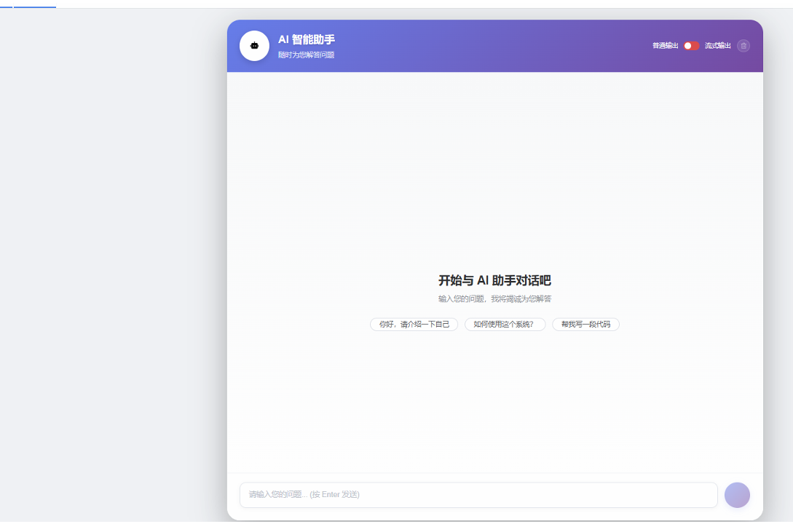

### **路径生成**

**路径生成**页面是 系统中用于可视化编排机器人任务路径模版的模块，通过拖拽指令的方式组合业务流程，自动生成符合机器人协议的 JSON 路径数据，实现路径配置的可视化、可复用与可维护，降低路径开发门槛

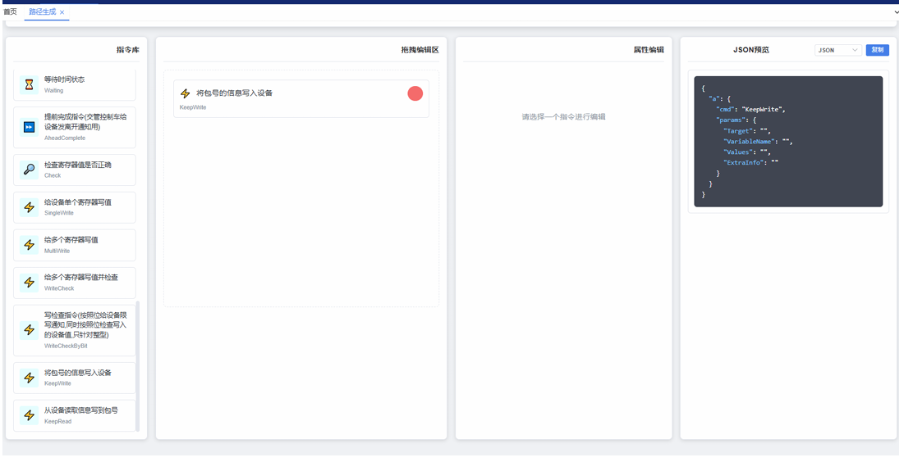

### **json校检工具**

**JSON 校验工具**是 RMS 系统内置的开发 / 调试辅助模块，用于校验 JSON 格式的合法性、格式化输出与语法纠错，帮助开发 / 运维人员快速定位 JSON 数据问题，保障接口交互、路径配置等场景下的数据正确性

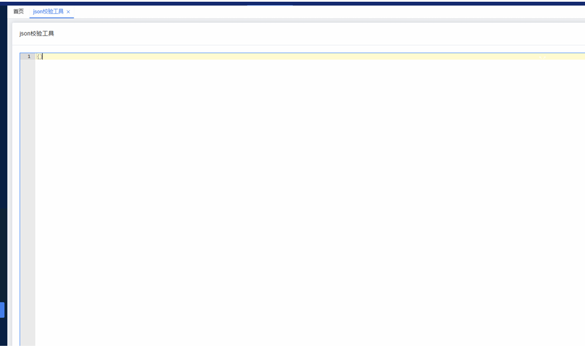

# 统计管理模块

## 任务

### 全局任务概览

查询当前任务状态分布概览(**查主表数据**)  支持条件间隔查询

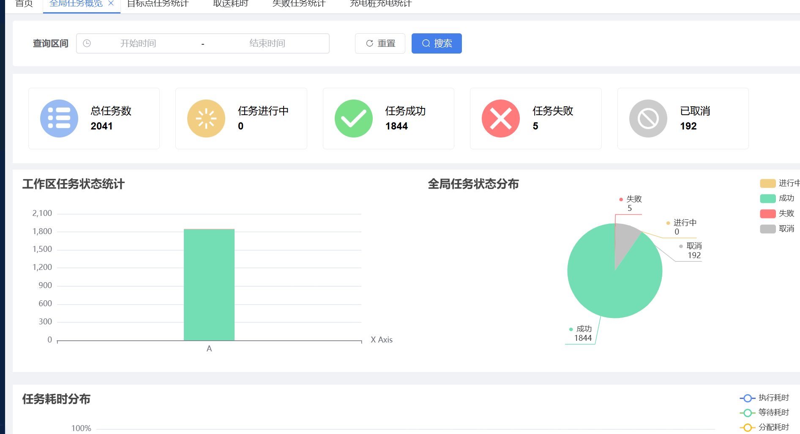

1. 筛选区

   功能：时间区间选择、重置条件、搜索查询

2. 指标卡

   展示：总任务数、进行中、成功、失败、已取消

   逻辑：总任务数 = 各状态任务数之和

3. 图表区

   工作区任务状态统计：柱状图，分析各工作区任务状态统计

   全局任务状态分布：饼图，展示所有工作区任务状态占比

   任务耗时分布：折线图，分析各个工作区的任务执行 / 等待 / 分配耗时趋势

### 目标点任务统计

统计各机台任务情况分布统计表格**(查的是主表的任务数据和资源表的关联**) ，支持多条件筛选与数据导出

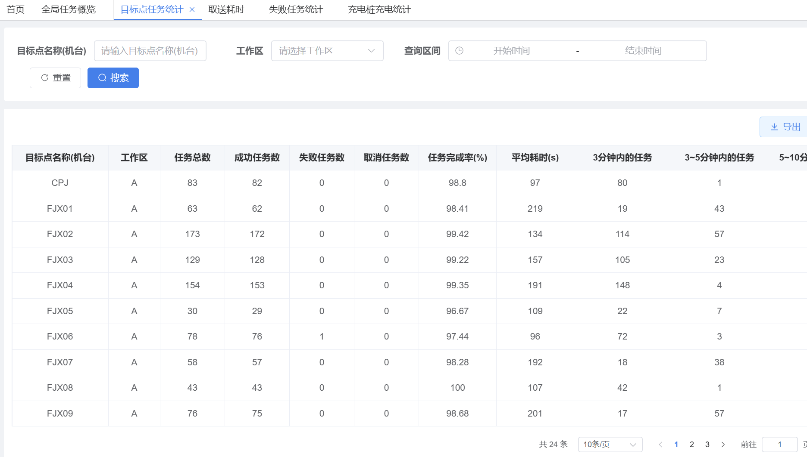

1. 筛选区

   筛选条件：目标点名称 (机台)、工作区、查询区间

   操作按钮：重置（清空条件）、搜索（查询数据）

2. 数据表格

展示目标点维度的任务统计数据：

​	基础信息：目标点名称 (机台)、工作区

​	任务量：任务总数、成功任务数、失败任务数、取消任务数

​	效率指标：任务完成率、平均耗时 (s)

​	时效分布：3 分钟内任务、3~5 分钟内任务、5~10 分钟内任务（等时段统计）

3. 导出功能

   支持将当前筛选结果导出为文件，用于离线分析或存档

### 取送耗时

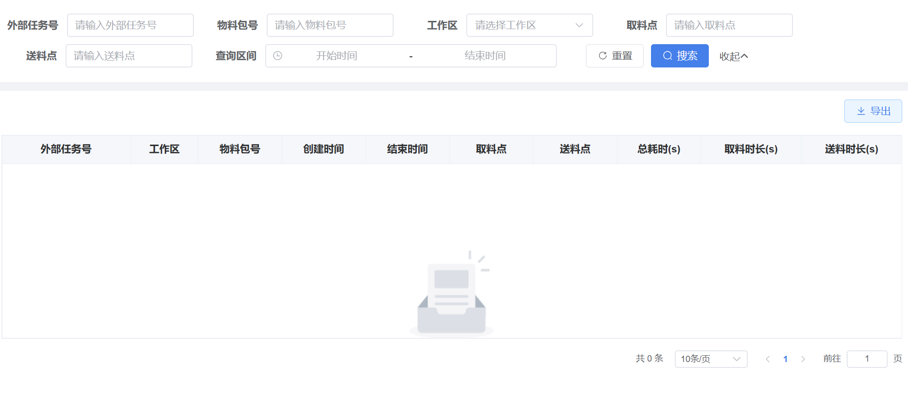

用于统计取送料任务全流程耗时**(查的是主表的任务数据和资源表的关联**)

1. 筛选区

- 筛选条件：外部任务号、物料包号、工作区、取料点、送料点、查询区间（开始 / 结束时间）
- 操作按钮：重置（清空条件）、搜索（查询数据）、收起（隐藏扩展筛选项）

2. 数据表格

展示取送料任务的明细数据：

- 基础信息：外部任务号、工作区、物料包号
- 时间信息：创建时间、结束时间
- 节点信息：取料点、送料点
- 耗时指标：总耗时 (s)、取料时长 (s)、送料时长 (s)

3. 导出功能

- 支持将当前筛选结果导出为文件，用于离线分析或报表存档

### 失败任务统计页面文档

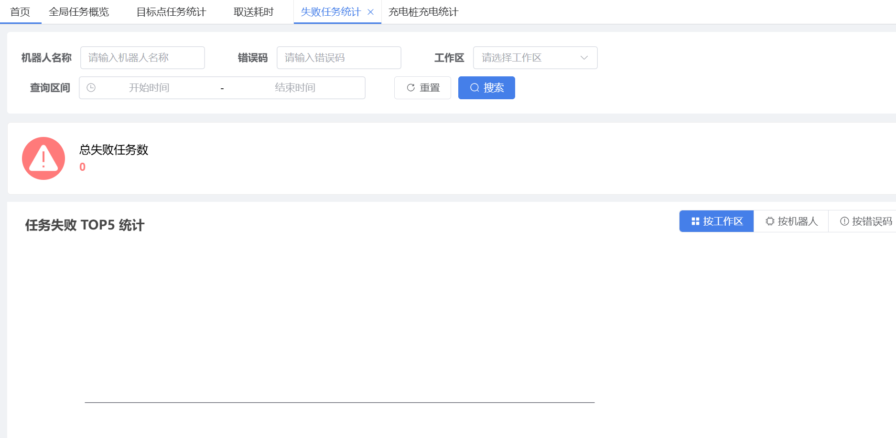

用于监控与追溯任务失败详情（查主表任务status为600也就是失败的任务数据）

1. 筛选区

- 筛选条件：机器人名称、错误码、工作区、查询区间（开始 / 结束时间）
- 操作按钮：重置（清空条件）、搜索（查询数据）

2. 核心指标区

- **总失败任务数**：展示当前筛选条件下的失败任务总量

3. 统计视图区

- **任务失败 TOP5 统计**：
- 切换维度：
    - 按工作区
    - 按机器人
    - 按错误码

4. 详情表格区

- **失败任务详情**：展示失败任务的完整链路信息
- 表格字段：任务号、所属工作区、任务类型、机器人名称、错误码、错误描述、解决方案、导出

## 机器人

### 运行状态概览

用于**实时监控机器人状态与电量**分布，支持按工作区(可多选)筛选数据 默认查询所有工作区数据

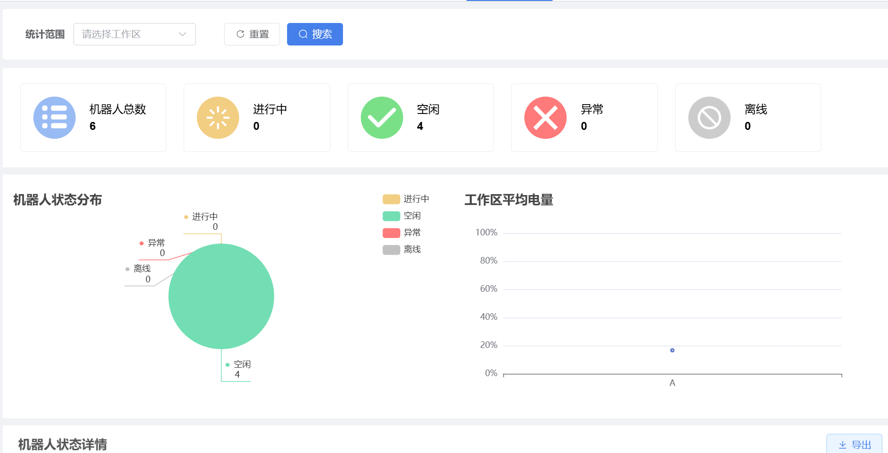

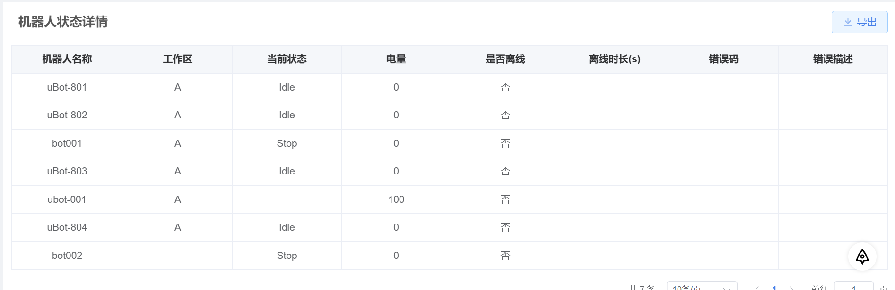

1.筛选区

- 筛选条件：统计范围（工作区选择）
- 操作按钮：重置（清空条件）、搜索（查询数据）

2.统计图表区

- 机器人状态分布（饼图）：直观展示各状态机器人的占比，包含进行中、空闲、异常、离线四类状态
- 工作区平均电量（折线 / 点图）：按工作区维度展示机器人平均电量水平，辅助判断电量健康度

3.机器人状态详情

查询机器人当前状态详情列表 支持按工作区(可多选)筛选数据 默认查询所有工作区数据.

### 异常状态

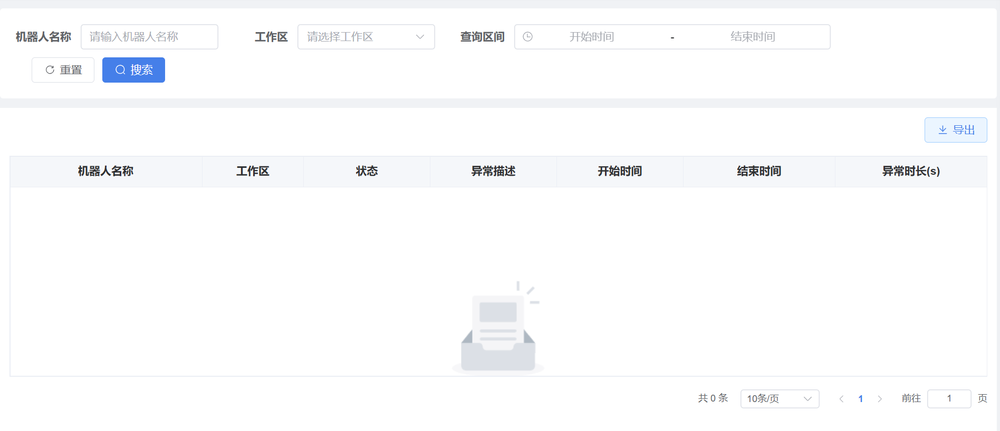

用于**查询与追溯机器人异常事件**，支持机器人名称，工作区，时间筛选与数据导出

1. 筛选区

- 筛选条件：机器人名称、工作区、查询区间（开始 / 结束时间）

- 操作按钮：重置（清空条件）、搜索（查询数据）

  2.导出功能

- 支持将当前筛选结果导出为文件，用于离线分析或故障复盘

### 运行时长

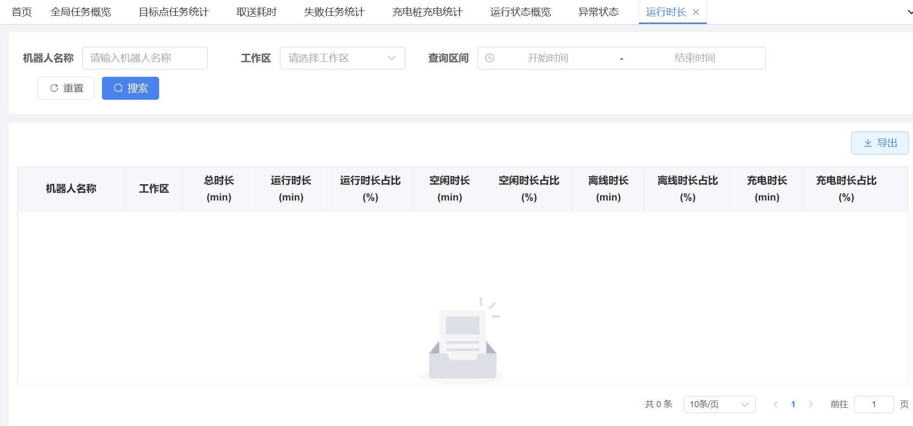

用于**分析机器人各状态时长占比**（查询任务主表和机器人工作区关联数据），支持多条件筛选与数据导出

1. 筛选区

- 筛选条件：机器人名称、工作区、查询区间（开始 / 结束时间）
- 操作按钮：重置（清空条件）、搜索（查询数据）

2. 数据表格

展示机器人各状态时长明细：

- 基础信息：机器人名称、工作区
- 时长指标：总时长 (min)、运行时长 (min)、空闲时长 (min)、离线时长 (min)、充电时长 (min)
- 占比指标：运行时长占比 (%)、空闲时长占比 (%)、离线时长占比 (%)、充电时长占比 (%)

3. 导出功能

- 支持将当前筛选结果导出为文件

### 任务量统计

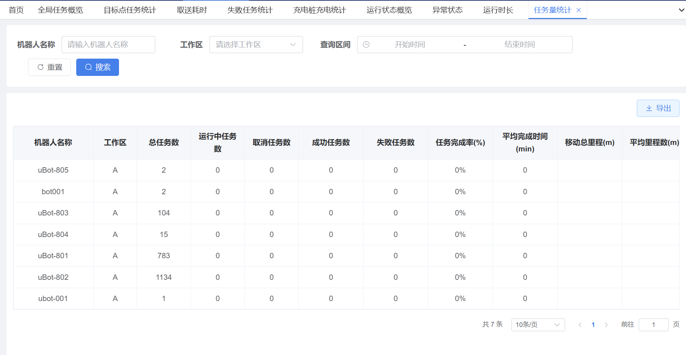

用于**按机器人维度统计任务执行情况**（查询任务主表和机器人工作区关联数据，支持多条件筛选与数据导出

1. 筛选区

- 筛选条件：机器人名称、工作区、查询区间（开始 / 结束时间）
- 操作按钮：重置（清空条件）、搜索（查询数据）

2. 数据表格

展示机器人任务统计明细：

- 基础信息：机器人名称、工作区
- 任务量指标：总任务数、运行中任务数、取消任务数、成功任务数、失败任务数
- 效率指标：任务完成率 (%)、平均完成时间 (min)
- 里程指标：移动总里程 (m)、平均里程数 (m)

3. 导出功能

- 支持将当前筛选结果导出为文件

### 充电统计

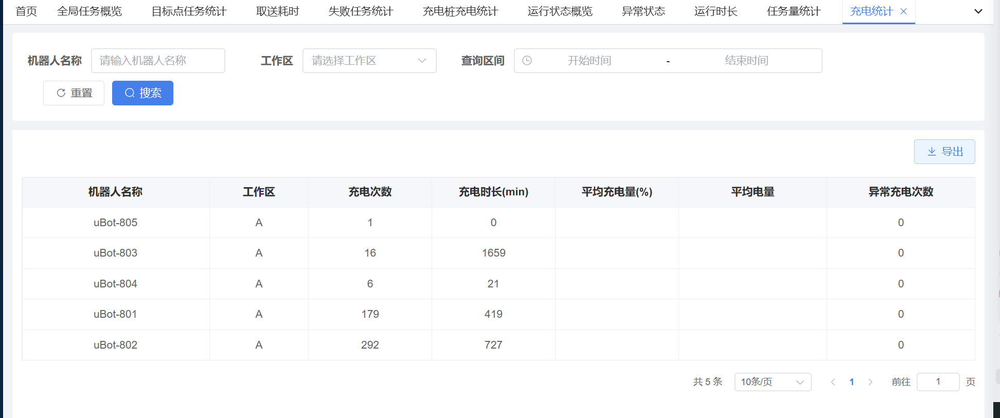

用于**统计机器人充电行为与状态**(查询主表充电任务)，支持多条件筛选与数据导出

1. 筛选区

- 筛选条件：机器人名称、工作区、查询区间（开始 / 结束时间）
- 操作按钮：重置（清空条件）、搜索（查询数据）

2. 数据表格

展示机器人充电统计明细：

- 基础信息：机器人名称、工作区
- 充电行为指标：充电次数、充电时长 (min)、异常充电次数
- 电量指标：平均充电电量 (%)、平均电量

3. 导出功能

- 支持将当前筛选结果导出为文件，用于离线分析或电池健康评估

## 充电桩充电统计

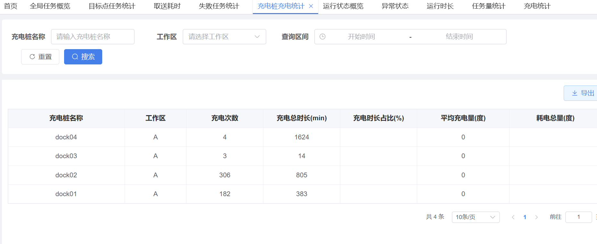

用于**按充电桩维度统计充电行为与能耗**（查询主表充电任务和资源点为DOCK类型关联数据），支持多条件筛选与数据导出

### 

1. 筛选区

- 筛选条件：充电桩名称、工作区、查询区间（开始 / 结束时间）
- 操作按钮：重置（清空条件）、搜索（查询数据）

2. 数据表格

展示充电桩充电统计明细：

- 基础信息：充电桩名称、工作区
- 充电行为指标：充电次数、充电总时长 (min)、充电时长占比 (%)
- 能耗指标：平均充电量 (度)、耗电总量 (度)

3. 导出功能

- 支持将当前筛选结果导出为文件，用于离线分析或能耗报表生成
