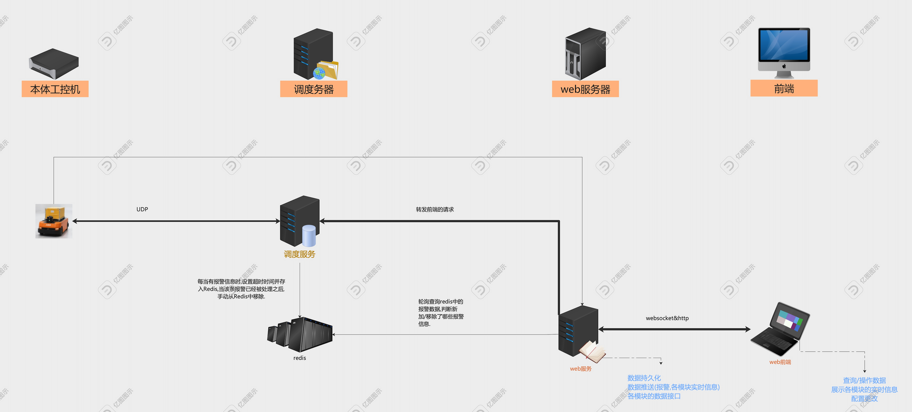

# 调度系统报警功能协议:

| 文件名称 | 调度报警功能说明   |
|------|------------|
| 部门   | 软件算法部      |
| 密级   | 保密(部门内部公开) |
----

## 1,修改记录:

| 版本号  | 修改日期       | 编撰人            | 概述        | 详细说明                        |
|------|------------|------------|-----------|-----------------------------|
| V1.0 | 2025-07-03 |关卿,吴淼  | 报警功能前后端协议 | 重构报警功能,包含robot,设备,TASK等报警信息 |
----

## 2,报警功能细分:
1. 本体报警: robot自身的报警,比如:eStop,low battery等;
2. 任务报警: 任务分配和执行模块产生的报警信息;
3. 设备报警: MCS系统收集到的报警信息;
4. 服务报警: 服务模块产生的报警信息,比如内存/cpu使用率过高等;

-----
   
## 3,报警功能统一实现:
报警模块提供标准的数据协议和基础方法, 收集整个调度系统的报警,并提供统一的接口供外部使用.

支持报警数据的持久化.支持报警数据推送并自定义间隔.支持关键字搜索(报警种类,报警来源,报警级别).

### 3.1,架构图:


---
### 3.2,输入:
在调度/MCS程序中,将报警数据以key-value形式存入redis.

对于不同报警数据设置超时时间.

key的格式为:alarmType:source:code , alarmType为报警种类,source指的是robot/device/task的id,code为报警码.

value为统一格式的报警内容,格式如下表:

| 参数名称      | 参数说明                                                            | 类型     | 可为空   |
|-----------|-----------------------------------------------------------------| -------- |-------|
| name      | 报警部位,基本只用于robot报警,表示robot本体中哪个传感器报警                             | string   | false |
| source    | 该条报警信息产生于哪个robot/device... (deviceId/robotId/taskId/serverName) | string   | true  |
| code      | 报警码,唯一                                                          | string   | false |
| type      | 报警类型:1-robot报警<br />2-task报警<br />3-device报警<br />4-系统报警<br />  | enum     | false |
| startTime | 报警开始时间                                                          | datetime | false |
| content   | 报警内容                                                            | string   | true  |
| material  | 报警信息中涉及到的包号信息,只用于任务报警类型,其他类型报警不用赋值                              | string   | true  |

### 3.3,输出:
1. ws:web服务端定轮询从Redis中获取报警数据,并主动推给前端.
**请求方式**: Websocket

**接口地址**: ws://{ip}:{port}/alarms/{alarmType}

**请求参数**:

| 参数名称  | 参数说明                                                                          | 类型  | 可为空  |
| --------- |-------------------------------------------------------------------------------|-----|------|
| alarmType | 报警类型:<br />0-无<br />1-robot报警<br />2-task报警<br />3-device报警<br />4-系统报警<br /> | int | true |

**返回结果**:

| 参数名称      | 参数说明                                                                                                      | 类型       |
|-----------|-----------------------------------------------------------------------------------------------------------|----------|
| name      | 报警部位,基本只用于robot报警,表示robot本体中哪个传感器报警                                                                       | string   | 
| source    | 该条报警信息产生于哪个robot/device... (deviceId/robotId/taskId/serverName)                                           | string   |
| code      | 报警码,唯一                                                                                                    | string   |
| type      | 报警类型:<br />robot报警-robotAlarm<br />task报警-taskAlarm<br />device报警-deviceAlarm<br />系统报警-systemAlarm<br /> | String   |
| level     | 报警等级:<br />1-fatal<br />2-error<br />3-warning<br />4-info                                                | String   |
| content   | 报警内容                                                                                                      | string   | 
| material  | 报警信息中涉及到的包号信息,只用于任务报警类型                                                                                   | string   | 
| startTime | 报警开始时间                                                                                                    | datetime |
| endTime   | 报警结束时间                                                                                                    | datetime |
| duration  | 报警持续时间(以s为单位)                                                                                             | datetime |

```json
{
  "data": [
    {
      "name": "robot-001",
      "source": "laser-left", 
      "code": "1001",
      "type": 1,
      "level": 1,
      "content": "报警描述.可显示不同语言的",
      "startTime": "2021-01-01 00:00:00",
      "endTime": "",
      "duration": 0
    }
  ]
}
```

2. http:web通过Http请求从后端获取报警数据,当后端接到请求时则从Redis中获取报警数据并返回给前端.
**请求方式**: HTTP-POST

**接口地址**: http://{ip}:{port}/alarms/getAlarms

**响应数据类型**:application/json

**请求参数**:

例:
```json
 {
  "alarmType" : 1,
  "source" : "robot-001",
  "level" : 1
}
```

| 参数名称      | 参数说明                                                                          | 类型     | 可为空  |
|-----------|-------------------------------------------------------------------------------|--------|------|
| alarmType | 报警类型:<br />0-无<br />1-robot报警<br />2-task报警<br />3-device报警<br />4-系统报警<br /> | int    | true |
| source    | 报警来源                                                                          | String | true |
| level     | 报警级别                                                                          | int | true |

**返回结果**:
```json
{
  "success": true,
  "code": 200,
  "message": "操作成功",
  "data": {
    "robot-alarm": [
      {
        "name": "robot-001",    //robotId | deviceId | taskId | serverName
        "source": "laser-left", //发生报警的传感器名称,对应robot上传数据中的device字段.
        "code": "1001",
        "type": 1,
        "startTime": "2021-01-01 00:00:00",
        "endTime": "",
        "duration": 0
      }
    ],
    "device-alarm":[
      
    ] 
  }
  

}
```
```json
{
  "success": false,
  "code": 201,
  "message": "查询失败",
  "data": []
}
```
## 4,报警数据持久化


**实现方式**: 从redis中循环查询报警数据,当有新的报警数据时,存入数据库;当之前的报警数据消失时,更新数据库信息.

---
