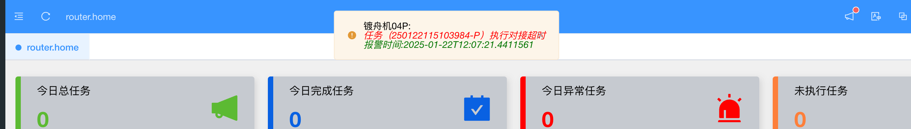
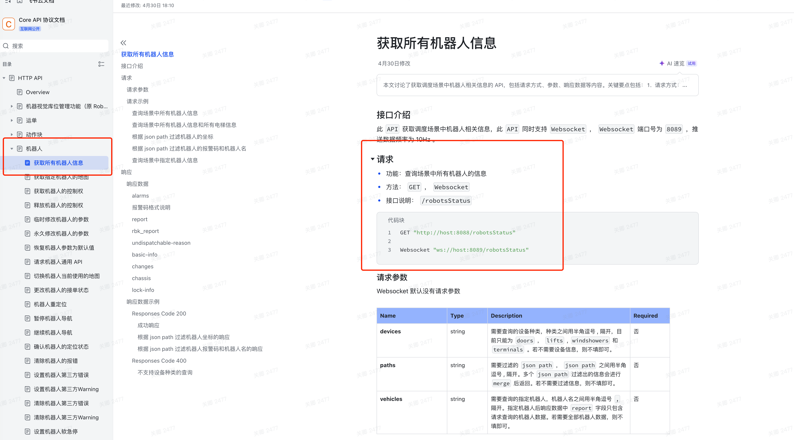
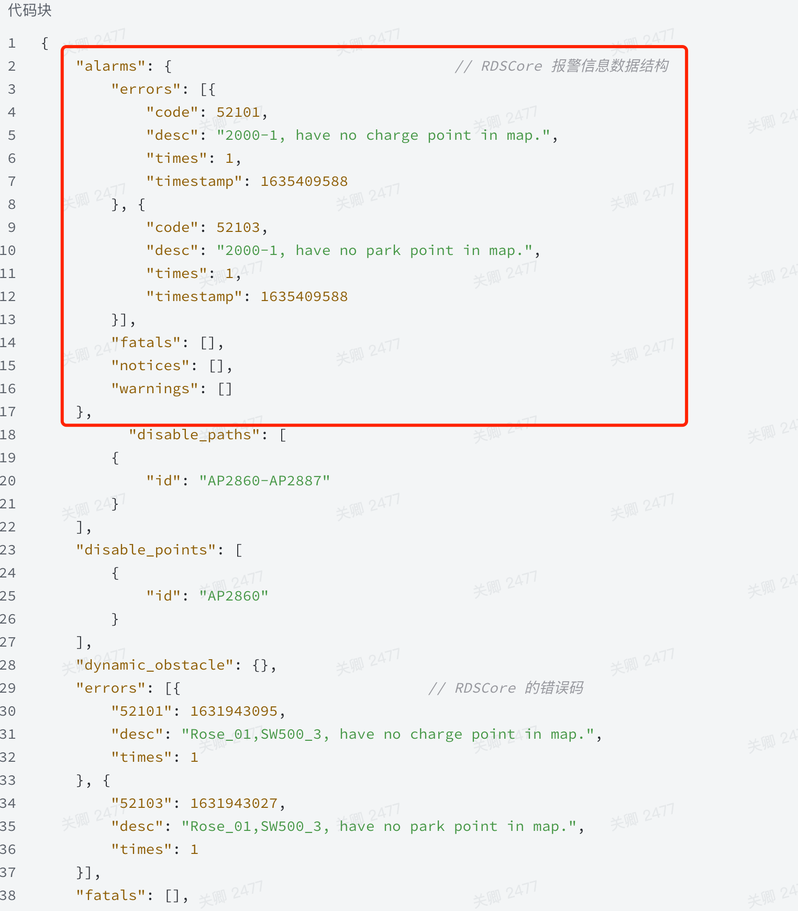

# 调度系统已有报警功能统计:


| 文件名称 | 调度报警功能说明   |
|------|------------|
| 部门   | 软件算法部      |
| 密级   | 保密(部门内部公开) |

----

## 1,修改记录:

| 版本号  | 修改日期       | 编撰人            | 概述       | 详细说明 |
|------|------------|------------|----------|----|
| V1.0 | 2025-06-26 |关卿,吴淼,夏雪婷  | 当前报警功能总结 | 总结各个现场的调度系统的报警功能   |
----

## 2,报警功能现状
目前报警模块涉及到多种报警信息以及目前多个项目已经实现了一部分功能,统计如下:

## 3,电池片&切片项目

目前这两种项目实现的报警功能有:robot报警,设备报警,wip报警,服务报警.都是通过http接口轮询实现的,后期可以改为调度/MCS系统把报警信息写入redis,web后端改为外发式(ws),减少调度/mcs系统的压力.
### 3.1,robot数据接口:

**实现方式**:调度系统从redis中获取报警信息,前端通过http接口轮询请求robot实时信息,这些实时信息当中包含了robot的报警信息.

**请求方式**: HTTP-GET

**接口地址**: http://{ip}:8200/mission/detail

**响应数据类型**:application/json

**参数**:

| 参数名称 | 参数说明 | 类型  | 是否必须 | 说明           |
|------|------------|---|---|--------------|
| command   | 请求标识      | string| 是 | 固定"detail"   |
| request_id | 请求id      | string | 否 | robot        |
| robot | 机器人名称      | string | 否 | 空字符表示查询所有机器人 |

**请求示例**:

```json
{
        "command": "detail",
        "request": "robot",
        "robot": ""
}
```

**返回结果**:
```json
{
  "result": 1,
  "robots": [
    {
      "name": "uBot-001", //机器人名称
      "ip": "172.18.14.7", //机器人ip
      "zone": "34", //机器人工作区
      "motor": 1, //急停标志，0代表急停
      "mode": "offline",
      "status": "runto_offline", //状态
      "rms": "busyinterrupted", //rms状态
      "pose": "0 0 90.0", //位置x、y、theta
      "speed": "30 0", //角速度vf、vr
      "battery": "80", //电量
      "sensor": [
        0,
        0,
        0,
        0
      ], //光电信息
      "payloads": [
        "",
        "",
        "150210220|2021-11-15 10:52:39",
        "150210220|2021-11-15 10:52:39"
      ], //包号信息
      "ostatus": "error",
      "over_time": [
        -1,
        -1,
        -1,
        -1
      ],
      "receive_time": "2021-11-30 09:12:06",
      "offline_time": 2, //离线时长
      "error_code": "", //硬件错误吗
      "job_target_charge":true, //是否充上电标志
      "battery_ntc":66.0 //电池温度       
    }
  ]
}
```
```json
{
  "result": 0,
  "robots": null
}
```

### 3.2,库位数据接口
**实现方式**:与robot报警类似,是通过Http从MCS系统获取设备&wip报警信息.

**请求方式**: HTTP-GET

**接口地址**: http://{ip}:8200/mission/buffersdetail

**响应数据类型**:application/json

**请求参数**: 
```json
{
        "command": "detail",
        "request": "targetResources",
        "robot": ""
}
```

**返回数据**:
```json
{
  "result": 1,
  "bufferResources": [
    {
      "id":2048,
      "type":"BUFFER",
      "name":"CP0229",
      "x":-127420,
      "y":66600,
      "theta":0.0,
      "enable":1,
      "status":null,
      "content":null,
      "updateTime":"2025-03-07 12:42:38",
      "description":"清洗北区_T13,14“满”",
      "category":"231231",
      "tag":"",
      "enablePowerful":0,
      "enableDockTarget":0,
      "enableParkTarget":0,
      "materialcartid":"JH100", //库位上的货架编号
      "isRepair":0,
      "isNeedwait":"0",
      "isAbnormal":"0", //库位是否异常，1代表异常
      "occupy":"0",
      "zone":{
        "id":19,
        "name":"脱胶-清洗北区",
        "status":"enable",
        "description":"脱胶-清洗北区",
        "createTime":"2024-08-07 11:51:21"
      },
      "materialCart":{
        "id":"JH100",
        "createTime":"2024-08-02 07:39:19",
        "updateTime":"2025-03-07 17:01:11",
        "type":"1",
        "content":  //货架包号
        "{\"material\":\"擦胶后满料\",\"hopper\":\"210\",\"vTransferRoute\":\"\",\"productType\":\"CPBM001640\"}",
        "fromtarget":"T15-JHDJJG",
        "taskcount":6624,
        "productId":"YX2025012700572", //晶棒编号
        "description":"",
        "location":"CP0229",
        "productType":"CPBM001640",
        "vTransferRoute":"",
        "overTime":false,
        "info":"**"
      },
      "isArtificial":null,
      "isArtificialup":null,
      "isDrainaget":null,
      "priority":0,
      "isNeedpass":null,
      "jobId":0, //任务占用ID
      "isSingle":"0",
      "isNg":null,
      "device":false,
      "empty":false,
      "buffer":true,
      "dock":false,
      "park":false,
      "areaName":"210N插片上满缓存区",
      "inUndefinedZone":false,
      "enabledDockTarget":false,
      "enabledParkTarget":false,
      "needReleased":false,
      "tagList":[],
      "normal":true,
      "occupied":false,
      "target1":false,
      "target":true
    }
  ]
}
```
```json
{
    "status": false,
    "code": 1,
    "message": "错误信息",
    "data": null
}
```
### 3.3,机台数据接口:
**实现方式**:该接口的targetResources字段主要用来获取机台位置

**请求方式**: HTTP-GET

**接口地址**: http://{ip}:8200/mission/detail

**响应数据类型**:application/json

**请求参数**:
```json
{
        "command": "detail",
        "request": "targetResources",
        "robot": ""
}
```

**返回数据**:
```json
{
  "result": 1,
  "targetResources": [
    {
      "id":1,
      "type":"DEVICE_M",
      "name":"110110121", //机台名称
      "x":-130725, //位置x
      "y":-117816, //位置y
      "theta":-90.0, //角度
      "enable":1,
      "status":null,
      "content":null,
      "updateTime":"2024-05-12 16:11:32",
      "description":"FL1",
      "category":null,
      "tag":"",
      "enablePowerful":0,
      "enableDockTarget":0,
      "enableParkTarget":0,
      "zone":{
        "id":1,
        "name":"一循环",
        "status":"enable",
        "description":"发料-制绒上",
        "createTime":"2023-10-26 17:22:35"
      },
      "empty":false,
      "inUndefinedZone":false,
      "dock":false,
      "enabledDockTarget":false,
      "park":false,
      "enabledParkTarget":false,
      "needReleased":false,
      "tagList":[],
      "washWheel":false,
      "occupied":false,
      "target":true
    }
  ]
}
```
```json
{
    "status": false,
    "code": 1,
    "message": "错误信息",
    "data": null
}
```
### 3.4,机台报警接口

**请求方式**: HTTP-GET

**接口地址**: http://{ip}:5010/Page/ProcessInfo

**响应数据类型**:application/json
**请求参数**: 无

**返回结果**:
```json
[
  {
    "processName":"发料下",
    "processGroup":null,
    "machineInfos":[
      {
        "machineID":"110110121", //机台编号
        "machineName":"发料1",
        "description":"FL1",
        "missionID":"53877687",
        "robotName":"WaitingRobot", //机器人名称，没有分配的时候，这个表示等待IGV
        "inOutFlag":"out", //进料还是出料任务
        "firstShield":false, //一层屏蔽信号，true代表已屏蔽
        "secondShield":false, //二层屏蔽信号，true代表已屏蔽
        "firstLayerCount":"", //一层轨道数量
        "secondLayerCount":"20", //二层轨道数量
        "machineType":"Auto",
        "notAllowedProduce":false, //限制生产标志
        "restrictedReason":null,
        "mcsShield":false, //M計衎S是否屏蔽
        "isLongTimeNoTask":false, //长期无任务标志
        "missionStatus":"SendSuccess",
        "domain":"日升"
      }
    ]
  }
]
```

### 3.5,wip数据接口

**请求方式**: HTTP-GET

**接口地址**: http://{ip}:5010/Page/MainWipInfo

**响应数据类型**:application/json
**请求参数**: 无

**返回结果**:
```json
[
  {
    "id":0,
    "machineID":"21012110", //WIP编号
    "machineName":"WIPI11二层", //WIP名称
    "description":"WIPI1102",
    "machineType":"Buffer",
    "strategy":null,
    "alias":null
  },
  {
    "id":1,
    "machineID":"21012090",
    "machineName":"WIPI09二层",
    "description":"WIPI0902",
    "machineType":"Buffer",
    "strategy":null,
    "alias":null
  }
]
```

### 3.6,wip报警接口

**请求方式**: HTTP-GET

**接口地址**: http://{ip}:5001/UAPage/Alarms

**响应数据类型**:application/json
**请求参数**: 无

**返回结果**:
```json
[
  {
    "machineID":"21012010", //WIP编号
    "time":"2025-05-14 15:10:33",
    "alarmID":"1", //异常标志，为空或0表示正常，其他表示异常
    "alarmText":"安全雷达报警",
    "serOrClear":"",
    "messageType":"Alarm"
  },
  {
    "machineID":"21012090",
    "time":"2025-05-14 15:10:33",
    "alarmID":"0",
    "alarmText":"机台待机状态",
    "serOrClear":"",
    "messageType":"Alarm"
  }
]
```
### 3.7,buffer数据接口

**请求方式**: HTTP-GET

**接口地址**: http://{ip}:5001/UAPage/Alarms

**响应数据类型**:application/json
**请求参数**: 无

**返回结果**:
```json
{
  "success":true,
  "data":[
    {
      "id":43,  //buffer编号
      "bufferName":"Buffer01",  //buffer名称
      "createTime":"2024-05-29T14:52:05.000+0000",
      "ip":"10.12.106.214",
      "status":1,
      "type":2,
      "x":-73476, //位置x
      "y":-65652, //位置y
      "zoneId":2,
      "zoneName":null,
      "catId":-1,
      "track01":"",
      "track02":"",
      "track03":"210R二绒隆基-制绒下-AUTO|2025-07-03 16:20:07",
      "track04":"210R二绒隆基-制绒下-AUTO|2025-07-03 16:20:07",
      "ruleName":null,
      "description":"",
      "isTrack01Error":null,
      "isTrack02Error":null,
      "isTrack03Error":null,
      "isTrack04Error":null,
      "overtime":null,
      "online":"离线",
      "warn":null,
      "originContent":null,
      "taskType":null,
      "robotName":null,
      "jobId":null,
      "position":null,
      "ruleGroupName":null,
      "ruleContent":null,
      "trackError":false,
      "trackOvertime":false
    }
  ],
  "code":null,
  "message":null
}
```

### 3.8,buffer报警接口

**请求方式**: HTTP-GET

**接口地址**: http://{ip}:9005/bms/task/monitor

**响应数据类型**:application/json
**请求参数**: 无

**返回结果**:
```json
[
  {
    "zoneName":"two",
    "stackTimes":["","","2024-02-20 00:01:59","2024-02-20 00:01:59"],
    "robot":"",
    "position":"DOWN", //上层下层：UP/DOWN
    "ruleContent":"",
    "online":"离线", //离线标志：在线/离线
    "photoelectricity":[0,0,1,1], //光电信息，与包号对比是否光电异常
    "playloads":[
      "",
      "",
      "110610911|2023-09-26 11:03:54",
      "110610911|2023-09-26 11:03:54"
    ], //包号时间计算是否超时
    "bufferName":"BF31",
    "status":"true",
    "jobId":"51691080",
    "bufferId":"2", //buffer编号
    "type":"GET-M",
    "isDockFail":"false", //对接失败标志，true代表对接失败
    "overTime":"1000", //包号超时阈值
    "ruleName":"制绒空花篮1"
  }
]  
```

### 3.9,服务报警

**实现方式**: 服务报警是web后端提供的,通过http轮询请求服务器资源详情,后端只提供资源使用率,报警阈值在前端设置.

**请求方式**: HTTP-GET

**接口地址**: http://{ip}:{port}/xxx/system

**响应数据类型**:application/json

```json
{
  "status": 200,
  "isSuccess": true,
  "message": "操作成功",
  "data": {
    "cpu":"", //cpu
    "mem":"", //内存
    "memUsage":"85%", //使用率，超过85%报警
    "jvm":"", 
    "jvmUsage":"85%", //使用率，超过85%报警
    "disk":"", //磁盘
    "diskUsage":"70%", //使用率，超过70%报警
    "exception":"" //日志异常
  }
}
```
```json
{
    "status": false,
    "code": 1,
    "message": "错误信息",
    "data": null
}
```
-------

## 4,老版舟房项目

目前有:设备报警(各种设备以及料架缓存区等),robot报警(只是在实时robot页面对robot做了异常状态显示,暂未做报警提示)
### 4.1,设备报警

**实现方式**: 通过http请求方式,想调度请求设备的报警信息,目前有通威S9和眉山S4两个现场,接口有些不同.

#### 4.1.1,眉山S4

**请求方式**: HTTP-GET

**接口地址**: http://{ip}:{port}/xxx/system

**响应数据类型**:application/json

**请求参数**:

| 参数名称             | 参数类型    | 是否必填 | 描述        |
|------------------|---------|----------|-----------|
| page             | int     | 是 | 页码        |
| limit            | int     | 是 | 页大小       |
| t                | String  | 否 | 请求时间(时间戳) |
| query            |         | 否 |           |
| query.warnType   | String  | 否 | 警告类型      |
| query.objectName | String  | 否 | 警告对象      |
| query.objectId   | String  | 否 | 警告日期      |
| query.isHandled  | boolean | 否 | 是否解决      |

**数据返回格式**:

```json
{
  "code": 200,
  "message": "操作成功",
  "data": {
    "list": [
      {
        "id": "5121e2de-3d72-4ea2-a230-200eeddef358",
        "objectId": "DZJ04P",
        "objectName": "镀舟机04P",
        "warningType": 0,
        "warningTypeDesc": "对接超时",
        "content": "任务（250122115103984-P）执行对接超时",
        "warningTime": "2025-01-22T12:07:21.4411561",
        "creationTime": "2025-01-22T12:07:51.8968594",
        "isHandled": false,
        "isHandledDesc": "否",
        "handleTime": null,
        "remarks": ""
      }
    ],
    "total": 198
  },
  "result": 1
}
```

**web显示效果**:


#### 4.1.2,通威S9

**请求方式**: HTTP-GET

**接口地址**: http://{ip}:{port}/statis/Alarm/GetRealTimeAlarms?alarmType=CacheAreaAlarm

**响应数据类型**:application/json

**请求参数**:

| 参数名称  | 参数说明                         | 请求类型 | 是否必须 | 数据类型  | schema   |
| --------- | -------------------------------- | -------- | -------- | --------- | -------- |
| alarmType | 报警类型, 固定传: CacheAreaAlarm | query    | true     | AlarmType | AlarmTyp |

**返回数据**:
```json
{
  "status": 200,  
  "isSuccess": true,
  "message": "操作成功",
  "data": [
    {
      "deviceId": "料架缓存POLY区",
      "content": "待卡点料架数 3 超过设置的阈值 2",
      "time": "2025-06-12 14:55:01"
    },
    {
      "deviceId": "料架缓存DM区",
      "content": "待卡点料架数 3 超过设置的阈值 1",
      "time": "2025-06-12 14:58:01"
    }
  ]
}
```
```json
{
  "status": 201,  
  "isSuccess": false,
  "message": "操作失败",
  "data": []
}
```
**显示效果**:

---
### 4.2,叉车项目
有robot报警.叉车项目用的叉车基本都是仙工的,所以报警信息都是调度通过http/ws方式从仙工robot获取的.然后robot实时信息通过singlr主动发给前端.前端未做专门报警显示,只是在robot实时页面中显示异常信息.
**接口文档**: [接口内容](https://seer-group.feishu.cn/wiki/PITlwfghPiaEYckei7NciH4unWc)
**具体位置**:



---
