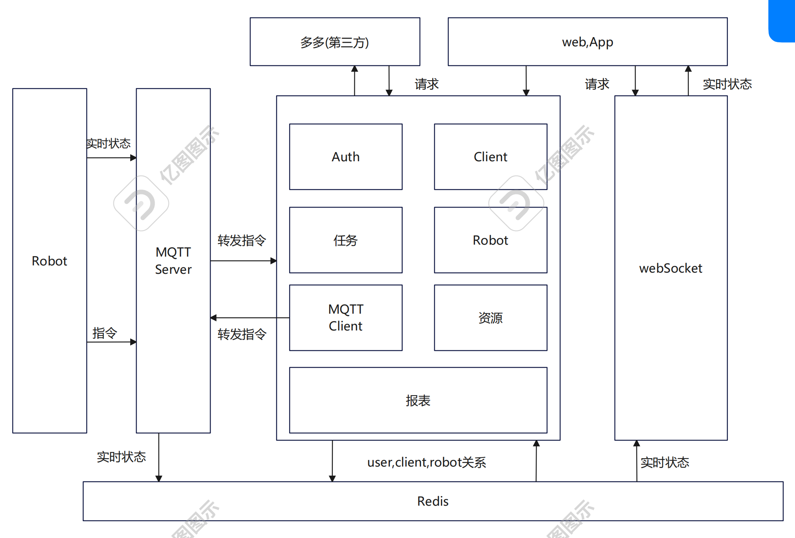
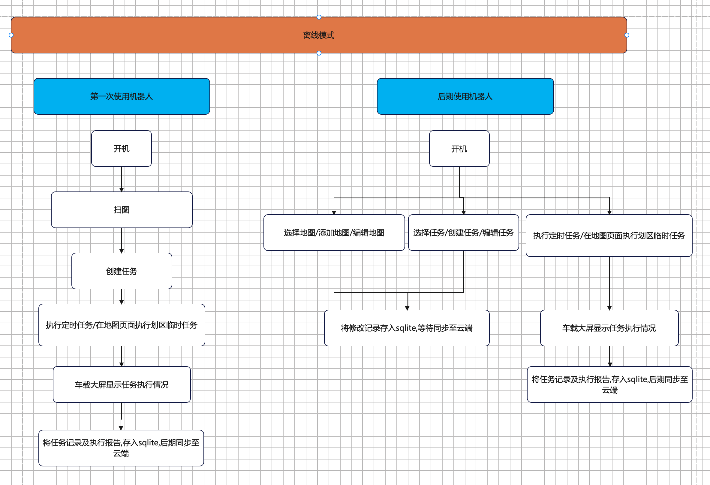
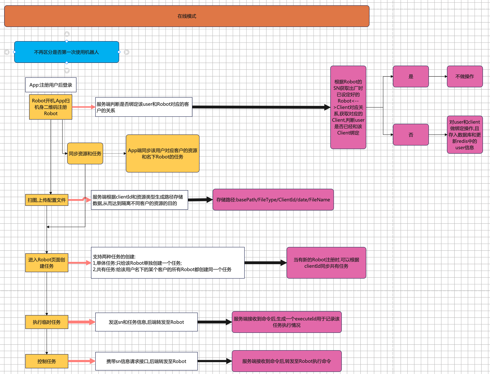
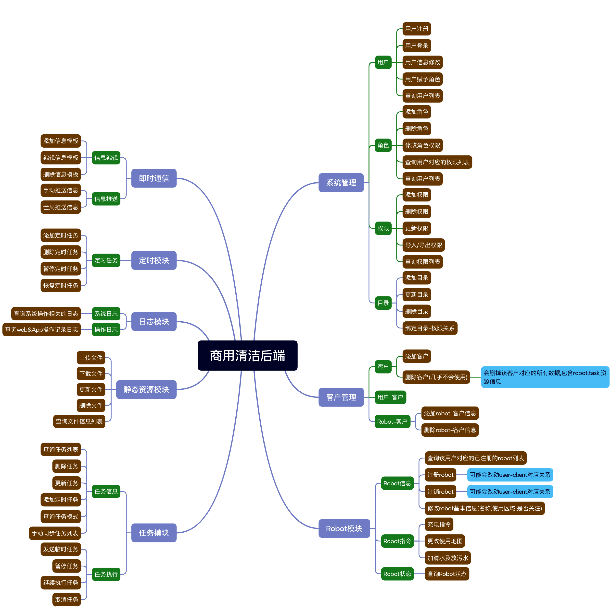

# 清洁机器人项目
----

## 1. 概要:

**简介**:按照之前的要求,可以跑起来了,各模块都实现了基本功能,完成了Demo版本,还需要打磨以及完善.本文对软件的各个模块的作用和完成情况进行整理.

## 2. 完成情况

| 模块                           | 完成情况                                | 待补充功能                     | 负责人   | 
|------------------------------|-------------------------------------|---------------------------|-------|
| URobot                       | 实现了基本功能,和车载大屏软件和本体MQTT Client调试已经完成 | 根据机器人型号给出耗材列表和寿命计算,远程开关机, | 王浩岚   |
| 车载大屏                         | 实现了基本功能,和车载大屏软件调试完成                 | 优化UI                      | 钱毅新   |
| 本体MQTT                       | 实现了基本功能                             | 会集成到晓哥那边                  | 关卿/沈晓 |
| MQTT Server                  | 实现基本功能,经过压力测试(100台,4个topic/台)       | 暂无                        | 关卿    |
| 服务端(包含MQTT Client和WebSocket) | 实现基本功能,目前已实现分离不同客户数据                | 加入耗材管理功能,优化已清扫区域绘制        | 关卿    |
| App                          | 实现基本功能,和服务端调试完成                     | 无                         | 赵伟达   |
| Web                          | 实现基本功能,                             | 数据大屏                      | 关卿    |

## 3. 软件架构

## 4. 使用逻辑
清洁机器人的使用场景总结来说是客户通过终端(手机/车载大屏)对机器人进行指令操作,其中通过手机端操作需要接入云端调度系统.

本文使用离线模式来描述使用车载大屏操作机器人的情形;用在线模式描述使用App操作机器人的情形.

### 4.1 使用车载大屏操作机器人

### 4.2 在线模式使用逻辑

## 5. 云端服务端模块:

### 5.1 云服务功能模块图示:

### 5.2 云服务模块功能简述
**系统管理和客户管理模块**:作为对数据以及权限的管理,不同用户只能访问属于自己的数据(数据隔离),只能操作自己能够操作的命令(权限控制).

**Robot模块**:用户管理机器人(注册,注销,更改基本信息等);提供查询机器人实时状态;终端操控机器人(充电).

**静态资源模块**:提供文件管理功能,所有静态资源(地图json,地图图片,配置文件,更新包等)都采取统一的上传,下载接口,服务器上资源的保存路径为:'basePath/type/client/timestamp/fileName'.

**任务模块**:提供定时任务信息管理功能:定时任务和任务模式的创建/修改/删除/查询;发送临时任务功能;任务执行过程管理:任务暂停/继续/取消.

**日志模块**:提供各模块的日志查询功能

**定时任务模块**:提供定时任务功能,以前用于执行定时任务,现已废弃.

**即时通信模块**:提供实时通信功能,主要用于推送信息给App端.

## 6. MQTT模块

MQTT模块目前有3个程序:云端MQTT Server和Client端,本体MQTT Client端(后续会废弃).

**云端MQTT Server**:接收各客户端发送的MQTT消息,存储实时状态信息到redis,转发指令信息到目标客户端

**云端MQTT Client**:接收调度系统转发的终端指令,发布信息到MQTT Server端.

**本体MQTT Client**:向MQTT Server端发布机器人实时状态信息和指令信息,订阅终端指令信息.

## 7. Web模块

**Web模块**:提供数据大屏功能(未做);各模块数据展示、修改、导出功能;

