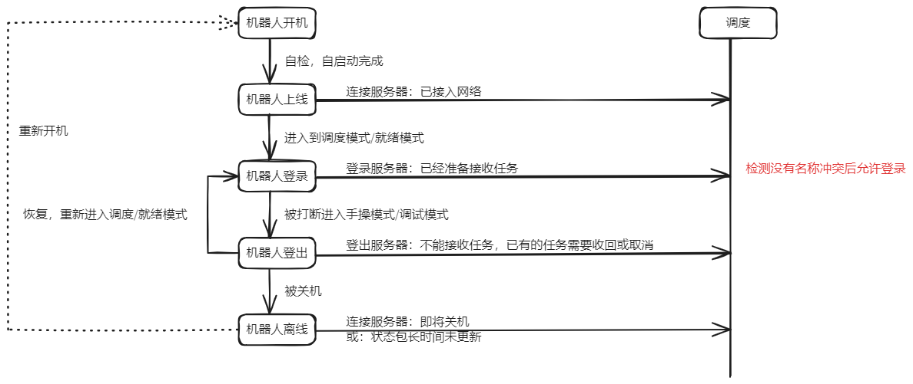
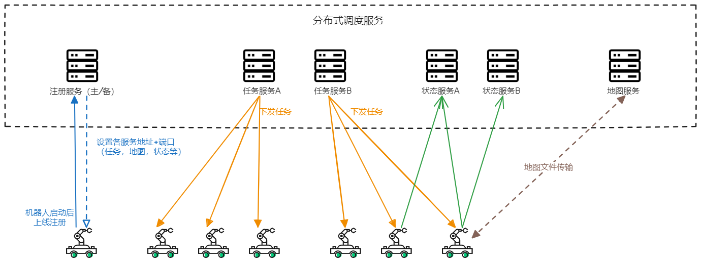
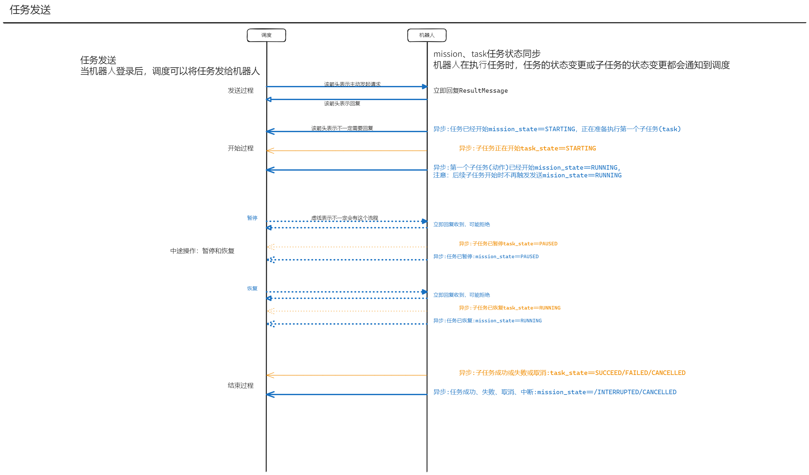
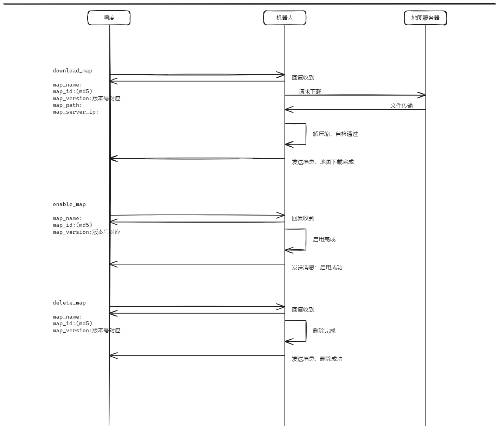

# 调度系统与机器人通信协议


| 文件名称 | 调度系统与机器人通信协议 |
| -------- | ---- |
| 部门     |   软件算法部   |
| 版本     |   1.2   |
| 密级     |   公开   |

## 修改记录

| 版本号 | 修改日期       | 修改人    | 修改说明                |
| --- | ---------- | ------ | ------------------- |
| 1.0 | 2025-10-29 | Kelsey | 新版调度与机器人通信协议初稿      |
| 1.1 | 2025-11-03 | Kelsey | 增加分布式服务详细说明；增加接口汇总表 |
| 1.2 | 2026-03-05 | Kelsey | 更新接口支持情况            |
| 1.3 | 2026-04-20 | 徐慧敏    | 文档补充说明              |


## 一、概述
本文档为玖物机器人的通信协议，重点说明机器人与任务调度系统或其他上层系统之间数据通信机制与通信接口规范，涵盖机器人上线注册、任务全生命周期、异常处理流程、状态同步等场景下的通信逻辑与消息结构定义，为开发人员理解并实现机器人任务调度提供参考依据。

协议统一采用`json`作为数据格式，目前支持以下传输协议：

- [x] HTTP
- [ ] MQTT
- [ ] TCP
- [ ] UDP

### 接口汇总

| 模块                                  | 接口名称                              | 地址                        | 数据类型                    | 发送方                                    | 接收方                                 | 是否已支持                |
| ----------------------------------- | --------------------------------- | ------------------------- | ----------------------- | -------------------------------------- | ----------------------------------- | -------------------- |
| 模式                                  | 模式切换                              | /robot/mode               | OperationModeMessage    | 调度                                     | robot                               | &#x2611;<br>         |
| <div style="width: 20pt"> 登录 </div> | <div style="width: 35pt">上线</div> | /robot/online             | OnlineMessage           | <div style="width: 28pt"> robot </div> | <div style="width: 25pt"> 调度 </div> | &#x2611;             |
|                                     | 下线                                | /robot/offline            | OfflineMessage          | robot                                  | 调度                                  | &#x2611;             |
|                                     | 登录                                | /robot/login              | LoginMessage            | robot                                  | 调度                                  | &#x2611;             |
|                                     | 登出                                | /robot/logout             | LogoutMessage           | robot                                  | 调度                                  | &#x2611;             |
| 任务                                  | 下发任务                              | /mission                  | MissionMessage          | 调度                                     | robot                               | &#x2611;             |
|                                     | 任务暂停                              | /mission/pause            | MissionCommandMessage   | 调度                                     | robot                               | &#x2610;  </br> 暂不支持 |
|                                     | 任务恢复                              | /mission/resume           | MissionCommandMessage   | 调度                                     | robot                               | &#x2610; </br>暂不支持   |
|                                     | 任务取消                              | /mission/cancel           | MissionCommandMessage   | 调度                                     | robot                               | &#x2611;             |
|                                     | 任务状态反馈                            | /robot/mission/state      | MissionStateMessage     | robot                                  | 调度                                  | &#x2611;             |
|                                     | 子任务状态反馈                           | /robot/mission/task/state | TaskStateMessage        | robot                                  | 调度                                  | &#x2611;             |
| 状态                                  | 常规状态发送                            | /robot/status             | RobotStatusMessage      | robot                                  | 调度                                  | &#x2611;             |
|                                     | 状态请求                              | /command/status           | StatusRequestMessage    | 调度                                     | robot                               | &#x2611;             |
|                                     | 请求的电池信息发送                         | /robot/info/battery       | RobotBatteryMessage     | robot                                  | 调度                                  | &#x2611;             |
|                                     | 请求的形状信息发送                         | /robot/info/shape         | RobotShapeMessage       | robot                                  | 调度                                  | &#x2611;             |
|                                     | 请求的路径信息发送                         | /robot/info/path          | RobotPathMessage        | robot                                  | 调度                                  | &#x2611;             |
|                                     | 请求的传感器信息发送                        | /robot/info/sensor        | RobotSensorMessage      | robot                                  | 调度                                  | &#x2611;             |
|                                     | 异常信息发送                            | /robot/alarm              | RobotErrorMessage       | robot                                  | 调度                                  | &#x2610; </br>开发中    |
| 地图                                  | 地图下载                              | /map/download             | DownloadMapMessage      | 调度                                     | robot                               | &#x2610; </br>开发中    |
|                                     | 地图启用                              | /map/enable               | EnableMapMessage        | 调度                                     | robot                               | &#x2610; </br>开发中    |
|                                     | 地图删除                              | /map/delete               | DeleteMapMessage        | 调度                                     | robot                               | &#x2610; </br>开发中    |
|                                     | 地图操作反馈                            | /robot/map                | MapCommandResultMessage | robot                                  | 调度                                  | &#x2610; </br>开发中    |
| 指令                                  | 重定位                               | /command/relocalize       | RobotLocMessage         | 调度                                     | robot                               | &#x2611;             |
|                                     | 停止                                | /command/stop             | RobotStopMessage        | 调度                                     | robot                               | &#x2611;             |

<p style="font-size:120%; font-weight:bold; background:#fff9c2; padding:4px 8px; border-radius:4px;"> 用户可通过浏览器访问地址  http://ip:8283/，进入 Swagger UI 界面，查看接口说明并进行在线接口调试与测试。 </p>


## 二、机器人模式

机器人开机上线后有以下四种模式：

- 调度模式：可接收调度任务，机器人运行完全由调度系统控制

- 就绪模式：可接收调度任务，可人工进行部分操作。例如人工远程触发idle/充电指令后机器人会进入到就绪模式，等待充电到位后需要回调告知调度，然后进入到调度模式。

- 手操模式：不可接收调度任务，完全由人工控制，机器人处于非安全状态。机器人在调度/就绪模式下若外部触发stop指令则会进入手操模式。

- 调试模式：不可接收调度任务，机器人配置修改、升级维护等场景下的特殊模式。

机器人上/下线和模式切换与调度服务器之间的状态流转如下：


### 1. 机器人模式切换：OperationModeMessage

#### 描述

机器人启动/上线/登录服务器后会自动进入到对应模式，服务器也可通过该接口下发消息切换机器人的模式。

#### 地址

`/robot/mode`

#### 消息内容

| 字段名称       | 字段类型 | 是否必填 | 字段描述                                                     |
| -------------- | -------- | -------- | ------------------------------------------------------------ |
| robot_id       | string   | 必需     | 机器人编号（bot-001）                                        |
| operation_mode | string   | 必需     | 机器人模式：AUTOMATIC（调度模式），SEMIAUTOMATIC（就绪），MANUAL（手操），SERVICE（调试） |

#### 消息回复：ResultMessage

机器人和服务器之间所有回复的消息数据都是`json object`类型，后续不再重复说明。

默认消息回复格式如下：

| 字段名称 | 字段类型    | 是否必填 | 字段描述           |
| -------- | ----------- | -------- | ------------------ |
| code     | int         | 必需     | 成功0，失败错误码  |
| message  | string      | 非必需   | 成功注释，失败原因 |
| data     | json object | 非必需   | 附带的数据         |

示例：

```json
成功：
    {
        "code":0
    }

失败:
	{
	  "code": 1002,
	  "message": "operation mode is invalid"
	}
```

## 三、机器人上线与服务器登录

调度服务采用分布式设计，主要包含以下服务：

- 注册服务：负责维护现场所有机器人的在线状态
- 任务服务：调度核心服务，负责进行任务的分配和执行管理
- 状态服务：负责接收并维护机器人运行状态数据，一台机器人可同时向多个状态服务广播状态数据包。
- 地图服务：存放管理现场地图并与机器人进行地图文件的传输同步

以上服务可最小化部署在同一服务器内，也可根据现场规模、复杂度对以上服务进行扩展部署至多套服务器中，以实现高扩展、高可用。

每个机器人可在内部的配置文件中配置各服务地址，上线后服务器也可通过接口向机器人写入新的服务地址以实现各服务的主备切换。




### 1. 上线信息：OnlineMessage

#### 描述

机器人上线后连接注册服务器，发送上线信息。注册服务器的地址存放在机器人内部的配置文件内。

#### 消息内容

| 字段名称 | 字段类型 | 是否必填 | 字段描述              |
| -------- | -------- | -------- | --------------------- |
| robot_id | string   | 必需     | 机器人编号（bot-001） |
| robot_ip | string   | 必需     | 机器人IP              |

### 2. 设置机器人服务器信息：SetServerMessage

#### 描述

机器人上线注册成功后，注册服务器可向机器人发送其他服务的IP和端口，本次生命周期中机器人将使用收到的服务信息替换内部配置文件中的原有配置，与任务、地图、状态等服务进行通信。若注册服务器未发送，则使用机器人配置的默认服务地址与端口。

若发生服务异常或其他情况需切换备用服务器，注册服务器重新向机器人发送服务IP和端口，机器人收到消息后将切换连接新的服务。

#### 消息内容

| 字段名称          | 字段类型 | 是否必填 | 字段描述                              |
| ----------------- | -------- | -------- | ------------------------------------- |
| register_endpoint | string   | 非必需   | 注册服务IP+端口                       |
| mission_endpoint  | string   | 非必需   | 任务服务IP+端口                       |
| status_endpoints  | string   | 非必需   | 状态服务IP+端口，可有多个，以逗号分隔 |
| command_endpoint  | string   | 非必需   | 指令服务IP+端口                       |
| map_endpoint      | string   | 非必需   | 地图服务IP+端口                       |

### 3. 登录信息：LoginMessage

#### 描述

机器人根据收到服务器IP和端口请求登录调度服务器（若未收到，则使用机器人配置文件中配置的服务器地址进行登录）。

登录成功后机器人进入自动/半自动模式，准备接收调度任务。

#### 消息内容

| 字段名称 | 字段类型 | 是否必填 | 字段描述              |
| -------- | -------- | -------- | --------------------- |
| robot_id | string   | 必需     | 机器人编号（bot-001） |
| robot_ip | string   | 必需     | 机器人IP              |

### 3. 登出信息：LogoutMessage

#### 描述

机器人切换至手动/调试模式前请求登出任务服务器，不再接收新任务，已有任务需回收或取消。

#### 消息内容

| 字段名称 | 字段类型 | 是否必填 | 字段描述              |
| -------- | -------- | -------- | --------------------- |
| robot_id | string   | 必需     | 机器人编号（bot-001） |

### 4. 离线信息：OfflineMessage

#### 描述

机器人关机时向注册服务器发起离线通知（机器人状态包长时间未更新时服务器将该机器人状态自动置为离线）

#### 消息内容

| 字段名称 | 字段类型 | 是否必填 | 字段描述              |
| -------- | -------- | -------- | --------------------- |
| robot_id | string   | 必需     | 机器人编号（bot-001） |

## 四、任务调度机制
任务（mission）是调度发送给机器人的最小执行单元，任务种类包括：

- normal：普通任务，涵盖常规作业场景，如接料、送料、多目标点任务等

- park：停车任务

- dock：充电任务

每个任务（mission）可包含多个子任务（task），子任务是机器人执行过程中的具体动作单元，机器人可以通过一系列子任务的串联来完成一个复杂的任务。机器人可支持的task类型与详细说明可见第八章。

机器人在执行任务过程，任务（mission）或子任务（task）的状态变更都需通知到调度系统。调度系统与机器人之间的任务交互和状态同步规则如下图：



### 1. mission任务发送消息：MissionMessage
#### 描述

当机器人注册上线并符合执行任务条件时，调度系统会根据任务的优先级分配特定任务给指定的机器人，以下为调度系统给机器人发送的任务消息，主要包括任务类型、任务内容等。任务数据在该任务全周期有效。

#### 消息内容

| 字段名称          | 字段类型        | 是否必填                                 | 字段描述                                                                 |
| ------------- | ----------- | ------------------------------------ | -------------------------------------------------------------------- |
| mission_id    | string      | 必需                                   | 任务号                                                                  |
| robot_id      | string      | 必需                                   | 分配的机器人编号                                                             |
| mission_name  | string      | 必需                                   | 表示任务流程名称                                                             |
| mission_type  | string      | 必需                                   | 任务类型：normal，park，dock                                                |
| content_type  | string      | 必需                                   | 任务内容的加载组装方式：internal，full，template，parameter_override。具体含义与示例见下方详细描述 |
| full_content  | json array  | 当content_type==full时必需               | 任务全内容                                                                |
| template_name | string      | 当content_type==template时必需           | 任务模板名称                                                               |
| template_args | json object | 当content_type==template时必需           | 模板附带的参数                                                              |
| override_args | json object | 当content_type==parameter_override时必需 | 内附需要覆盖的参数kv对                                                         |
| mission_data  | json object | 非必需                                  | 任务附带的一些信息，如物料编号等                                                     |
| description   | string      | 非必需                                  | 任务描述                                                                 |
#### 任务内容加载组装方式（content_type）

##### （1）internal

任务所有流程和参数已预设在机器人内部，调度系统不发送具体任务内容，只需发送任务名称，机器人将根据已预设的任务动作流程和参数执行任务。**此功能需要对应在机器人内部配置文件config/routes/routes.json中提前预设**，机器人出厂已预设好简单的测试任务可用于调试。

###### 消息示例（content_type==internal）

```json
{
    "mission_id": "ABCDEFG1234567890",
    "robot_id": "Bot-001",
    "mission_type": "normal",
    "mission_name": "TestSimpleMission",
    "content_type": "internal",
    "description":"一个简单的去A点的任务"
}
```

```json
{
    "mission_id": "ABCDEFG1234567890",
    "robot_id": "Bot-001",
    "mission_type": "normal",
    "mission_name": "TestInternal",
    "content_type": "internal",
    "description":"多个连续的Wait子任务"
}
```

##### （2）full

任务所有流程和参数由调度指定，调度在发送给机器人的full_content字段中发送完整任务流程内容和动作参数。

full_content字段为该任务包含的子任务（task）序列数组，task数据内容包括task_id（task全周期有效，**从0开始递增**，如果未指定则系统自动生成）、cmd（子任务指令名称，常用cmd参考第八章节）以及各task所需的参数。

###### 消息示例（content_type==full）
```json
{
    "mission_id": "ABCDEFG1234567890",
    "robot_id": "Bot-001",
    "mission_type": "normal",
    "mission_name": "TestSimpleMission",
    "content_type": "full",
    "full_content": [
        {
            "task_id": "0",
            "cmd":"goto",
            "target":"goal",
            "goal": "A"
        },
        {
            "task_id": "1",
            "cmd":"goto",
            "target":"pose",
            "x":1000,
            "y":1000
        },
        {
	        "task_id": "2",
			"cmd":"wait",
			"time":5
        }
    ]
}
```

##### （3）template

任务所有流程和部分参数已通过任务模板形式预设在机器人内部，任务模板内的部分或全部参数由调度给定。

该模式下调度需同时给机器人发送任务模板名称template_name和模板内的动作参数template_args，template_args的数据格式是以$开头的参数变量名和参数值的键值对。机器人会将调度下发的参数填充至相应任务模板中形成完整的任务内容并执行。

###### 消息示例（content_type==template）

```json
{
    "mission_id": "ABCDEFG1234567890",
    "robot_id": "Bot-001",
    "mission_type": "normal",
    "mission_name": "TestSimpleMission",
    "content_type": "template",
    "template_name": "SimpleMissionTemplate",
    "template_args": {
        "$goal":"A"
    }
}
```

##### （4）parameter_override

使用机器人内部的任务内容（与content_type==internal类似），但是覆盖部分参数。

调度系统发送任务名称，并在override_args字段中发送需要覆盖的参数kv对，机器人将以调度发送的参数替代已参数并执行预设的任务动作流程。

###### 消息示例（content_type==parameter_override）

```json
{
    "mission_id": "ABCDEFG1234567890",
    "robot_id": "Bot-001",
    "mission_type": "normal",
    "mission_name": "TestSimpleMission",
    "content_type": "parameter_override",
    "override_args": {
        "goal":"A"
    }
}
```

### 2. mission任务状态反馈消息：MissionStateMessage
#### 描述

机器人在执行任务时，需将任务的状态变更信息通知到调度，调度系统接收到消息，将任务状态进行同步更新。

注意：当第一个子任务（动作）开始时mission_state就变更为RUNNING并反馈调度，后续子任务开始时不再重复触发发送mision_state==RUNNING。

#### 消息内容

|   字段名称      |   字段类型     |    是否必填   |  字段描述    |
| ---- | ------ | ----- | ---- |
|mission_id  |    string      |    必需      |       任务号 |
|robot_id  |      string      |    必需      | 机器人编号（bot-001） |
|mission_name  |  string      |    必需      |       表示任务流程名称|
|mission_type  |  string      |    必需      |       任务类型：normal，park，dock|
|mission_data  |  json object |    非必需    |       任务附带的一些信息，如物料状态等|
|description  |   string      |    非必需    |       任务描述|
|mission_state| string        |  必需        |     任务状态，详见下方mission_state说明|
|code,message,data| ResultMessage | 非必需   |      任务错误或失败时的错误码和信息|

##### mission_state说明
|   状态码      |   含义     |
| ---- | ------  |
|     STARTING  |   收到任务，正在开始      |
|     RUNNING          |  任务进行中      |
|     PAUSED           |  任务已暂停      |
|     TO_INTERRUPT     |  收到打断指令(强制取消)，准备打断      |
|     INTERRUPTING     |  收到打断指令(强制取消)，正在打断      |
|    TO_CANCEL        |  收到取消指令，准备取消      |
|    CANCELLING       |  收到取消指令，正在取消      |
|    SUCCEED          |  任务完成      |
|    FAILED           |  任务失败      |
|    INTERRUPTED      |  任务已打断，可接新任务      |
|    CANCELED  |   任务已取消，可接新任务      |
|    COMPLETE  |   任务已完成(成功或失败)，可接新任务      |

```json
示例
{"code":-1,"description":"","mission_data":{},"mission_id":"1","mission_name":"TestFullContent","mission_state":"RUNNING","mission_type":"normal","robot_id":"ubot-001"}
```

### 3. task子任务状态反馈消息：TaskStateMessage
#### 描述

机器人在执行任务时，子任务的状态变更也需通知到调度。

#### 消息内容

|   字段名称      |   字段类型     |    是否必填   |  字段描述    |
| ---- | ------ | ----- | ---- |
| mission_id     |    string      |   必需      |      任务号    |
| robot_id     |      string      |    必需      | 机器人编号（bot-001） |
| mission_name     |  string      |   必需      |    表示任务流程名称    |
| mission_type     |  string      |   必需      |      任务类型：normal，park，dock    |
| mission_data     |  json object    |   非必需     |   任务附带的一些信息，如物料状态等   |
| description     |   string    |    非必需      |         任务描述    |
| mission_state   | string     |   必需      |           任务状态    |
| task_id     |       string      |    必需       |     子任务号    |
| task_cmd     |      string     |       非必需    |       子任务指令    |
| task_state     |    string    |    必需      |      子任务状态，详见下方task_state说明   |
| code,message,data  |  ResultMessage   |  非必需  |   子任务错误或失败时的错误码和信息   |

#### task_state说明
|   状态码      |   含义     |
| ---- | ------  |
|     STARTING      |   子任务(task)启动中    |
|      RUNNING      |   子任务(task)进行中    |
|      PAUSED        |   子任务(task)已暂停    |
|      CANCELLED     |   子任务(task)已取消    |
|      SUCCEED     |   子任务成功    |
|      FAILED        |   子任务失败    |

```json
示例
{"code":-1,"description":"","mission_data":{},"mission_id":"1","mission_name":"TestFullContent","mission_state":"RUNNING","mission_type":"normal","robot_id":"ubot-001","task_cmd":"wait","task_id":"0","task_state":"STARTING"}
```

### 4. mission任务中途操作指令消息：MissionCommandMessage
#### 描述

任务执行过程中，调度可向机器人发起任务取消/暂停/恢复请求。机器人异步完成任务取消/暂停/恢复后，将通过上述接口回复调度系统对应的任务和子任务状态更新。

#### 消息内容

|   字段名称      |   字段类型     |    是否必填   |  字段描述    |
| ---- | ------ | ----- | ---- |
|mission_id     |   string     |     必需       |      任务号     |
|robot_id     |     string     |     必需       | 机器人编号（bot-001） |
|mission_name     |  string    |      必需      |    表示任务流程名称     |
|mission_type     |  string    |      必需      |   任务类型：normal，park，dock     |
|command     |      string     |     必需       |      cancel，pause，resume     |

## 五、机器人状态上报


### 1. 常规上报：RobotStatusMessage

#### 描述

机器人上线后每500ms-1s自动将状态信息上报给服务器，作为机器人心跳包。内容包含机器人基础状态、当前任务、地图、位姿、速度、负载、电量和网络信息。

#### 消息内容

|   字段名称      |   字段类型     |    是否必填   |  字段描述    |
| ---- | ------ | ----- | ---- |
|   stamp    |   int   |   必需     |   时间戳(s) |
|   robot_id   |    string   |  必需     | 机器人编号（bot-001） |
|  status_msg    |     json object     | 必需 |   状态信息，具体字段详见下方StatusMessage   |
|  mission_msg    | json object | 非必需，有任务时填写 |   任务信息，具体字段详见下方MissionMessage   |
|  map_msg    | json object | 必需 | 地图信息，具体字段详见下方MapMessage |
|  pose_msg    | json object | 必需 | 位姿信息，具体字段详见下方PoseMessage |
|  speed_msg    | json object | 必需 | 速度信息，具体字段详见下方SpeedMessage |
|  load_msg    | json object | 必需 |   负载信息，具体字段详见下方LoadMessage   |
|  battery_msg    | json object | 必需 | 电量信息，具体字段详见下方BatteryMessage |
|  network_msg    | json object | 必需 | 网络信息，具体字段详见下方NetworkMessage |


##### 状态信息：StatusMessage
| 字段名称           | 字段类型    | 是否必填 | 字段描述                                                            |
| -------------- | ------- | ---- | --------------------------------------------------------------- |
| motor          | boolean | 必需   | 电机是否上电                                                          |
| lost           | boolean | 必需   | 是否定位丢失                                                          |
| lost_reason    | string  | 非必需  | 定位丢失原因                                                          |
| stuck          | boolean | 必需   | 是否卡住                                                            |
| stuck_reason   | string  | 非必需  | 卡住原因                                                            |
| estop          | boolean | 必需   | 是否急停                                                            |
| estop_reason   | boolean | 非必需  | 急停原因                                                            |
| charging       | boolean | 必需   | 是否充电                                                            |
| operation_mode | string  | 必需   | 机器人模式：AUTOMATIC，SEMIAUTOMATIC，MANUAL，SERVICE，TEST               |
| work_status    | string  | 必需   | 机器人状态： IDLE，PARKED，CHARGING，BUSY，INVALID，INTERRUPT，SUCCESS，FAIL |

##### 任务信息：MissionMessage
|   字段名称      |   字段类型     |    是否必填   |  字段描述    |
| ---- | ------ | ----- | ---- |
|    mission_id  |  string  | 必需 | 当前执行的mission任务号 |
|    mission_name | string  | 必需 |     任务流程名称       |
|    mission_type | string  | 必需 | 任务类型：normal，park，dock |
|    mission_state | string  | 必需 |  任务状态  |
|    task_id   |    string | 非必需，执行子任务时填写 |  子任务号  |
|    task_cmd   |   string | 非必需，执行子任务时填写 |  子任务指令  |
|    task_state  |  string  | 非必需，执行子任务时填写 |    子任务状态   |
|    task_note  |   int | 非必需，执行子任务时填写 |   子任务说明 |

##### 地图信息：MapMessage
|   字段名称      |   字段类型     |    是否必填   |  字段描述    |
| ---- | ------ | ----- | ---- |
|    map_name  |  string  | 必需 | 当前地图 |
|    map_id | string  | 必需 |     基于哪个地图id       |


##### 位姿信息: PoseMessage
|   字段名称      |   字段类型     |    是否必填   |  字段描述    |
| ---- | ------ | ----- | ---- |
|    px  |  double  | 必需 | 当前地图中的全局坐标x(mm) |
|    py | double  | 必需 |     当前地图中的全局坐标y(mm)       |
|    pt  |  double  | 必需 | 当前地图中的全局坐标t(deg) |
|    score | int  | 必需 |     位姿置信度(0-1000)      |


##### 速度信息：SpeedMessage
|   字段名称      |   字段类型     |    是否必填   |  字段描述    |
| ---- | ------ | ----- | ---- |
|    vx  |  double  | 必需 | x方向速度（mm/s） |
|    vy | double  | 必需 |     y方向速度（mm/s）       |
|    vt  |  double  | 必需 | 旋转角速度（deg/s） |

##### 负载信息（背负的货物信息）：LoadMessage
|   字段名称      |   字段类型     |    是否必填   |  字段描述    |
| ---- | ------ | ----- | ---- |
|    load_state  |  string  | 必需 | 负载状态：empty/full/half |
|    load_content | json  | 非必需，有负载时填写 |     物料信息     |


##### 电量信息：BatteryMessage
|   字段名称      |   字段类型     |    是否必填   |  字段描述    |
| ---- | ------ | ----- | ---- |
|    battery  |  int[0~100]  | 必需 | 电池电量 |


##### 网络信息：NetworkMessage
|   字段名称      |   字段类型     |    是否必填   |  字段描述    |
| ---- | ------ | ----- | ---- |
|    ip  |  string  | 必需 | 机器人IP |


### 2. 请求上报
#### 描述

当服务器需要获取机器人详细的电池信息、路线信息、尺寸信息和传感器信息时，可请求机器人上报相应数据。机器人在收到请求后每秒向服务器发送相应数据，一段时间（默认为5分钟）后自动停止。如需机器人继续上报，服务端可再次请求。

#### 消息内容

##### （1）请求上报信息：StatusRequestMessage

| 字段名称        | 字段类型 | 是否必填 | 字段描述                                                     |
| --------------- | -------- | -------- | ------------------------------------------------------------ |
| robot_id        | string   | 必需     | 需要上报详细信息的机器人编号                                 |
| report_type     | string   | 必需     | 机器人需上报的消息类型： battery，shape，path，device        |
| report_duration | int      | 非必需   | 机器人上报消息的持续时间，单位为秒（s），若不填写此项则默认为5分钟 |

##### （2）电池信息上报：RobotBatteryMessage
|   字段名称      |   字段类型     |    是否必填   |  字段描述    |
| ---- | ------ | ----- | ---- |
|   stamp    |   int   |   必需     |   时间戳(s) |
| robot_id |    string   |  必需     |   机器人名称(Bot-001) |
|    battery  | int[0~100] | 必需 |  电机是否上电   |
|    battery_temp    | double | 必需 |  电池温度（℃）   |
| battery_voltage |  double | 必需 |     电压（V）      |
|    battery_current  | double | 必需 |  电流（A）   |
| battery_full_capacity|  double | 必需 |    充满时的电量（mah）       |
|    battery_left_capacity   | double | 必需 |  剩余电量（mah）   |

##### （3）尺寸信息上报：RobotShapeMessage
尺寸信息有修改时发送

|   字段名称      |   字段类型     |    是否必填   |  字段描述    |
| ---- | ------ | ----- | ---- |
|   stamp    |   int   |   必需     |   时间戳(s) |
| robot_id |    string   |  必需     |   机器人名称(Bot-001) |
|    robot_type  | string |  必需  |  机型   |
|    shape    | json | 必需   |  尺寸数据，字段见下表   |

###### shape字段
|   字段名称      |   字段类型     |    是否必填   |  字段描述    |
| ---- | ------ | ----- | ---- |
|   width    |   double   |   必需     |   时间戳(s) |
|   length_front    |    double   |  必需     |   机器人中心到前边框的长度（mm） |
|    length_rear  | double |  必需  |  机器人中心到后边框的长度（mm）   |
|    radius    | double |  必需  |  机器人旋转所需的最小半径（mm），如果radius==lf==lr==w/2表示圆形   |

##### （4）路线信息上报：RobotPathMessage
|   字段名称      |   字段类型     |    是否必填   |  字段描述    |
| ---- | ------ | ----- | ---- |
|   stamp    |   int   |   必需     |   时间戳(s) |
| robot_id |    string   |  必需     |   机器人名称(Bot-001) |
|    path    | json | 必需   |  路线信息，格式见下方   |

```json
路线信息
{
    "base":[
        {"name":"p1", "pose":[x1,y1,t1]},	//name为预留字段，暂无实际值，当前实际返回为空字符串
        {},...
    ],
    "horizon": [
        {"name":"p6", "pose":[x6,y6,t6]},
        {},...
    ]
}
```

##### （5）传感器信息上报：RobotSensorMessage
|   字段名称      |   字段类型     |    是否必填   |  字段描述    |
| ---- | ------ | ----- | ---- |
|   stamp    |   int   |   必需     |   时间戳(s) |
| robot_id |    string   |  必需     |   机器人名称(Bot-001) |
|    device    | json | 必需   | 传感器信息，格式见下方 |

```json
传感器信息
{
    "laser_main":{
        "num": 541,
        "points": [x1,y1,x2,y2,x3,y3...]
    },
    "laser_rear":{},
    "laser_left":{},
    "laser_0":{}
}
```

### 3. 异常上报：RobotErrorMessage
#### 描述

机器人内部会持续收集各个设备的报警信息，当收集到的数据有变化后（包括报警信息的增加、减少、更新）都会触发报警数据包的发送。

#### 消息内容

|   字段名称      |   字段类型     |    是否必填   |  字段描述    |
| ---- | ------ | ----- | ---- |
|   stamp    |   int   |   必需     |   时间戳(s) |
| robot_id |    string   |  必需     | 机器人编号（bot-001） |
| device         | string   | 必需     | 发生报警的传感器名称                                        |
| code           | string   | 必需     | 错误码                                                      |
| level          | string   | 必需     | 故障等级：<br/>1-fatal<br/>2-error<br/>3-warning<br/>4-info |
| error_msg      | string   | 非必需   | 报警内容描述                                                |
| error_handling | string   | 非必需   | 错误处理方法                                                |

##### 设备错误码
详见文档 ： 《机器人报警协议》


## 六、地图更新和启用

人工操作机器人扫图并在XManager客户端内完成地图编辑后，可将地图上传至现场地图服务器内，用于更新现场地图。

调度可通知机器人进行地图文件的下载、启用、删除等操作。



### 1. 地图下载信息：DownloadMapMessage

#### 描述

调度通知机器人从地图服务器下载指定地图文件。

#### 消息内容

| 字段名称      | 字段类型 | 是否必填 | 字段描述                                                     |
| ------------- | -------- | -------- | ------------------------------------------------------------ |
| map_name      | string   | 必需     | 地图名称                                                     |
| map_id        | string   | 必需     | 地图id（为地图文件的md5值）                                  |
| map_version   | string   | 必需     | 版本号                                                       |
| map_server_ip | string   | 非必需   | 地图服务器IP，若未指定则使用机器人内部配置文件内配置的默认服务器地址 |
| map_path      | string   | 非必需   | 服务器上地图文件所在目录，若未指定则使用机器人内部配置文件内配置的默认目录 |

### 2. 地图启用信息：EnableMapMessage

#### 描述

调度通知机器人启用已下载的指定地图文件。

#### 消息内容

| 字段名称    | 字段类型 | 是否必填 | 字段描述                    |
| ----------- | -------- | -------- | --------------------------- |
| map_name    | string   | 必需     | 地图名称                    |
| map_id      | string   | 必需     | 地图id（为地图文件的md5值） |
| map_version | string   | 必需     | 版本号                      |

### 3. 地图删除信息：DeleteMapMessage

#### 描述

调度通知机器人删除已下载的指定地图文件。

#### 消息内容

| 字段名称    | 字段类型 | 是否必填 | 字段描述                    |
| ----------- | -------- | -------- | --------------------------- |
| map_name    | string   | 必需     | 地图名称                    |
| map_id      | string   | 必需     | 地图id（为地图文件的md5值） |
| map_version | string   | 必需     | 版本号                      |

### 4. 地图操作结果反馈：MapCommandResultMessage

#### 描述

机器人完成地图操作后异步通知调度反馈操作结果。

#### 消息内容

| 字段名称    | 字段类型 | 是否必填 | 字段描述                    |
| ----------- | -------- | -------- | --------------------------- |
| code     | int         | 必需     | 成功0，失败错误码  |
| message  | string      | 非必需   | 成功注释，失败原因 |
| data     | json object | 非必需   | 附带的数据         |
| robot_id     | string | 必需   | 机器人编号         |
| map_name    | string   | 必需     | 地图名称                    |
| map_id      | string   | 必需     | 地图id（为地图文件的md5值） |
| map_version | string   | 必需     | 版本号                      |
| map_command | string   | 必需     | 操作类型：download，enable，delete                |


## 七、其他接口

### 1. 机器人重定位：RobotLocMessage

#### 描述

调度给机器人直接下发重定位指令

#### 消息内容

| 字段名称 | 字段类型 | 是否必填             | 字段描述                                                |
| -------- | -------- | -------------------- | ------------------------------------------------------- |
| robot_id | string   | 必需                 | 机器人编号（bot-001）                                   |
| target   | string   | 必需                 | pose：使用坐标位置进行定位<br/>goal：使用目标点进行定位 |
| x        | double   | 当target==pose时必需 | 当前地图中的全局x坐标(mm)                               |
| y        | double   | 当target==pose时必需 | 当前地图中的全局y坐标(mm)                               |
| t       | double   | 当target==pose时必需 | 朝向(deg)                                               |
| goal     | string   | 当target==goal时必需 | 目标点名称                                              |

### 2. 停止机器人：RobotStopMessage

#### 描述

令机器人停止，切换到停止状态

#### 消息内容

| 字段名称 | 字段类型 | 是否必填 | 字段描述                      |
| -------- | -------- | -------- | ----------------------------- |
| robot_id | string   | 必需     | 要停止的机器人编号（bot-001） |

## 八、机器人动作列表

此处仅列出常规动作说明，具体详见各机型机器人动作说明文档


| 动作名称       | 说明                      | 核心参数（KEY）                                                                                                         | JSON 示例                                                                                                                                 |
| :--------- | :---------------------- | :---------------------------------------------------------------------------------------------------------------- | --------------------------------------------------------------------------------------------------------------------------------------- |
| **Stop**   | 停止任务                    |                                                                                                                   | `{"cmd": "Stop"}`<br><br>`{"cmd": "idle", "time": -1}`                                                                                  |
| **Idle**   | 使机器人进入空闲模式，可设置持续时长      | `time`（时长，单位秒，`-1` 表示不退出）                                                                                         | `{"cmd": "idle", "time": 1}`<br><br>`{"cmd": "idle", "time": -1}`                                                                       |
| **Wait**   | 机器人等待，可设置等待时长或检查电机状态    | `time`（可选，等待时长，单位秒，`-1` 表示一直等待）<br>`check_motor`（可选，是否检查电机使能状态）                                                   | `{"cmd": "wait", "time": 5}`<br><br>`{"cmd": "wait", "check_motor": 1, "time": -1}`                                                     |
| **Head**   | 控制机器人原地旋转，支持设置角度、速度与加速度 | `angle`（旋转角度，单位 deg，>0 逆时针、<0 顺时针）<br>`speed`（旋转速度，单位 deg/s）<br>`angle_acc`（可选，旋转加速度，单位 deg/s²）                   | `{"cmd": "head", "angle": 360, "speed": 50}`<br><br>`{"cmd": "head", "angle": -360, "speed": 50}`                                       |
| **Move**   | 控制机器人前后移动，移动方向由参数正负决定   | `distance`（移动距离，单位 mm）<br>`speed`（移动速度，单位 mm/s）<br>`time`（可选，超时时间，单位秒）                                            | `{"cmd": "move", "distance": 1700, "speed": 300}`<br><br>`{"cmd": "move", "distance": -1700, "speed": 300}`                             |
| **Goto**   | 自主导航到目标点，支持按点位名称或坐标导航   | `target`（目标类型：`goal`/`pose`）<br>`goal`（点位名称，目标是goal时必填）<br>`x/y/th`（目标坐标 / 朝向，xy单位mm，目标是pose时必填）<br>`time`（可选，限时） | `{"cmd": "goto", "target": "goal", "goal": "A"}`<br><br>`{"cmd": "goto", "target": "pose", "x": 3000, "y": 3000, "th": 90, "time": 60}` |
| **Charge** | 控制机器人执行充电流程             | `goal`（充电点名称，`auto` 表示最近充电桩）                                                                                      | `{"cmd": "charge", "goal": "auto"}`<br><br>`{"cmd": "charge", "goal": "Dock1"}`                                                         |
# 九、反馈码汇总

持续更新中...

| 错误码  | 枚举名称                   | 说明         |
| ---- | ---------------------- | ---------- |
| 0    | SUCCESS                | 成功         |
| 1001 | FAILED                 | 通用失败       |
| 1002 | PAMATER_ERROR          | 参数错误       |
| 1003 | STATE_ERROR            | 状态错误       |
| 2001 | ROBOT_ID_NOT_MATCH     | 机器人 id 不匹配 |
| 2002 | ROBOT_NOT_IN_SERVICE   | 机器人无法执行任务  |
| 2021 | MISSION_ANALYSIS_ERROR | 任务解析错误     |
| 2022 | MISSION_CMD_ERROR      | 任务命令错误     |
| 2023 | MISSION_NOT_FOUND      | 任务未找到      |
| 2024 | MISSION_NOT_SUPPORT    | 任务不支持      |
| 2051 | COMMAND_PAMA_INVALID   | 命令参数无效     |
| 2052 | COMMAND_FAILED         | 命令执行失败     |
| 3001 | MAP_NOT_FOUND          | 地图未找到      |
| 3002 | MAP_DOWNLOAD_FAILED    | 地图下载失败     |
