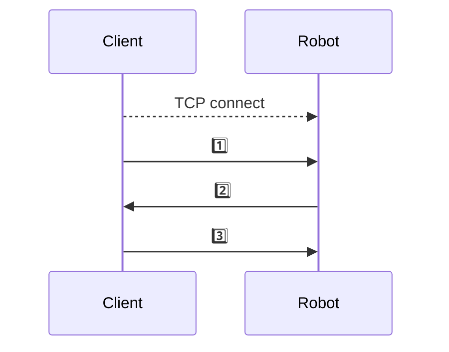

# 机器人通信协议(TCP)

| 文件名称 | 机器人通信协议(TCP) |
| -------- | ------------------- |
| 部门     | 软件算法部          |
| 版本     | 10.3                |
| 密级     | 保密(部门内公开)                |

## 修改记录

| 版本号 | 修改日期   | 修改人 | 概述                                              |
| ------ | ---------- | ------ | ------------------------------------------------- |
| 9.0    | 2023-05-10 | Gary   | 机器人控制相关协议                                |
| 10.0   | 2025-06-13 | Gary   | 改为 markdown 格式                                |
| 10.1   | 2025-07-02 | Gary   | 增加 UmGetRobotInfo,UmGetCurTask 的返回值详细描述 |
| 10.2   | 2025-07-02 | 吴勇毅   | 增加 UmGetRobotInfo里特殊字段返回值描述 |
| 10.3   | 2025-07-11 | 吴勇毅   | 补充AdvGetRoutes等返回值描述 |

---

## 一、概述

机器人通信通过 TCP 进行，用 Socket 连上机器人后，通过第二章节的包格式与机器人进行通信。所有的命令，包括参数和返回值都罗列在第五章节中。用该通信协议可以开发出类似 JunionManager 的客户端来控制机器人。

## 二、数据包格式

整个数据包分为包头、长度、分隔符、数据、包尾五个部分。如下所示：

|      |        |       |      |      |
| ---- | ------ | ----- | ---- | ---- |
| $#   | LEN    | ##    | DATA | $~   |
| head | length | split | {…}  | tail |

1.  包头为 2 个字节，值为 ASCII 码 ‘$#’，即十六进制 0x24 和 0x23。
2.  长度数据不限字节数，值为分隔符 ‘##’ 和尾部 ‘$~’ 之间的数据长度，值以字符串的形式来表示，如：如果 data 的长度为 5，那么长度的数据为 ASCII 码‘5’，即十六进制 35H，如果长度为 12，那么长度的数据为字符串 “12”，即十六进制 3132H。
    3)  数据为 json 格式字符串，数据中有 2 个必须要有的值：

        -  `#CMD#`：命令，表示当前数据包是用于处理哪个命令，如 “UmConnect” 命令、“UmGetRobotInfo” 命令等。
        -  `#GAP#`：时间间隔，单位为毫秒，客户端向服务端请求数据时，有的数据需要每隔一段时间就要获取一次，如机器人的坐标信息等，这时，只需要在请求的数据包中设置相应的间隔时间，服务端就会主动间隔相应的时间给客户端发送该信息，而不需要客户端每次都去请求。

3.  分隔符为 2 个字节，值为 ASCII 码 ‘##’，用于判断长度字符串的结束以及数据的开始。
4.  包尾为 2 个字节，值为 ASCII 码 ‘$~’。

## 三、连接过程



1️⃣ UmConnect 数据包: `$#64##{"#CMD#":"UmConnect","#GAP#":-1,"password":"test","user":"test"}$~`
2️⃣ 机器人对于 UmConnect 指令的返回: `$#108##{"#CMD#":"UmConnect","commands":[],"msg":"Connect Succeed: login as test, group contains: all","state":true}$~`
3️⃣ 后续其他指令, UmGetRobotInfo: `$#37##{"#CMD#":"UmGetRobotInfo","#GAP#":20}$~`

如上所示，在 Socket 连接成功之后需要先发送“UmConnect” 命令来获取所有可用的命令，之后可以用这些所有的命令来收集信息和发送控制命令。建议在接收到所有的可用命令后先发送所有收集信息的命令，设置好相应的时间间隔即可，这样只需要一直接收来处理相应的信息，控制命令一般是一次性的请求，可以在后续需要发送的时候再发送，上图中连接过程完成后就是发送了"UmGetRobotInfo"指令，间隔为 20ms，后续机器人会每隔 20ms 给客户端返回一次机器人当前状态数据。

## 四、示例

请求机器人的 input 数据并且接收的过程如下：

1. 一个发送 “UmGetInput” 请求的完整的数据包示例如下：

| **名称** | **head** | **length** | **split** | **data**                            | **tail** |
| -------- | -------- | ---------- | --------- | ----------------------------------- | -------- |
| **数据** | $#       | 35         | ##        | {"#CMD#":"UmGetInput","#GAP#":1000} | $~       |
| **说明** | 包头     | 长度为 35  |           |                                     | 包尾     |

Data 解析格式如下：

-   "#CMD#":"UmGetInput"：该数据包是用于请求 “UmGetInput” 命令的信息的。
-   "#GAP#":1000：要求服务端每 1000ms（即 1s）给请求者发送一次 “UmGetInput” 命令对应的数据。

2. 一个接收到的完整的数据包示例如下：

| **名称** | **head** | **length** | **split** | **data**                                     | **tail** |
| -------- | -------- | ---------- | --------- | -------------------------------------------- | -------- |
| **数据** | $#       | 44         | ##        | {"#CMD#":"UmGetInput","input":[0,0],"num":2} | $~       |
| **说明** | 包头     | 长度为 44  |           | 数据                                         | 包尾     |

其中 Data 解析格式如下：

-   "#CMD#":"UmGetInput"：该数据包是用于传递 “UmGetInput” 命令的信息的。
-   "input":[0,0]：实际需要的数据，该数据为一个数组，里面包括两个元素值 0
-   "num":2：实际需要的数据，表示该 input 数组有两个元素值。

## 五、命令

与机器人进行通信的命令就是数据包中的#CMD#对应的值，如上面举例的一个完整的数据包格式中，“UmGetInput” 就是一个命令。所有的命令如下表所示：

#### 1)  UmConnect：

a) 说明：用于连接机器人，在 socket 连接成功后需要发送该命令给机器人，机器人会返回所有可用的命令。
b)  参数：需要用户名、密码、设备类型，user(string), password(string),device_type(string)，device_type 可选 iphone、android、ipad、pc、local（本地连接）。
c)  返回：根据发送的用户名和密码，服务端会返回一个列表，该列表包括所有可用的命令、命令参数、返回值说明。格式为：commands:[ {cmd(string), arg(string), ret(string)}, … ]
d)  举例：

```
$#87##{"#CMD#":"UmConnect","#GAP#":-1,"user":"test","password":"test","device_type":"iphone"}$~
```

#### 2)  UmDrive:

a) 说明：驾驶机器人，需要发送线速度、角速度、速度百分比。
b) 参数：直线速度(trans(int))，单位为 mm/s；旋转速度(rot(int))，单位为 °/s；以及速度百分比(speed(int))，取值范围为[0,100]。最终机器人使用的速度是：线速度(trans _ speed / 100)，角速度(rot _ speed / 100)。
c) 返回：无
d)  举例：

```
$#62##{"#CMD#":"UmDrive","#GAP#":-1,"trans":300,"rot":30,"speed":10}$~
```

#### 3)  UmDock

a) 说明：控制机器人去充电
b) 参数：无
c)  返回：无
d)  举例：

```
$#29##{"#CMD#":"UmDock","#GAP#":-1}$~
```

#### 4)  UmGetCurTask

a)  说明：获取机器人当前的任务
b)  参数：无
c)  返回：数据在 data 对应的子 json 数据中，data 中有当前 routes 名称(routes)、当前 routes 的键值(key)、当前的 task(value)、当前的 id 号(id)、当前的 mode 名称(mode)、当前的状态(status)6 个字符串数据，数据格式类似：data:{routes(string), key(string), value(string), id(string),mode(string),status(string)}。返回的完整包举例：

```
$#xxx##{"#CMD#":"UmGetCurTask","#GAP#":-1,"data":{"id":"","key":"d111","mode":"Stop","routes":"Samples","status":"Stopped","value":{"cmd":"return","comment":"mode wait for 1s","flag":"1"}}}$~
```

d)  举例：

发送:

```
$#37##{"#CMD#":"UmGetCurTask","#GAP#":1000}$~
```

返回:

```json
{
	"time": "2025-01-01 14:24:59.234", // string, 当前任务开始时机器人系统时间, 精确到毫秒
	"routes": "sample_idle",           // string, 当前route名称, 可能有后缀[Temp][Template]分别表示临时任务(通过UmScheduleThis触发)和模版任务
	"key": "a",                        // string, 当前执行到的任务的key
	"id": "4354512323",                // string, 当前任务号, 来自于调度系统
	"value": { "cmd": "idle" },        // json object, 当前任务的具体内容
	"note": 1,                         // int, 当前任务的编号, 不具有实际意义, 可以用来表示当前任务是大任务的第几步
	"mode": "Idle",                    // string, 当前机器人的模式
	"status": "idle",                  // string, 当前机器人的状态
	"state": 0                         // int, 内部状态字段, 仅用于内部测试
}
```

#### 5)  UmGetInput

a)  说明：获取 Input，返回值包括 Input 的字节数，以及每个字节的值
b)  参数：无
c)  返回：num(int)和 input(array)，num 为 input 数组的元素个数，input 对应的值为一个数组，数组中的每个元素的低八位为对应的 input 值，第 1 个元素为最高的八位 input，最后一个元素为最低的八位 input，数据格式类似 input:[byte1(int),byte2(int)…]。例如：num 为 2，那么总共的 input 数组元素有 2 个，每个元素为 8 位，即总共有 16 个 input 值；假设 input 为[1,2]，1 对应的二进制值为 0000 0001，2 对应的二进制为 0000 0010，那么所有的 input 值为 0000 0001 0000 0010，所以目前 IO 中 io2 和 io9 的值为 1，其他 io 的值都为 0。
d)  举例：

```
$#35##{"#CMD#":"UmGetInput","#GAP#":1000}$~
```

#### 6)  UmGetLaser

a) 说明：获取激光数据
b)  参数：无
c)  返回：因为机器人激光可能不止一个，所以返回一个数组，数组中每个元素为一个激光的激光数据，包括激光束个数 num，即 xy 坐标对的个数，以及激光点坐标字符串 points，points 中总共有 num 个 x 和 y 对，数据形式类似：data(array):[{num(int),points: "x1 y1 x2 y2 …]},…]
d)  举例：

```
$#34##{"#CMD#":"UmGetLaser","#GAP#":200}$~
```

#### 7)  UmGetLocState

a)  说明：获取定位分数
b)  参数：无
c)  返回：score(int)
d)  举例：

```
$#37##{"#CMD#":"UmGetLocState","#GAP#":200}$~
```

#### 8)  UmGetMap

a)  说明：获取地图数据
b)  参数：无
c)  返回：返回的数据包括 Header、分辨率(MapRes:mm/p)、最大点的坐标(MaxPose)、最小点的坐标(MinPose)、障碍线的个数(NumLines)、障碍点的个数(NumPoints)、功能区对象(Objs)、障碍线数组(ObsLines)、障碍点数组(ObsPoints)。其中功能区中的每个元素也是一个数组类似"ForbiddenArea":[{"name": "","points": "-100 -200 300 400","pose": "0 0 0"}]；障碍线数组中的每个元素类似"-100 -200 300 400"，是直线的两个端点的坐标值 x1,y1,x2,y2，中间以空格分开；障碍点数组是一个二维数组，每个数组中的第一个元素为 x 值，后面的元素为地图中该列的所有 y 值，类似[[x1 y11 y12 y13 y14 …], [x2 y21 y22 y23 y24 …], …]。
d)  举例：

```
$#31##{"#CMD#":"UmGetMap","#GAP#":-1}$~
```

#### 9)  UmGetMapName

a) 说明：获取机器人当前使用的地图名称
b)  参数：无
c)  返回：name(string)
d)  举例：

```
$#37##{"#CMD#":"UmGetMapName","#GAP#":2000}$~
```

#### 10) UmGetMotorState

a)  说明：获取驱动器使能状态
b)  参数：无
c)  返回：flag(bool)
d)  举例：

```
$#40##{"#CMD#":"UmGetMotorState","#GAP#":1000}$~
```

#### 11) UmGetName

a)  说明：获取机器人名称
b)  参数：无
c)  返回：name(string)
d)  举例：

```
$#32##{"#CMD#":"UmGetName","#GAP#":-1}$~
```

#### 12) UmGetOutput

a)  说明：获取 Output，与获取 Input 类似
b)  参数：无
c)  返回：num(int):output 的字节数；output(array):[byte1(int),byte2(int)…]
d)  举例：

```
$#36##{"#CMD#":"UmGetOutput","#GAP#":1000}$~
```

#### 13) UmGetPath

a)  说明：获取路径
b)  参数：无
c)  返回：返回的数据包括路径点的个数 num(int)，以及路径点的数组 points:[{x,y},…]。
d)  举例：

```
$#33##{"#CMD#":"UmGetPath","#GAP#":200}$~
```

#### 14) UmGetRobotInfo

a)  说明：获取机器人基本信息，包括位置，速度，模式状态，电量等
b)  参数：无
c)  返回：位置(x(int),y(int),th(int))，速度(vel_f(double),vel_r(double))，模式状态(mode(string),status(string))，电量(battery(int))
d)  举例：

发送:

```
$#38##{"#CMD#":"UmGetRobotInfo","#GAP#":200}$~
```

返回:

```json
{
	"mode": "Stop",        // string, 机器人当前模式
	"status": "stopped",   // string, 机器人当前状态
	"x": 0,                // int, 机器人全局x坐标值, mm
	"y": 0,                // int, 机器人全局y坐标值, mm
	"th": 0,               // int, 朝向, deg
	"vel_f": 0,            // double, 线速度, mm/s, 如果有横向速度, 则表示sqrt(vx^2+vy^2)
	"vel_r": 0,            // double, 角速度, deg/s
	"battery": 80,         // int, 电量[0,100]
	"is_charged": false,   // bool, 机器人是否正在充电
    // 特定机型会返回其他数据:
  //除了光伏和早期的差速机器人没有以下字段
  "station": "",				 // string, 目标点名称
  "obs": false					 // bool, true：机器人卡住无法移动
}
```

#### 15) UmGetRobotSize

a)  说明：获取机器人大小
b)  参数：无
c)  返回：宽度(width(double))，机器人总长(length(double))以及机器人中心到前端长度(lengthfront(double))
d)  举例：

```
$#37##{"#CMD#":"UmGetRobotSize","#GAP#":-1}$~
```

#### 16) UmGetRoutes

a)  说明：获取所有的 routes
b)  参数：无
c)  返回：data 中包含的是一个 routes 数组，routes 数组里面包含所有的 route，每个 route 中数据结构类似{"name":"","content":{"a":"cmd","a1":""…}}。
d)  举例：

```
$#34##{"#CMD#":"UmGetRoutes","#GAP#":-1}$~
```

#### 17) UmGetSafeDrive

a)  说明：获取是否是安全驾驶
b)  参数：无
c)  返回：flag(bool)
d)  举例：

```
$#39##{"#CMD#":"UmGetSafeDrive","#GAP#":2000}$~
```

#### 18) UmGoto

a)  说明：令机器人去某目标点或某坐标点
b)  参数：target(string):为 goal 或 pose，goal(string):目标点名称，poseX(int):目标坐标 X 值(mm)，poseY(int):目标坐标 Y 值(mm)，poseTh(int):目标坐标朝向(deg)。如果 target 是 goal，那么 goal 需要赋值为地图上某个 goal 的名称，如果 target 是 pose，那么 poseX,poseY,poseTh 需要赋值为想要去的位置坐标。
c)  返回：无
d)  举例：

```
$#98##{"#CMD#":"UmGoto","#GAP#":-1,"goal":"none","poseTh":-23,"poseX":5686,"poseY":2602,"target":"pose"}$~
```

#### 19) UmIdle

a)  说明：切换到空闲模式
b)  参数：无
c)  返回：无
d)  举例：

```
$#29##{"#CMD#":"UmIdle","#GAP#":-1}$~
```

#### 20) UmLocalize

a)  说明：将机器人定位到 goal 或者 pose，参数与 UmGoto 类似
b)  参数：target(string):为 goal 或 pose，goal(string):目标点名称，poseX(int):目标坐标 X 值(mm)，poseY(int):目标坐标 Y 值(mm)，poseTh(int):目标坐标朝向(deg)，取值范围为(-180,180]。如果 target 是 goal，那么 goal 需要赋值为地图上某个 goal 的名称，如果 target 是 pose，那么 poseX,poseY,poseTh 需要赋值为想要重定位的位置坐标。
c)  返回：无
d)  举例：

```
$#96##{"#CMD#":"UmLocalize","#GAP#":-1,"goal":"","poseTh":0,"poseX":3513,"poseY":4189,"target":"pose"}$~
```

#### 21) UmRoutes

a)  说明：执行某个路线
b)  参数：需要发送执行的路线名称 routes(string)和路线的 key(string)，id(string)是可选的
c)  返回：无
d)  举例：

```
$#60##{"#CMD#":"UmRoutes","#GAP#":-1,"key":"d","routes":"Samples"}$~
```

#### 22) UmSchedulerList

a)  说明：执行一个路线列表
b)  参数：路线个数 size(int)，以及一个数组 list(array)，里面每个元素是路线名称和 key 的组合：routes:key，数据格式类似：size(int), list(array):[routes:key1(string), routes2:key2(string),…]
c)  返回：无
d)  举例：

```
$#__##{"#CMD#":"UmSchedulerList","size":1,"list":["Samples:a"]}$~
```

#### 23) UmSchedulerThis

a)  说明：发送一个临时 routes 给机器人执行
b)  参数：完整的 route 内容(content)，route 名称(name)，起始执行的 key(key)，id 号(id,非必须)
c)  返回：无
d)  举例：

```
$#__##{"#CMD#":"UmSchedulerThis","name":"Samples","key":"a","content":{"a":{"cmd":"wait","time":-1}}}$~
```

#### 24) UmSetMotor

a)  说明：设置机器人驱动器使能状态
b)  参数：flag(bool)
c)  返回：无

#### 25) UmSetOutput

a)  说明：设置机器人 Output
b)  参数：字节数(length(int))，目前只支持 2 个字节，所以一般为 2，高 8 为的值(high(int))，低 8 位的值(low(int))。
c)  返回：无

#### 26) UmSetOutputByte

a)  说明：设置机器人 Output 的某一位的值
b)  参数：需要设置的位(num(int))，目前只支持 16 位，所以取值范围为 1~16；需要设置的值 flag(int):0 或 1。
c)  返回：无

#### 27) UmSetSafeDrive

a)  说明：设置是否使用安全模式
b)  参数：flag(bool)
c)  返回：无

#### 28) UmSetVolume

a)  说明：设置机器人音量
b)  参数：volume(int):0~100
c)  返回：无

#### 29) UmStop

a)  说明：令机器人停止，切换到停止状态
b)  参数：无
c)  返回：无

#### 30) error(异常)

a)  说明：获取机器人报警/报错信息
b)  参数：无
c)  返回：level 为报错等级: 1 为警告, 2 为普通报错, 3 为致命报错; device 参数指报错的设备; title 为报警信息标题或简短报错; message 为报警信息详细说明; suggestion 为建议的处理方法
d)  举例

```
$#__##{"#CMD#":"error","level":1,"device":"bumper/robot/laser","title":"bumper","message":"bumper triggered!","suggestion":"stop robot…"$~
```

### 31) UmGetPathPlanningClearances

a)  说明：获取机器人本体的轮廓和避障框的轮廓
b)  参数：无
c)  返回：num(int):个数，points(json-array):坐标[{"x","y"}]
d)  举例：
```
$#__##{"#CMD#":"UmGetPathPlanningClearances","num":16,"points":[{"x":-878,"y":-11374},{"x":-332,"y":-11424},{"x":-332,"y":-11424},{"x":-237,"y":-10390},{"x":-237,"y":-10390},{"x":-783,"y":-10340},{"x":-783,"y":-10340},{"x":-878,"y":-11374},{"x":-878,"y":-11374},{"x":-332,"y":-11424},{"x":-332,"y":-11424},{"x":-237,"y":-10390},{"x":-237,"y":-10390},{"x":-783,"y":-10340},{"x":-783,"y":-10340},{"x":-878,"y":-11374}]}$~
```

### 32) UmGetBatteryInfo

a)  说明：获取机器人电池信息
b)  参数：无
c)  返回：soh:电池健康, vol:电池电压, tem1:电池温度1, tem2:电池温度1, tem3:电池温度1
d)  举例：

### 33) UmGetRailInfo

a)  说明：获取机器人轨道光电信息(光伏车才有)
b)  参数：无
c)  返回：rail(string):"000000_000000_000000_000000"
d)  举例：

### 34) UmGetTaskInfo

a)  说明：获取机器人调度任务信息
b)  参数：无
c)  返回：id(string):job_id，path(string):routes name，time(string):接收到任务的时间，status(string):当前状态，goal(string):目标点，packet(string):包号，type(string):任务类型
d)  举例：
f)  注：需要通过RmsTask下发任务才会有数据

### 35) UmGetMotorInfo

a)  说明：获取机器人底盘故障信息
b)  参数：无
c)  返回：SystemError(int):系统故障码，SystemWarning(int):系统报警码，MotorError(int):电机故障码
d)  举例：

### 36) UmGetVirtualIO

a)  说明：获取机器人虚拟io信息
b)  参数：无
c)  返回：value(string):"xxxxxxxxxxxxxxxx"
d)  举例：

### 37) UmGetIgnoreObstacleRange

a)  说明：获取机器人载货状态时忽略障碍物范围
b)  参数：无
c)  返回：num(int):个数，ignoreRanges(json-array):[{"x","y","r"}/{"x1","y1","x2","y2"}]
d)  举例：

### 38) UmGetConfig

a)  说明：获取机器人所有配置参数
b)  参数：无
c)  返回：data(json-object):[section]:{[parameter]:{[json-value]}}
d)  举例：
f)  注：[section]、[parameter]代表名称是变动的，[json-value]代表数据类型也是变动的

### 39) UmGetMappingState

a)  说明：获取机器人扫图状态
b)  参数：无
c)  返回：flag(bool)
d)  举例：

### 40) UmMapping

a)  说明：机器人扫图
b)  参数：name(string):记录地图数据的名称,flag(bool):true开始扫图 false结束扫图
c)  返回：无
d)  举例：

### 41) UmReloadConfig

a)  说明：令机器人重新加载自身配置，只有在idle和stop状态下才被允许执行
b)  参数：无
c)  返回：无
d)  举例：

### 42) UmSetConfig

a)  说明：设置机器人参数配置
b)  参数：[section]-[parameter_name]:[json-value]
c)  返回：无
d)  举例：
f)  注：[section]、[parameter]代表名称是变动的，[json-value]代表数据类型也是变动的

### 43) AdvSetRoutes

a)  说明：设置机器人rotues.json的内容
b)  参数：routes(string):全部routes内容
c)  返回：无
d)  举例：

### 44) AdvGetRoutes

a)  说明：获取机器人rotues.json的内容
b)  参数：无
c)  返回：routes(string):全部routes内容
d)  举例：

### 45) AdvSetParamsRoutes

a)  说明：设置机器人rotues.params.json的内容
b)  参数：routes(string):全部routes.params内容
c)  返回：无
d)  举例：

### 46) AdvGetParamsRoutes

a)  说明：获取机器人rotues.params.json的内容
b)  参数：无
c)  返回：routes(string):全部routes.params内容
d)  举例：

### 47) AdvSetTemplateRoutes

a)  说明：设置机器人rotues.template.json的内容
b)  参数：routes(string):全部routes.template内容
c)  返回：无
d)  举例：

### 48) AdvSetTemplateRoutes

a)  说明：获取机器人rotues.template.json的内容
b)  参数：无
c)  返回：routes(string):全部routes.template内容
d)  举例：

### 49) UmResetRobotArm

a)  说明：机械臂复位
b)  参数：无
c)  返回：无
d)  举例：
```
$#__##{"#CMD#":"UmResetRobotArm","#GAP#":-1}$~
```
### 50) UmClearArmFault

a)  说明：清除机械臂报警信息
b)  参数：无
c)  返回：无
d)  举例：
```
$#__##{"#CMD#":"UmClearArmFault","#GAP#":-1}$~
```
