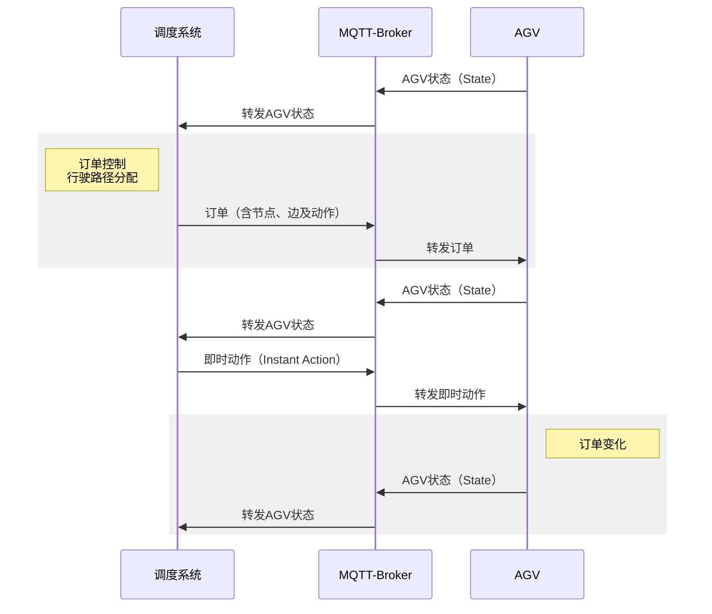
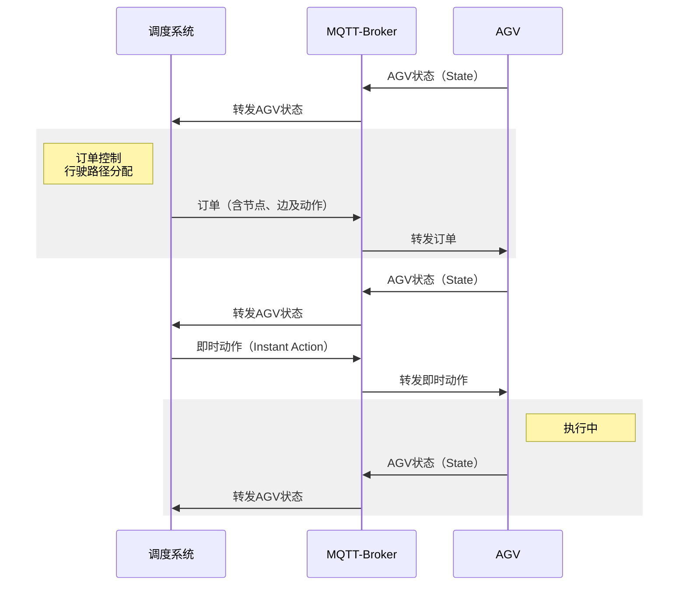
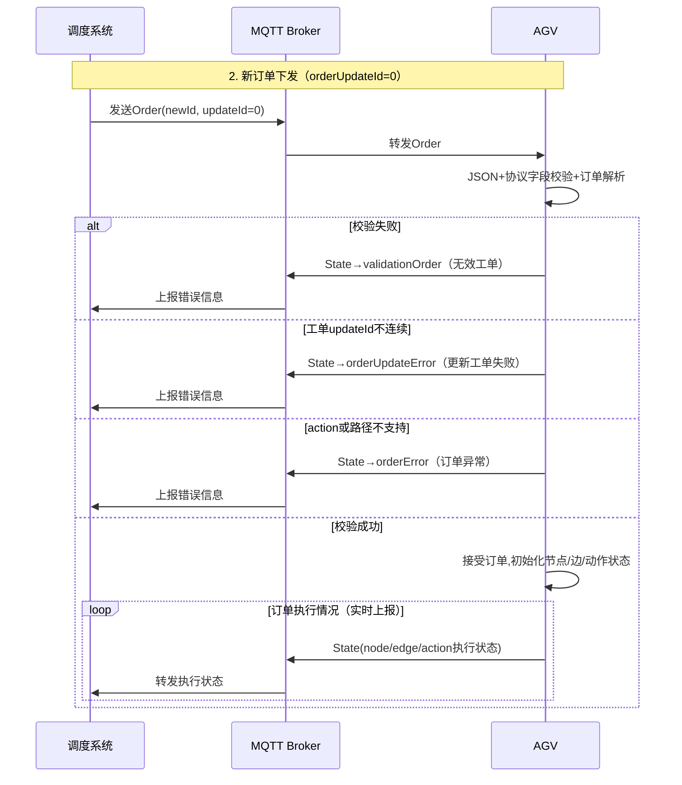
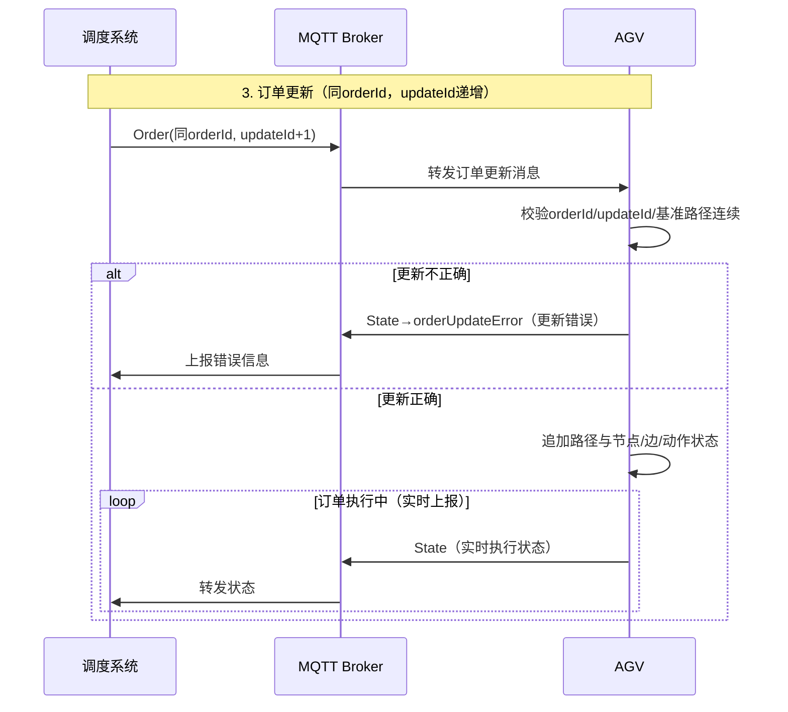
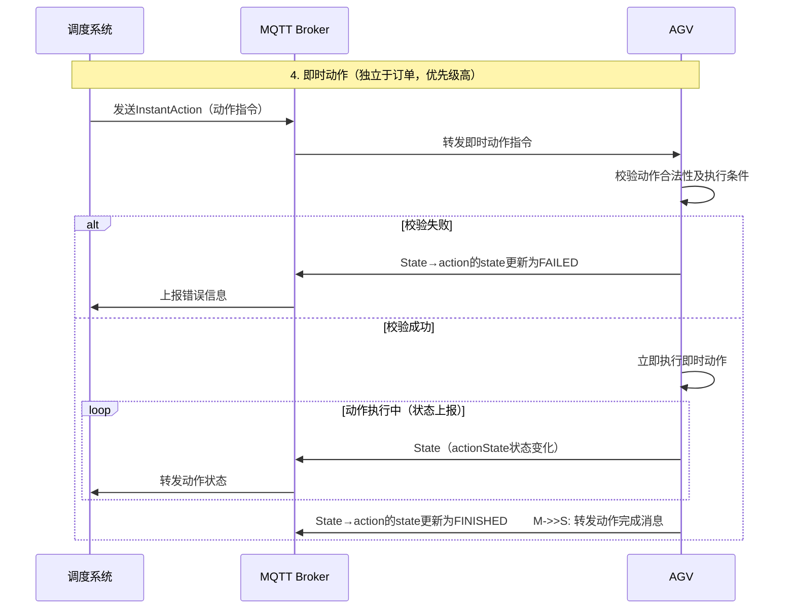
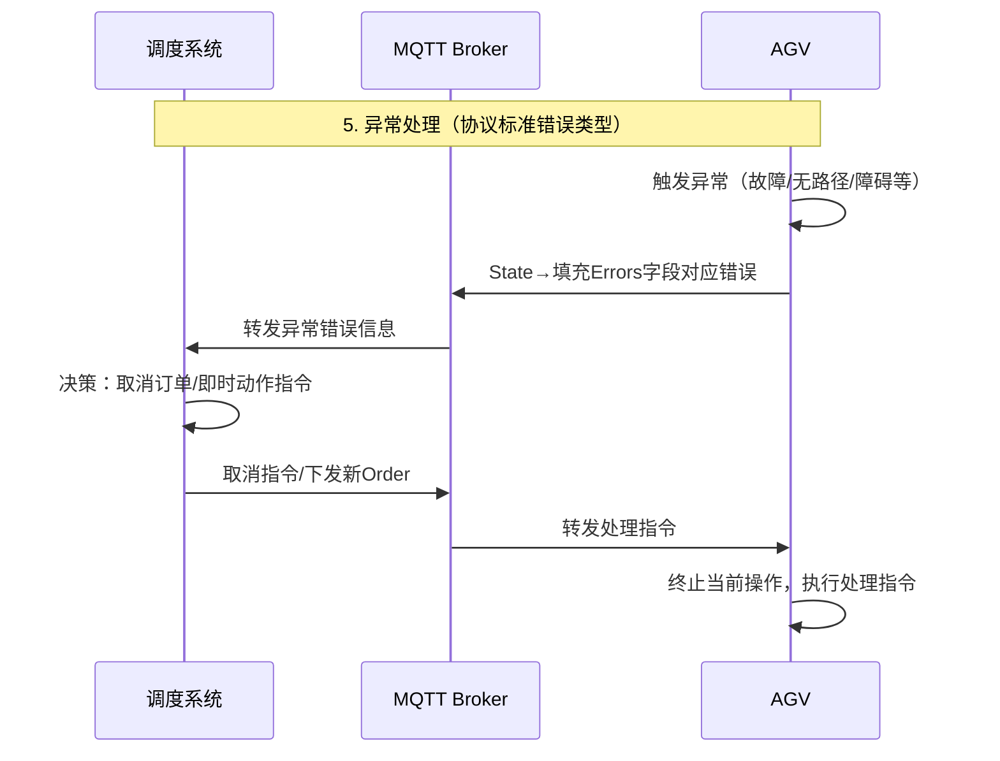

# # VDA5050AGV标准协议接入说明

| 文件名称 | 机器人协议      |
| ---- | ---------- |
| 部门   | 软件算法部      |
| 版本   | 1.0        |
| 密级   | 保密（部门内部公开） |

## 修改记录

| 版本号 | 修改日期      | 修改人 | 概述                   | 详细说明         |
| --- | --------- | --- | -------------------- | ------------ |
| 1.0 | 2026.4.17 | 徐慧敏 | VDA5050AGV标准协议接入说明初稿 | 描述当前机器人的所有协议 |

---

## 一、概述

本文档为玖物机器人提供的VDA5050协议接入方式说明，重点阐述AGV与上层主控系统之间的标准化通信机制与接口规范，遵循德国汽车工业协会（VDA）与VDMA材料处理和内部物流协会联合制定的VDA5050协议2.0.0标准，涵盖AGV连接、设备信息上报、任务指令交互、实时状态同步等核心场景的通信逻辑与消息结构定义，明确MQTT传输协议、JSON数据格式的适配要求，为开发人员实现AGV与调度系统的快速集成、跨厂商设备协同及标准化调度提供参考依据，助力实现AGV设备的“即插即用”与高效协同运行。

## 二、适配说明
### 2.1 交互流程说明
玖物机器人严格遵循VDA5050 2.1.0版本标准的交互流程，下图为AGV与调度系统基础的交互时序。并作核心模块的交互时序简单介绍。

#### 2.1.1 基础连接与心跳保活时序

1. 连接与订阅：调度系统、AGV分别通过MQTT Broker订阅对应Topic，确保消息双向通信畅通——调度系统订阅AGV状态Topic，用于接收AGV上报的各类状态；AGV订阅订单、即时动作等Topic，用于接收调度系统下发的指令；
2. 心跳保活：AGV按协议推荐周期（300ms~10s，玖物机器人默认1s）周期性上报State消息，调度系统通过该消息校验AGV在线状态、通信连续性及任务执行情况。

#### 2.1.2 新订单下发与执行时序

1. 订单下发：调度系统生成符合协议规范的新订单消息（orderId唯一，orderUpdateId初始化为0），通过MQTT Broker转发至AGV；
2. 订单校验：AGV接收订单后，首先校验消息的JSON格式及协议字段合规性（如节点、边信息是否完整、数量是否正确），校验不通过则上报**validationOrder**错误；然后校验订单是否可行等其它标准校验；校验通过则接受订单并更新state，初始化nodeStates、edgeStates、actionStates等状态参数；
3. 执行反馈：AGV执行订单过程中，state中将填充orderId、nodeState和edgeState等信息，实时同步节点、边、动作的执行进度。

#### 2.1.3 订单更新（相同orderId）交互时序

1. 更新下发：调度系统生成订单更新消息；
2. 更新校验：AGV接收更新消息后，依次完成三项核心校验：① orderId与当前执行订单一致；② orderUpdateId=当前的updateId+1；③ 新订单的基准路径（base）与当前执行路径的最后一个节点保持连续。任意一项校验失败，均上报orderUpdateError错误，反馈至调度系统；
3. 执行反馈：校验通过后，AGV在原有的base路径基础上追加节点、边、动作状态列表；整个机器人生命周期中均周期上报State消息，同步更新进度。

#### 2.1.4 即时动作（InstantActions）交互时序

1. 指令下发：调度系统生成InstantActions消息（独立于订单，包含动作类型、参数等信息）；
2. 指令校验：AGV接收即时动作指令后，校验动作权限（如指令是否支持）及当前AGV状态（如是否处于可执行该动作的状态），校验失败则state里更新该action的State为FAILED；校验通过则立即执行该即时动作；
3. 执行反馈：AGV执行即时动作过程中，周期性上报State消息，同步动作状态（WAITING/INITIATING/RUNNING/FINISHED）；动作完成后，上报FINISHED状态。

#### 2.1.5 异常与错误处理时序

1. 异常触发：AGV在执行订单、即时动作或通信过程中，出现故障、障碍物阻挡、无可行路径、指令校验失败等异常情况时，触发异常处理流程；
2. 错误上报：AGV根据异常类型，上报对应的错误状态（如noRouteError无路径错误、emergencyStop急停错误、validationOrder订单校验错误等），通过MQTT Broker转发至调度系统，错误消息中需包含错误类型、描述及相关参考ID，便于调度系统定位问题；
3. 异常处理：调度系统接收异常消息后，进行决策（如取消当前订单、重新规划路径、下发急停/复位指令等），并将处理指令通过MQTT Broker下发至AGV；AGV接收指令后，终止当前操作，重置相关状态，执行调度系统下发的处理指令，完成异常处理。

### 2.2 Topic 层级结构
玖物机器人 AGV 遵循 VDA5050 协议规范，统一采用如下 Topic 层级格式：
`interfaceName/majorVersion/manufacturer/serialNumber/topic`

#### 层级字段详细定义

| MQTT Topic 层级 | 数据类型   | 协议标准描述        | 玖物机器人取值示例                                                       |
| :------------ | :----- | :------------ | :-------------------------------------------------------------- |
| interfaceName | string | 使用的接口名称       | uagv                                                            |
| majorVersion  | string | 主版本号，以 "v" 开头 | v2                                                              |
| manufacturer  | string | AGV 的制造商      | Junion                                                          |
| serialNumber  | string | 唯一 AGV 序列号    | 例ubot-001，由大小写字母（A-Z/a-z）、数字（0-9）及`-`、`.`、`:`组成的设备唯一编码，需保证全场景唯一 |
| topic         | string | MQTT 业务 Topic | 对应 VDA5050 协议定义的业务接口名称，如`order`、`state`、`orderState`等，详见后续接口汇总  |

### 2.3 Subtopic 定义

结合协议标准与玖物机器人 AGV 实现情况，核心业务 Subtopic 规范如下；
#### 2.3.1 协议标准subtopic

以下为VDA5050协议2.0.0版本下AGV与上层系统交互的核心接口汇总，严格遵循协议标准定义：

| Subtopic 名称      | 发布者          | 订阅者        | 用途说明                            | 玖物机器人支持情况 |
| :--------------- | :----------- | :--------- | :------------------------------ | :-------- |
| `order`          | 主控 / 调度系统    | robot      | 传输从主控到 AGV 的行驶任务指令              | 已支持       |
| `instantActions` | 主控 / 调度系统    | robot      | 传输需要 AGV 立即执行的操作指令（如急停、暂停等）     | 已支持       |
| `state`          | robot        | 主控         | 传输 AGV 的实时状态信息（位置、速度、任务状态等）     | 已支持       |
| `visualization`  | robot        | 可视化系统 / 主控 | 传输高频次、仅用于可视化的位置信息               | 暂不支持      |
| `connection`     | Broker/robot | 主控         | 同步AGV 连接状态                      | 已支持       |
| `factsheet`      | robot        | 主控         | 上报 AGV 设备能力、参数等信息，用于主控侧 AGV 初始化 | 已支持       |

 <strong>以序列号为 ubot-001 的玖物机器人 AGV 为例，各核心业务 Topic 如下：</strong> <ul style="margin:6px 0 0 0; padding-left:20px;"> <li>任务下发接口：<code>uagv/v2/Junion/ubot-001/order</code></li> <li>即时动作指令接口：<code>uagv/v2/Junion/ubot-001/instantActions</code></li> <li>AGV 状态上报接口：<code>uagv/v2/Junion/ubot-001/state</code></li> <li>连接状态上报接口：<code>uagv/v2/Junion/ubot-001/connection</code></li> <li>设备文档上报接口：<code>uagv/v2/Junion/ubot-001/factsheet</code></li> </ul> 

### 2.4 模式说明
机器人开机上线后有以下五种模式：
- 调度模式（**AUTOMATIC**）：可接收调度任务，机器人运行完全由调度系统控制
- 就绪模式（**SEMIAUTOMATIC**）：可接收调度任务，可人工进行部分操作。例如人工远程触发idle/充电指令后机器人会进入到就绪模式，等待充电到位后需要回调告知调度，然后进入到调度模式。
- 手操模式（**MANUAL**）：不可接收调度任务，完全由人工控制，机器人处于非安全状态。机器人在调度/就绪模式下若外部触发stop指令则会进入手操模式。
- 调试模式（**SERVICE**）：不可接收调度任务，机器人配置修改、升级维护等场景下的特殊模式。
- 配置模式（**TECHIN**）：不可接收调度任务，初始化AGV时模式，如地图下载中。

机器人上/下线和模式切换与调度服务器之间的状态流转如下：

## 三、Subtopic详细说明

## 3.1 order（任务指令）

功能：严格遵循协议规范，调度系统通过该Subtopic向AGV下发各类任务指令，涵盖基础搬运、路径导航等全场景任务需求，是AGV接收调度指令、执行作业任务的核心入口，调度系统需结合AGV当前状态及实际业务需求，灵活下发任务指令，确保AGV精准执行作业流程，适配工业场景下的各类作业需求。

传输方向：调度系统 → 玖物机器人AGV

### 3.1.1 消息结构说明

 本节仅说明关键字段，未罗列全部协议字段，请以 VDA5050-V2.1.0 标准协议为准。 

- **orderId**：必选字段，任务唯一标识。由调度系统生成，全局唯一，用于唯一标识每一条任务指令，长度，便于任务追溯、状态查询及指令匹配。
- **orderUpdateId**：必选字段，任务更新标识。用于区分任务的新增、更新操作，初始下发任务时取值为0，每更新一次任务，该标识自增1，确保调度系统与玖物机器人同步任务更新状态，避免任务指令混乱。（**若updateId不连续，AGV将拒绝该order；若updateId重复，AGV将忽略该order**）

- **nodes**：必选字段，任务节点数组。包含任务执行过程中的所有节点信息，每个节点需包含nodeId、sequenceId、released（是否释放）、actions（节点关联动作）等核心字段。
- **edges**：必选字段，任务路径边数组。用于定义相邻两个任务节点之间的路径信息，每个路径边包含edgeId、sequenceId、released（是否释放）、actions（节点关联动作）、startNodeId、endNodeId、maxSpeed（可选）、trajectory（轨迹，可选，通常用来下发贝塞尔弧线等）、corridor（走廊，可选，通常用来规定AGV可自主避让的范围）等字段。

- **zoneSetId**：可选字段，用于导航或主控用于路径规划。

### 3.1.2 应用说明

1. 若当前order正在执行中，收到新的order（非order更新）玖物机器人将拒绝此次order；调度系统如需打断当前order请合理使用instantAction中cancelOrder；
2. nodes数量应不少于1，且nodes与edges数量应严格为n:n-1；
3. nodes的起始sequenceId应遵循协议，自0开始，如下图所示；且update的order的第一个base node应与上一条order最后一个base node相同，否则AGV将拒绝此次order；
	 

4. **目前玖物机器人暂不支持zoneSetId功能**

功能：玖物机器人向调度系统实时上报运行状态，包括位置、速度、电量、任务执行状态等核心信息。

传输方向：玖物机器人AGV → 调度系统

玖物机器人支持情况：**支持**，默认1s上报一次或特殊状态变化时上报，确保调度系统实时掌握robot状态。

### 3.2.1 消息结构说明

 本节仅说明关键字段，未罗列全部协议字段，请以 VDA5050-V2.1.0 标准协议为准。 

- **orderId**：当前执行的任务id，如无则是上一个完成的orderid，在收到新order时更新该值。默认为“”；
- **orderUpdateId**：表明该order的更新已经被AGV接受，默认为0。
- **lastNodeId**：AGV最后到达节点的NodeID，如果AGV当前在节点上，则为当前节点的NodeID，若lastNodeld不可用，填入空字符串""。
	
    
- **lastNodeSequenceld**：AGV最后到达节点的SequeneID，如果AGV当前在节点上，则为当前节点的SequenceID；如果lastNodeSequenced不可用，则为0。

- **nodeStates**：order中待完成的nodeState对象数组，idle时为空。
- **edgeStates**：order中待完成的edgeState对象数组，idle时为空。
- **ActionStates**：包含当前action和待执行的action的列表，可能包括来自先前节点的仍在进行中的actions。action完成后，actionStatus设置为FINISHED并发布state；actionState一直保留，直到收到下一个新的order。
	

- **agvPosition**：机器人实时位置信息，包含x、y、theta、mapId等字段，各字段的单位遵循协议定义，确保位置信息准确。
- **operatingMode**：AGV当前的操作模式，如AUTOMATIC（调度模式）/SEMIAUTOMATIC（就绪模式）/MANUAL（手操模式）/SERVICE（调试模式）/TEACHIN（配置模式）。
- **velocity**：机器人实时速度信息，包含vx（m/s）、vy（m/s）、omega（rad/s），准确反映机器人运行速度状态。
- **batteryState**：电池状态信息，包含batteryCharge（剩余电量，百分比）、charging（是否充电中）等字段，全面反馈机器人电池状态，便于调度系统合理安排充电任务。
- **errors**：error数组，若为空则AGV当前没有错误信息。

所有字段及子字段均严格对照协议规范，完整对齐标准。
### 3.2.2 应用说明

1. nodeStates和edgeStates只包含当前未行驶过的点和边，不包含当前正处于的点或边；
2. operatingMode操作一旦出现手操模式与其它模式的切换，为保证安全及数据正确机器人将取消当前所有order；
3. order的action在actionStates字段上报中将以orderId为key更新，若orderId更新则将清除旧order的所有actionStates，反之将保留所有actionStates；
4. instantActions的state将在整个机器人生命周期中都进行上报，避免主控丢失对该action的状态管理。

## 3.3 instantActions（即时动作）

功能：调度系统向玖物机器人发送急停、暂停、继续等即时控制指令，无需等待任务队列。

传输方向：调度系统 → 玖物机器人AGV

玖物机器人支持情况：**支持**，接收指令后立即执行，并在state中反馈执行结果。

### 3.3.1 消息结构说明

 本节仅说明关键字段，未罗列全部协议字段，请以 VDA5050-V2.1.0 标准协议为准。 

- **actionId**：必选字段，即时动作唯一标识，由调度系统生成，全局唯一，用于唯一标识每一条即时动作指令，便于动作执行结果追溯及指令匹配。
- **actionType**：必选字段，即时动作类型，支持不限定如暂停（pause）、继续（resume）、取消所有任务（cancelOrder）等标准动作类型。
- **blockingType**：通常instantAction接口不处理blockingType。
- **actionParameters**：可选字段，仅当actionType需要额外参数时填写。

### 3.3.2 应用说明

1. 玖物机器人在instantAction接口响应中忽略blockingType字段功能，直接作为立即动作执行，如与当前order有冲突，该instantAction将失败，请合理使用功能。

## 3.4 visualization（可视化信息）

功能：玖物机器人向调度系统上报可视化相关信息，辅助调度系统直观监控robot运行状态。

传输方向：玖物机器人AGV → 调度系统

玖物机器人支持情况：**暂不支持**。

### 3.4.1 消息结构说明

- 此接口字段内容较多，建议查看标准协议，玖物机器人后续支持时将严格遵循标准协议规范。

## 3.5 connection（连接状态）

功能：玖物机器人向调度系统上报与调度系统的连接状态，用于确认通信链路正常。

传输方向：玖物机器人AGV → 调度系统

玖物机器人支持情况：**支持**，变化时立即上报。

### 3.5.1 消息结构说明

- **serialNumber**：玖物机器人唯一设备标识，与Topic中的robotId保持一致，全局唯一，用于调度系统识别上报连接状态的目标设备。
- **connectionStatus**：连接状态，严格遵循原文定义，取值包含ONLINE（AGV主动上线）、OFFLINE（AGV主动断开连接）、CONNECTIONBROKEN（AGV和broker 连接意外断开）。

## 3.6 factsheet（设备说明书）

功能：玖物机器人向调度系统上报设备基础参数，便于调度系统完成设备建档与管理。

传输方向：玖物机器人AGV → 调度系统

玖物机器人支持情况：**支持**，上线后自动上报。

### 3.6.1 消息结构说明

- 此接口字段内容较多，建议查看标准协议，玖物机器人严格遵循标准协议规范。

# 四、附件说明
## 4.1 VDA5050 2.1.0官方文档

链接：https://github.com/VDA5050/VDA5050/blob/release/2.1.0/VDA5050_EN.md

## 4.2 支持的action

**action待持续更新补充**

| 动作名称             | 功能描述                         | 参数                                                                   | 即时执行 | 节点  | 边   | 支持  |
| ---------------- | ---------------------------- | -------------------------------------------------------------------- | ---- | --- | --- | --- |
| startPause       | 激活暂停模式，停止行驶动作，订单可恢复          | -                                                                    | 是    | 否   | 否   | 是   |
| stopPause        | 解除暂停模式，恢复行驶及所有动作             | -                                                                    | 是    | 否   | 否   | 是   |
| startCharging    | 启动充电流程，支持站点 / 车道充电，过充防护由车辆负责 | -                                                                    | 是    | 是   | 否   | 是   |
| stopCharging     | 终止充电流程，准备接收新订单               | -                                                                    | 是    | 是   | 否   | 是   |
| initPosition     | 重置 AGV 的位姿（坐标、角度、地图 ID 等）    | x/y/theta (float64)  mapId/lastNodeId (string)                 | 是    | 是   | 否   | 是   |
| enableMap        | 启用已下载地图，无需重新初始化位置            | mapId/mapVersion (string)                                            | 是    | 是   | 否   | 否   |
| downloadMap      | 触发地图下载，完成后更新状态               | mapId/mapVersion/mapDownloadLink  mapHash (可选)                 | 是    | 否   | 否   | 否   |
| deleteMap        | 从 AGV 中移除指定地图                | mapId/mapVersion (string)                                            | 是    | 否   | 否   | 否   |
| stateRequest     | 请求 AGV 上报最新状态                | -                                                                    | 是    | 否   | 否   | 是   |
| logReport        | 请求 AGV 生成并存储日志报告             | reason (string)                                                      | 是    | 否   | 否   | 否   |
| pick             | 请求 AGV 执行取货，支持多设备并行作业        | lhd/stationType/stationName  loadType/loadId/height/depth (可选) | 否    | 是   | 是   | 是   |
| drop             | 请求 AGV 执行放货，规则同取货            | lhd/stationType/stationName  loadType/loadId/height/depth (可选) | 否    | 是   | 是   | 是   |
| detectObject     | 触发 AGV 检测目标（负载、充电位、停车位等）     | objectType (string, 可选)                                              | 否    | 是   | 是   | 否   |
| finePositioning  | 节点 / 边场景下，让 AGV 完成精确定位与对齐    | stationType/stationName (可选)                                         | 否    | 是   | 是   | 否   |
| waitForTrigger   | AGV 等待外部触发信号（如按钮、人工装载）       | triggerType (string)                                                 | 否    | 是   | 否   | 否   |
| cancelOrder      | 立即停止并删除当前订单，取消所有动作           | -                                                                    | 是    | 否   | 否   | 是   |
| factsheetRequest | 请求 AGV 上报设备能力清单              | -                                                                    | 是    | 否   | 否   | 是   |
