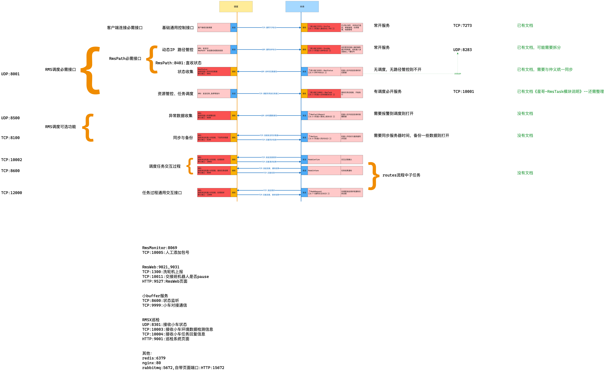

# 机器人协议

| 文件名称 | 机器人协议      |
| ---- | ---------- |
| 部门   | 软件算法部      |
| 版本   | 1.0        |
| 密级   | 保密（部门内部公开） |

## 修改记录

| 版本号 | 修改日期       | 修改人  | 概述           | 详细说明         |
| --- | ---------- | ---- | ------------ | ------------ |
| 1.0 | 2025-06-12 | Gary | 机器人当前所有协议的罗列 | 描述当前机器人的所有协议 |

---

## 一、概述

机器人目前协议以TCP和UDP为主，HTTP协议正在逐步增加中，目前已有：
1. [机器人通信协议(TCP)](./1机器人通信协议): 已经是第四版，很多项目都依赖于该协议，包括JunionManger，通过该协议可以完全控制机器人
2. [机器人UDP协议](./2机器人UDP协议): 用于向机器人广播/单播消息，如发送调度服务器的IP地址，向机器人发送路径
3. [机器人任务调度协议(TCP)](./3机器人任务调度协议(TCP)): 主要用于调度系统给机器人下发任务，虽然《机器人通信协议》也可以发任务，但是相对该协议略显复杂，而且针对性不强。
4. 机器人UDP状态协议：用于机器人向外广播/单播自己的实时状态数据
5. 机器人错误上报协议
6. 机器人同步协议
7. [通用TCP交互协议](./7通用TCP交互协议): 用于机器人在任务过程中与调度系统的交互过程。

所有的协议如下图所示：

