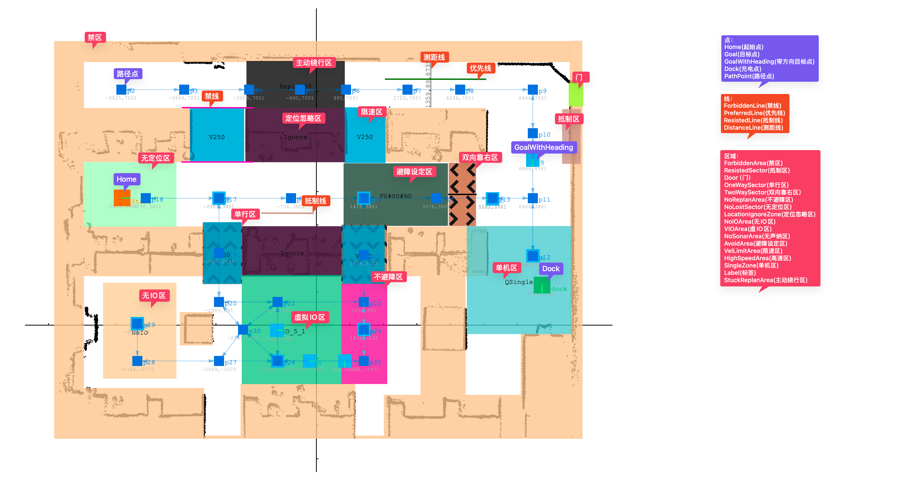

# 地图

| 文件名称 | 地图             |
| -------- | -------------------- |
| 部门     | 软件算法部           |
| 版本     | 3.0                  |
| 密级     | 保密（部门内部公开） |

## 修改记录

| 版本号 | 修改日期   | 修改人      | 概述      | 详细说明              |
| ------ | ---------- | ----------- | --------- | --------------------- |
| 1.0    | 2025-06-11 | Gary        | 地图说明概述  | 地图说明文档总览          |

---

## 一、概述

地图从第一版json地图开始，经历过两次改变，现在已经是第三版。
目前地图总体来说，分为三层：

- 第一层：底图，为定位地图，由机器人SLAM算法扫描周围环境自动创建出的地图，主要是记录创建出来的障碍物点，该层地图数据量较大，以后会考虑单独出来一个文件
- 第二层：规划地图，由人工在第一层地图的基础上，增加目标点、节点、禁区、功能区域等二维几何图形，用于机器人本体或路径调度规划路线
- 第三层：展示地图，与第二层类似，由人工在底图基础上，增加设备、通道信息等二维几何图形，用于调度系统的大屏展示

示例：[第二层地图J7.json](./samples/J7.json)

示例：第三层地图:[底图ZW3.json](./samples/ZW3.json) [第三层ZW3-3.json](./samples/ZW3-3.json)

## 二、地图格式

第一版地图格式[初版地图](./1初版地图)
第二版地图格式[第二版地图](./2第二版地图)
第三版地图格式[新地图格式说明](./3新地图格式说明) 和 [第三层地图](./4第三层地图)

## 三、地图同步机制

见文档[地图同步机制](./5地图同步机制)

## 四、地图前端显示接口
[单机Web地图](./单机Web地图接口)
[智能模拟地图](./智能模拟地图)

## 五、显示地图的相关界面

目前需要展示地图的界面除了地图编辑，本体大屏外有以下情形:

1. 调度大屏/看板

2. webeye

3. 单机web

4. 模拟器

