# 3D雷达上位机软件
| 文件名称 | 3D雷达上位机软件 |
| -------- | --------------- |
| 部门     | 软件算法部/单机组   |
| 版本     | 2.0             |
| 密级     | 内部公开             |

## 修改记录
| 版本号  | 修改日期     | 修改人 | 概述                  | 详细说明                |
| ------ | ---------- | ------ | ------------------  | -------------------- |
| 1.0    | 2025-07-21 | 王浩岚   | Word 版说明         | 软件基础功能说明     |
| 2.0    | 2026-04-14 | 王春晓   | 改为 markdown 格式  | 添加新增功能说明        |

## 一、概述 & 约束
本手册用于指导用户实现2D、3D雷达数据的可视化，以及雷达配置操作。

### 运行要求
- 操作系统：Windows 10 / 11（64位）
- CPU：Intel i5 以上
- 内存：8 GB 以上

### 软件运行
解压软件包后，找到DeepCloud.exe 双击运行。

### 特别说明
目前3D上位机软件仅供雷达研发部门进行研发测试，参数配置等（即所有已支持功能全部开放）。

## 二、功能模块介绍

### 2.1 主界面
顶部为菜单栏，包括`文件` `调试` `工具` `测试` `帮助`。
第一行快捷工具栏，以点云可视化配套小工具的快捷按钮和设置按钮为主。
第二行快捷工具栏，为点云数据可视控制按钮。
主页面分为2列，左侧边栏为显示状态值，设备列表，文件列表，右侧为点云可视化窗口，分别显示距离点云值和脉宽值。

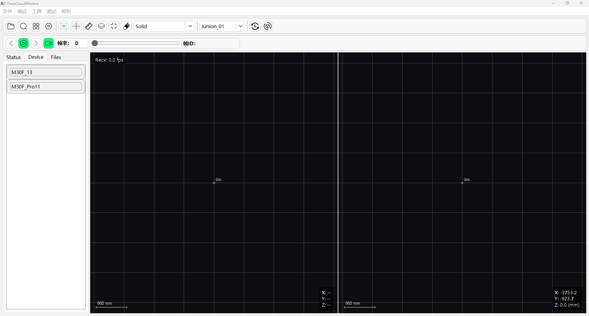

### 2.2 菜单栏  

#### 2.2.1 文件菜单

涵盖数据文件读取，保存等
- Open：打开文件夹，选择数据文件
- Save
- Exit

#### 2.2.2 调试菜单
- `点对点连接`弹窗： 提供单雷达设备指定IP,Port参数进行设备连接，绕过传统通过UDP广播搜索设备途径。
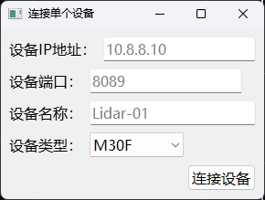
- `内部参数设置`弹窗： 提供给研发人员进行雷达内部参数设置页面，包含探测器参数，探测器转换公式参数，电机启动停止开关。
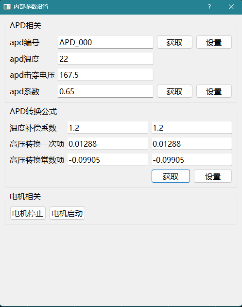
- `标定建模`弹窗：可以独立进行指定设备类型进行批量标定建模，输入数据文件所在根路径，输出标定表。
- `数据采集`弹窗：支持可选指令的定时采集和定量采集模式，默认以字节流数据存入txt文件。
- `温标数据采集`弹窗：支持高低温采样数据采集。

#### 2.2.3 工具菜单
- `视图设置`弹窗：用于设置网格，全局偏移量等视图控制参数。
- `网络配置`弹窗：用于设置雷达设备的网络参数。
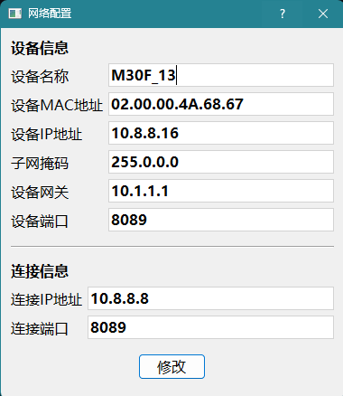
- `固件升级`弹窗：用于雷达设备的固件升级。
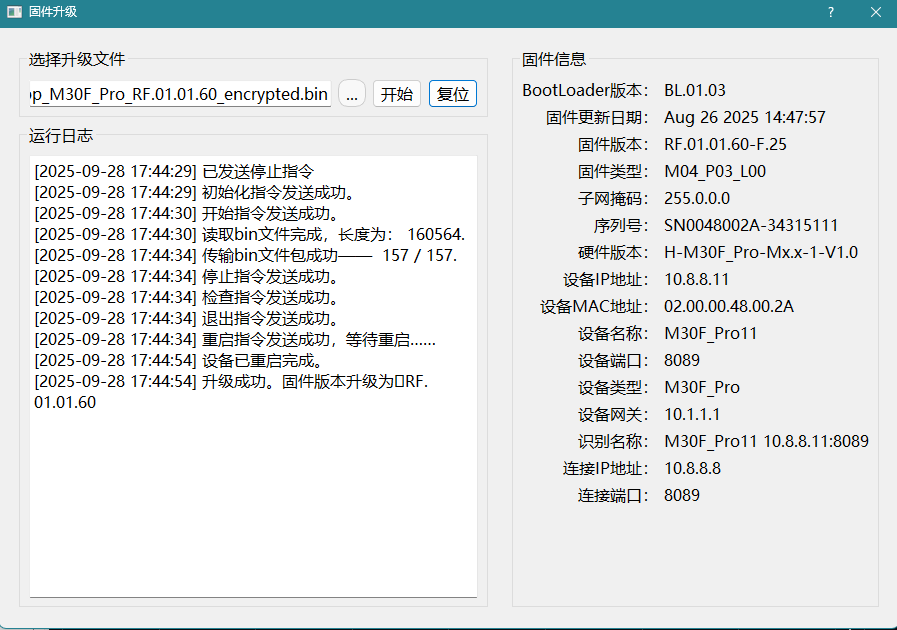
- `指令终端`弹窗：用于研发调试的自定义指令的发送和接收，以及字节文件的发送。
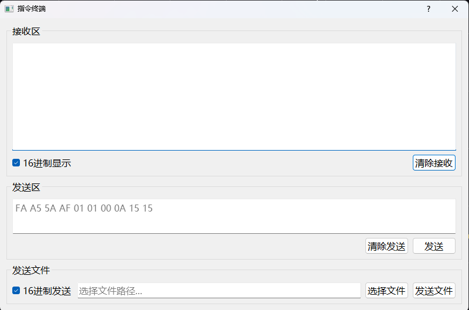
- `设备参数设置`弹窗：用于设置雷达运行参数。
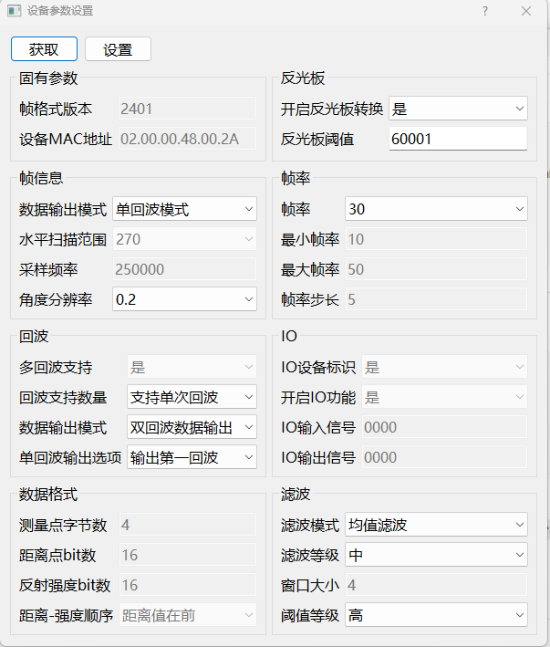

#### 2.2.4 测试菜单
- `均值统计`窗口
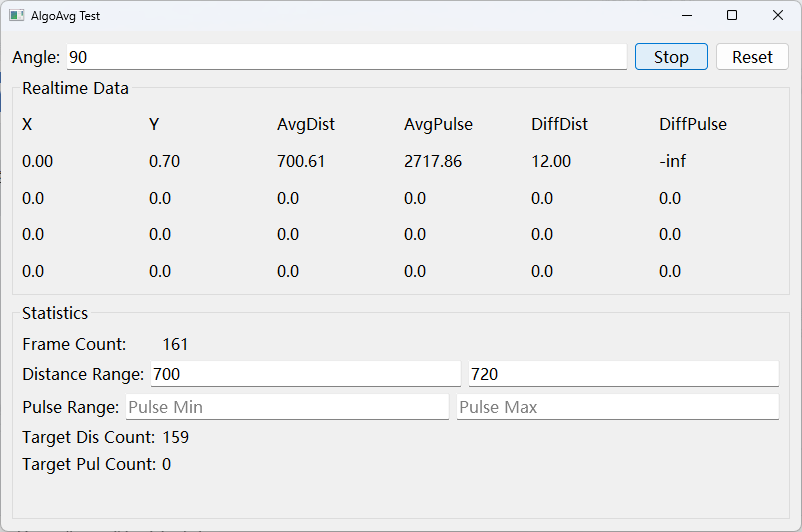
>均值统计窗口中，输入指定角度，点击start，在点云实时刷新的同时，测试页面会统计该角度下各回波的X，Y，距离均值，脉宽均值，距离差值，脉宽差值。同时若输入距离值范围或脉宽值范围，则会统计在此范围内的计数值。
- `点集`窗口
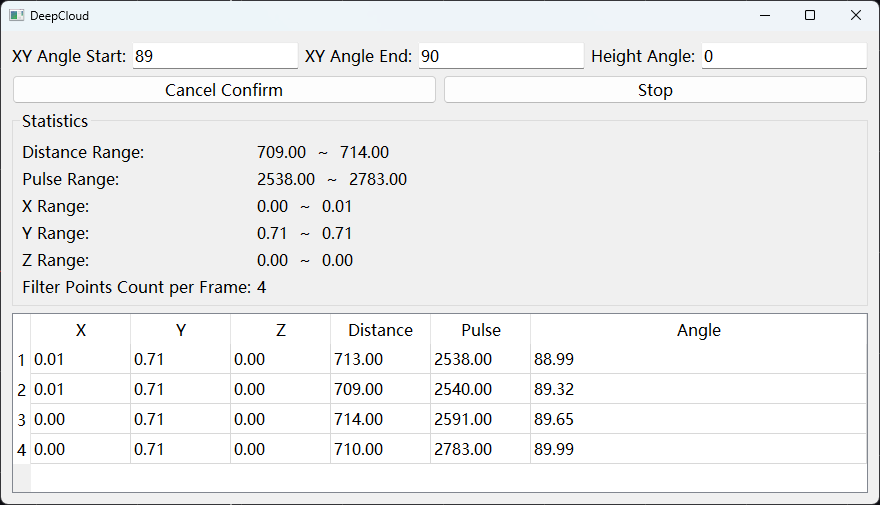

#### 2.2.5 帮助菜单
- `关于`：用于说明当前软件的Copyright。
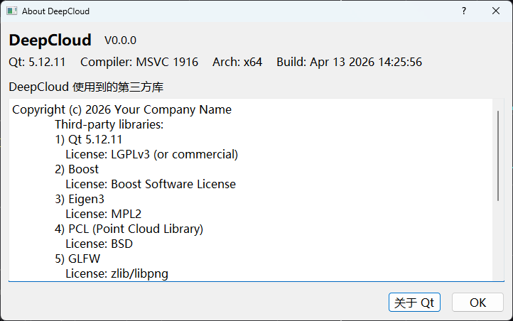
- `更新日志`：用来提示当前版本更新的内容。
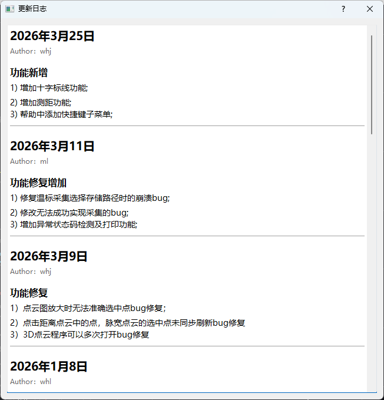
- `常用快捷键`：当前用来提示视图各个工具的快捷键组合。  
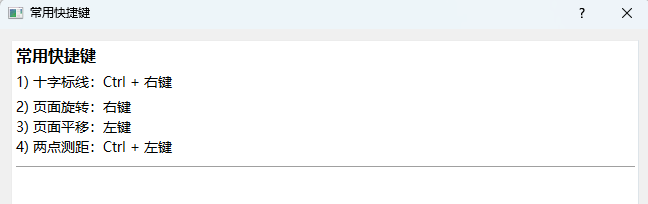

### 2.3 快捷工具栏
| 图标 | 说明 |  用途                    |
| -------- | --------------- |-------- | 
|     | 加载数据文件  | 用于选择txt文件来进行读取播放，支持5X和Junion01协议。 |
|     | 广播搜索设备  | 用于搜索当前连接的所有网口设备。                   |
|     | 视图设置     | 用于设置网格，偏移量，开启点算法和时间轴设置。          |
|  | 运行参数设置  | 点击选中后，弹出参数设置窗口。                |
|       | 高亮点坐标   | 点击选中后，在图像中点击鼠标左键查看坐标。       |
|   | 2D十字标线   | 点击选中后，Ctrl+鼠标右键，可以在XY面画一个以鼠标点位置为中心的十字直线，并显示十字中心坐标。|
|        | 2D测距       | 点击选中后，Ctrl+鼠标左键，可以在点云上选择一个点，再选择另一个点，左上角会显示两点的Distance距离值。|
|     | 图像叠加     | 点击选中后，图像中的点云图像叠加显示。|
|     | 重置视图    | 当前若进行3D旋转后，可一键恢复XY视角。|
|     | 拖尾算法启用 | 点击选中后，监控显示数据经过拖尾算法处理后的图像。|
|     | PTP同步启用 | 点击选中后，开启软件PTP时钟同步消息。|

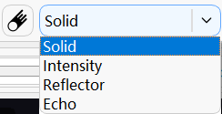 

>在不启用拖尾过滤时，下拉框显示图像配色方案，包括
>- Solid：固定颜色(距离值默认绿色，脉宽值默认黄色)；
>- Intensity：按反射率映射彩虹颜色(反射率高为红色，反射率低为蓝色)；
>- Refector：区分反光板颜色（反光板点为红色，其他点为绿色）；
>- Echo：按回波数区分颜色（第一回波为绿色，第二回波为橙色，其他为紫色）；

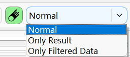 

>在启用拖尾过滤时，下拉框显示数据源
>- Normal:点云全部显示，拖尾点另用紫色表示；
>- Only Result：仅显示过滤后的数据；
>- Only Filtered Data：仅显示判定为拖尾点的数据，另脉宽图不变；

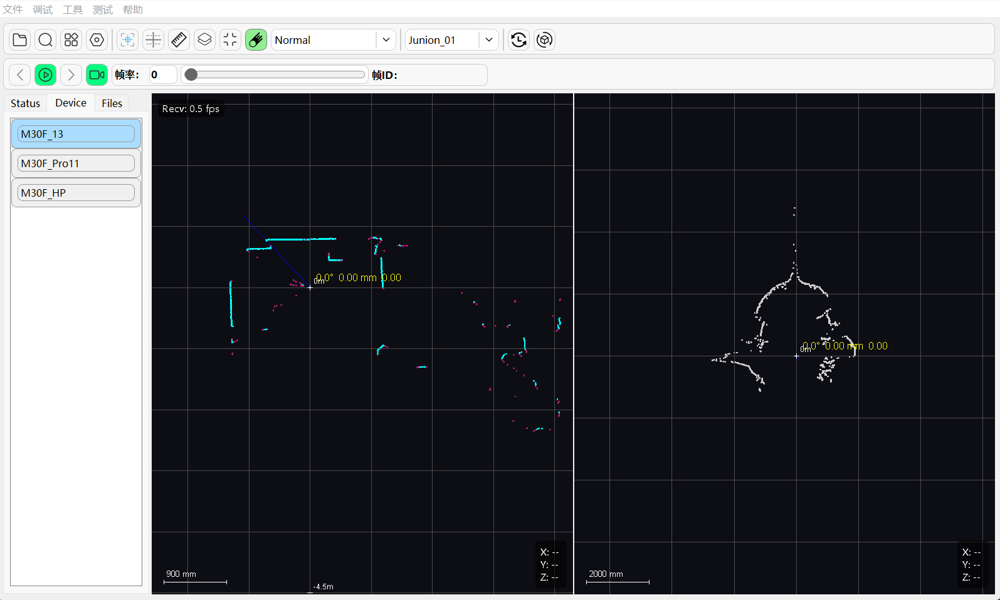 

 数据指令选择下拉框，当前支持Junion01,Test_56H,Test_57H,Test_58H
>【特别说明】仅在Junion01下拖尾算法才能启用。  

### 2.4 点云控制工具栏

| 图标      | 说明            | 用途    |
| -------- | --------------- |-------- | 
|     | 上一帧  | 在读取文件后，在播放暂停时可以点击，数据界面会切换至相应数据，而帧id也会跟着切换。 |
|     | 播放  | 1）在加载并选择文件后，点击播放按钮，可播放数据文件，帧率默认为数据文件状态信息中的帧率(可修改)；滚动条和帧id会跟随实时变化。    2）在搜索并选择设备后，点击播放按钮，可查看实时点云图像； |
|     | 暂停     | 暂停点云图像。          |
|  | 下一帧  | 在读取文件后，在播放暂停时可以点击，数据界面会切换至相应数据，而帧id也会跟随切换。 |
|    | 录制  | 在点云实时刷新的同时，将数据以字节流的格式保存在txt文件中。 |

### 2.5 点云监控
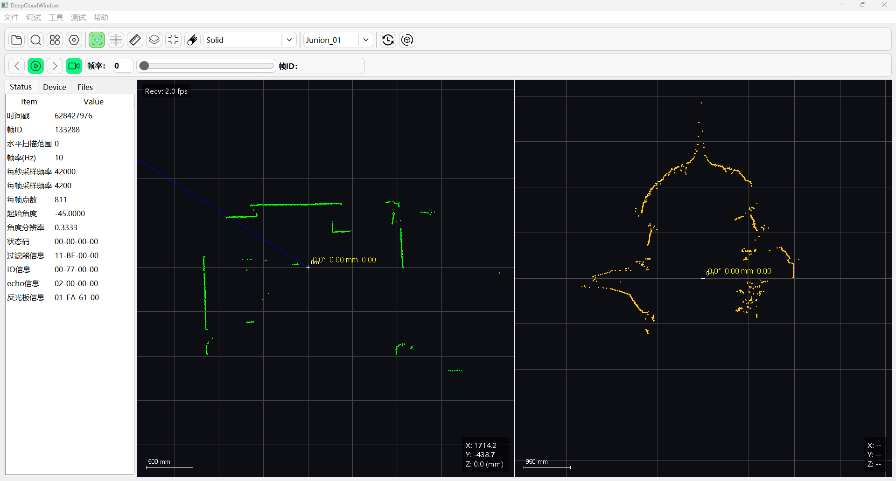
图像监控窗口内，鼠标左键点中拖动为平移图像，鼠标右键点中拖动为旋转图像。
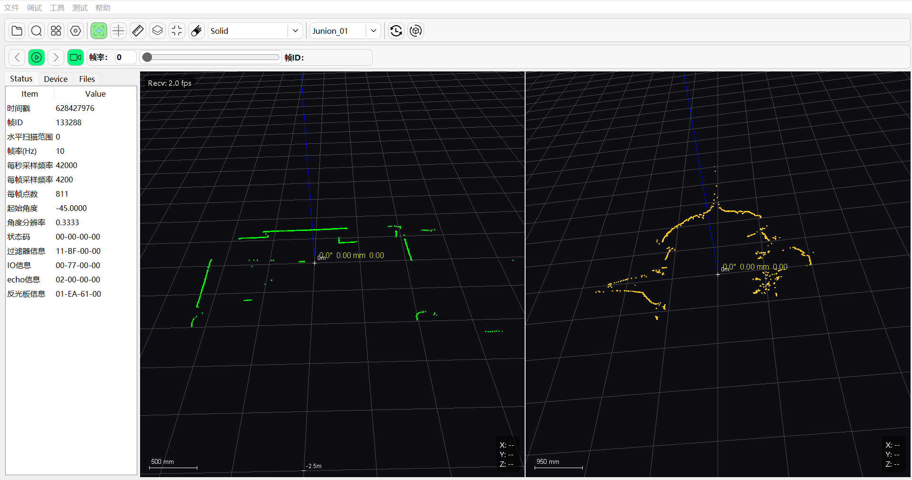

