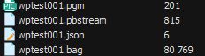

# xManager用户手册

## 前言

本节内容的目的是确保用户通过本手册能够正确使用产品，以避免操作中的危险或财产损失。在使用此产品之前，请认真阅读产品手册并妥善保存以备日后参考。

### 概述

本手册适用于 xManager 地图编辑工具的操作。

本手册指导用户完成地图管理、地图编辑、离线建图、在线建图等操作。

### 使用注意事项

**使用本软件前请对要操作的文件做好相应的备份**。

---

## 软件概述

### 运行要求

该软件运行对电脑性能有一定要求，具体参考以下表格：

| 名称     | 参数                                      | 备注                                                         |
| -------- | ----------------------------------------- | ------------------------------------------------------------ |
| 操作系统 | win10、win11、macOS、Linux(Ubuntu20.04+)  | **win10 上需要先安装随安装包配带的 vc_redist.x64.exe**       |
| 运行内存 | 4G+RAM                                    |                                                              |
| 硬盘     | 20G+                                      |                                                              |
| 显卡     | 无要求                                    |                                                              |
| 语言     | 中文、英文                                |                                                              |
| **解密** | **使用前请联系单机组同事申请解密license** | **请将申请到的license放置到以下目录C:\Program Files\JunionManager** |

### 功能简介

该软件主要是围绕地图文件进行管理和建图等进行操作。

- 地图管理对于地图主要包括地图编辑、拼接、保存、上传、下载、校验等操作。一个完整的操作流程是从加载地图开始，接着编辑地图界面元素，最后保存输出到本地文件并上传至机器人本体的过程。
- 建图主要是通过与 Urobot/Jarvis 配合，驱动机器人本体上的建图工具实现在线、离线建图，并展示到界面中，从而进行地图管理的过程。

### 配置说明

配置文件所在目录为 xManager.exe 的同级目录，以下为具体的配置文件：

- cache/params/settings_map.json 为整个地图软件的核心配置文件。

- cache/Config.ini 保存用户设置的一些参数，然后用这些参数进行启动。

### 其他说明

整个文档中提到的坐标数值对应的单位均为 mm。

---

## 主界面

### 关于界面

- 使用前先检查当前版本是否为最新版本

- 点击软件右上角感叹号即可


### 主界面概述

整个应用上方为菜单栏，包含常用的基本操作。左侧分为两部分：上半部分是相关操作工具，下半部分是界面元素集合。主界面如图3-1 所示。


### 菜单栏概述

菜单栏包含“加载地图”、”添加地图”、“保存地图”、“下载地图”、“上传地图”、”清空地图“、“在线建图”、”离线建图“、”连接机器人“。菜单栏如图3-2 所示。


- 加载地图：可以通过选择本地一张地图文件加载到地图编辑软件中。
- 添加地图：用于地图拼接操作，详细操作见“5.地图拼接”。
- 保存地图：用于保存已经编辑过的地图。
- 下载地图：用于从机器人上下载一张地图到编辑软件，详细操作见“6.2 地图下载”。
- 上传地图：用于从本地上传一张编辑好的地图到机器人中，详细操作见”6.3 地图上传“。
- 清空地图：用于清空正在编辑的地图。（注意：**一旦清空不可测回**）
- 在线建图：详细操作见“8.在线建图”。
- 离线建图：详细操作见“7.离线建图”。
- 连接机器人：详细操作见“6.1 连接机器人”。

### 侧边工具栏概述

1. 侧边工具栏上半部分（如图3-3 所示）

   

   主要涉及一些具体的操作：图层切换、底图旋转、查找定位、隐藏底图、禁用缩放、画笔、橡皮、选择、拖拽。

   以上操作详见“4.地图编辑”。

2. 侧边工具栏下半部分（如图3-4 所示）

   

   主要涉及路标、点、线、区域的展示与添加。具体操作见“4.地图编辑”。

---

## 地图编辑

### 点操作

点的操作支持添加、删除、编辑、拖拽等。


具体操作如下：

1. 点击左侧工具栏中的具体类型的点。

2. 在地图界面中选择合适的位置按下鼠标右键，鼠标松开时地图界面会添加一个新的点。

3. 双击新加的点，会有编辑框弹出，可以编辑点的信息，点击确定可以同步点的信息到内存中。

4. 点添加后需要 **点击菜单栏里的保存** 操作才能持久化保存到地图文件中。

   

5. 其他注意事项：

   - 带方向的点：目标点和充电点时带方向的点，当操作在界面操作时长按拖动鼠标可以自动绘制一个红线，用来标注当前点的角度。

     

   - 路径点：路径点详细见“4.7 针对路径点的补充”。

### 路标操作

路标的操作支持添加、删除、编辑、拖拽等。


具体操作同点的操作。下面说下路标的其他注意事项：

- 带方向的路标：二维码是带方向的路标。

- 更改路标大小：双击路标，弹出编辑框里面支持对路标的宽高设置。

  

- 实时获取路标：详见“6.4 反光板等路标的获取”

### 线段操作

线段的操作支持添加、删除、编辑、拖拽等。


具体操作同点的操作。下面说下线段的其他注意事项：

- 测距线使用：

  1. 测距线上显示文字逗号左边是距离，逗号右边是角度。

  2. 测距线分两种，一种不可持久化的，拖动鼠标绘制测距线，松开鼠标测距线消失；还有一种是松开鼠标测距线会继续保留在界面中。但两种均不会保存输出到地图文件中。

  

- 路径线使用：

  1.路径线分两种，单向路径线和双向路径线。

  2.绘制路径线时会先绘制一条导引线，待鼠标松开后会在线段中等距离填充路径点，目前是两点间默认间隔是 3000mm。

  3.路径线不会保存输出到地图文件中，但上述填充的路径点会保存到地图文件中。

  

### 区域操作

区域的操作支持添加、删除、编辑、拖拽等。


具体操作同点的操作。


### 底图操作

1. 底图画笔：画笔可以用来绘制底图点，新增的底图点会被融合进已有底图中，并在保存时出到地图文件中。（**需要选中图层一下层才会生效，具体见“4.6 其他操作”。**）

   

2. 底图擦除：橡皮是用来擦除底图的，点击橡皮后，可以按住鼠标左键在需要的区域擦除相关底图。（**需要选中图层一下层才会生效，具体见“4.6 其他操作”。**）

   

3. 底图旋转：地图旋转可以直接点击左边旋转按钮，默认旋转 90°；也可以手动输入要旋转的角度，按下 Enter 键会自动将底图旋转到预设角度。（**需要选中图层一下层才会生效，具体见”4.6 其他操作”。**）

   

4. 底图隐藏：选中后会将底图隐藏，只保留上层元素。

   

### 其他操作

1. 图层切换：选中对应图层，当前图层元素被至于最上层，可以进行拖拽、移动、编辑等操作，其他图层变为不可变动状态。目前图层支持以下几种：

   - 整体移动：初次加载地图时默认选中此类型，选中后无论加载了几张图，所有元素均不可单独拖拽、移动、编辑。
   - 图一下层：选中后仅图一底图可以拖拽、移动、编辑。**画笔、橡皮、底图旋转操作需要选中此图层才会生效。**
   - 图一点、路标、线段、区域：选中后对应相关类型的元素会被置顶，其他元素均不可单独拖拽、移动、编辑。
   - 图一整体：如有多图，选中后，主图（第一张加载进来的地图）所有元素包括底图均可拖拽、移动、编辑，第二张加载进来的地图会变为不可单独拖拽、移动、编辑状态。
   - 图二整体：如有多图，选中后同选中图一整体效果相反。

   

2. 路径点查找定位：输入格式必须是 p+数字，如 p31，输入完成按 Enter 键地图中查找到的点会被居中显示。

   

3. 界面元素展示缩放控制：为了提高渲染速度，默认不选中。选中后无论如何缩放地图，界面上所有元素均会展示。

   

4. 界面元素框选批量操作：使用选择，框选一个区域，该区域所有元素均可批量拖拽、移动、删除等。

   

###  撤销和重做

目前支持界面元素移动、删除等操作的撤销和重做操作，点击相关按钮即可实现。


### 地图检测

目前已集成部分地图检测功能，具体见图示：


###  补充

#### 路径点相关编辑配置

1. 以下是双击路径点打开的路径点编辑框，如图所示：

   

2. 地图文件中路径点的数据结构解释

   以下是截取的地图文件中的一段关于路径点的数据：

   ```json
   {
     "bezier": "0 900 0 900 0 900 0 900",
     "connections": [
       {
         "cost": 1,
         "name": "p5",
         "posture": "O:O:O",
         "type": 1,
         "x1": 0,
         "x2": 0,
         "y1": 900,
         "y2": 900
       },
       {
         "cost": 1,
         "name": "p6",
         "posture": "O:O:O",
         "type": 1,
         "x1": 0,
         "x2": 0,
         "y1": 900,
         "y2": 900
       },
       {
         "cost": 1,
         "name": "p11",
         "posture": "O:O:B",
         "type": 0
       }
     ],
     "costs": [1, 1, 1],
     "name": "p10",
     "pose": "14900 6800 0",
     "postures": "O:O:O O:O:O O:O:B",
     "vertex": "p5 p6 p11"
   }
   ```

   - name：当前路径点的名称，如“p10”。
   - pose：当前路径点的坐标信息，对应 x y theta。
   - postures：当前机器人位姿，花篮车、舵轮车、叉车三种车型对应默认“O: O: O O: O: O O: O: O”(大写字母 O)。
   - bezier：贝塞尔曲线参数，“0 900”对应“p5”点绑定的贝塞尔曲线的参数，其他依次类推，其中如数字 900 为 p5 点与当前 p10 点间的相对距离。
   - costs：代价参数，同上与连接点一一对应。
   - vertex：与当前路径点连接的点，空格隔开。

   `注意`：新版地图下新加了 connections 字段，使用 xManager 编辑地图上路径点后会添加相应字段并在保存时输出到 connections 中，**实际上就是对外围上述的 bezier、postures、costs、vertex 字段做了拆分和模块化处理**。每个对象里的字段解析如下：

   - name：与当前路径点连接的点的名称。
   - cost：与当前路径点连接的点的代价。
   - posture：与当前路径点连接的点的机器人位姿。
   - type：与当前路径点连接的点的类型。
   - x1, y1, x2, y2：与当前路径点连接的点的贝塞尔参数。

3. 路径点编辑弹窗说明

   当前点配置

   

   - 启用绑定：点击启用绑定后可以配置绑定点信息，具体操作见接下来的“绑定点配置”小节。

   - 启用目标点：点击启用目标点后可以配置目标点信息，用于有路径点需要左右配置目标点协作处理 PathServer 路径规划时使用。

     

   - 启用 lifthouse：点击后路径点保存后会输出 lifthouse 字段到地图文件中。

   - 启用角度：默认路径点不带角度，特殊情况为配合 PathServer 路径规划时点击此参数，暴露路径点角度编辑框，**填 0 或空时会认为不启用角度功能**。

     

   连接点配置

   - 更改类型：共有三种类型：

     

     | 类型     | 释义                                                             |
     | -------- | ---------------------------------------------------------------- |
     | LINE     | 对应的 p10 和 p5 之间连线为直线段，对应地图文件中 type 0         |
     | BEZIER   | 对应的 p10 和 p5 之间连线为贝塞尔曲线，，对应地图文件中 type 0   |
     | RELCOATE | 对应的 p10 和 p5 之间连线为虚拟重定位线，，对应地图文件中 type 1 |

   - 设置 cost：点击上下按钮修改 cost 值。

     

   - 设置机器人姿态：三种车型花篮车、舵轮车、叉车，对应默认值“O: O: O O: O: O O: O: O”(大写字母 O)。

     

   - 设置贝塞尔曲线参数：连接点是贝塞尔类型的才有这个参数。

     

   - 设置转盘参数：点击启用转盘会弹出转盘配置信息，转盘信息线阶段会拼接到 posture 字段里，如“O: O: O: K90”。

     

   绑定点配置

   - 设置类型：不同绑定点拥有不一样的编辑格式，PathServer 路径规划时会使用到。

     

#### 如何新增自定义的区域？

1. 地图文件中区域的数据结构解析

   以下是截取的地图文件中的一段关于区域的数据：

   ```json
   {
     "ForbiddenArea": [
       {
         "name": "禁区1",
         "points": "11014.5 7108.55 16704.5 8218.55",
         "pose": "13859.5 7663.55 -11.0379"
       }
     ]
   }
   ```

   - name:
   - points：
   - pose:

2. 自定义区域添加流程，以添加“激光角度调整区”为例：

   - 找到 xManager.exe 文件同级目录下的 cache/params/settings_map.json 文件。

   - 编辑并填入以下内容：

     ```json
     {
       "map_regions": [
         {
           "chn": "激光角度收缩区",
           "color": "#ee6510",
           "id": "LaserShrinkArea",
           "ext": [
             {
               "name": "left_laser_left_limit",
               "type": "int"
             },
             {
               "name": "left_laser_right_limit",
               "type": "int"
             },
             {
               "name": "right_laser_left_limit",
               "type": "int"
             },
             {
               "name": "right_laser_right_limit",
               "type": "int"
             },
             {
               "name": "left_laser_left_limit",
               "type": "int"
             }
           ]
         }
       ]
     }
     ```

     | 键值  | 释义                                                                                                                              |
     | ----- | --------------------------------------------------------------------------------------------------------------------------------- |
     | chn   | 元素中文名，会用来显示到侧边工具栏里                                                                                              |
     | color | 元素要显示的颜色，会填充到加载的地图界面中                                                                                        |
     | id    | 元素 id，用于区分元素类型                                                                                                         |
     | ext   | 默认没有，需要为元素添加扩展参数时增加刺字段，然后对应填入要展示的参数的名称和数据类型，目前数据类型支持 string, int, double 三种 |

   - 重启地图编辑软件，会看到侧边栏区域处多了一个激光角度收缩区。

   - 重新加载地图，可以在地图上绘制激光角度收缩区，如下图所示，ext 中的参数会默认加载到界面中，当点击保存后也会输出到地图文件对应的对象节点下。

     

---

## 地图拼接

- 添加多张地图

  目前仅支持两张地图拼接。加载完第一张地图作为主图后，可以点击菜单栏添加地图（**注意不是加载地图**）添加第二张地图，第二张地图只会加载底图进来，效果如下图：


- 多张地图下的图层操作

  目前仅支持两张地图拼接。第二张地图添加进来后可以将图层切换到“图2 整体”，这样就可以对其做拖拽、移动、旋转、删除等操作。具体效果如下图所示：


- 多张地图下的保存逻辑

  目前仅支持两张地图拼接。地图拼接好，点击保存会将第二张地图的 ObsPoint 融合进第一张地图的文件中，一旦拼接完再次加载进来就是一整张新的地图了。

---

## 设备连接

### 连接机器人

- 点击菜单栏连接机器人，弹出机器人连接信息配置弹窗，配置完毕后可以连上机器人。

- 机器人连接后会自动将机器人本体存储的地图文件下载到本地。

- 如果需要断开连接，点击断开连接即可。具体效果见下图：


### 地图下载

点击菜单栏上下载地图，会弹出机器人连接信息配置界面，界面中端口要填入 22 才能建立 SFTP 通道将机器人本地上的地图下载到本地。具体效果见下图：


### 地图上传

点击菜单栏上上传地图，会弹出机器人连接信息配置界面，点击上传会将事先存储在 cache/maps 下的地图文件上传到机器人本体中。

### 反光板等路标获取

- 连上小车后，在配置了可以获取反光板的机器人中可以实时展示反光板等路标的信息。效果见下图所示：

- 此时反光板的位置可能因为视觉检测反馈的信息不同而产生位置变更，如果确定此处有反光板，可以静候位置稳定后右击鼠标点击保存，则当前反光板就被保存到内存中。

- 如果删除保存的反光板，可以再次右击鼠标，点击取消保存即可。

  

  

---

## 离线建图

离线建图参考了之前的建图小工具 MapCreate.exe，现在将其所有内容移植到地图编辑软件里，同时支持建图完成后直接展示建好的地图这一功能。

- 概览如下：

  

  - 具体操作如下：

    1. 将笔记本和机器人通过网线连线（防止断网，尽量避免使用无线），并配置好 IP 地址。

    2. 按照顺序依次操作：(**“Port”不需要修改**)1 框处输入机器人 IP；点击 2 框处连接机器人；点击 3 框处开启建图功能；4 框处输入构建地图名称；点击 5 框前的 **保存路径**，选择需要保存地图的路径，路径会显示在 5 框中 **\*\*(实际文件保存在 params/map 下)\*\***；等待机器建图服务启动成功（**点击 "启动建图" 后，等 2 到 3 分钟**），点击框 6 开始收录数据。

    3. 勾选 "**手动 " **，通过键盘控制机器人进行扫图（参照 [L-SLAM 地图构建操作手册](https://p10j68f02n.feishu.cn/docx/Qbwfd2KEmolbZ0xxMO6cjNIrnGh?from=from_copylink) 规划合理路线），完成扫图后点击停止收录数据，点击开始在线建图。

    4. 如下图所示，直到框中显示“**build map success**”，则表示建图完成。（建图时间和场景大小相关，场景越大需要的建图时间越长）

    5. 建图完成后，点击关闭建图，机器人自动恢复初始状态。

    6. 现场详细操作及异常处理参照下图：
    
       

---


## 增量建图

日常建图时可能会遇到想在原来已有的图上扩展区域，可以考虑使用增量建图来实现。

1. 前提：已经有的地图文件（包含xx.json、xx.pbtream等），如果没有需要先按第7节执行离线建图生成以上文件。

   

2. **增量建图需要用到离线建图保留下来的xx.json和xx.pbstream，**二者需要保持同步，所以离线建图后原始的这两个文件不要做更改，需要编辑更改xx.json请重命名新保存的文件。

3. **增量建图需要用到当前机器人的位置信息**，**需要先切换机器人地图至上述xx.json,并进行一次重定位以获取机器人在xx.json中的位姿**，使用前需要先点击菜单栏连接机器人，配置连接信息，机器人连接成功后，再断开连接，此时不要移动小车，待程序保存当前机器人最新位置后方可进行后续操作。

4. 上述两步操作完成后方可进行增量建图操作，点击菜单栏增量建图，配置建图服务连接参数，点击开始建图，小车内的build_map_server会将urobot停掉，然后启动mapping建图程序。

5. 输入已经有的地图的名称，如上图中wptest001，**不需要类型后缀**，然后点击开始建图即可，此后可以移动小车进行建图数据更新。

   

6. 点击结束建图小车“/usr/local/urobot/params/map/”文件夹中会生成“wptest001_ext.json”和“wptest001_ext.pbstream”文件，即增量建图后的地图文件，并且会自动加载显示到程序界面中。

   

   ---


## 在线建图

具体操作如下：

1. 先点击菜单栏连接机器人，配置连接信息，待机器人连接成功后方可进行后续操作。

2. 点击菜单栏在线建图，会触发机器人本体建图程序运行，等待建图程序建图完成后，会将建好的图的一帧数据转成 jpg 传递到地图编辑程序中，展示到界面上。

3. 点击菜单栏结束建图，会通知机器人本体建图程序结束运行并生成相应的地图文件，地图编辑软件会将该文件下载到本地，加载展示到界面中。具体效果可见下图所示:

   

---

## 第三层地图

### 第三层地图说明

关于第三层地图的详细说明请移步相关网址：

[第三层地图说明]: http://10.0.1.113:3000/zh/%E5%8D%95%E6%9C%BA/%E5%9C%B0%E5%9B%BE/4%E7%AC%AC%E4%B8%89%E5%B1%82%E5%9C%B0%E5%9B%BE


### 第三层地图的操作

目前已在侧边栏集成第三层地图部分模型


第三层地图还支持自定义多边形、自定义线、自定义区域操作，绘制完相关元素后可以编辑分层及名称保存为固定模型

- 下图为自定义多边形效果


- 下图为自定义区域效果


- 下图为自定义线段效果


### 地图保存

目前为兼容第三层地图和之前地图保存时会生成三个文件：原地图+时间戳、第三层地图、地图模型文件


