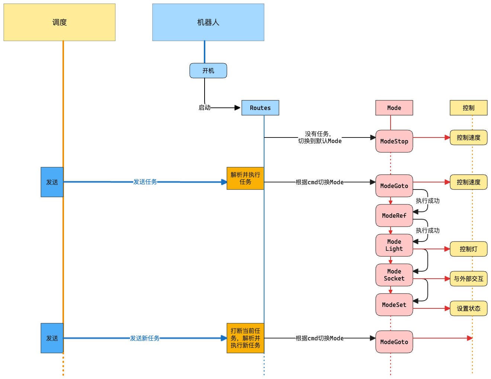
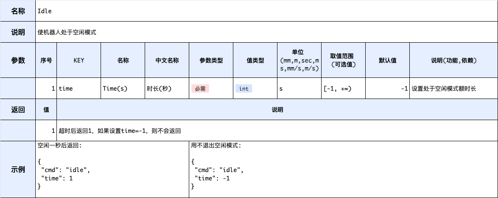
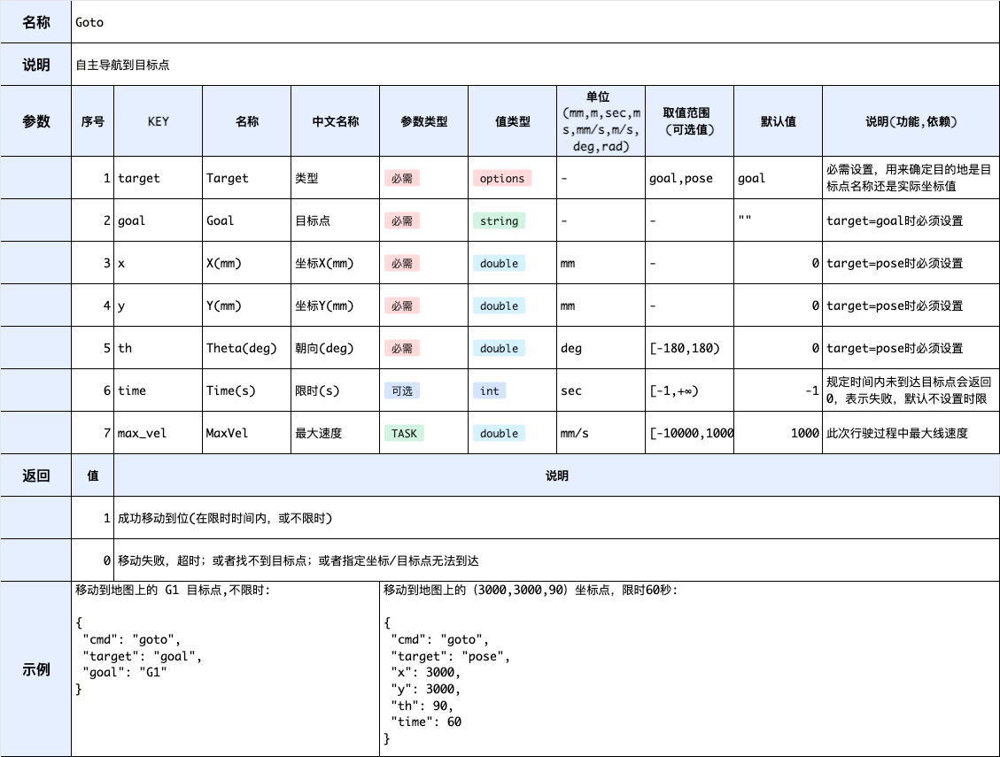

# 机器人任务机制及 Mode 说明

| 文件名称 | 机器人任务机制及 Mode 说明 |
| -------- | -------------------------- |
| 部门     | 软件算法部                 |
| 版本     | 2.0                        |
| 密级     | 保密(部门内公开)                       |

## 修改记录

| 版本号 | 修改日期   | 修改人 | 概述                      |
| ------ | ---------- | ------ | ------------------------- |
| 1.0    | 2025-06-24 | 沈晓   | 初版                      |
| 2.0    | 2025-07-07 | Gary   | 修改格式,任务执行机制说明 |

---

## 一、概述

该文档用于描述机器人任务执行机制、routes 编写规则以及机器人支持的所有任务模式。任务模式分为以下四大类:

-   静止类: 该类型任务模式机器人执行过程中始终停留在原地，没有安全方面的问题，是最简单的任务，一般用于表示机器人空闲、等待、任务完成；
-   交互类: 该类型任务执行过程中机器人停留在原地，没有安全方面的问题，但是会与外部设备、调度进行通信；
-   对接类: 该类型任务执行过程中机器人会有小范围移动，一般用于简单移动、二次对接，对于避障范围的定制化比较多；
-   导航类: 该类型任务主要用于机器人从某个位置移动到另一个位置，或执行充电任务，也需要对避障范围进行定制。

## 二、任务执行机制

如上所示，机器人内部有自己的任务执行机制，分为三层，Routes,Mode 和控制:

-   Routes 为机器人任务接收处理端,负责调度 Mode 完成任务以及 Mode 的切换工作，保证机器人从开机开始，始终有且仅有一个 Mode 在运行，即机器人始终处于某一个任务模式(Mode)中。开机时，没有接收到任务任务，Routes 使机器人进入到默认的工作模式 ModeStop，此时机器人状态是 stopped；当接收到外部任务时，Routes 根据外部发送的内容，依据 cmd 指令寻找对应的 Mode，进入到对应的工作模式下机器人就会根据参数发出相应的控制指令；
-   Mode 为机器人任务执行的最小单元，也可以称为工作模式，进入到该工作模式中后，根据传入的参数，机器人会执行相应的指令来达到完成任务的目的，如控制机器人速度，控制机器人的灯、声音，与外部通信交互等等。机器人从开机后，就会进入到某个 Mode 中，ModeStop 是默认工作模式，没有任务、任务跳转找不到下一个任务、任务执行结束都会进入到默认工作模式；
-   控制层是机器人指令控制层，包含内部最直接的指令控制。

## 三、routes 编写

## 四、mode

### 1.静止类

#### 1) Stop

#### 2) Idle

#### 3) Wait

#### 4) Set

### 2.交互类

#### 1) Socket

### 3.对接类

#### 1) Head

#### 2) Move

### 4.导航类

#### 1) Goto

#### 2) RmsGoto

#### 3) Dock
