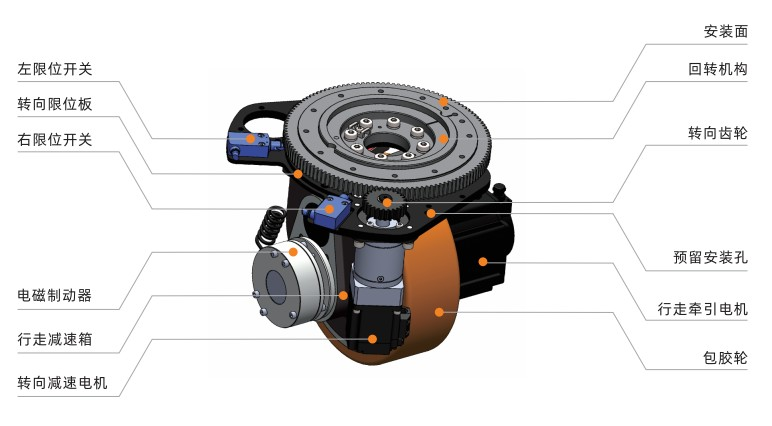

# flex如何选择合适的驱控方案

# 1.如何选择合适的舵轮模组

### 1.1 舵轮模组组成

| 序号 | 零件名称           | 作用                                                         | 备注               |
| ---- | ------------------ | ------------------------------------------------------------ | ------------------ |
| 1    | 限位开关（传感器） | 用于舵轮左右转动角度极限检测                                 | 非必须部件，选配件 |
| 2    | 转向限位板         | 安装在回转机构外圈，用于触发限位开关                         |                    |
| 3    | 电磁制动器         | 行走牵引电机的刹车                                           |                    |
| 4    | 行走减速箱         | 降速同时提高输出扭矩                                         |                    |
| 5    | 转向减速机+电机    | 为舵轮转向提供动力                                           |                    |
| 6    | 回转机构           | 将车体的负载传递到舵轮上，同时能保证车体和舵轮的相对转动，它由内圈、外圈、滚动体等构成 |                    |
| 7    | 转向齿轮           | 转向电机减速机输出的扭矩通过转向齿轮传递到回转机构外圈       |                    |
| 8    | 行走牵引电机       | 舵轮前进后退、加减速的动力来源                               |                    |
| 9    | 包胶轮             | 舵轮直接与地面接触部分                                       | 属于易损件         |

### 1.2 行走电机扭矩及功率

计算行走电机前，需要确认以下整车参数，以Flex300车型为例

| 序号 | 参数           | 数值         | 备注     |
| ---- | -------------- | ------------ | -------- |
| 1    | 额定负载       | 300kg        |          |
| 2    | 自重           | 180kg        |          |
| 3    | 额定速度       | 0.445m/s     |          |
| 4    | 最大爬坡角度   | α =3 °       |          |
| 5    | 加速度         | a =/s²       |          |
| 6    | 舵轮模组数量   | T = 2组      |          |
| 7    | 驱动轮半径     | r = 0.0425 m |          |
| 8    | 行走减速机速比 | 8            |          |
| 9    | 滚动摩擦系数   | u =          | 经验参数 |
| 10   | 传动效率       | η = 0.8~0.9  | 经验值   |

在坡道启动时所需要的扭矩是最大的，可根据下列经验公式计算得出。

单轮斜坡启动扭矩 = [（总质量 * 9.8 * u * cosα + 总质量 * a +总质量 * 9.8 * sinα）* r ] / (T * η)

### 1.3 行走电机编码器选型

​         一般伺服电机可选增量式和绝对值式两种编码器类型，行走电机只需要选配增量式编码器即可，对于编码器线数无具体要求。编码器线数会影响机器人绝对精度，绝对精度一般指的是硬件参数计算出来的误差，例如一个轮子半径为 100mm 的全向机器人，行走电机编码器抖动精度是 10cnt 脉冲，编码器精度是 50000 线，那这个轮子的行走误差是 2 × 3.14 × 100 ｍｍ × 10 ／50000 ＝0.0426 ｍｍ 。所以一般 1000 线以上的编码器可完全满足使用精度要求。

### 1.4 包胶轮负载及硬度选择

​        选择合理的包胶轮的硬度，对移动机器人运行过程中的震动、打滑、到位精度、耐磨程度都有着重要影响，根据积累的经验数据，聚氨酯包胶轮的 Shore A 硬度在 75-85 范围内能获得较好综合性能。

### 1.5 转向部分配置确认

​        舵轮转向部分一般也采用伺服电机配合减速机，实现降速增加扭矩。电机功率选型需要结合转向最大减速比（减速机速比*(大齿轮齿数/小齿轮齿数)）。目前舵轮的选项在确认行走电机功率后，供应商会自行配置对应功率、扭矩的转向电机和减速装置，目前确认可参考以下的经验选型表

| 单轮负载     | ≤ 500 kg | ≤ 1000 kg | ≤ 1500 kg |
| ------------ | -------- | --------- | --------- |
| 转向电机功率 | ≤ 0.1 kw | ≤ 0.2 kw  | ≤ 0.4 kw  |
| 最大减速比   | 250 ≥    | 250 ≥     | 250 ≥     |

转向部分需要重点关注伺服电机编码器选型，目前主流的两种配置如下：

a）选用绝对值编码器的伺服电机，无需配置左右限位开关，每次上电开机，舵轮通过电机自身绝对值编码器实现找零动作；

b）选用增量式编码器的伺服电机，配置左右限位开关，每次上电开机，舵轮会固定沿着某一方向转动，当限位开关被触发时，转向电机停止转动，舵轮实现找零动作。