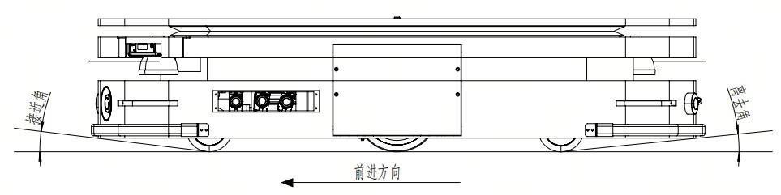
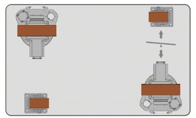
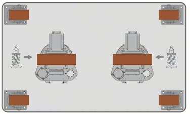
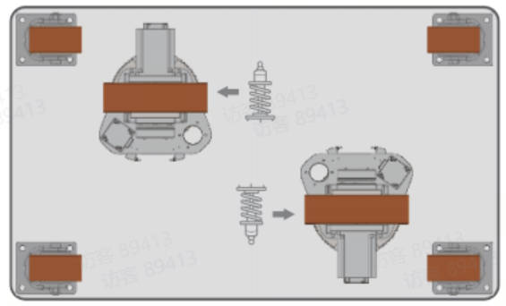
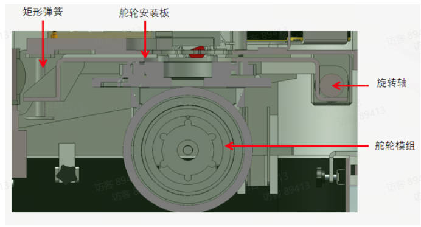
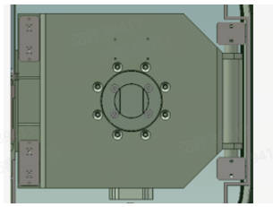

# flex机械设计建议

## 1.车体机械设计注意点

### 1.1 整车车体设计

#### 1.1.1 车体离去与接近角

​        接近角和离去角是衡量车体通过性的重要指标，当车体工作环境中有坡道场景时，设计车体必须考虑车体的离去和接近角度，否则会造成车体在爬坡和下坡时蹭底，导致车体结构受损。在计算接近角和离去角时需要注意以下两点：车体满载运行时，车体底部是否会相对地面产生下降；万向轮由于存在偏心距离，如果车体最前侧为万向轮，在前进时计算接近角需要考虑万向轮的偏心距离。

#### 1.1.2 可维护性设计

1. 产品的配置应根据其故障率的高低、维修的难易、尺寸和质量的大小以及安装特点等统筹安排，凡需要维修的零件部件，都应具有良好的可达性；对故障率高而又需要经常维修的部位及应急开关，应提供最佳的可达性。
2. 产品特别是易损件、常拆件和附加设备的拆装要简便，拆装时零部件进出的路线最好是直线或平缓的曲线。
3. 产品的检查点、测试点等系统的维护点，都应布置在便于接近的位置上。
4. 需要维修和拆装的产品，其周围要有足够的操作空间。
5. 维修时一般应能看见内部的操作，其通道除了能容纳维修人员的手或臂外，还应留有供观察的适当间隙。

### 1.2 车体吊点设计

1. 常规情况下当车体或其中某个部件重量大于 50 kg ，在设计时需考虑预留吊装孔；
2. 需要考虑吊装孔尺寸与重量匹配关系。
3. 吊点预留时需要考虑车体重心位置，防止在吊装过程中，车体出现很明显倾斜。吊点周围部件需要有足够强度，在吊装过程不会因吊绳的挤压导致零部件变形。

# 2.驱动单元布置

### 2.1 布置方式

常见的双舵轮全向机器人底盘驱动布置方式有以下几种。

### 2.2 舵轮零位布置

车体设计时建议预留舵轮零位参考点，方便后期舵轮零位设定时参照。

# 3.悬挂设计

### 3.1 影响悬挂的相关参数

悬挂设计的优劣会直接影响车体在行走时的地面适应性，悬挂设计时需要从以下因素考虑：弹簧刚度、车体自重、额定负载重量、负载重心偏载范围等。

### 3.2 悬挂设计参考形式

# 4.材料及结果强度推荐

### 4.1 推荐材料

1. 车体框架宜采用型材焊接结构，材质选用应充分考虑整车的使用环境和经济性，优先选用 Q235B 或 Q345B；若整车在低温环境使用频率较高，推荐使用C级或牌号等级更高的材质。
2. 轴类承力零件：35#、45#、50# 等结构钢因具有较高的综合力学性能，应用较多，推荐使用 45# 钢，表面采用镀铬处理，提高耐磨性;受力较小的场合也可采用 Q235、Q345 等碳素结构钢。
3. 板类承力零件：常规推荐使用Q235B、Q345B，表面喷塑处理或镀镍处理，在使用时如果有低温场景需考虑温度对材料力学影响，选用牌号D。
4. 在有洁净度要求使用场景中的零部件：如果采用铝合金，建议采用以下牌号 2A12、5052、6061、6063、7075，表面处理采用本氧、硬氧、喷塑工艺；如果采用不锈钢，建议采用以下牌号 SUS304、SUS316、SUS440，表面处理采用镜面（双镜面、单镜面）、拉丝、抛光钝化、钝化、喷塑、烤漆。
5. 承受径向力轴套：POM 和 PA 材料具备良好的机械强度及耐磨性，适合制作比较精密的塑料轴承，工作温度从-60℃～100℃，表面强度高且光滑，基本上不会出现张力，其良好的自润滑性能及低的摩擦系数，在保持塑料轴承传统优势的基础上，可应用于精密及较高转速运转。
6. 在选择钣金材料时，需要考虑防锈和强度要求以及经济性，以上材料成本排名如下，冷轧板 < 热锌板 < 电锌板 < SD 钢板 < 不锈钢。由于某些钣金材料本身并不具备防锈防腐蚀能力，所以要经过表面处理来达到目的。表面处理的目的主要有两类：1.提高产品在恶劣环境中的使用寿命，提高防锈防腐蚀能力；2.为获得需要的表面效果或功能，满足产品的外观要求。钢板常用的表面处理工艺有以下：1）电镀锌：就是利用电解，在制件表面形成均匀、致密、结合良好的金属或合金沉积层的过程。与其他金属相比，锌是相对便宜而又易镀覆的一种金属，属低值防蚀电镀层。被广泛用于保护钢铁件，特别是防止大气腐蚀，并用于装饰。2）喷粉：粉末被极化，在电场力的作用下，均匀附着在极性相反的产品表面。属于物理变化。喷粉工艺的特点：粉末静电喷涂不会造成大气的污染，粉末可以回收降低材料的消耗成本，涂膜性能优越耐酸，耐碱，耐盐的腐蚀性较好，附着力也较高。3）浸塑：产品在熔融的材料中，进行加热，受热的金属与周围熔融的材料结合，形成一定厚度的表面材料。属于物理变化。浸塑的工艺特点：应用广泛；具有丰富的色彩，良好的防护性，优异的耐寒保温性以及抗酸碱性。

### 4.2 结构强度

1. 详细设计过程中通过有限元分析校核，确保牢固稳定。车体钢结构为承载主体，其力学结构需设计合理并兼顾总装部件布局。最大应力不应该超过材料最大屈服应力的0.85倍，最大挠度变形不大于L*1/500（L为整车长度）。
2. 关键受力零部件完成结构设计后，需要进行有限元分析，在正确添加边界条件和材料后，整体安全系数应大于2。