# 伺服系统通识介绍

AMR 机器人目前常用的驱动单元是由伺服系统组成的，可以实现车体的精确控制。

# 1.伺服系统组成

伺服系统由伺服驱动器+伺服电机+编码器（内置、外置）+抱闸+传动机构组成

- 伺服驱动器和伺服电机是伺服系统的基本组成
- 伺服电机由交流永磁同步电机和内置编码器组成，构成闭环控制系统
- 编码器是核心反馈传感器，没有编码器就构不成伺服系统。编码器也是 AMR 的基本传感器，提供了里程的原始数据
- 减速机构可以是标准减速机，也可以是自制的减速机构。通过减速加扭的形式，将高速、低扭矩的电机输出轴转化为低速、高扭矩的减速机输出轴（输出面）。此处仅介绍标准减速机。对于自制的齿轮传动等，将作为传动机构进行介绍。
- 传动机构包括：齿轮齿轮、齿轮齿条、滚珠丝杆、梯形丝杆、滚珠花键、同步带、V 带、平皮带、链条、涡轮蜗杆、凸轮、多连杆等。其作用是实现电机扭矩的传递或者将旋转运动转化为别的形式的运动。
- 抱闸是可选配组件，主要是给电机提供刹车（制动），比如顶升电机，大功率行走电机需要配抱闸。同时，也可以采用梯形丝杠、涡轮蜗杆等机构，通过摩擦角自锁的形式，实现运动机构的自锁。

# 2.驱动器和电机

- 伺服驱动器和伺服电机是伺服系统的基本组成
- 伺服电机由交流永磁同步电机和内置编码器组成，构成闭环控制系统
- 编码器是核心反馈传感器，没有编码器就构不成伺服系统。编码器也是 AMR 的基本传感器，提供了里程的原始数据
- 减速机构可以是标准减速机，也可以是自制的减速机构。通过减速加扭的形式，将高速、低扭矩的电机输出轴转化为低速、高扭矩的减速机输出轴（输出面）。此处仅介绍标准减速机。对于自制的齿轮传动等，将作为传动机构进行介绍。
- 传动机构包括：齿轮齿轮、齿轮齿条、滚珠丝杆、梯形丝杆、滚珠花键、同步带、V 带、平皮带、链条、涡轮蜗杆、凸轮、多连杆等。其作用是实现电机扭矩的传递或者将旋转运动转化为别的形式的运动。
- 抱闸是可选配组件，主要是给电机提供刹车（制动），比如顶升电机，大功率行走电机需要配抱闸。同时，也可以采用梯形丝杠、涡轮蜗杆等机构，通过摩擦角自锁的形式，实现运动机构的自锁。

## 2.1驱动器分类

|          | 分类                 | 优点                         | 缺点                   |
| -------- | -------------------- | ---------------------------- | ---------------------- |
| 结构     | 一体式（推荐）       | 体积紧凑，线缆比较精简       | 散热不好，功率不能太大 |
| 结构     | 分体式（推荐）       | 通用，选择比较多，比较好采购 | 体积大，线缆比较多     |
| 输入电源 | 低压 DC（推荐）      | 适合 AMR 电池直接供电        | 功率偏小               |
| 输入电源 | 高压 AC              | 适合市电直接供电，非常普遍   | 比较贵                 |
| 控制方式 | 总线 CAN&485（推荐） | 可以精细的控制速度和位置     | 比较贵                 |
| 控制方式 | IO                   | 控制比较简单，适合恒速的场合 | 无法精确控制速度和位置 |

## 2.2电机分类

|                          | 转子   | 定子   | 位置反馈   | 用途                                                         |
| ------------------------ | ------ | ------ | ---------- | ------------------------------------------------------------ |
| 直流有刷电机             | 绕组   | 永磁体 | 无         | 滚筒电机限位挡板、料箱机器人拨爪                             |
| 步进电机                 | 永磁体 | 绕组   | 无         | 叉车充电桩伸缩机构。步进电机属于较为常用的控制电机，一般认为是一种开环控制方式 |
| 闭环步进电机             | 永磁体 | 绕组   | 有，编码器 | 低成本的闭环控制                                             |
| 交流永磁同步电机（推荐） | 永磁体 | 绕组   | 有，编码器 | AMR 行走电机、顶升电机、旋转电机、升降电机等                 |
| 交流感应异步电机         | 绕组   | 绕组   | 无         | 电动汽车电机                                                 |
| 直线电机                 | 永磁体 | 绕组   | 光栅尺     | 高精度直驱场合，动子直连负载，实现直线运动                   |
| DD 马达                  | 永磁体 | 绕组   | 有，编码器 | 高精度、高响应旋转运动场合，无传动机构。线边设备，不建议添加减速机。 |
| 音圈电机                 | 永磁体 | 绕组   |            |                                                              |

# 3.编码器

编码器一般分为光编和磁编：

|                  | 优点                       | 缺点                         |
| ---------------- | -------------------------- | ---------------------------- |
| 光编码器         | 信号稳定，精度高，价格贵   | 怕振动，怕灰尘，污垢         |
| 磁编码器（推荐） | 性价比高，大部分电机选磁编 | 噪声略大，易受高温或磁场影响 |

编码器线数、分辨率和位的概念

1. 分辨率（P/R：pulse per rotation）=编码器线数*4 倍频。
2. 编码器线数的概念来自于光编，见下图码盘上的刻线。
3. 4 倍频 ： 码盘下有一个光源，码盘上有 A、B 两个光敏装置，码盘每转一格，在 A、B 上会各产生一个明暗的方波，每个方波 1 个上升沿 1 个下降沿，共输出 4 个脉冲。
4. 位的概率来自绝对值编码器，圆形码盘上沿径向有多个同心码盘，有几圈码盘就是几位的编码。一般位 12 位到 14 位。

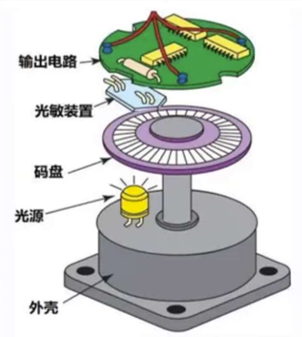

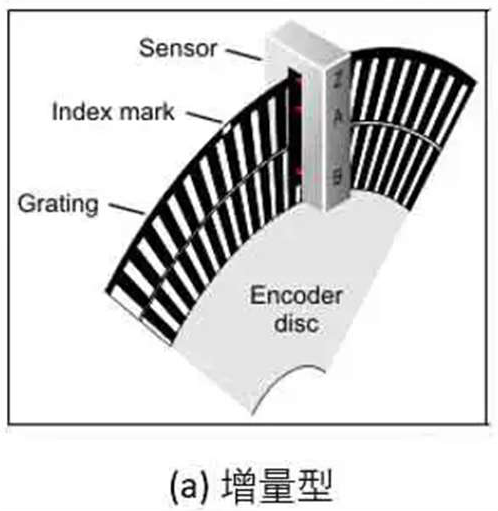

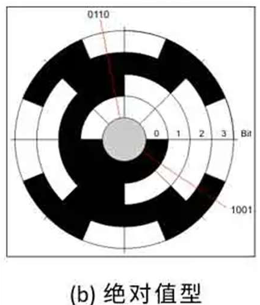

# 4.减速机构

- 减速机构的作用主要体现在以下 3 点：
  - 1.减速加扭
    - 将高速、低扭矩的电机输入轴转化为低速、高扭矩的减速机输出轴（输出面）
  - 2.降低负载惯量比，优化机构响应，此处与速比平方相关

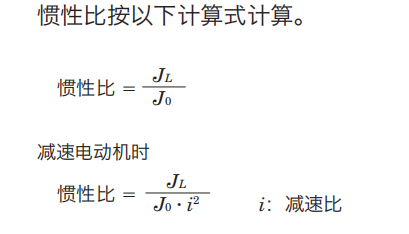

- 3.实现输入、输出轴的换向以及动力的分配
- 伺服电机在额定转速下，恒扭矩输出；额定转速以上，恒功率输出。实际工作所需转速一般相对较低。若不添加减速机构，而选用大规格的电机，将造成电机性能的浪费。减速机通过减速加扭的形式，将高速、低扭矩的电机输出轴转化为低速、高扭矩的减速机输出轴（输出面），实现电机与负载间的转速匹配。
- 增加减速机，可以有效降低负载惯量比，提高电机的响应性能。对于精密控制场合，一般要求负载惯量比小于 20 至 30。
- 通常，伺服电机匹配行星减速机或者高精度的齿轮减速机。机械臂关节一般采用谐波、Rv 减速机。在满足使用要求条件下，建议购买成品减速机。。

| 减速机种类         | 优点                                                         | 缺点                                                         |
| ------------------ | ------------------------------------------------------------ | ------------------------------------------------------------ |
| 直齿圆柱齿轮减速器 | 体积小、传递扭矩大、传动效率高， 传动比范围大；效率高，易加工。 | 不能承受轴向载荷；相对斜齿传动，啮合存在瞬时冲击             |
| 斜齿圆柱齿轮减速器 | 啮合平稳性；最小齿数允许值小，不易产生根切，本身体积相对直齿轮可以做的更小，重合度大。 | 导致不良的轴向力；略增制造成本                               |
| 锥齿轮减速器       | 常用于直角减速机，输入、输出轴垂直共面                       |                                                              |
| 准双曲面减速机     | 啮合平稳，输入、输出轴空间交错传动                           | 装配精度要求高                                               |
| 涡轮蜗杆减速器     | 具有反向自锁功能，减速比较大，输入输出轴空间交错，线接触、噪声小、传动平稳 | 一般体积比较大，传动效率不高，精度不高；易发热及磨损；轴向力较大。 |
| 行星齿轮减速器     | 结构比较紧凑，回程间隙小，精度较 高，使用寿命长，额定输出扭矩可以很大；传动效率高，减速范围广。单级速比一般不大于10。 | 成本较高                                                     |
| 谐波减速机         | 利用柔性元件可控的弹性变形来传递运动和动力，精度很高；齿隙小，安装简便；体积小重量轻，效率高，噪音小。 | 柔轮寿命有限 、不耐冲击、刚性较差，输入转速不能太高。        |
| RV 减速机          | 体积小、重量轻、传动比范围大、 寿命长、精度保持稳定、效率高、传动平稳 |                                                              |

减速机速比计算：

接触点，瞬时线速度一致，确认对应速比

单级减速比/传动比：减速机输入、输出轴之比：i = n1 / n2 = Z2 / Z1

多级传动比：传动比 = 各级传动比的乘积

传动效率：多级传动传动效率=各子模块传动效率的乘积

# 5.传动机构在 AMR 内的应用

- 传动机构包括：齿轮齿轮、齿轮齿条、滚珠丝杆、梯形丝杆、滚珠花键、同步带、V 带、平皮带、链条、涡轮蜗杆、凸轮、多连杆等。其作用是实现电机扭矩的传递或者将旋转运动转化为别的形式的运动。

|          | 传动类型                     | 传动特点                                                     | 机构原理图                                           | 应用范围                                                     | AMR 应用示例                                             |
| -------- | ---------------------------- | ------------------------------------------------------------ | ---------------------------------------------------- | ------------------------------------------------------------ | -------------------------------------------------------- |
| 传动机构 | 齿轮齿轮啮合传动             | 常用于减速机，传动特点参考齿轮减速箱                         | 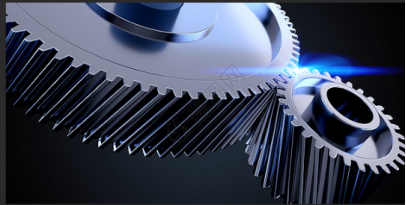   | 立式舵轮转向机构  第一级：行星减速器；第二级：齿轮传动，减速加扭、平行轴传动 | 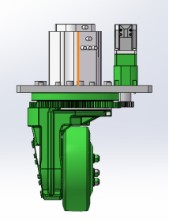       |
|          |                              |                                                              |                                                      | 潜伏顶升车旋转盘 第一级：涡轮蜗杆减速机，交错轴传动；第二级：  齿轮传动，减速加扭、平行轴传动 | 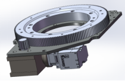       |
|          |                              |                                                              |                                                      | 双差速模组 外置编码器 齿轮传动，将转动角度传输至外置编码器   | 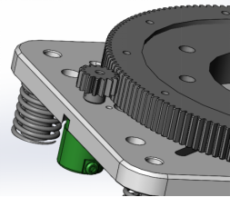       |
|          | 齿轮齿条                     | 旋转运动转化直线运动，传动高刚性、高精度，用于大负载场合。作为地轨使用时，齿条固定，齿轮沿齿条运动；作为前移叉车前移轴使用时，齿轮与车身固定，齿条前后运动。齿轮齿条机构，成本相对较高 | 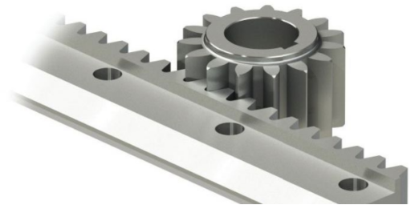   | 地轨第七轴、前移叉车前移机构、堆垛机轨道                     |                                                          |
|          | 滚珠丝杆                     | 旋转运动转化直线运动，高精度；内部通过滚珠实现滚动摩擦，传动效率高；不适用于长跨度或者高速传动，丝杆传动需校核临界转速；导程、转速换算：丝杆旋转一圈，丝杆螺母移动一个导程。通常情况下，驱动电机位于丝杆固定端，采用一组角接触球轴承或者圆锥滚子轴承作为径向固定，作为动力输入，驱动丝杆螺母运动；空间紧凑场合，可将驱动电机通过内部轴承与丝杆螺母径向固定，随丝杆螺母一起运动。 | 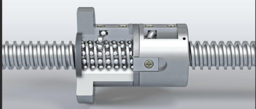 | 顶升机构：图示，通过三组丝杆机构，实现顶升功能               | 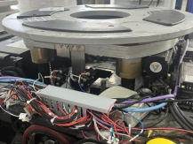     |
|          |                              |                                                              |                                                      | 叉车充电桩伸缩机构                                           | 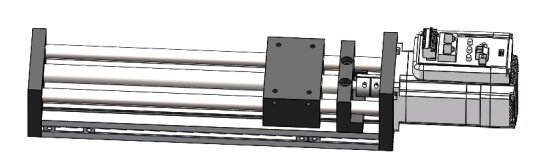     |
|          | 梯形丝杠                     | 部分具备自锁能力，自锁性能取决于螺旋升角；滑动摩擦，传动效率较低；建议应用于断电防坠场合 | 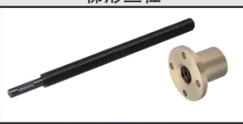 |                                                              |                                                          |
|          | 滚珠花键                     | 通过丝杆轴、花键轴电机的输入控制，可实现直线、旋转以及螺旋三种形式运动 | 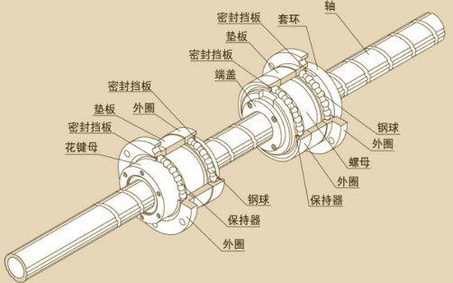 | SCARA 机器人第三、第四轴                                     |                                                          |
|          | 同步带                       | 旋转运动转化直线运动，可实现长跨度工作。齿形啮合，传动精度较高。可用于输送模组或者实现输入、输出轴的平行传动，常用于单轴机器人。常采用平顶圆弧齿，行程、转速换算：同步轮旋转一圈，同步带移动一个周长（同步带参数可查表）。对于带传动，需注意张紧，同步带张紧力相对较小，可以采用专用测力计测试同步带张紧力。 | 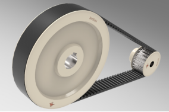 | 料箱机器人升降轴：设计亮点：开环同步带设计，张紧机构设计在中间提升部件，方便调整张紧 | 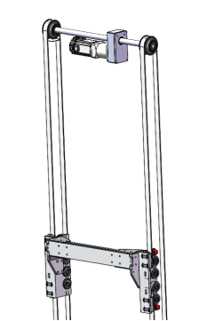     |
|          | V 带                         | 旋转运动转化直线运动，可实现远距离长跨度工作；侧向面为工作面；需注意张紧。V 带过载打滑，具备一定的防护功能。 | 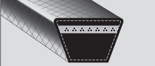 |                                                              |                                                          |
|          | 平皮带                       | 常用于输送线。需注意张紧。                                   | 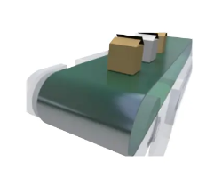 |                                                              |                                                          |
|          | 链轮链条                     | 适合大负载场，传动有冲击，瞬时传动比不为常数，可实现平行轴传动或者输送 | 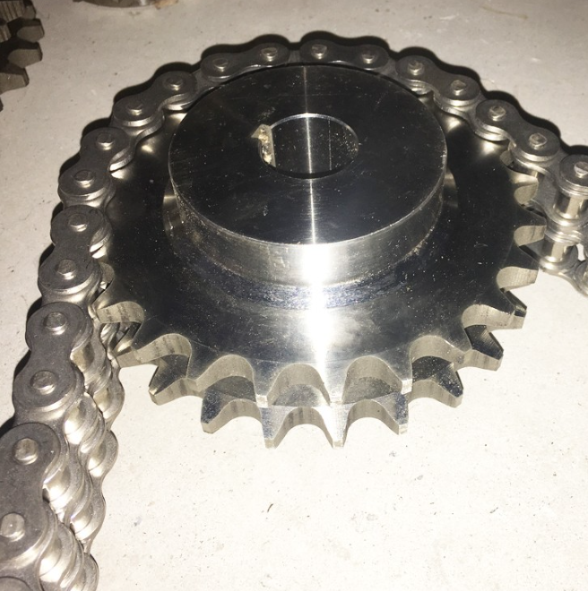 | 料箱机器人旋转轴                                             | 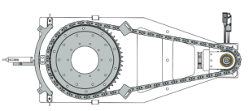     |
|          |                              |                                                              |                                                      | 叉车叉齿升降机构：大负载场合，常采用液压作为驱动单元；驱动链轮，实现倍程效果 | 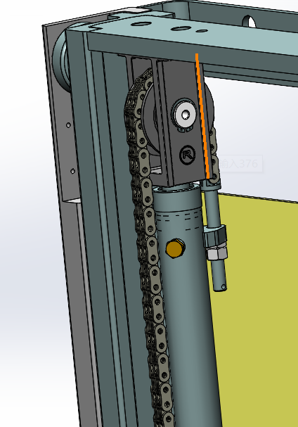     |
|          | 涡轮蜗杆                     | 传动啮合平稳，传动效率低，发热较大。部分涡轮蜗杆具备自锁能力。常设计为涡轮蜗杆减速机。 | 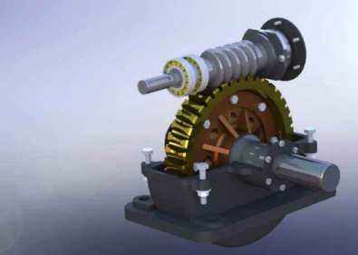 | 不建议自制，直接购买标品                                     |                                                          |
|          | 凸轮                         | 根据凸轮轨迹，实现各种形式运动；点（线）啮合，相对易磨损     | 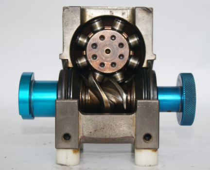 | 凸轮分割器、各类型凸轮机构                                   |                                                          |
|          | 多连杆                       | 根据连杆设计，可实现多种运动；瞬时速度、加速度以及轨迹等，需根据多连杆单独设计；设计时，需注意机构自由度与驱动单元数量匹配 |                                                      | 剪刀叉机构：丝杆机构作为动力输入，驱动剪刀叉机构运动         | 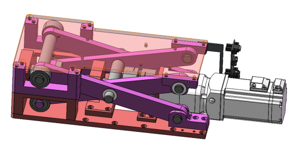     |
|          |                              |                                                              |                                                      | 多连杆顶升机构：电机通过齿轮减速箱，驱动丝杆，带动多连杆顶升 | 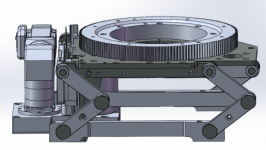     |
| 驱动单元 | 驱动轮、减速机、电机独立选型 |                                                              |                                                      |                                                              | 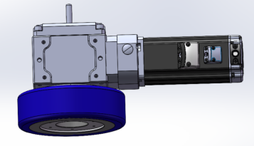     |
|          | 驱动轮、减速机一体式         |                                                              |                                                      | 减速机与驱动轮一体式：需添加驱动电机                         | 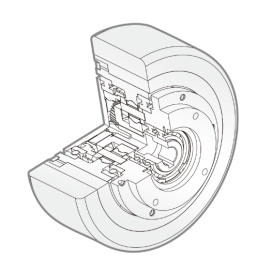     |
|          | 轮毂电机                     | 驱动轮、减速机、驱动电机集成设计                             |                                                      |                                                              | 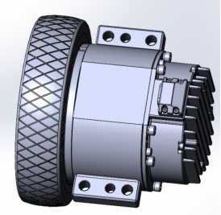     |
|          | 双差速模组                   | 两组驱动轮，等效实现双轮车速车效果，可实现行进以及转向功能。 |                                                      |                                                              | 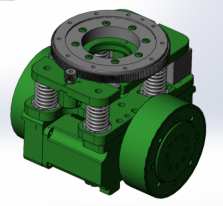     |
|          | 卧式舵轮                     | 驱动电机以及转向电机，分别实现行进以及转向功能               |                                                      |                                                              | 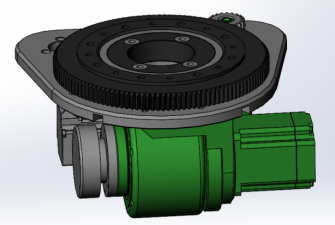     |
|          | 立式舵轮                     | 驱动电机以及转向电机，分别实现行进以及转向功能               |                                                      |                                                              | 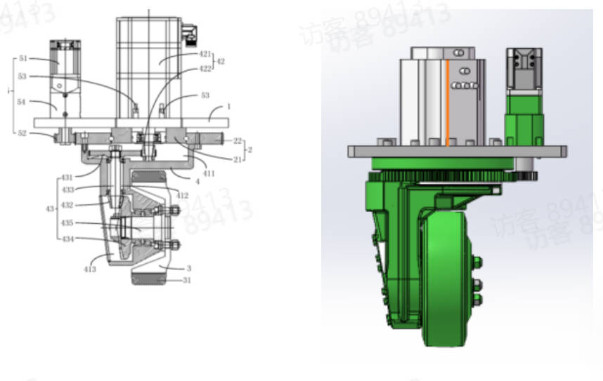 |
|          | 麦克纳姆轮                   |                                                              |                                                      |                                                              | 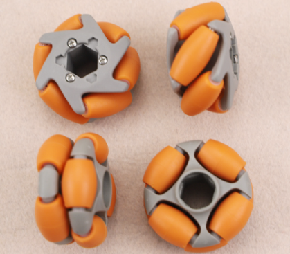     |
| 功能模块 | 滚筒                         |                                                              |                                                      | 直接采购成品                                                 | 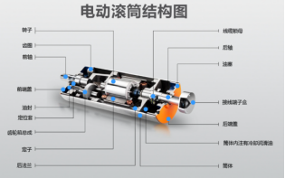     |
|          | 阻挡机构                     |                                                              |                                                      | IO 电机，2 处工作点位，阻挡限位                              | 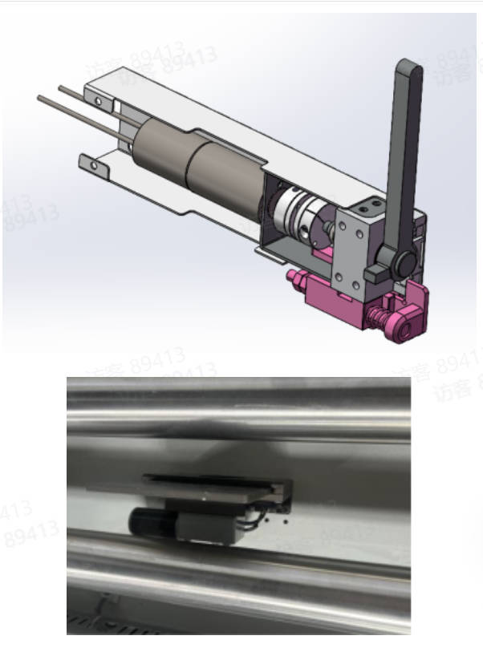 |
|          | 倍程机构                     |                                                              |                                                      | 动滑轮的形式，可实现同步带、齿轮齿条、链轮链条等机构的倍程。上述机构常用于堆垛机、穿梭车、天车、料箱机器人的伸缩机构，叉车的升降门架结构，可有效节约空间。随着倍程级数的增加，机构悬臂效应增加，结构刚性下降。通常不会超过 2 级门架设计。 | 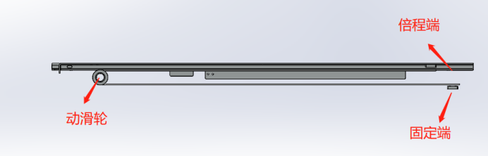     |
|          | 机械臂                       |                                                              |                                                      | 复合机器人一般采用六轴协作机械臂，设计时，注意不可旋转关节   | 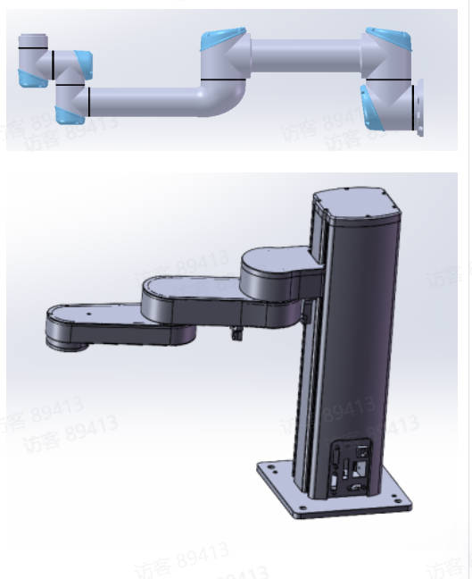 |
|          | 伺服电爪                     |                                                              |                                                      | 伺服电爪，常用于末端执行机构，成本较高                       | 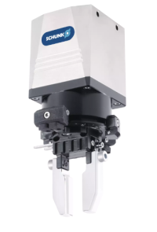     |

# 6.抱闸

- 抱闸是电机的制动装置，提供快速停止和锁定功能；一般是电磁原理，失电抱闸，得电解闸。
- 一般顶升机构和大功率的行走电机需要抱闸，比如叉车的行走电机。
- 一般由驱动器来控制抱闸和解闸，抱闸装置比较耗电，所以最好独立供电。大部分驱动器是提供抱闸的控制信号，通过外部的继电器来给抱闸供电和断电。抱闸装置是感性负载，容易形成反电动势，所以需要安装续流二极管。

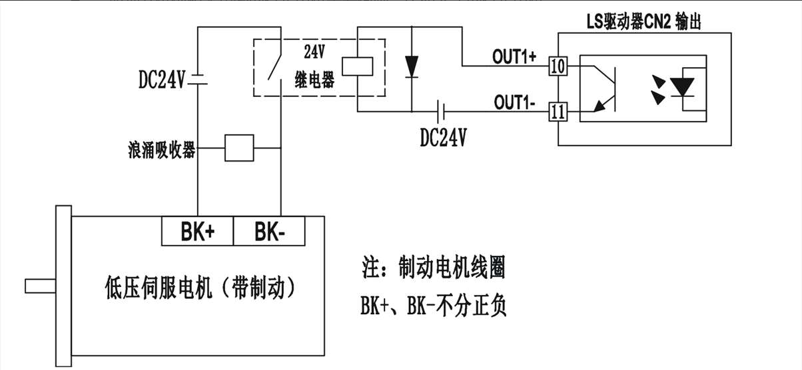

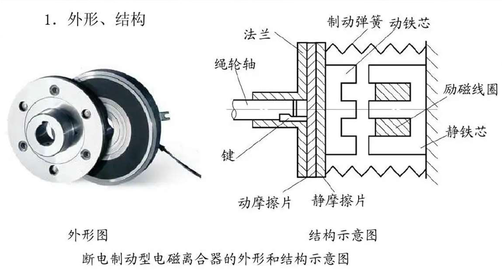

- 可以采用梯形丝杠、涡轮蜗杆等机构，通过摩擦自锁的形式，实现运动机构的自锁，采用上述机构时，需保证受力角度处于自锁范围内。

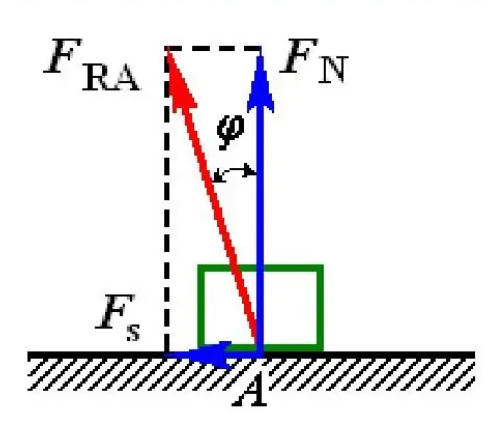

- 拆卸带抱闸电机时，需解闸，驱动电机轴转动，松开开口环。

# 7.伺服电机选型计算

## 7.1伺服电机选型计算

### 7.1.1转速匹配

-  输出转速=电机转速/减速比；伺服电机常见 3000rpm，部分大功率电机为 2000rpm 等。
  - ​      建议按照伺服电机额定转速，选择较大速比减速机
- ​            输出转速转化为负载转速：
  - ​          滚珠丝杆：旋转一圈，负载移动一个导程

  - ​                同步带模组：旋转一圈，移动对应周长（可查表）

  - ​                齿轮齿条：旋转一圈，移动分度圆周长

### 7.1.2负载惯量比匹配

   对于高精度或者重复启停场合，负载惯量比应小于 20；伺服电机惯量可查厂家样册

​       **注：与原厂沟通，AGV 车体，负载惯量比一般都远大于 20，此处可不进行校核。**

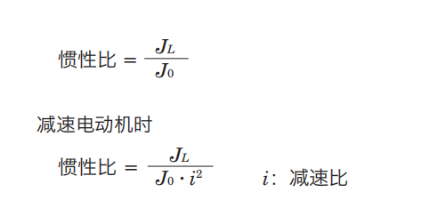

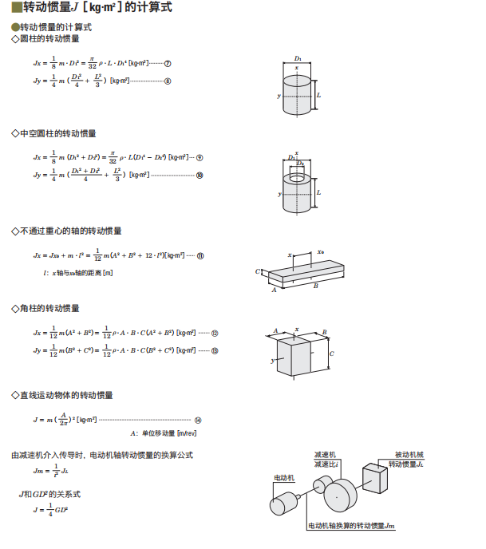

### 7.1.3电机扭矩匹配

   伺服电机具备过载能力（一般为 3 倍），分别校核额定扭矩以及峰值扭矩

   负载扭矩：匹配额定扭矩

   峰值扭矩=匀速扭矩+加速扭矩，匹配电机峰值扭矩

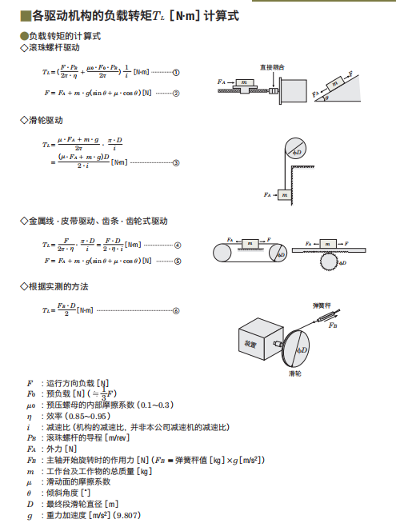

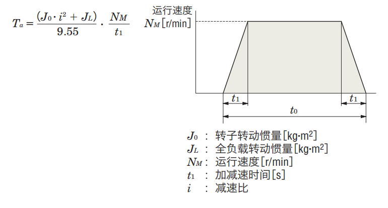

### 7.1.4定位精度以及重复

   定位精度匹配：根据分辨率确定定位精度（步进电机可细分驱动，需注意）

   旋转角度=360°/分辨率。（e.g 分辨率=1000，对应 0.36°）。

   将角度转换为输出角位移或者线位移，确认是否满足要求

### 7.1.5相关电气参数匹配以及驱动器选型

### 7.1.6选型案例

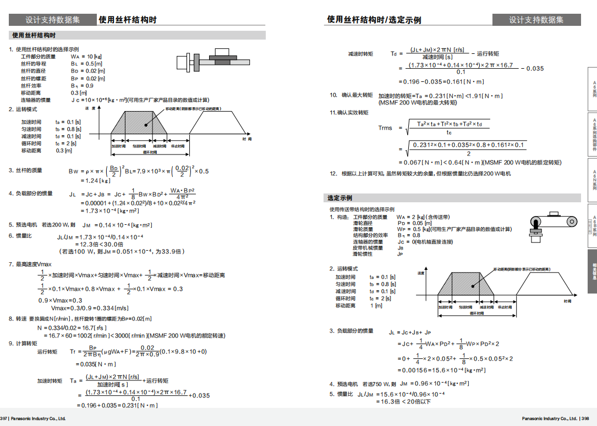

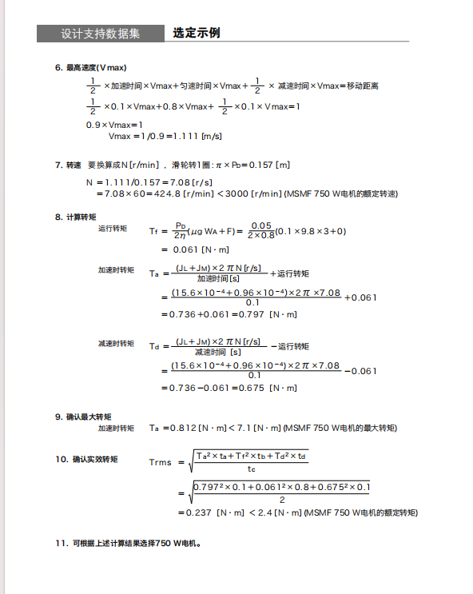

