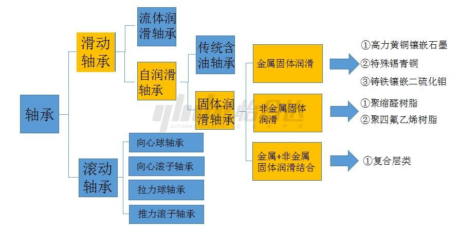
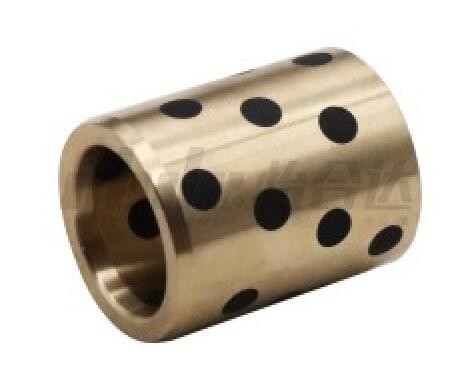
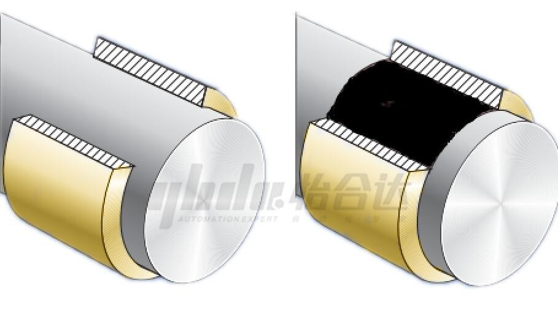
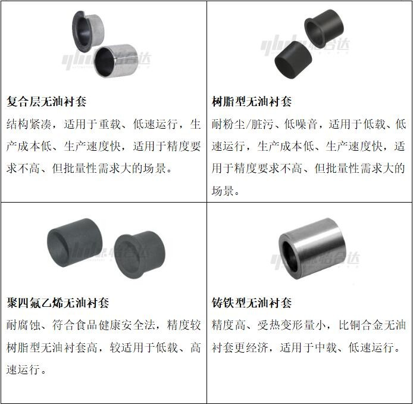
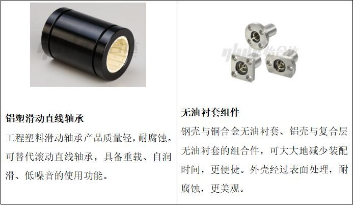
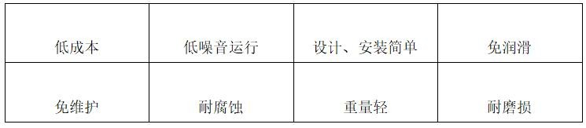

# 十大无油衬套分类

## **一、定义**

无油衬套也叫无油轴承，属于滑动轴承中的自润滑轴承。是指由具备自润滑性能的材料制作而成或在轴承材料中预先加入润滑剂，在工作时可以不加或长时间不必加润滑剂的滑动轴承。

## **二、工作原理**

以铜合金无油衬套为例

​                                                                                运行前                                                                                              运行后

 

​        铜合金无油衬套一般固体润滑剂占摩擦表面积的20%-30%，润滑原理为：轴与轴承在滑动摩擦过程中，石墨颗粒的一部分转移到轴与轴承的摩擦表面上，形成了一层较稳定的固体润滑隔膜，从而防止轴与轴承的直接粘着以致磨损。石墨的润滑性良好，但是承载能力差；金属的承载性优良，但润滑性一般。而在金属基体镶嵌润滑剂的这种搭配，使得无油衬套既拥有金属的高承载能力，又具备石墨材料的润滑性能。

## **三、分类与特点**

## **四、无油衬套的优点**

1、结构简单缩短设计时间、安装与更换方便；

2、自润滑无需供油装置、维护频率低，寿命更长、成本更低；

3、既能满足直线运动与旋转运动，又能在高温或低温极端环境下频繁启停使用。

## **五、应用行业**

无油衬套在汽车制造、工程机械、工业机器人、新能源、3C电子、物流运输、健身器材、食品医疗等行业具有广泛的应用。