# 压轧滚珠丝杠-产品知识介绍

## 一、什么是压轧滚珠丝杠

​        在轧制时，圆棒料毛坯在旋转的轧辊作用下，逐渐产生塑性变形而形成带螺纹的长杆叫轧制丝杆；丝杆轧制工艺分热轧与冷轧两种；丝杆轧制同传统的车削方法相比，具有生产率高、节约金属、扎件力学性能好和操作简单等优点；尤其是冷轧丝杆，由于强度和硬度的提高，使用寿命大大延长。

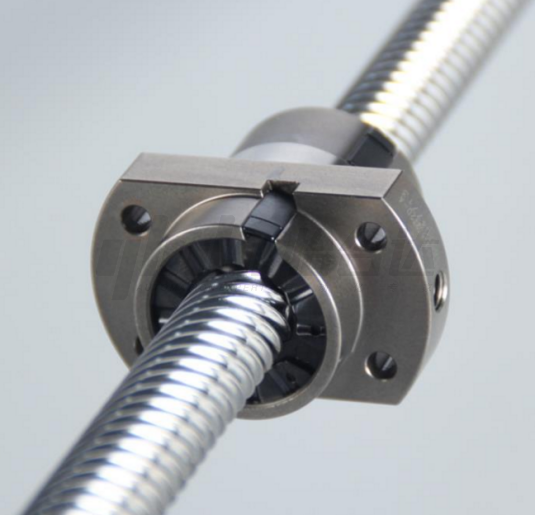

## **二、结构特点**

（1）精度适中，适合大部分自动化设备机械。

（2）轧制丝杆有单头丝杆，双头丝杆，多头丝杆，丝杆承载力有不同级别，导程有小导程，中导程，更有同直径导程，双倍导程，选择范围大。

（3）高传递效率，滚珠丝杆其运转是靠螺帽内的钢珠作滚动运动，比滑行丝杆有更高的效率，所需的扭矩只有其1/3以下，因此可轻易地将回转运动变转为直线运动。

（4）循环结构多样，钢珠循环方式有插管式（外循环），端盖式，内循环偏转器式，端头偏转器式。

## 三、示例案例

（1）自动化设备

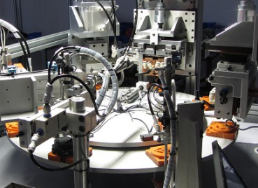

（2）NC工作机械：车床、铣床、镗床、磨床、放电加工机、线切割机、高速冲床、木工机

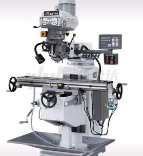

（3）半导体相关设备：曝光装置、化学处理装置、电子零件插入机、印刷电路板钻孔机

（4）产业机器人：直角坐标型、垂直多关节型、圆筒坐标型、钢铁设备机械、影像处理装置、航空器

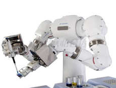

## **四、产品选用原则**

（1）容许回转数

​    1）危险速度 必须检讨滚珠螺杆之回转数使不至于螺杆的固有振动发生共振（发生共振时之速度，谓之危险速度）以危险速度的80%以下为容许回转数，容许回转数的刻度，请依据滚珠螺杆的支持方法加以选定。

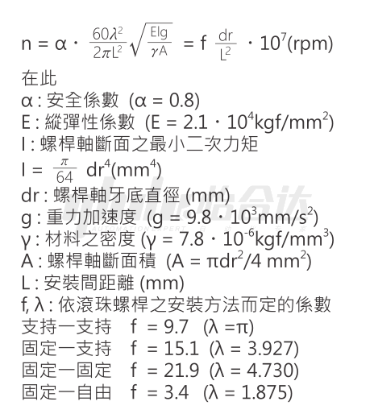

 2）Dm·N值  容许回转数亦受表示周速的DmxN值（Dm：钢珠之中心圆径mm，N：回转数rpm）之限制。

​       精密用（精密等级C7以上）   DmXN≤70000 
​       一般产业用（C7/C10）     DmXN≤50000    

（2）丝杆细长比：滚珠丝杆细长比建议取70以下，超过该细长比的丝杆易出现跳动大晃动问题。

（3）预压：轧制滚珠丝杆定位精度要求一般，预压等级可以选择无预压的无间隙，若机构刚性要求高，可选择带预压丝杆。

## **五、安装与拆卸**

（1）支撑座的安装

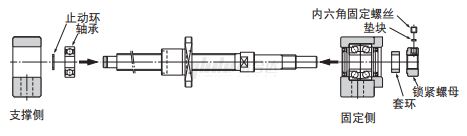

 1）将固定座装配到丝杠轴上。

​    2）将固定座单元插入后,拧紧锁紧螺母,用垫块和内六角固定螺丝将其固定。

​    3）用止动环将支撑侧轴承固定到丝杠轴上,并装入支撑侧支承座。

​    ● 请勿拆卸支撑座。

​    ● 丝杠轴插入支承单元时,注意请不要将油密封圈的凸缘弄翻。

​    ● 用内六角固定螺丝压紧垫块时，为防止松动，请将内六角固定螺丝锁紧。

（2）安装到工作台以及基座上

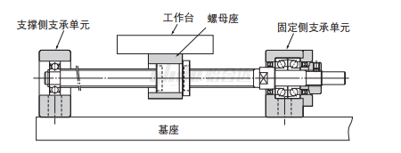

 1）使用螺母座把螺母安装在工作台时,将螺母插入螺母座并暂时拧紧。

​    2）将固定座单元暂时拧紧到基座上。

​    3）此时,将工作台移近固定座单元并对准轴中心,调整工作台使其能平滑移动。

​    4）以固定座单元为基准时,请将螺母外径与工作台或螺母座内径之间留出一定间隙进行调整。

​    5） 以工作台为基准时,用薄垫片调整轴心高度（方形支承单元用）、或将圆形支撑座外表面与安装部内面之间留一定间隙（圆形支承座用）进行调整。

​    6）将工作台移近支撑侧的支承单元,并对准轴中心,使工作台往返数次,一直调整到螺母整个行程都能平滑运动,并暂时将支承单元拧紧在基座上。 

（3）确认精度以及全拧紧。

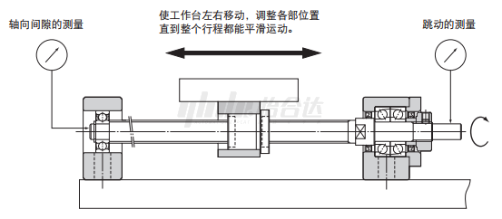

用千分表一边测试滚珠丝杠轴端的跳动及轴向间隙,一边按螺母、螺母座、固定座单元、支撑座单元的顺序依次完全拧紧。 

（4）与联轴器、电机的连接

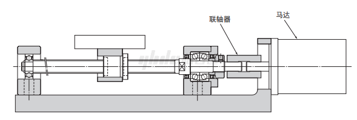

 1）将马达托架安装到基座上。

​    2）用联轴器将马达与滚珠丝杠连接起来。

​    3） 请注意进行充分的试运行。

## **六、使用注意事项**

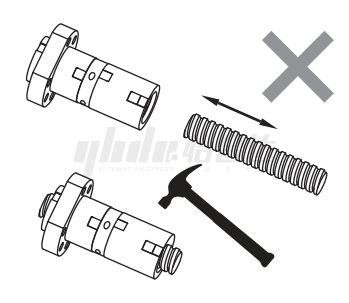

 滚珠丝杆为精密零组件，请特别注意不可使尖物或刀具撞击到牙型表面，以及组装滚珠丝杆时也需避免敲打或碰撞擦伤，同时需注意不可将螺帽与螺桿分离或过行程，螺帽行程若是脱离了丝杆就会造成钢珠脱落，若不小心脱落请勿强行装回，此举容易造成丝杆卡死的情况。

（1）润滑：

​    1）使用滚珠螺桿时，必须要注意具备足够的润滑，如果润滑不够会发生与金属接触导致摩擦与磨耗的增加，造成故障产生或是寿命缩短等情况。

​    2）滚珠丝杆所使用的的润滑剂，润滑脂是使用锂皂基系之润滑油，其粘度30`140cst(40°）润滑油使用ISO等级32~100。

​    3）选择依据：

​       ①高温或低温环境用途时：使用基油粘度低的润滑剂。

​       ②高温，高负荷或晃动，低速用途时：使用基油润滑脂粘度较高的润滑剂。

​       ③润滑剂之检视与补给间隔：

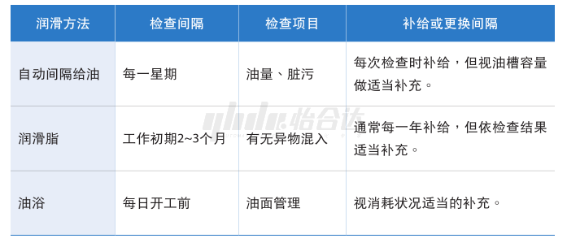

（2）防尘：滚珠丝杆与滚动轴承一样，当混入异物或水分时，磨损会加快，严重者甚至会导致破损。有鉴于此，我司滚珠丝杆螺帽前后两端皆附有刮刷器，为防止外部混入异物，请使用如图所示的蛇腹套或伸缩套，使其完全密封，可提供较佳的防尘效果。

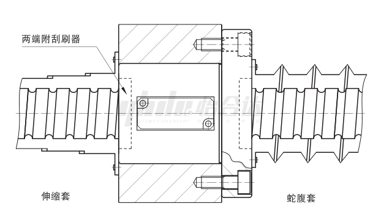