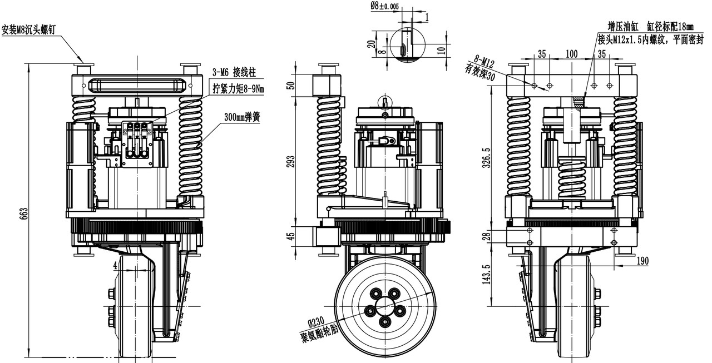

# 叉车如何选择驱控方式

| **序号** | **功能**      | **运动** **模型** | **推荐等级**                                   | **特点**                                 |
| -------- | ------------- | ----------------- | ---------------------------------------------- | ---------------------------------------- |
| 1        | 行走&转向     | 单舵轮            | 推荐                                           | 承载力强，设计调试较简单，但灵活度不高。 |
| 2        | 多舵轮        | 一般              | 承载力强，全向移动灵活度高，但设计、调试困难。 |                                          |
| 3        | 双轮差速      | 不推荐            | 承载力差，一般用于小型。                       |                                          |
| 4        | 升降          | 泵控液压          | 推荐                                           | 只有升起来后的高位、和降下来后的低位     |
| 5        | 伺服电机+丝杆 | 一般              |                                                |                                          |
| 6        | 电缸          | 不推荐            |                                                |                                          |

## 1.舵轮模组组成介绍

| **序号** | **零件名称**       | **作用**                                                     | **备注**                                   |
| -------- | ------------------ | ------------------------------------------------------------ | ------------------------------------------ |
| 1        | 行走牵引电机       | 舵轮前进后退、加减速的动力来源                               |                                            |
| 2        | 回转机构           | 将车体的负载传递到舵轮上，同时能保证车体和舵轮的相对转动，它由内圈、外圈、滚动体等构成 |                                            |
| 3        | 限位开关（传感器） | 用于舵轮左右转动角度极限检测                                 | 非必须部件，选配件绝对值转向驱动器可不安装 |
| 4        | 电磁制动器         | 行走牵引电机的刹车                                           |                                            |
| 5        | 行走减速箱         | 降速同时提高输出扭矩                                         |                                            |
| 6        | 转向减速机+电机    | 为舵轮转向提供动力                                           |                                            |
| 7        | 转向齿轮           | 转向电机减速机输出的扭矩通过转向齿轮传递到回转机构外圈       |                                            |
| 8        | 包胶轮             | 舵轮直接与地面接触部分                                       | 属于易损件                                 |