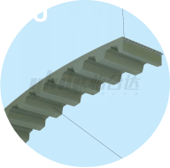
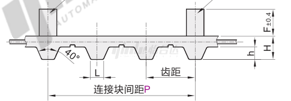
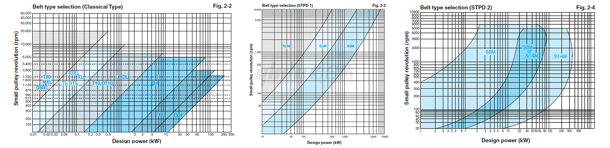
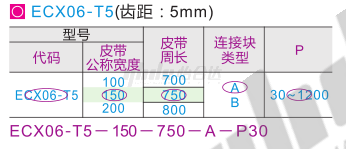
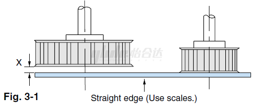
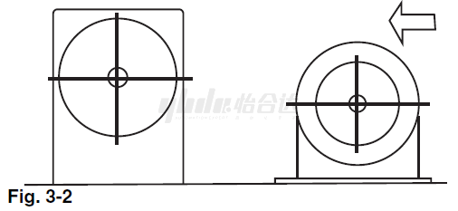
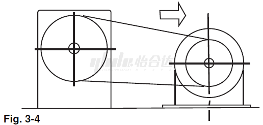
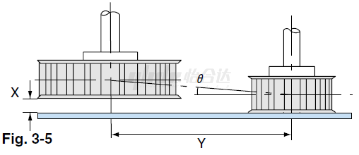
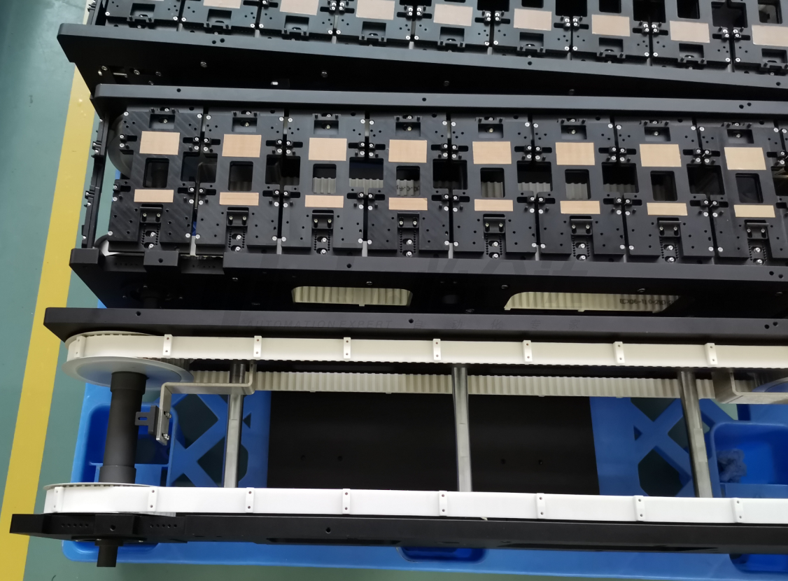
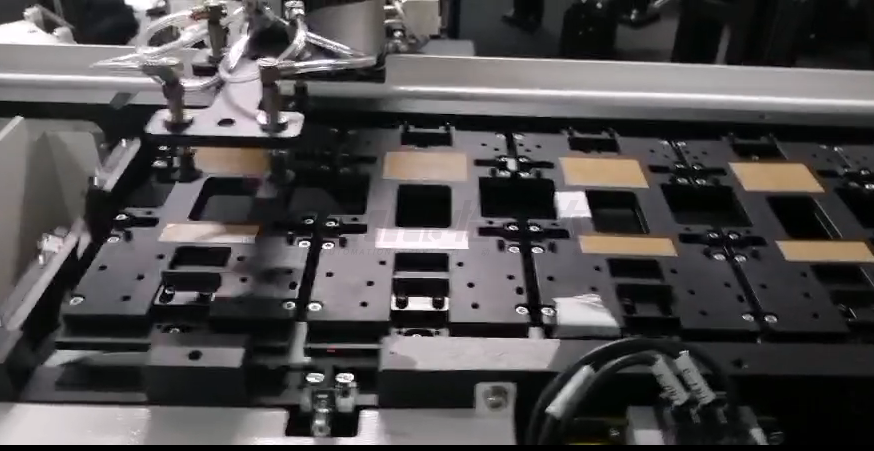

# 同步带-产品知识介绍

## **一、什么是同步带**

​         由于PU与橡胶、尼龙产品相比更加耐磨、耐水解，其优良的可塑性使其通过在聚氨酯同步带背面焊接不同形状的挡块，形成可做不同功能使用的输送型同步带。

## **二、产品组成**

输送型同步带由用钢丝绳或kevlar为强力层，外覆以聚氨酯，背面根据需求焊接不同形状挡块的同步带，带的内周制成齿状，使其与齿形带轮啮合。
芯线作用：承担带传动的主要拉力。要求：拉伸刚度大；疲劳寿命长；长度保持恒定。
表面层作用：传递剪切力，保证横向稳定；要求：强度高；抗磨损能力强；耐油性能好。
挡块作用：做阻挡或固定夹具（工件）；要求：根据功能和需要定制形状。

## **三、使用场合**

​        输送型同步带由于传动准确、平稳、效率高，维护保养方便，可根据传送产品和安装情况设计不同的挡块，配合方便简单等性能。广泛应用于3C、锂电行业的机械传动中。

## **四、产品特点**

（1）传动准确，工作时无滑动，具有恒定的传动比；

（2）传动平稳，噪声低；

（3）传动效率高，可达0.98，节能效果明显；

（4）维护保养方便，不需润滑，维护费用低；

（5）可用于长距离传动，中心距可达10m以上；

（6）相对于普通同步带，输送型同步带具有阻挡、定位传输功能。

 

## **五、产品选用原则**

（1）根据使用功率、转速等参数选择对应的齿形（或者直接根据负载情况和经验值选择齿形和带宽）；

（2）根据设备类型使用时长、传动比、张紧方式等选出负载修正系数、转速比修正系数、导带轮修正系数等，然后计算设定设计功率，结合传动容量算出同步带的宽度，并进行功率、传动比进行校正（或者直接根据负载情况和经验值选择齿形和带宽）；

（3）根据其配合的同步轮和同步轮安装位置计算出同步带的周长；

（4）跟进传送的功能和传送产品（治具）形状、固定方式，选择（设计）相适应的挡块和挡块的间距；

（5）根据试算出的齿形、带宽和周长、挡块外形及尺寸和间距，核对其加工工艺和能力，如聚氨酯接驳带周长要大于600mm才能加工，挡块厚度要小于1.2个齿距；

（6）编写怡合达同步带的型号。

 输送型同步带： 

## **六、安装与拆卸**

（1）切断机械电源；

（2）确认同步轮是否在同一平面内，如果不在同一平面内就要进行调整，尽可能保证配合的同步轮在同一平面上；

（3）松开螺栓，缩短轴间距，使得同步带可以轻松的安装到同步轮上；

（4）张紧同步带，将带齿对准带轮的齿槽，慢慢调动中心距，张紧同步带；

（5）将同步带张紧至规定的张力（可用同步带张力计测量或凭经验值调试）；

（6）用直尺检查同步轮对齐情况，如有异常，取下同步带重新调整；

（7）固定同步轮张紧端的安装螺丝，确保不会移动；

（8）检查同步带和同步轮的啮合情况。

## **七、维护保养**

进行同步带日常检查时，应注意以下项目：

（1）同步带的安装张紧力有无大幅下降？同步带的安装张力在运转20~30小时后，因带轮的跑合会略微下降。但同步带是啮合传动，只要安装时施加正确的张力，以后无需重新张紧。

（2）同步带背部有无龟裂、挡块有无松动或脱落？

（3）同步带齿根有无龟裂？

（4）将同步带翻转过来，检查同步带齿间齿底的布有无因磨损而露出橡胶层或芯线？

（5）同步带侧面有无因与同步轮挡边摩擦而产生的磨损或破损？

（6）同步带在运行时是否有明显的之字形摆动现象？

（7）同步带上有无附着水或油？

（8）底座有无松动？

（9）带轮的齿面或挡边有无生锈？

（10）噪音是否比平常大？

## **八、常见问题** 

（1）同步带早期断裂：
    1）没有考虑到被动轮和被动负载的惯性力。

​    2）负载过大或由于意外事故被动轮停转。从而大大增加了负载力。

​    3）带轮过小，皮带强行弯曲过。
​    解决方法：

​    1）改进设计。

​    2）检查设计，换成比原最小齿数多的带轮。

​    3）搬运、保管、安装操作时应充分注意和小心谨慎。

（2）同步带带边磨损：
    1）轮的平行度不准。 

​    2）轴承刚性不足。 

​    3）带轮挡边弯曲。

​    4）带轮的直径比皮带宽度小。
​    解决方法：

​    1）对带轮进行校正定位。 

​    2）增加轴承的刚性，并固定牢靠。 

​    3）修正挡边或更换。 

​    4）检查设计。

（3）同步带齿面磨损：
    1）负载过大。 

​    2）皮带张紧力过大。 

​    3）掺入磨损性粉层。 

​    4）轮齿粗糙。

​    解决方法：

​    1）改进设计。 

​    2）调整皮带张紧力。 

​    3）改善环境，增加防护罩。

​    4）修光轮齿或调换带轮。

（4）同步带齿断落：
    1）跳齿。

​    2）被动机械事故负载增加。
​    解决方法：

​    1）检查设计。 

​    2）调整适当的张紧力。

​    3）增大皮带轮直径，增加齿合齿数。

​    4）排除被动机械故障

（5）同步带带背胶磨损和龟裂 ：
    1）外张紧轮转动受阻。 

​    2）外张紧轮定位失准。 

​    3）碰到机械的框架。 

​    4）长期处于低温状态。
​    解决方法：

​    1）修理或调换张紧轮轴承。 

​    2）修正张紧轮位置。 

​    3）检查并修正机械部位。 

​    4）改善环境温度。

（6）带背胶软化：
    1） 高温 。

​    2）张紧轮停转。 

​    3）粘上油类。
​    解决方法：

​    1）改善环境温度。 

​    2）检查、调整张紧轮。 

​    3）不要粘上油类或改换耐油同步带。

（7）皮带纵向龟裂：
    1）同步带超出带轮的边沿运转。 

​    2）同步带卷上了带轮的挡边。
​    解决方法：

​    1）调整带轮的位置。 

​    2）增强轴承刚性，并固定牢靠。

（8）抗张体部分的断裂 ：
    1）不正确装卸同步带。 

​    2）掺进杂物或尖锐锋利的残渣。
​    解决方法：

​    1）正确装卸同步带方法。 

​    2）改善环境，增加防护罩。

（9）运行时噪音过大：
    1）同步带张紧力太大。 

​    2）两轴的平行失准。 

​    3）同步带的宽度大于带轮的直径。 

​    4）负载过大。 

​    5）同步带与带轮齿合不良。
​    解决方法：

​    1）减低张紧轮（不跳齿为准）。

​    2）调整带轮的定位。

​    3）改进设计。

​    4）改进设计。

​    5）检查同步带与带轮。

（10）带轮齿磨损：
    1）负载过大。

​    2）同步带的张力过大。

​    3）带轮的材料不好。

​    4） 掺入磨损性粉尘。
​    解决方法：

​    1）改进设计。

​    2）降低张紧力。

​    3）使用硬度高的材料，表面进行硬化处理。

​    4）改善环境，增加防护罩。

## **九、示例案例**

设备名称：3C检测设备
设计目的：实现检测产品精准的传动和定位，以便CCD视觉的捕捉和拍照，实现自动化检测。
零件应用说明：通过同步带和同步轮配合，挡块与治具固定安装，让产品的精准传送及定位，配合视觉设备的捕捉拍照，实现自动化运转功能。

