# 工程材料及其热处理与表面处理

## 钢种类及用途1

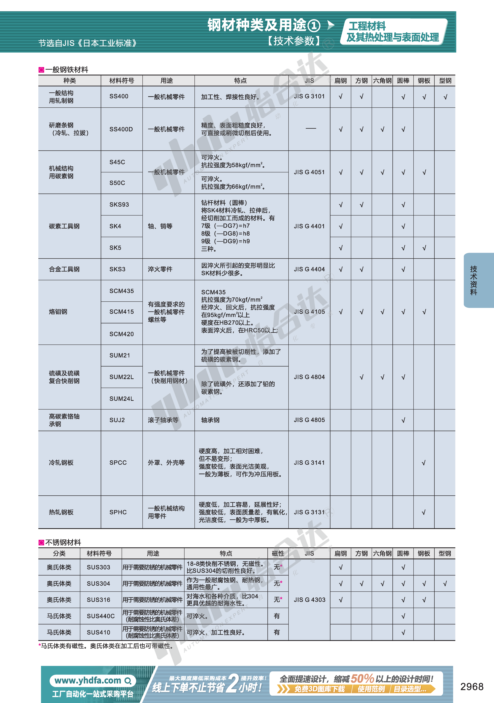

## 钢种类及用途2

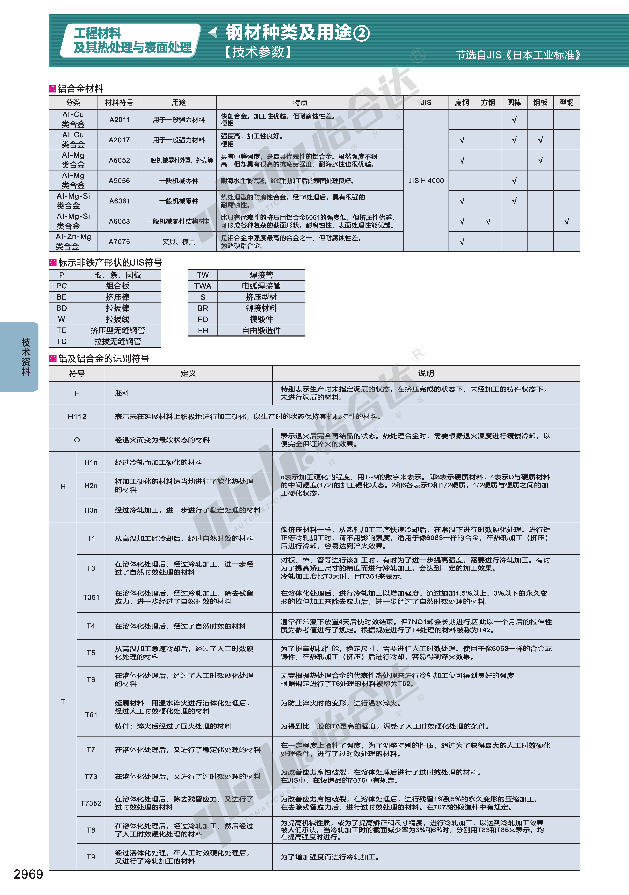

## 钢种类及用途3

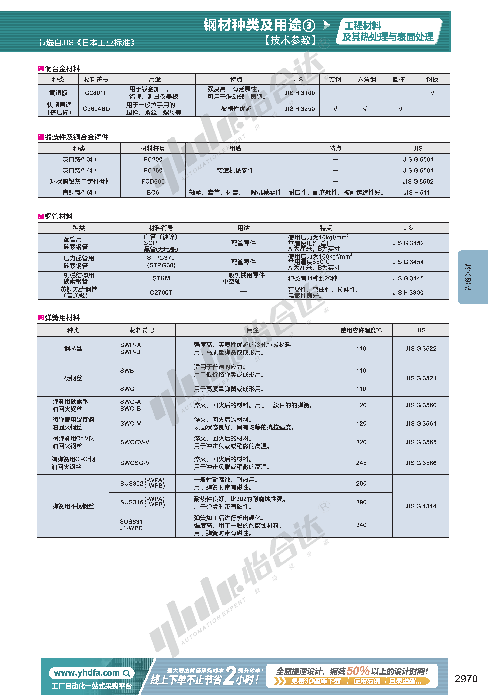

## 日本主要钢铁公司钢号对照表

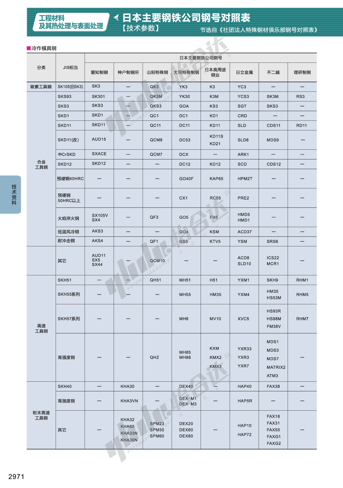

## 钢铁代码及化学成份1

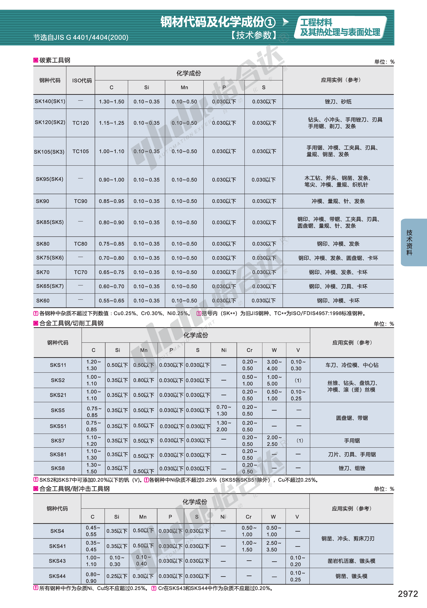

## 钢铁代码及化学成份2

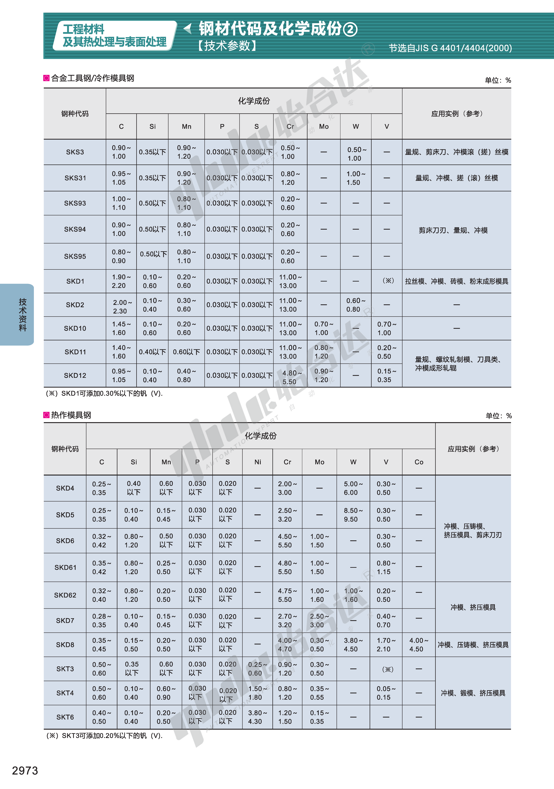

## 钢铁代码及化学成份3

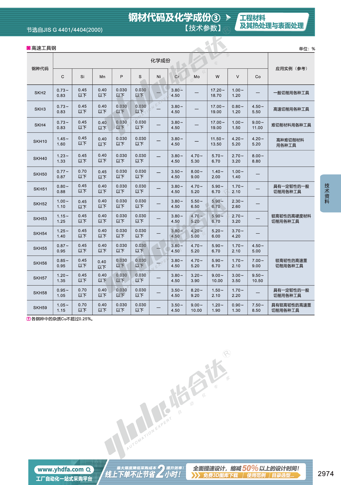

## JIS标准与其它国家标准钢号对照表1

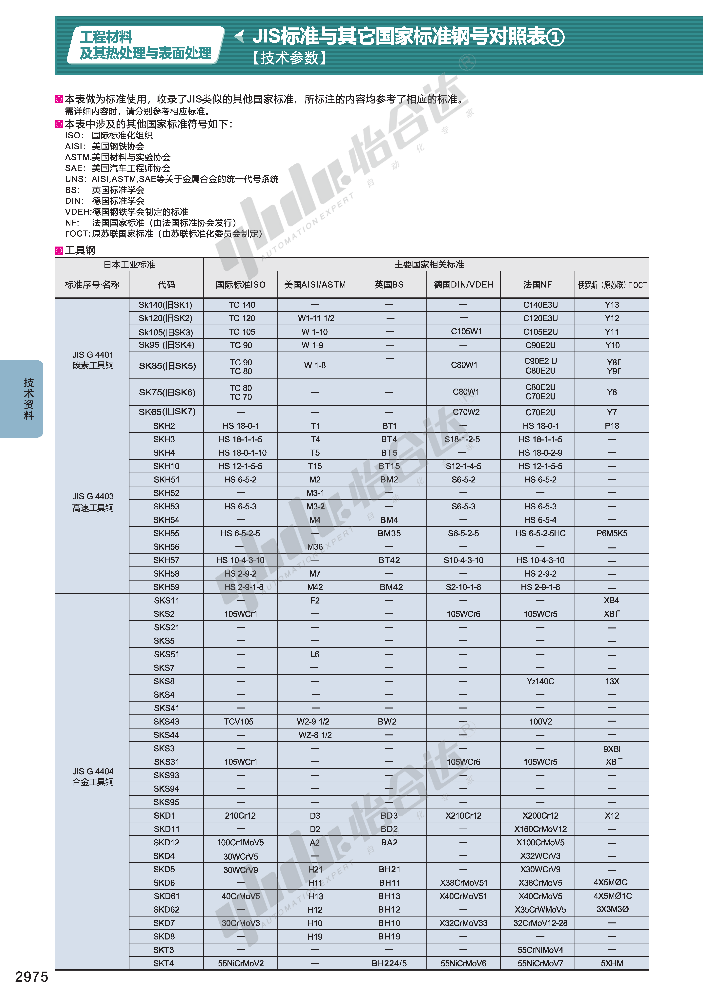

## JIS标准与其它国家标准钢号对照表2

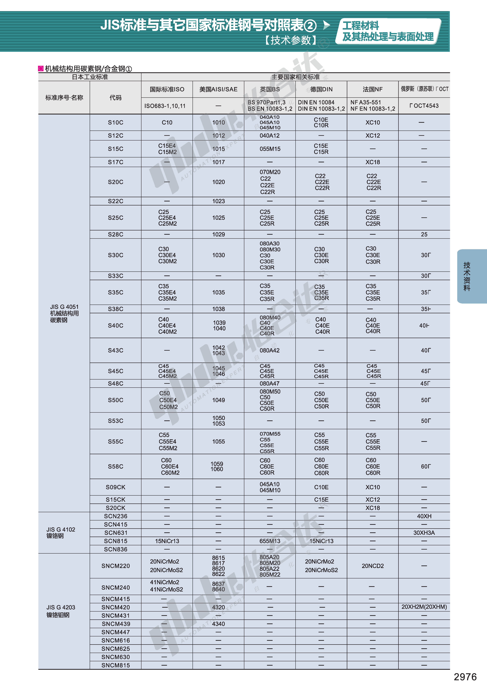

## JIS标准与其它国家标准钢号对照表3

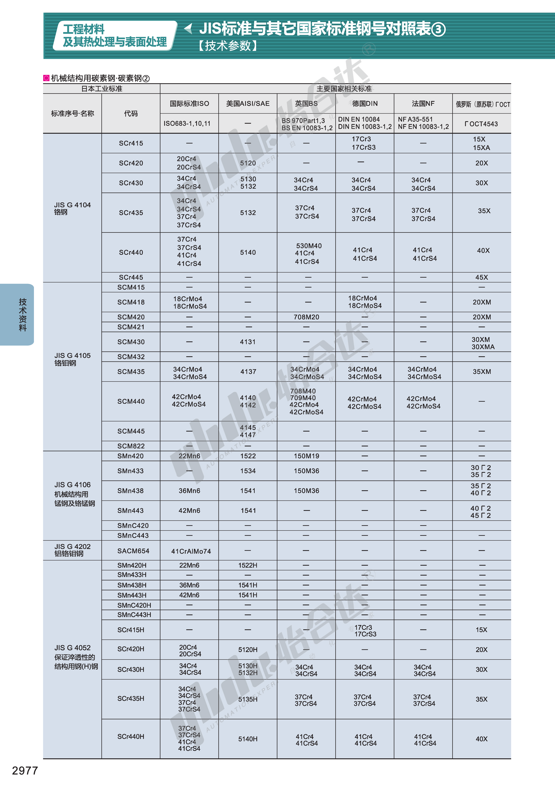

## JIS标准与其它国家标准钢号对照表4

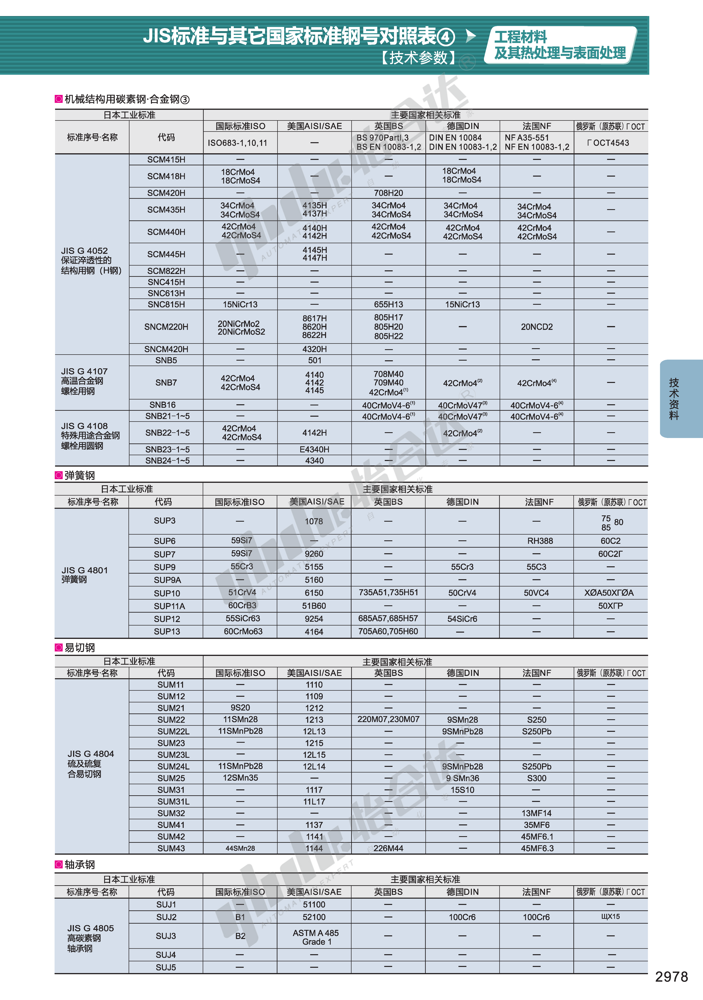

## JIS标准与其它国家标准钢号对照表5

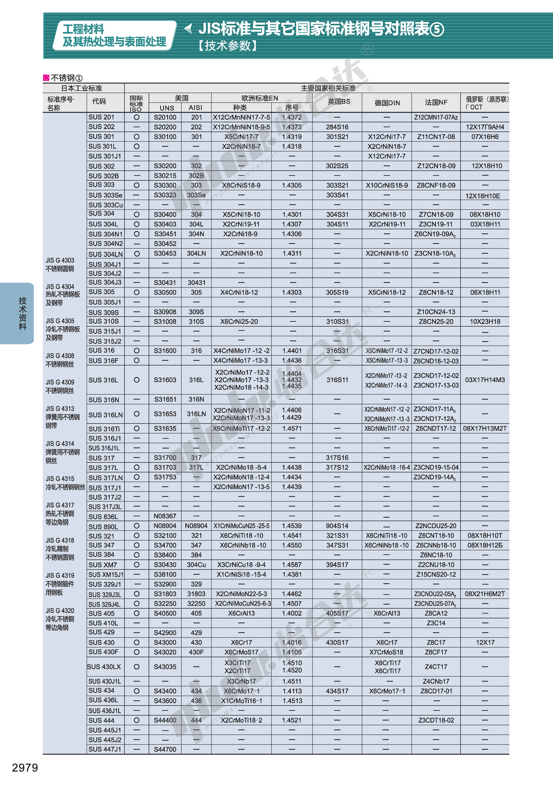

## JIS标准与其它国家标准钢号对照表6

### 主要钢材的硬度和对应工具表

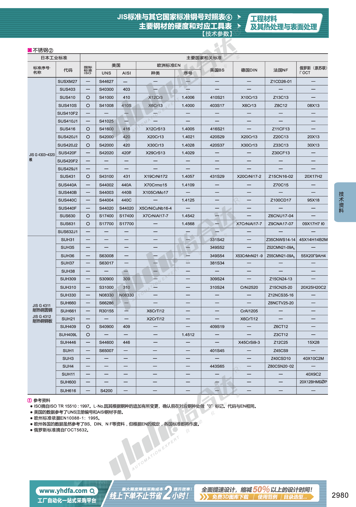

## 强度硬度换算表

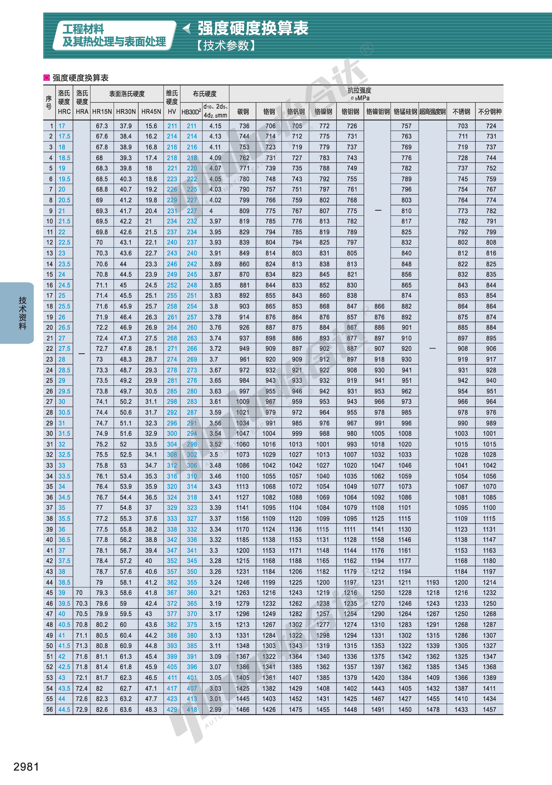