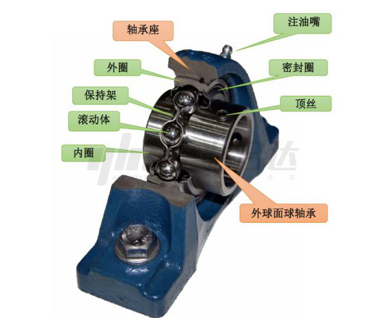
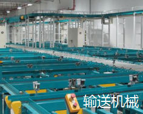
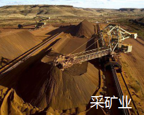
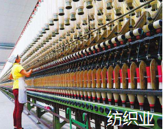
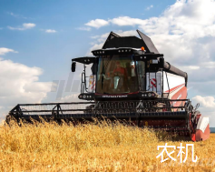
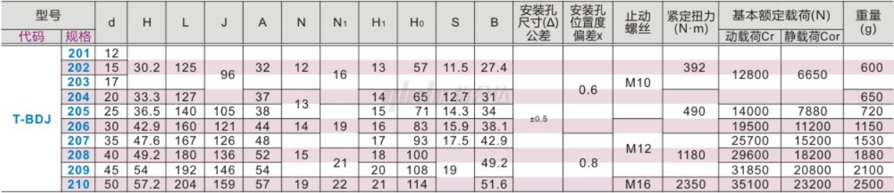
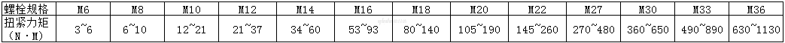
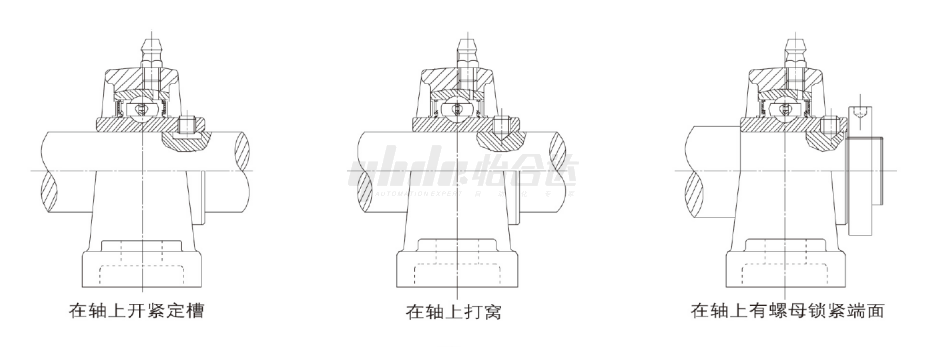
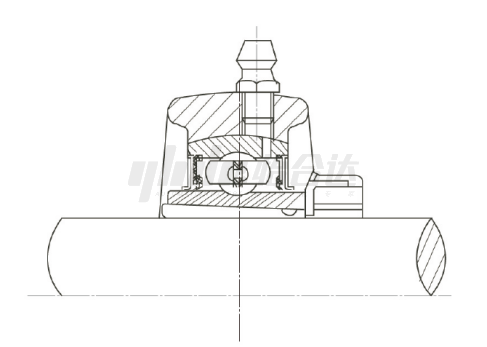
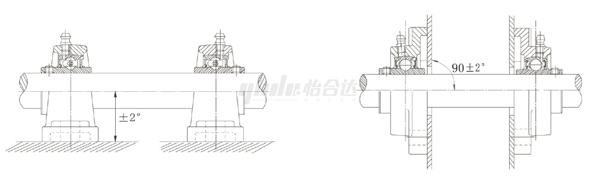

# 带座外球面轴承-产品知识介绍

## **一、什么是**带座外球面轴承

​        外球面球轴承实际上是深沟球轴承的一种变型，是将轴承与轴承座结合在一起的一种轴承单元。轴承单元可以通过几个螺栓直接安装到机械设备的主体上，具有一定的调心功能，能够进行润滑脂的补充等，是一种安装、使用都非常简便的产品。

​                                                                                                             产品结构示意图（立式座）

## **二、产品特点与优点**

（1）种类多样，可以根据安装空间，强度要求选取不同的带座外球面轴承单元。

（2）既可以承受较大的径向负荷，也可以承受一定的轴向负荷。

（3）球状外径面轴承和带球面内孔轴承座的配合使带座外球面轴承单元有一定的调心性能，可以调整轴的偏心、挠曲等误差，避免异常应力。

（4）润滑脂补充方便，通过油嘴直接加入润滑脂，同时由于较好的密封及防尘性能，能够长久保持良好的润滑状态。

（5）通过选择优质的材料、高水平的铸造工艺及合理的座型设计，使带座外球面轴承单元具备长久的使用寿命和优良的工程强度。

## **三、使用场合**

## **四、**产品选用原则

带座外球面轴承的正确选用，对发挥轴承的性能，达到主机正常工作是重要的环节。从多种的轴承和轴承座中选用适合的满足主机要求的带座外球面轴承型号需考虑以下因素：

（1）机器本身的结构对支承的要求；

（2）安装部位的空间和机轴尺寸；

（3）轴承承受的载荷（大小、方向、性质）；

（4）轴承的使用寿命和可靠性要求；

（5）工作转速（高低、正反转）；

（6）轴承与机轴的配合性质和固定方法；

（7）支承位置、配置和轴向膨胀收缩的大小；

（8）轴承和轴承座的配合性质；

（9）周围环境温度的要求（耐高温、低温）；

（10）周围介质、防尘、防潮、防水等要求；

（11）再润滑的重要性；

（12）噪音、振动要求；

（13）轴承座的强度要求。

## **五、安装注意事项**

带座轴承的安装根据不同的型号主要有紧定套、顶丝、偏心套等三种方式。

（1）带顶丝：这种轴承宽内圈的一端装有成120°角的两个紧定螺钉，紧定螺钉把轴固定在轴承上。安装轴时，可参考下表的紧定扭矩来拧紧螺钉。

（参考值）

如果轴承工作在下列情况下:

   1）轴承有振动;

   2）轴承有相对移动;

   3）轴承的载荷较大或者转速较高时;

应在轴上紧定螺钉的相应位置开有紧定槽或窝，如果轴承的轴向载荷较大，则有必要在轴上用螺母锁紧端面。

（2）带偏心套：这种轴承紧固套的偏心端和内圈的一端相连。安装时，先向轴旋转方向拧紧偏心套，再拧紧偏心套上的紧定螺钉，螺钉锁紧力与普通螺钉相同即可，因为轴的旋转力或负荷并不直接作用螺钉上，因而螺钉不会松动。

   往轴上安装轴承前，必须先拔下轴承外套的固定销，同时将轴颈表面打磨光滑干净，并在轴颈处涂油防锈兼润滑(允许轴承在轴上有稍微转动)。然后将装配好的轴承与轴承座一起套在轴上．推至所需位置处进行安装。同时固定轴承座的螺栓先不要拧紧，要让轴承外套在轴承座内能转动。同样装好同一根轴上的另一端轴承和座，将轴转动几圈，让轴承本身自动找正位置后。再将轴承座螺栓紧固好。最后先将偏心套套在轴承内套的偏心台阶上，并用手顺轴的旋转方向拧紧．然后再将小铁棍插入或顶住偏心套上的沉孔．用手锤顺轴的旋转方向敲击小铁棍．使偏心套安装牢固，最后锁紧偏心套上的内六角螺钉。

（3）带紧定套：这种轴承的内孔有1:12的锥度。所造成的轴承内圈变形量较小小，可带来更好的运转及更长的寿命安装时，可以用于偏心固定轮型所不能对应的正反方向运转，在高速运转中更安静、顺畅。安装时先把套放进轴承内孔，再嵌入防松垫片，然后装上螺母。安装轴时，先用手尽力拧紧螺母，再用扳手拧进2/5~3/5圈即可。螺母拧紧后，把防松片弯进防松槽内，否则，可能因螺母松动而引起轴与套间的相对滑动。

轴承的正确安装顺序应该是:先安装座，再安装轴。原则上轴承座可以装在任何地方，但为了保证轴的使用寿命，安装面必须平坦，牢固。带座外球面轴承立式轴承座安装平面与轴的平行度或法兰式轴承座安装平面与轴的垂直度的角度公差要保持在士2°以内。

## **六、常见问题及保养**

带座外球面轴承因使用环境的不同，所以被侵蚀的表现也是不同的，因为侵蚀方式不同有以下几种主要的侵蚀方式：

（1）流体侵蚀：带座外球面轴承的流体侵蚀是指流体激烈地冲击固体表面会造成流体侵蚀，使固体表面上出现点状伤痕，这种损伤的表面较光滑；

（2）气蚀：带座外球面轴承的气蚀是固体表面与液体接触并作相对运动时所产生的表面损伤形式。当润滑油在油膜低压区时，油中会形成气泡，气泡运动到高压区后，在压力作用下气泡溃灭，在溃灭的瞬间产生极大的冲击力和高的温度，固体表面在这冲击力的反复作用下，材料发生疲劳脱落，使摩擦表面出现小凹坑，进而发展成海绵状伤痕。 重载、高速，且载荷和速度变化较大的滑动轴承中，常发生气蚀；

（3）电侵蚀：轴承的电侵蚀是指由于电机或电器漏电，在带座外球面轴承摩擦表面间产生电火花，在摩擦表面上造成点状伤痕，其特征是损伤往复出现在较硬的轴颈表面上。

## **七、维护保养**

​        带座轴承保养时先将轴承拆下检查时，用拍照等方法做好外观记载。另外，要供认剩余润滑剂的量并对润滑剂采样，然后再清洗轴承。为了区分拆下的轴承能否重新运用，要偏重检查其标准精度、旋转精度、内部游隙以及协作面、滚道面、坚持架和密封圈等，根据机械功用和重要度以及检查周期等，如有必要需进行更换。