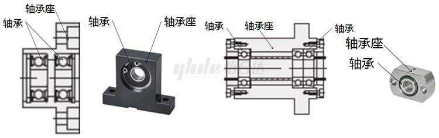
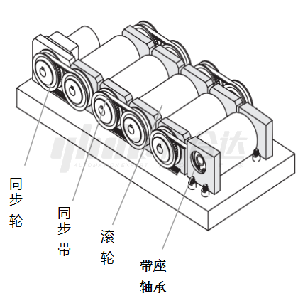
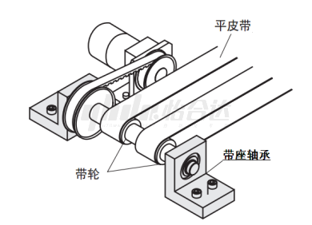
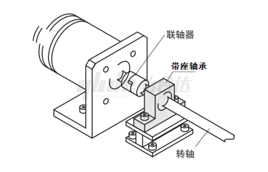

# 带座轴承-产品知识介绍

## 一、什么是带座轴承

带座轴承是将滚动轴承与轴承座结合在一起的一种轴承单元。是将滚动轴承与机加的轴承座安装在一起，形成结构形式多样，通用性和互换性好的轴承单元。

## 二、产品组成

带座轴承由深沟球轴承或角接触轴承或推力球轴承推力球轴承)和一个轴承座两部分组成。

## **三、使用场合**

主要通途是支撑机械结构的旋转体，常用于转轴的固定及保证其转动。
适用于重、轻工业，常见于传动设备，输送设备，减速装置，保持架等等。

## **四、产品特点**

（1）有效降低机械设备在传动过程中机械载荷的摩擦系数

（2）通用性强，安装稳定，装卸方便

（3）负荷能力大，工作噪声小

（4）使用寿命长   

（5）密封性能良好

## **五、产品选用原则**

带座外球面轴承选用要点带座外球面轴承的正确选用，对发挥轴承的性能，达到主机正常工作是重要的环节。从多种的轴承和轴承座中选用适合的满足主机要求的带座外球面轴承型号需考虑以下因素：
（1）机器本身的结构对支座的要求；

（2）安装部位的空间对轴承座尺寸的要求；

（3）轴承座承受的载荷的大小、方向、性质；

（4）轴承座的使用寿命和可靠性要求；

（5）轴承座轴承工作转速的高低的要求；

（6）轴承座的定位要求；

（7）轴承座轴承的防尘要求；

（8）轴承座使用环境的温度的要求（耐高温、低温）；

（9）轴承座使用周围的介质、防尘、防潮、防水等要求；

（10）轴承座的强度要求；

（11）轴承座的经济型要求。

## **六、安装注意事项**

（1）机加件的带座轴承安装，应先固定到安装板上再安装轴。原则上带座轴承可以安装到任何地方，但为了保证轴承的使用寿命，安装面必须平坦，牢固。

（2）表面为发黑处理的带座轴承，应尽量避免在潮湿环境中使用，安装时应避免汗手，湿手直接接触产品。安装完及使用中应定期喷淋防锈油进行防锈处理。

（3）背向组合型带座轴承注意轴环的使用。

（4）成对使用带座轴承时要注意安装的同心度。

## **七、维护与保养**

（1）原则上深沟球带座轴承的轴承盖板内密封有润滑脂不需要额外润滑。
（2）滚针推力球带座轴承和背向组合型带座轴承润滑脂未密封， 使用过程中应定期润滑保养。

 

## **八、常见问题及分析**

（1）安装面不平坦会在造成对使用的带座轴承中心高的差异，会造成抱死，摩擦加大，发热量增加，寿命减小。
（2）深沟球轴承的带座轴承，能承受较大的径向力，但承受轴向力有限，应尽量避免承受轴向力，要承受轴向力和径向力可选购背向组合型或滚针推力球型带座轴承。
（3）轴承为精密机械零件，使用中应尽量避免冲击，以免造成轨道面或滚珠的破坏，会造成支座摩擦加大，发热量增加，寿命减小。
（4）带座轴承的防尘盖有不同类型，使用中根据需要正确选择：

​    ZZ为金属防尘盖，摩擦力小，高速性，密封性，防尘性良好，但防水性较差。

​     VV为非接触橡胶密封圈，摩擦力小，高速性良好，密封性，防尘性比金属防尘盖更好，但防水性较差。

​     DD为接触橡胶密封圈，，摩擦力较大，高速性较差，密封性，防尘性最好，防水性良好， 可在飞溅环境中使用。

## **九、应用案例**

（1）输送机构

（2）传动机构

