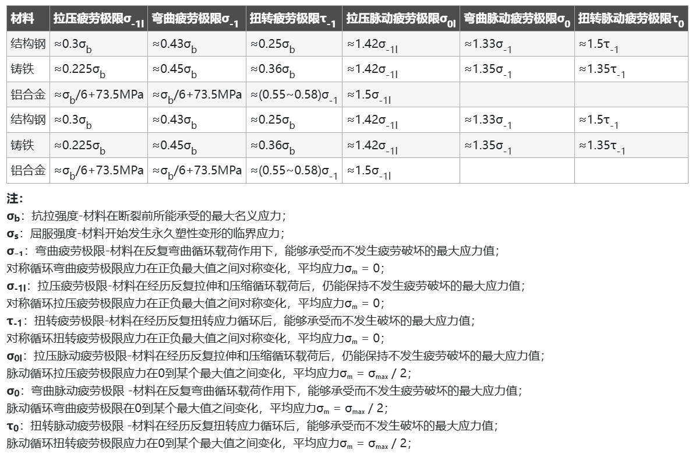

#### 常用材料近似极限强度

**疲劳极限的实际意义**
在工程中，疲劳极限的数值主要通过疲劳试验获得。试验会绘制出材料的S-N曲线（应力-寿命曲线），这条曲线显示了材料在不同应力水平下直到断裂所能承受的循环次数。
对于许多钢材，S-N曲线在10⁷次循环左右会出现一个水平平台，平台对应的应力值即为疲劳极限，意味着只要工作应力低于此值，理论上零件可无限次循环而不破坏（无限寿命）。
但对于铝合金等有色金属，其S-N曲线通常没有明显的平台，一般规定10⁷或10⁸次循环对应的应力作为“条件疲劳极限”。