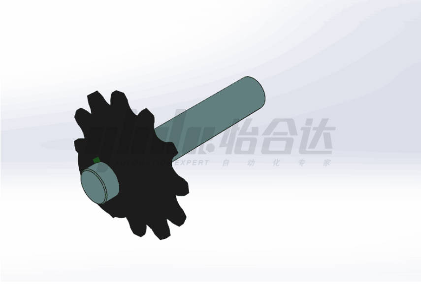
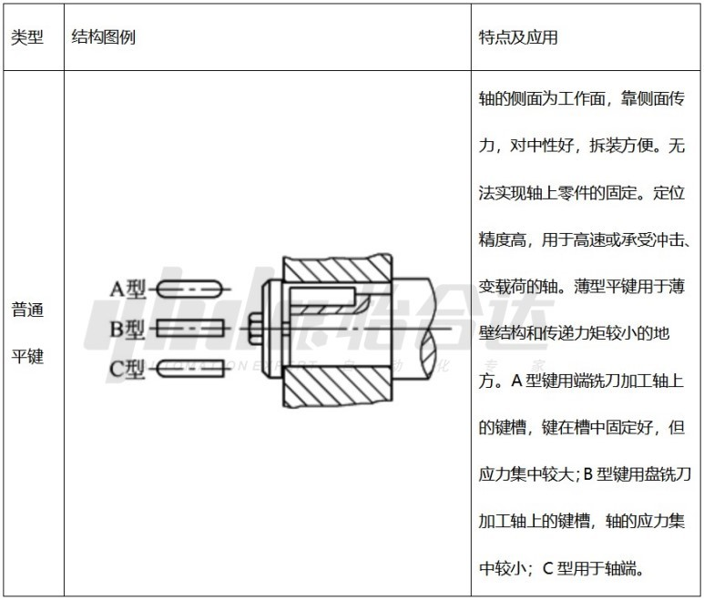
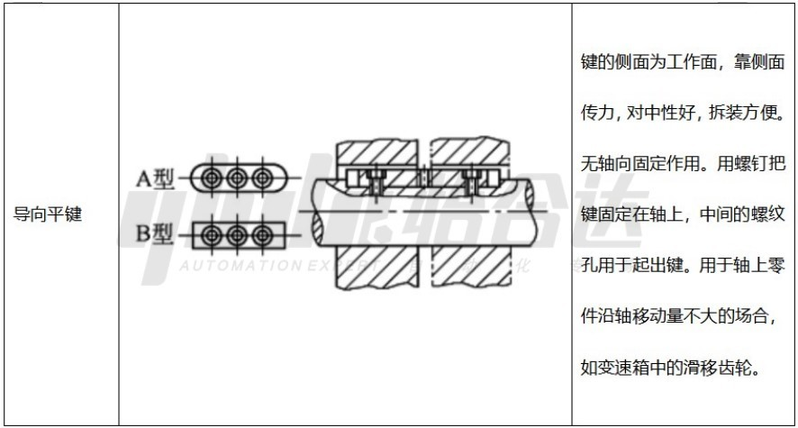
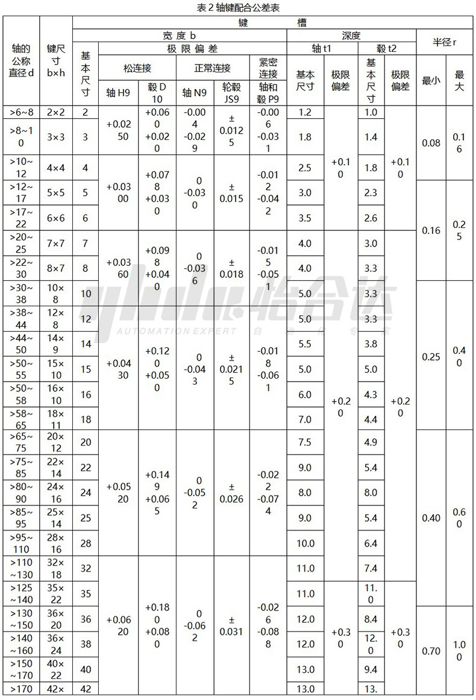
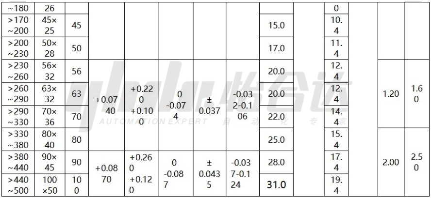
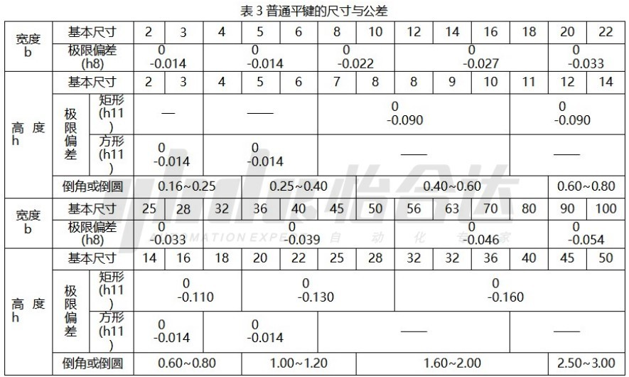
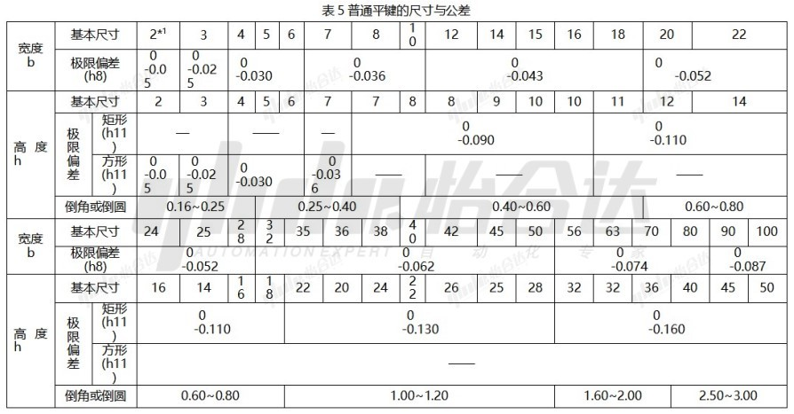

# 平键知识介绍

​        平键就是用来连接轴和轴上零件（轮毂、齿轮等）的，使轴上零件能和轴具有相同运动的连接件。比如齿轮轴和齿轮就是用键将齿轮固定在轴上，轴转齿轮也跟着转。使用轴传动的设备都需要用到平键连接来传递扭矩，广泛用于汽车行业、机床、减速机、电机等机械行业。

## **平键的分类及简介**

表1 平键的类型、特点及应用

## **平键连接的三种类型**

**松连接**：轮毂和键的配合代号为D10/h8，轴和键的配合为H9/h8；用于轮毂可以在轴上沿着轴向滑动的场合。

**正常连接**：轮毂和键的配合代号为JS9/h8，轴和键的配合为N9/h8；用于载荷不大，不需要消除回程间隙，轮毂不需要在轴上沿着轴向滑动的场合。

**紧密连接**：轮毂和键以及轴和键的配合代号均为P9/h8；用于载荷较大或者有冲击载荷，需要消除回程间隙，轮毂不需要在轴上沿着轴向滑动的场合。

 

## **键槽剖面尺寸**

在平键的连接中，平键的剖面尺寸b×h是由轴的直径d决定，我司平键采用了JIS及国标两种标准覆盖了更多的轴槽尺寸，轴的直径对应键b×h的值可见下表2。

## **平键尺寸及公差要求**

​         对于我司的平键产品，分别对应有三种平键尺寸与公差的标准，对应GB/T 1096-2003标准的平键，尺寸范围及对应公差值的见表4；普通型平键对应JIS B 1301-1996标准的平键，尺寸范围及对应公差值见表5；

注1：宽度b为2的平键采用S45C材质时，公差的值的下偏差为-0.05，采用SUS304材质时公差值的下偏差为-0.08。

注2：上述两表格内的公差不适用于半成品平键。

长度公差：关于长度公差，我司普通平键及导向键长度公差按IT14等级，精密型平键按IT12等级，该公差不适用于半成品平键。