# 拖链-产品知识介绍&分类

## **一、拖链及拖链附件**

拖链又称坦克链、电缆保护链，可针对往复运动的电缆、气管、油管、水管起到保护、收纳、牵引的作用。

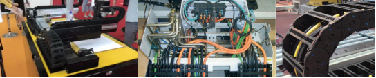

拖链一般由数量不等的单链节和一套接头组成。可选用一些配件，比如分隔片，梳状板。

分隔片分为竖隔片和横隔片，可分别对横向、纵向进行分隔，可减少线缆扭曲缠绕现象；梳状板起到减少应力、固定线缆的作用，可延长线缆寿命。

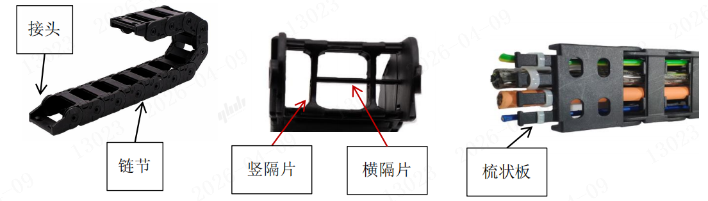

## **二、拖链分类**

拖链可按横杆结构、横杆打开方式和拖链的功能进行分类，需根据使用场景选择不同的种类。

1.按结构分

(1)桥式：也称敞开式拖链，能够清楚观察到内部管线的状态。

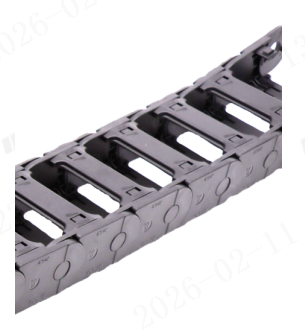

(2)全封闭：能保护管线免受外部异物影响，有效防止颗粒物进入。

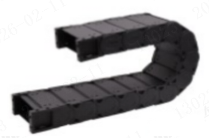

(3)半封闭：能减少部分异物影响，同时可以观察到内部管线状态。

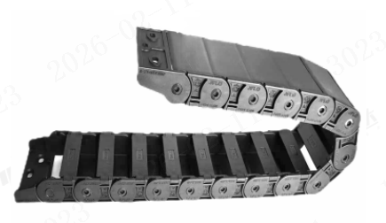

2.按打开方式分

(1)内径打开/外径打开：结构简单，打开方便。

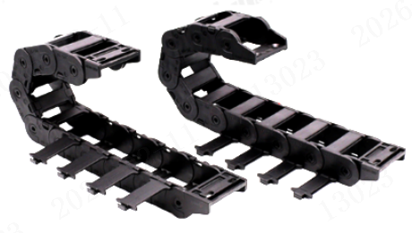

(2)两侧打开：内径和外径方向皆可打开，比单侧打开更繁琐些。

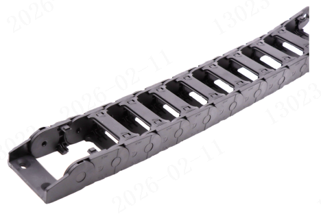

(3)不可打开：微型拖链采用的结构，需从两头穿线。

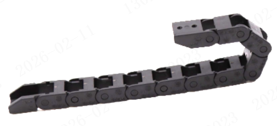

(4)压入式：横杆从中间断开且带弹性，线缆可从一侧快速压入、拉出。

3.按功能分

(1)一般用：VBY系列，规格尺寸最齐全，可覆盖常规应用工况。

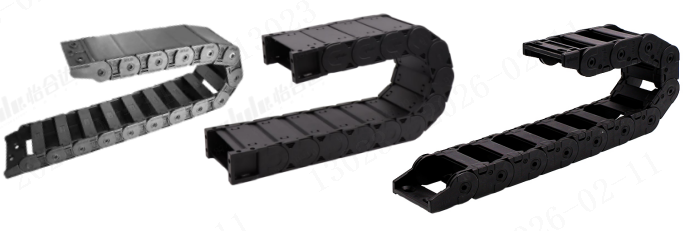

(2)静音型：代码VBW01~VBW41，适用于速度较快，对于噪音要求较高的场合，普通拖链运行噪音在65~75dB，静音拖链运行噪音普遍在40dB以内。

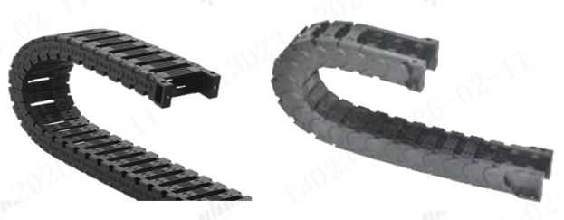

(3)无尘静音型：代码VAQ01~VAQ31、VAX11，相比普通静音拖链，更适合在无尘车间使用，VAQ01~VAQ31符合ISO CLASS 1无尘标准，VAX11符合ISO CLASS 3无尘标准。

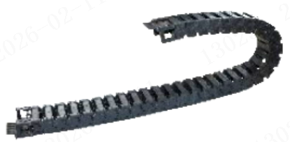

(4)无尘静音防静电型：代码VAX01，符合ISO CLASS 3无尘标准，外表呈现灰色，表面阻值小于1x109Ω，适用于需要防静电的场合。

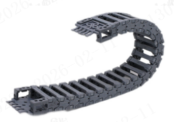

(5)双向弯曲型：代码VAS01，适用于水平旋转应。

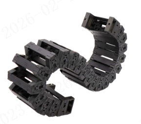

(6)三维运动型：代码VAR01~VAR21，适用于工业机器人。

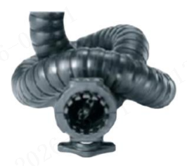

(7)柔性无尘拖链：代码VAK01、VAK02，适用于半导体行业无尘车间以及医疗行业使用。

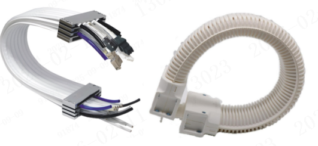

适合超长行程使用的钢骨拖链、长行程滑行拖链，以及高温环境使用的钢制拖链等等......

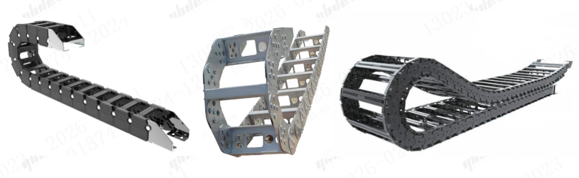

注：以上代码均为怡合达