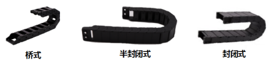
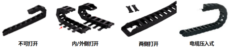
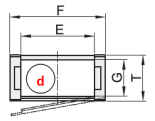
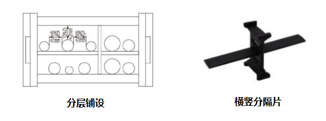
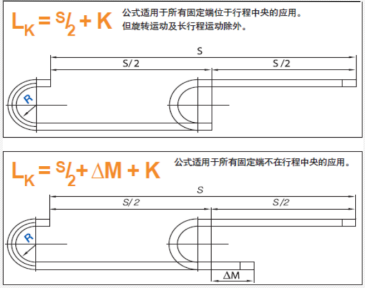

# 拖链选型及长度计算

## 一、拖链选型

拖链适合于使用在往复运动的场合，能够对内置的电缆、油管、气管、水管等起到牵引和保护作用。已被广泛应用于数控机床、电子设备、石材机械、玻璃机械、门窗机械、注塑机、机械手、起重运输设备、自动化仓库等。
拖链根据功能可分为通用型、防静电型、静音型、无尘型、双向弯曲型、三维拖链以及其他功能型拖链；根据结构方式可分为桥式、半封闭式、全封闭式。面对如此多的选择，我们如何才能精准的选定合适的拖链呢？     

1）判定拖链是否需要在特殊要求环境下使用

  例如：拖链需要使用在无车车间时，此时我们选择无尘静音拖链才能满足车间的无尘及静音要求；

2）预选拖链的结构类型：桥式、半封闭式、封闭式

桥式：可清楚观察到内部管线状态
半封闭式：既能观察内部管线状态，也能减少部分异物影响
封闭式：保护管线免受外部异物影响，可防止颗粒物进入，多用在切割、焊接场合

3）预选拖链横杆打开方式：不可打开、内侧打开、外侧打开、两侧打开、电缆压入式  

横杆可打开：填装线缆更换方便，打开横杆即可装入
横杆不可打开：拆装线缆需要从拖链两头穿过，线缆需要拆卸，操作麻烦

4）选定拖链内部尺寸&弯曲半径

内高内宽：根据线管数量和直径确定内高宽，容下所有线管后，拖链内部应该留10-20%空间
  弯曲半径：大于所有管线要求的最小半径，通常按照管线最粗直径10倍作为弯曲半径参考
5）拖链附件选定

1、油、电、气、液应选用分隔片分隔铺设

2、直径差别很大的电缆与管线应选用分隔片分隔铺设

3、拖链侧装时必须安装分隔片

##  二、拖链长度计算

Lk=拖链长度   S=行程    R=弯曲半径    P=节距

​    ΔM =偏移中心点的距离

​    K = π * R + X * P(P≤20，X=2, P>20,X=4)

   固定端在行程中央时为最佳解决方案，选用拖链长度为最短。

   LK=S/2+K
   固定端不在行程中央时

   LK=S/2+ΔM+K