# 机械弹簧-产品知识介绍

## **一、定义**

​        机械弹簧是一种利用弹性变形储存和释放能量的机械元件，常见于缓冲减震、动力传动和精密控制领域。按受力方式可分为压缩、拉伸和扭转弹簧，广泛应用于汽车、机械、电子等行业，核心参数包括刚度、寿命和耐温性。

## **二、机械弹簧的主要功能**

| ***\*主要功能\**** | ***\*功能说明\****                       | ***\*典型弹簧类型功能特点\****                               |
| ------------------ | ---------------------------------------- | ------------------------------------------------------------ |
| 力系控制功能       | 提供弹性力、维持恒定压力、调节作用力大小 | 压簧：轴向承压/缓冲吸能 拉簧：张力维持/复位牵引 扭簧：扭矩存储/角度回正 碟簧：高负荷补偿/防松紧固 板簧：多向承载/抗冲击 恒力弹簧：近似恒定的输出力/长行程储能/空间效率高 波形弹簧：小变形高刚度/轴向空间节省/多级刚度设计 |
| 能量管理功能       | 机械能存储与释放、动能-势能转换          | 同上                                                         |
| 运动调节功能       | 复位定位、位移补偿、振动控制             | 同上                                                         |
| 系统保护功能       | 过载保护、间隙消除、柔性连接             | 同上                                                         |

##  **三、机械弹簧的主要材质及特性**

| 材质           | 特点                                                         | 应用行业                                         |
| -------------- | ------------------------------------------------------------ | ------------------------------------------------ |
| SUS304         | 耐腐蚀性强、弱磁性、中等强度、耐温性较好、加工性好           | 医疗器械、食品设备、海洋环境、日用五金、电子电器 |
| SUS631         | 高强度高弹性、良好的耐腐蚀性、耐高温性、工艺复杂性           | 航空航天、精密仪器、汽车工业、电子器件、工业机械 |
| NCF750         | 超强耐高温性、高强度与抗蠕变、耐腐蚀性、低磁性、工艺复杂     | 航空航天、能源工业、高端制造、特殊环境           |
| 琴钢丝         | 超高强度、优异的疲劳寿命、高弹性和韧性、表面光滑、成本适中   | 精密机械、汽车工业、家用电器、特殊领域           |
| 油冷回火弹簧钢 | 高强度与韧性、优异的疲劳寿命、经济性高、表面可处理性、耐高温性较好 | 汽车工业、重型机械、家电与五金、工业设备         |
| 50CrV4         | 高强度与韧性、优异的疲劳寿命、耐高温性、淬透性好、经济性     | 汽车工业、工程机械、工业设备                     |

## **四、机械弹簧的不同类型及推荐**

 1.压缩弹簧：弹性机械元件，主要用于承受轴向压力，在受到外力作用时压缩变形，储存能量，并在外力去除后恢复原状。其设计目的是提供缓冲、减震、复位或保持压力等功能。

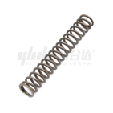

耐热型压缩弹簧特点：耐腐蚀，耐温最高可以达到500℃。推荐系列：YUS

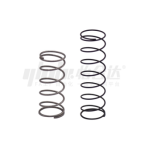

高寿命压缩弹簧特点：性价比高，寿命次数可以达到1000万次。推荐系列：YWG、YUG、YMUG、YMWG

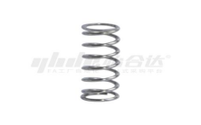

医疗型压缩弹簧特点：种类全、性价比高、不锈钢材质耐腐蚀。推荐系列：Y-YUY、Y-YUL等

2.矩形弹簧：采用矩形或方形截面材料绕制而成的螺旋弹簧，区别于传统圆形截面弹簧。其簧丝横截面呈长方形（宽高比≠1）或正方形（宽高比=1），通过独特的几何形状提供特殊的力学性能。

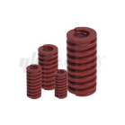

矩形弹簧特点：种类全、性价比高、寿命长、弹力稳定。推荐系列：YSWM、YSWL等

3.拉伸弹簧：主要用于承受轴向拉力的弹性元件，其设计特点是在无负载状态下簧圈通常紧密接触或具有初始张力，并在外力作用下伸长，储存能量，外力移除后恢复原状。

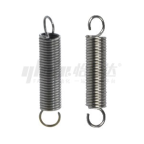

英式挂钩拉伸弹簧特点：种类全、性价比高、弹力稳定。推荐系列：YAWS、YAWT等

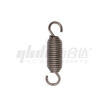

转动拉伸弹簧特点：挂钩可以360°旋转。推荐系列：YHWFM、YPUFM

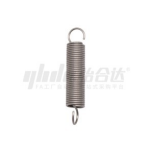

耐热型拉伸弹簧特点：耐腐蚀，耐温最高可以达到300℃。推荐系列：YNUS、YNUT

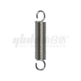

医疗拉伸弹簧特点：种类全、性价比高、不锈钢材质耐腐蚀。推荐系列：Y-YAUU、Y-YAUA等

4.扭簧：用于承受旋转力（扭矩）的弹性元件。当外力使其绕轴线旋转时，扭簧会储存机械能，并在外力去除后恢复原始角度位置，从而提供复位、平衡或施加持续扭矩的作用。

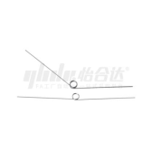

单扭簧特点：种类全、性价比高、不锈钢材质耐腐蚀。推荐系列：FHC01、FHC02等

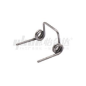

双扭簧特点：承载力大、性价比高、不锈钢材质耐腐蚀。推荐系列：FHC21、FHC22

5.碟形弹簧：是一种锥形碟片状的弹性元件，通过轴向压缩产生反作用力，具有高负载能力、小变形空间的特点。其独特的结构使其在高压力、有限安装空间的应用中表现出色。

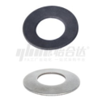

标准型碟形弹簧特点：承载力大、性价比高、空间效率之王。推荐系列：FEN01、FEN02、FEN03；

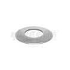

医疗型碟形弹簧特点：种类全、性价比高、不锈钢材质耐腐蚀。推荐系列：Y-RAA11；

## **五、机械弹簧的产品选型**

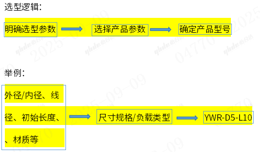

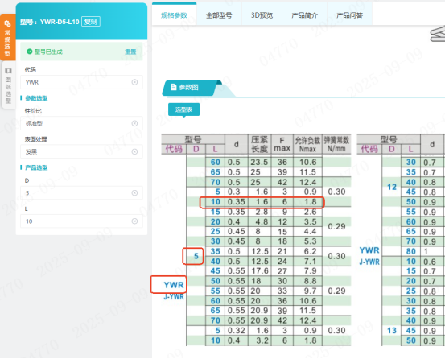

## **六、机械弹簧的使用注意事项**

1.压缩弹簧

安装要求：

①无弹簧导承时的使用

​       在没有弹簧导承的条件下使用时，弹簧会发生纵弯曲和横弯曲等，弯曲的内侧会产生局部高应力，导致最终折损。因此，请务必使用导销、外径导承等弹簧导承。一般说来，通过内径侧导承将导销自上而下贯通后使用最为理想。

②有关弹簧的内径与轴

​        如果与导销之间的间隙较小，那么，导销就会使弹簧内径产生磨损，并以磨损部为起点，导致最终折损。另外，如果与导销之间的间隙过大，则会导致纵弯曲。建议杆径比内径d小1.0mm左右。另外，自由长度较长的弹簧（自由长度/外径=4以上的弹簧），其导销需带有落差，以免横弯曲时接触弹簧内径。

③关于弹簧的外径与沉头孔

​        如果与沉头孔之间的间隙较小时，会因弹簧压缩后外径侧膨胀，而导致外径受到约束，形成应力集中，产生最终折损。建议沉头孔径比外径D大1.5mm左右。自由长度较长弹簧采用如下图所示沉头孔形状是比较理想的。

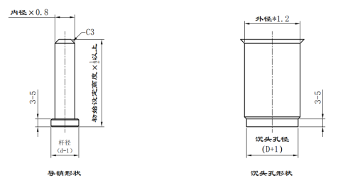

保养要求：

①给弹簧定时喷涂防锈油（每个月1~2次）；

②对于灰尘较多的使用环境，要按时清理下弹簧表面的粉尘。因为如果夹住异物，那么相应部分的弹簧卷就不会有作用，会造成除此之外的部分压缩，这实际上相当于减少了有效弹簧卷数，因而会产生高应力，导致最终折损。因此请注意不要使异物进入。

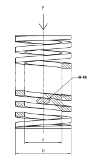

2.拉伸弹簧

安装要求：

①使用拉伸弹簧前必须严格检查，确认无脏物灰尘等，仔细检查；定期地对冲床的转盘和模具安装底座进行检查，以保证上下转盘的同轴精度。

②拉伸弹簧的凸模和凹模刃口磨损时应及时停止使用，及时刃磨，否则会迅速增大模具刃口的磨损程度，减少模具的使用寿命，降低弹簧质量。

③按照模具的安装程序将凸凹模在转盘上安装好，保证凸凹拉伸弹簧的方向一致，尤其是具有方向要求的拉伸弹簧更要小心，以免弄错。

④弹簧加工职员在安装模具时应使用较软的金属制成操纵工具，防止安装过程中敲、砸时损坏拉伸弹簧。

⑤想使拉伸弹簧的寿命长久一些，就应该定期地对模具弹簧进行更换，防止劳损影响拉伸弹簧使用寿命。

保养要求：

①给弹簧定时喷涂防锈油（每个月1~2次）；

②对于灰尘较多的使用环境，要按时清理下弹簧表面的粉尘。因为如果夹住异物，那么相应部分的弹簧卷就不会有作用，会造成除此之外的部分压缩，这实际上相当于减少了有效弹簧卷数，因而会产生高应力，导致最终折损。因此请注意不要使异物进入。

3.扭簧

安装要求：

①无预压的使用，因有间隙造成弹簧上下振动导致弹簧扭曲，如有预压时，弹簧较为稳定。

②弹簧横置使用时，会造成导销与弹簧磨损并断裂。

③如在无弹簧导引的情况下使用时，很容易造成弹簧底部及本体之扭曲，其扭曲部之局部高压力是导致弹簧断裂的要因，请一定要使用内径导销或外径导引等装置。

④装配面之平行度不良时，会造成弹簧扭曲，局部产生高压力断裂，及平行度不良之场合造成弹簧扭曲。

⑤异物夹杂使用时，夹杂异物部分会造成有效卷部无作用仅其他部分之压缩，实质的有效卷数变小近面造成高应力并断裂，请勿将异物夹杂于弹簧内。

保养要求：

①给弹簧定时喷涂防锈油（每个月1~2次）；

②对于灰尘较多的使用环境，要按时清理下弹簧表面的粉尘。因为如果夹住异物，那么相应部分的弹簧卷就不会有作用，会造成除此之外的部分压缩，这实际上相当于减少了有效弹簧卷数，因而会产生高应力，导致最终折损。因此请注意不要使异物进入。

 

4.碟形弹簧

安装要求：

①检查确保与螺母的法兰面干净光洁。还要检查螺栓材质、工况参数及尺寸是否相符，检查碟簧是否完好，规格是否正确。

②用润滑剂（或防卡剂）润滑螺纹与螺母表面，以利于实际运用中螺栓紧力的均匀性。

③将碟簧套入螺栓，凹面朝向法兰，并使碟簧与螺栓保持同心。然后用手初步拧紧所有螺母，用力要均匀细致。

④按逆时针或者顺时针的方向依次检查螺栓，确认全部紧固完好。

⑤在尚未发生泄漏的法兰在现有螺栓增加碟簧垫片时，可不更换法兰密封垫，采用先拆一根螺栓更换上碟簧垫片后，上紧，再更换另一根螺栓，所有螺栓更换完后，再全部紧固一遍，达到法兰密封的要求。对已经泄漏的法兰采用更换密封垫片后再上螺栓和增加碟簧。

⑥保证用力均匀，紧固时需要按照对角线原则进行紧固。即先紧固一个螺栓，再紧固对角的螺栓。其目的是为保证法兰紧固的用力均匀性，从而能够更好地密封。将螺栓全部紧固后，再按顺时针或逆时针方向依次检查螺栓，确认全部紧固好。

保养要求：

①擦干磨削液，保持碟簧片表面干燥，不允许碟簧片表面出现污渍和锈迹。

②对于灰尘较多的使用环境，要按时清理下弹簧表面的粉尘。

③在使用时，要检查碟簧表面无凹痕、划伤及其它缺陷，去除碟簧毛坯外圆周边毛刺。

## **七、机械弹簧的使用案例**

1.门框与门板连接处安装扭簧，如下图

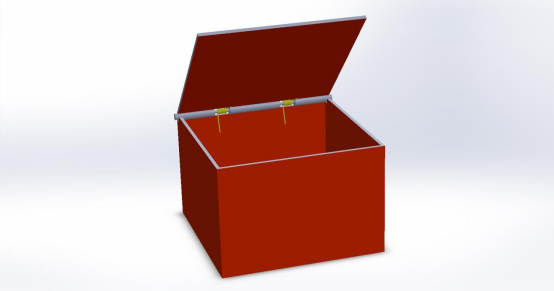

2.提升机构安装拉伸弹簧，用于设备助力，如下图

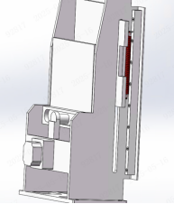