# 机械设计规范

## 1.3D数模设计

### 1.1 草图绘制及特征

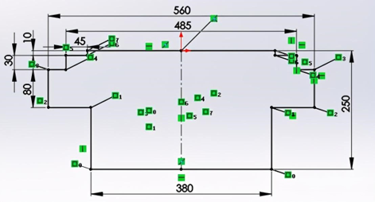

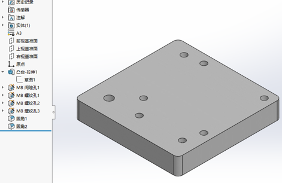

- 绘制的草图必须完全定义（草图颜色全部变为黑色），应尽量使用约束（垂直、平行、相等、对称、相切等）而非尺寸标注来使草图完全定义。

- 造型的基本顺序规则是“如何制造如何建模”，造型最好和现有的加工工艺连接，一个模型可能有多种方法完成，选择的标准应该是体现工艺路线。

- 在做较复杂的零件造型时，有意识的把一些特征放到最后（如扫描、放样、数量大的阵列等）；这样可以方便的临时压缩这些特征，改善模型修改、装配的速度。

- 造型的时候， 能拉伸多次完成的尽量不要在一份草图中完成， 要不后期更改、补充很麻烦，草绘造型的时候， 尽量（面） 对称， 拉伸也是， 这样装配更加便捷。

- 做特征时，能做拉伸完成的就不要采用放样。

- 能够在零件环境形成的特征，就要避免在草图形成。 (不要在草图中做倒角和倒圆，应在模型基本完成后采用加特征的方式去做。 )

- 孔，最好用异型孔向导特征完成，这样在装配时可以使用零部件特征阵列

- 阵列孔、均布孔等用于装配标准件或零件的孔，就一定要用特征级的阵列将孔做出。而不是用草图级的阵列，最后一次性打孔。

- 对于装轴承的轴肩或台阶，不必严格清角，最好有小圆弧，通常为 0.2~1。

- 有配合关系的销钉孔，在两装配件其中一件上，仅一个孔为圆孔，其余为腰型孔，并取消孔距公差。

- 销钉孔深度不小于销钉直径的两倍为宜，销钉孔最好为台阶通孔，便于装配和拆卸销钉。

- 设计的零件尽量确保能采用常用的车、铣(CNC)、磨等加工方法加工。

- 确定不可能在 CNC 上加工的，应尽量避免外圆角，用 45°斜角替代。

- 注意权衡材料费与加工费，尽可能将多个零件组装改为一体加工成型。

### 1.2 设计界面管理

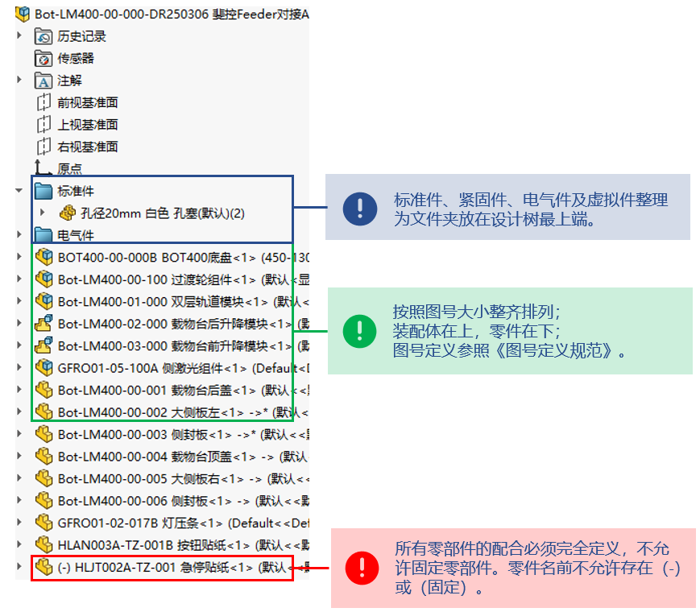

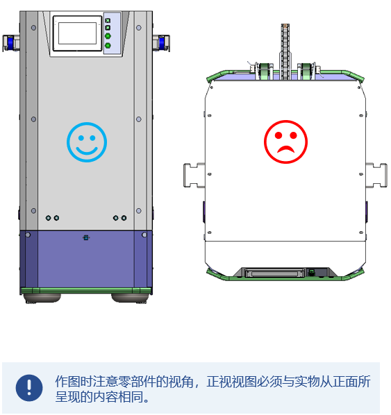

### 1.3 属性管理

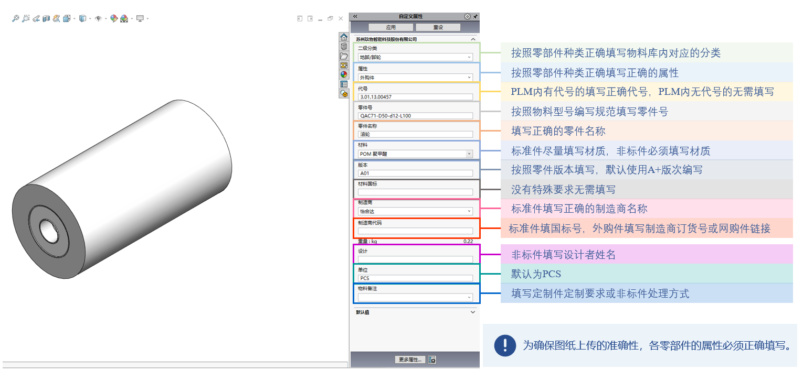

### 1.4 机加件材质选择

| **材料** | **使用范围**                     | **表面处理**                                       |
| -------- | -------------------------------- | -------------------------------------------------- |
| 6061     | 铝件优先选用                     | 阳极氧化本色、硬质阳极氧化、阳极氧化发黑、喷砂亮银 |
| 5052-H32 | 轻量化外观件                     | 阳极氧化本色、阳极氧化发黑、喷粉                   |
| 7075     | 重量有限制，强度要求高时选用     | 阳极氧化本色、硬质阳极氧化                         |
| 45       | 有一定强度要求、需要热处理的零件 | 镀硬铬、镀镍、发黑                                 |
| Q235B    | 普通加工件、焊接件               | 镀硬铬、镀镍、发黑、喷粉                           |
| 40Cr     | 高强度、韧性、塑性               | 镀硬铬                                             |
| SUS304   | 有防锈要求的零件                 | 抛光、拉丝                                         |
| GCr15    | 轴类                             | 涂防锈油或表面镀硬铬                               |
| POM      | 塑料件优先选用                   |                                                    |
| 冷轧板   | 钣金件                           | 喷粉                                               |
| 黄铜     | 铜件优先选用                     |                                                    |
| 有机玻璃 | 透明/透光零件                    |                                                    |
| 聚氨酯   | 非金属缓冲块优先选用             |                                                    |

- 设计时需根据工件位置、使用工况、加工难度、加工成本综合考虑。选用合适的材质及表面处理及热处理方式；

- 机加件材质属性必须正确填写，材质不对性能及成本可能相差极大。

### 1.5 3D设计颜色使用规范

- 红色：焊接件的加工面(安装面)
- 蓝色：精加工孔(销孔等)
- 白色：喷粉/烤漆的固定部件(安装面)
- 黄色：防护部件、移动部件(警示色)
- 灰色：非喷粉/烤漆钢件
- 青色：其它非钢铁金属材料
- 绿色：非金属材料
- 黑色：橡胶材料

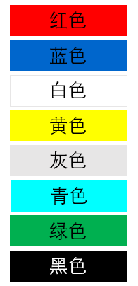

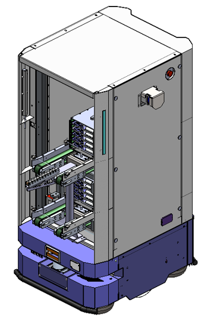

- 标准件可直接使用原始数模颜色；

- 普通过孔、通孔及螺纹孔可直接使用零件本体颜色，不需做额外设置；

- 为减少工作量，镀铬、镀镍、镀锌、发黑等均使用材料本色，不做颜色上的区分；

- 铝件、铜件应用场合区分明显，为减少工作量可不做颜色上的区分；

- 对于本规范中未定义的其它机构或零件，可以使用本规范中未提及的其它颜色，但应避免与本规范冲突或产生误解。

### 1.6 机械结构设计规范

一、结构要求

a)机械机构设计需符合人机工程学，方便人员操作与维修；

b)机械结构设计需经过计算，达到正常使用的强度要求，并在安全余量之内；

c)机械结构设计需根据我方具体要求，对关键点进行FEMA分析和验证；

d)机械结构总体设计需考虑经济、环保、安全的原则。

二、传动要求

a)传动设计需考虑传动效率最优化;

b)传动机构要求简单合理,以至少的环节实现功能；

c)传动设计需考虑现场噪音控制，尽一切可能降低噪音的产生；

d)电机、减速机、轴承等部件要求指定厂家或者品牌；

e)变频机电采用的范围：风机、需调速的传动机构、需要和传动机构配合的传动系统。

三、气动系统

a)气动系统应确保其安全性、系统的连续运行能力、可维护性和经济性,并能保证系统的使用寿命延长；

b)系统的所有部件应在设计上或者以其他保护措施，防止压力超过系统或者系统任何部份的最高工作压力及各具体元件的额定压力；

c)应考虑由于阻塞、压降或者泄漏等原因影响元件安全工作的后果；

d)无论是预期的还是意外的机械运动(包括加速、减速或者物体的提升/夹持) ,都不应造成对人员有危险的状态;

e)当排气造成的声压等级超过了合用的法规和标准的许可时，排气口应使用消声器。

四、润滑系统

a)所有传动部件关键转动、滑动部位均应有润滑点；

b)对于难以接近的润滑点，需外引至可接触位置,方便人员润滑；

c)若润滑点相对集中，需设计为集中润滑形式；

d)对于所有润滑点，必须提供润滑标准，包括：润滑油品型号、润滑周期、润滑方式等；

e)润滑系统总体设计需考虑经济性、安全性、可靠性。

## 2.工程图绘制

### 2.1 工程图模版

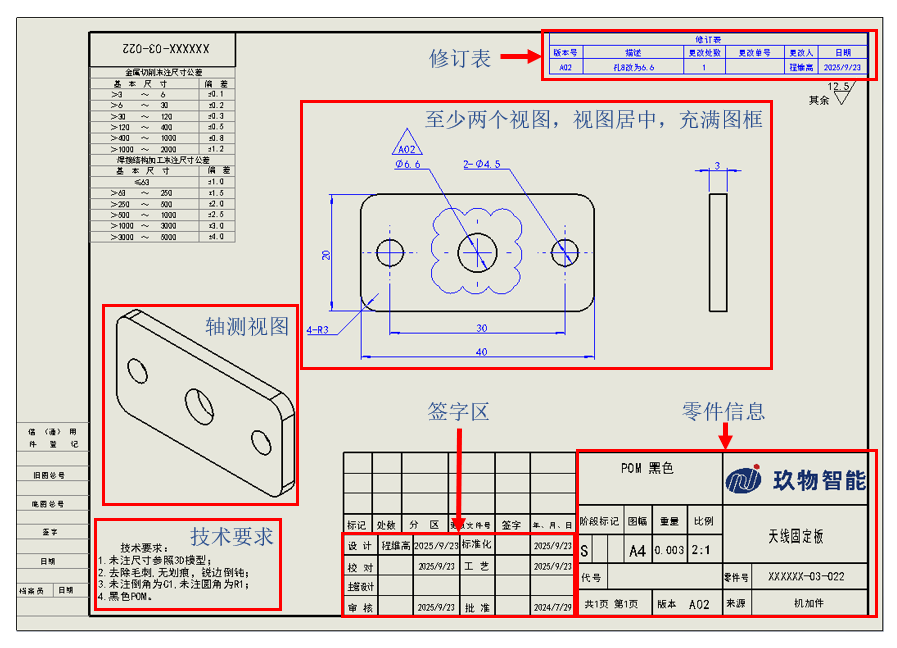

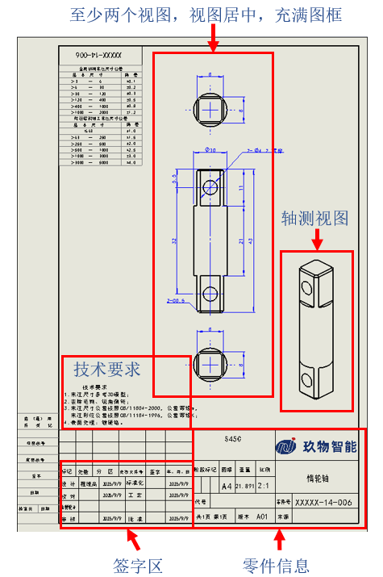

根据零件大小选择合适的图框及比例

### 2.2 图纸标注

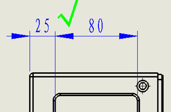

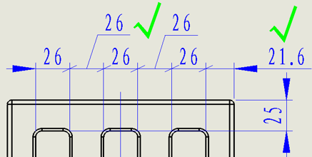

- 如果尺寸能放得下，尺寸数字优先放在尺寸线中间；正常情况箭头向外；如果箭头遮挡文字了，可以使用箭头向内；

- 如果尺寸太拥挤，可以将文字拉到尺寸线之外，放到侧面；

- 尺寸可以用斜线表示。如果尺寸仍拥挤，用等距文字命令将尺寸放在一边。

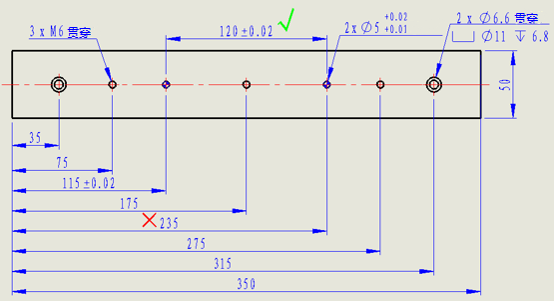

SolidWorks 中的尺寸链和自动标注能带来很多方便，但在使用的时候，比较重要的尺寸，一定要有尺寸连接，比如销钉孔。

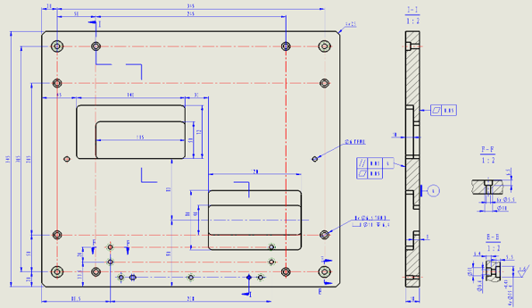

- 图面上尺寸不能太分散，影响读图速度，并且视图太多也容易出现漏尺寸的错误，因此出图时，需要尽可能多的在主视图上表达所有要素，其余都是辅助视图；

- 阶梯剖的运用，可以使几个端面在一个图上表达出来，从而节省图面空间，可以使视图显示的更大；

- 如果只表达很少一部分的要素，可使用局部剖，仅表达需要的部分，不需要把整个面剖开，从而使图面整齐，简洁；

- 原则上尺寸线应该在零件以外，但是对于大零件，需要表达的要素太多，周围摆不下的情况下，允许尺寸线放在里面。

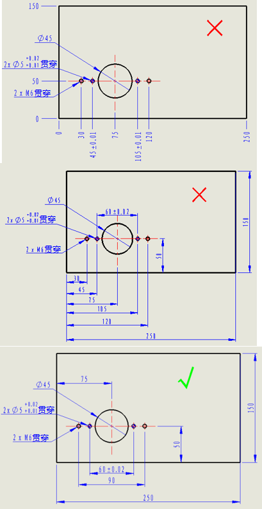

​        设计人员应该将设计基准放在第一位。很多小的特征，是局部中心对称的，标注时采用中心对称，容易读图，检验尺寸对不对，对加工人员来说，也知道要保证哪些特征间的尺寸。

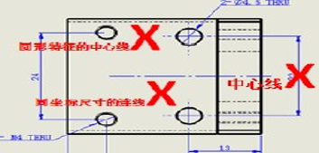

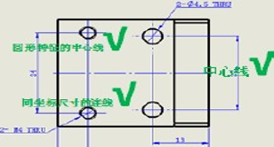

主视图中采用实线表示零件特征，中心对称的零件一定要显示出中心线，突出零件外端3-5mm，圆孔、圆柱等须标示出中心线。

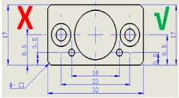

- 箭头及字体的类型须用模板规定箭头类型和字体；

- 箭头的指向 必须与注释文字放置的方向相反。

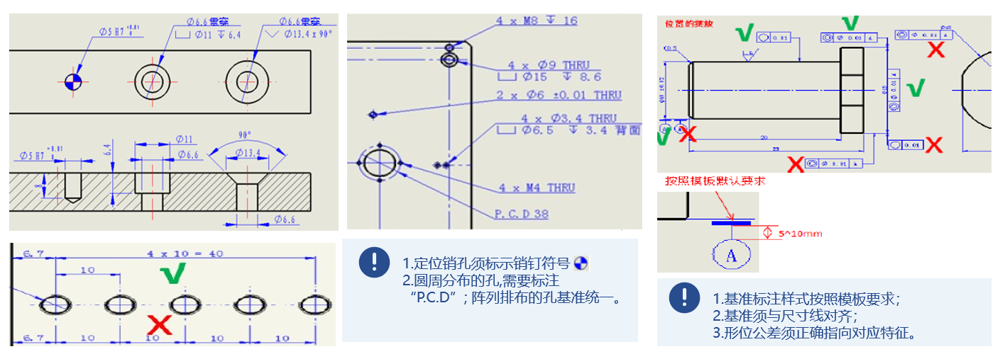

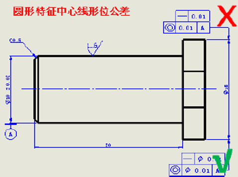

- 圆形特征中心相关的形位公差需要在数值前加直径符号；

- 同一要素上给出的形状公差应该小于位置公差值；

- 圆柱形零件的形状公差值（轴线的直线度除外）一般情况下应该小于其尺寸公差；

- 平行度公差值应该小于相应的距离公差值。

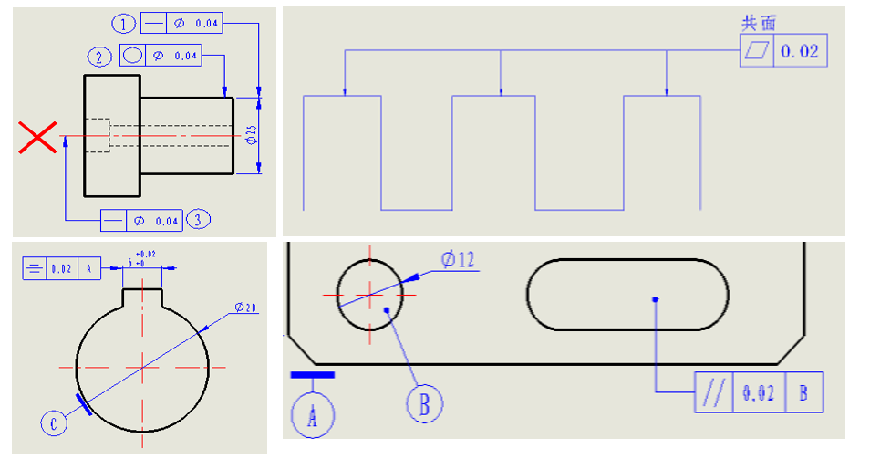

- 当被测要素为轴线或中心平面时，指引线的箭头应与该要素的尺寸线对齐；

- 当被测要素为线或表面时，箭头应指在该要素的轮廓线或其延长线上，并应明显地与尺寸线错开；

- 不连续的被测要素具有相同的形位公差，且共面时，标注如上；

- 基准要素和被测要素为表面时，用圆点指向实际表面；

- SolidWorks 中，基准和形位公差均可以吸附在尺寸线上，非常方便，用的时候注意对齐和不对齐的区别。

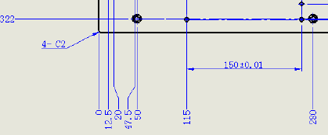

- 以边为基准的零件，特征较多时，优先选用坐标标注法。两个特征之间重要位置关系时，需单独标注；

- 仍不能满足要求，可选择孔表进行标注。

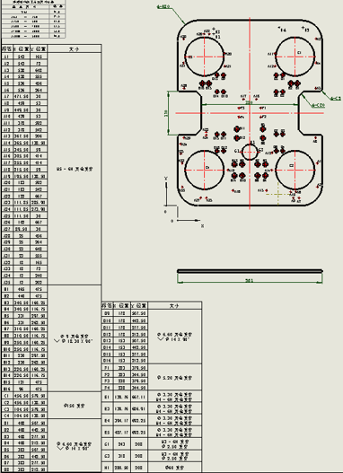

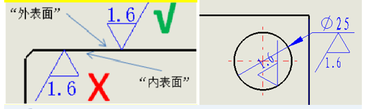

- 粗糙度符号标示在零件的加工外表面侧

- 尺寸较小的要素标注粗糙度时可标在尺寸上，或者用引线拉出

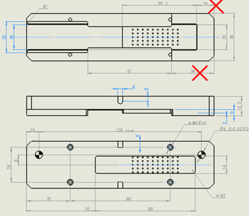

同一个零件的不同视图的基准尽量统一。

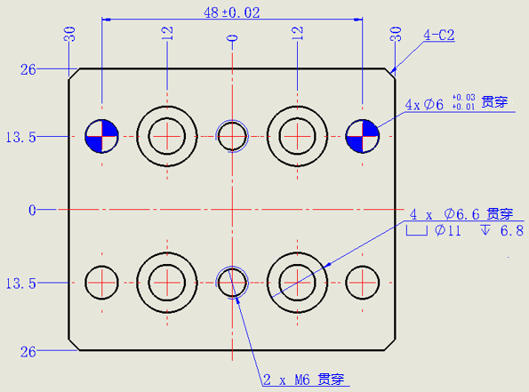

​        坐标标注时，也应遵循设计基准优先原则。原点不一定非要设置在边上，对于对称零件，原点也可以设置在中间。对于比较重要的特征，应该视情况，坐标标注和尺寸标注混合使用，使图面更美观。

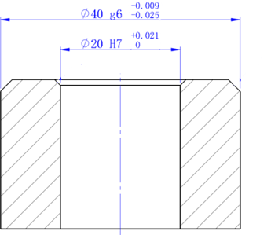

- 优先选用基孔制
- 优先选用公差配合：H7/h6、H8/h7、H7/g6

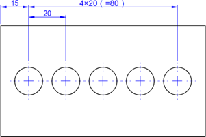

- 阵列排布的孔标注为个数X间距（=测量尺寸）

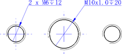

- 粗牙不标螺距； 细牙必须标螺距

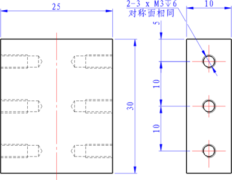

- 为保证图面简洁，对称面相同的孔可以只在一面标注。

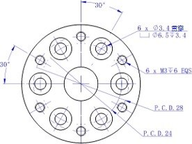

- . EQS 为英语“均布”的缩写，在 GB/T16675.2-1996 标准中采用此符号
- P.C.D. 中心节圆直径
- 角度标注：以XY轴为基准标注

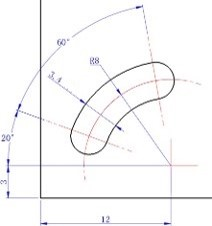

- 标注腰形孔中心圆半径和槽宽及定位角度和形状角度
- 角度标注：以XY轴为基准标注

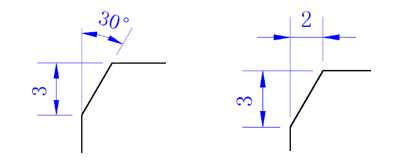

- 通过角度定义的倒角，分别标注倒角的一条边长和倒角的角度
- 通过长度定义的倒角，分别标注倒角的两条边长

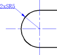

- 球头须标注倒角的个数×SR 倒角的半径,需标注中心线

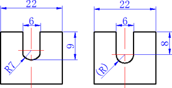

- 若半径不等于槽宽之半，应注半径尺寸
- 若半径等于槽宽之半，根据具体要求可不注半径尺寸，也可将其作为参考尺寸注或只注符号 R 而不注尺寸数字

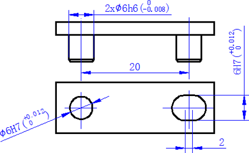

- 标注腰形孔中心圆半径和槽宽及定位角度和形状角度
- 角度标注：以XY轴为基准标注

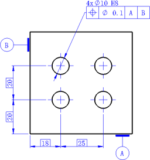

- 有位置度要求的尺寸对应的定位尺寸需要标理论正确尺寸（TED），数字加“□”

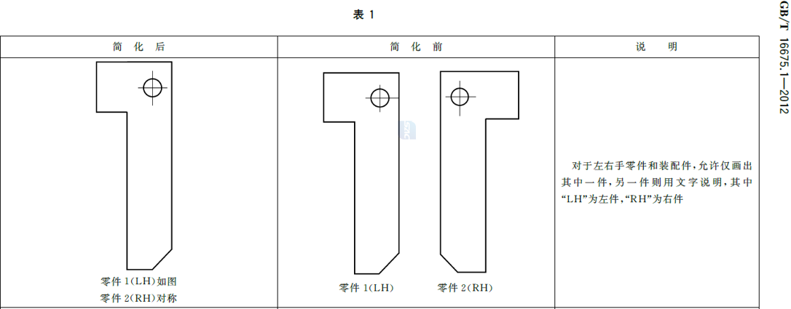

- 镜像件允许按照GB/T16675.1规定简化标注
- 在主视图右侧以点划线标示镜像线
- 在主视图下方标注清楚当前图纸对应的零件号及对应的镜像件零件号

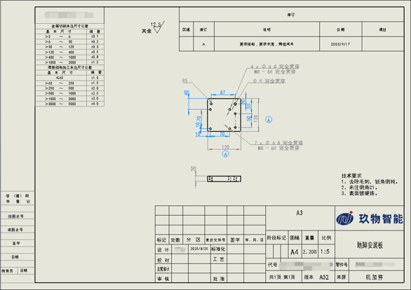

​                                                                                                                                        （×）

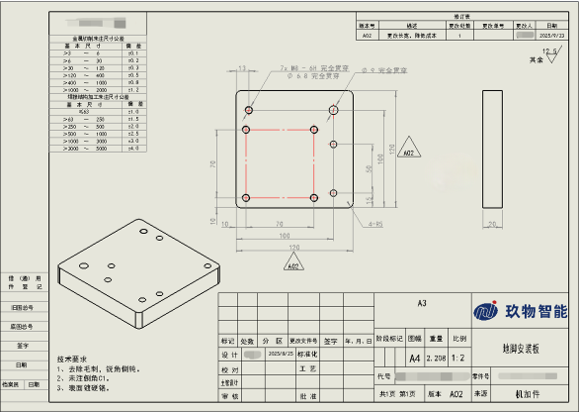

​                                                                                                                                        （√）

- 根据零件大小选择合适的比例，图纸尽量布满图框
- 选用正确的修订表，避免图表占用大量图纸空间
- 尺寸线均匀分布，能对齐的尺寸需要对齐
- 图纸上只允许存在一个基准
- 不允许存在多标注或漏标注
- 增加轴测视图

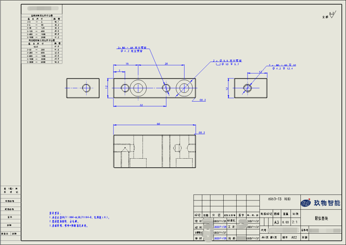

​                                                                                                                                      （×）

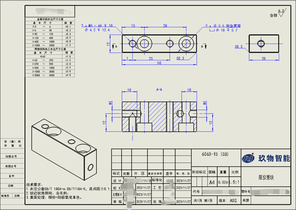

​                                                                                                                                    （√）

- 通过尽量少的视图完整表现所有特征
- 避免在虚线上标注尺寸，应选择剖视图表达， 剖视符号在视图正上方
- 尺寸线间隔均匀一致， 并避免交叉

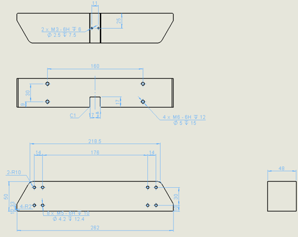

​                                                                                                                                      （×）

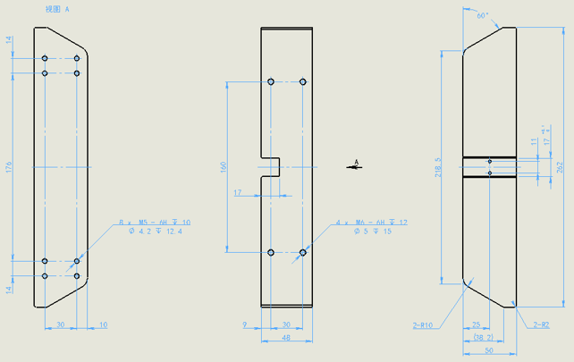

​                                                                                                                                    （√）

- 通过尽量少的视图完整表现所有特征
- 尺寸线间隔均匀一致，并避免交叉
- 避免尺寸重复标注，必要时重复尺寸或参考尺寸加括号（  ）
- 尺寸尽可能集中标注在视图外，局部结构细节尺寸可就近标注

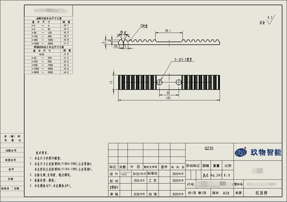

​                                                                                                                                      （×）

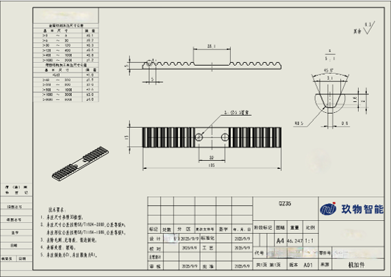

- 较小特征通过局部放大图标注

### 2.3 **公差与配合的选择原则**

一、基准制的选择：选择基孔制或基轴制，应从产品结构特点、加工工艺和经济性等方面综合考虑。

1.一般优先选用基孔制：加工方便，生产方便。

2.与标准件配合时，由标准件确定。下列情况下，一般采用基轴制：

a)当配合的轴为标准件时，以标准件为基准件。如：键与键槽的配合；滚动轴承外圈与孔的配合；

b)直接采用冷拉钢料做轴时，一般用于精度要求不高的机械中；

c)考虑一轴与多孔配合，且配合性质不同时。

3.必要时采用适当的孔、轴公差带组成的配合。

二、标准公差等级的选择：1.在满足使用要求的前提下，尽量使用低等级（＞IT7）。2.考虑到加工，下列情况降低一级选用：a)孔对于轴；b)细长孔/轴；c)距离较大的孔或轴；d)宽度较大的零件表面；e)线对线和线对面相对于面对面的平行度/垂直度。3.标准公差等级应用参考（见下表）

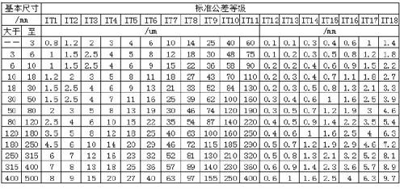

三、配合选择：常用公差配合选择参考表（见下表）

四、形位公差：

1.在同一要素上形状公差通常要小于位置公差（如两平行平面，平面度一般小于平行度）2.圆柱形零件的形状公差要小于尺寸公差（轴线的直线度除外）3.一般平行度公差值小于其对应的距离公差值。

五、基准原则：

1.尽可能设计基准与工艺基准一致2.不一致时，主要尺寸以设计基准标注，其他尺寸以工艺基准标注，方便加工与测量。

### 2.4 **表面粗糙度**

1.与轴承配合的轴或孔圆面：完全可以优先选用3.2，其次选用 1.6；

2.键槽：侧面选用 3.2，底面选用 6.3；

3.直线滑轨安装面，通常铣削加工而成：选用 3.2；若需要磨削精加工：选用 1.6；

4.大板的四周，若无配合要求：选用 6.3 或 12.5；

5.台阶轴或孔的过渡非配合面、退刀槽、卡簧槽、端面等：选用 3.2 或6.3；

6.过线、避位、减重等需要的孔和槽：选用 6.3；

7.非金属材料

(1)硬质，如赛钢 POM、尼龙、亚克力：选用 3.2或 6.3;

(2)软质，如优力胶：选用 6.3 或12.5 或去除材料符号；

8.对有粗糙度要求的不加工面,如机加件和铸造件不加工面：选用不加工符号+数字

| 表面粗糙度的运用 |                                             |                    |                                                     |                                                              |
| ---------------- | ------------------------------------------- | ------------------ | --------------------------------------------------- | ------------------------------------------------------------ |
| 序号             | Ra值不                              大于\μm | 表面状况           | 加工方法                                            | 应用举例                                                     |
| 1                | 25、50                                      |                    |                                                     | 粗加工后的表面，焊接前的焊缝、粗钻孔壁等                     |
| 2                | 12.5                                        | 可见刀痕           | 粗车、刨、铣、钻                                    | 一般非结合表面，如轴的端面、倒角、齿轮及皮带轮的侧面，键槽的非工作表面，减重孔眼表面 |
| 3                | 6.3                                         | 可见加工痕迹       | 车、镗、刨、钻、铣、锉、磨、粗绞、铣齿              | 不承要零件的配合表面，如支柱、支架、外壳、衬套、轴、盖等的端面。紧固件的自由表面，紧固件通孔的表面，内、外花键的非定心表面，不作为计量基准的齿轮顶圈圆表面等 |
| 4                | 3.2                                         | 微见加工痕迹       | 车、镗、刨、铣、刮1~2点/cm²、拉、磨、锉、滚压、铣齿 | 和其他零件连接不形成配合的表面，如箱体、外壳、端盖等零件的端面，要求有定心及配合特性的固定支承面如定心的轴间，键和键槽的工作表面，不重要的紧固螺纹的表面。需要滚花或氧化处理的表面 |
| 5                | 1.6                                         | 看不清加工痕迹     | 车、镗、刨、铣、铰、拉、磨、滚压、刮1~2点/cm²、铣齿 | 要求保证定心及配合特性的表面，如锥销与圆柱销的表面，与G级精度滚动轴承相配合的轴径和外亮孔，中速转动的轴径，直径超过80mm的E、D级滚动轴承配合的轴径及外壳孔、内、外花键的定心内径，外花键键侧及定心外径，过盈配合IT7级的孔(H7)，间隙配合IT8~IT9级的孔(H8,H9)，磨削的齿轮表面等 |
| 6                | 0.8                                         | 可辨加工痕迹的方向 | 车、镗、拉、磨、立铣、刮3~10点/cm²、滚压            | 要求保证定心及配合特性的表面，如锥销与圆柱销的表面，与G级精度滚动轴承相配合的轴径和外壳孔，中速转动的轴径，直径超过80mm的E、D级滚动轴承配合的轴径及外壳孔，内、外花键的定心内径，外花键键侧及定心外径，过盈配合IT7级的孔（H7)，间隙配合IT8~IT9级的孔(H8,H9)，磨削的齿轮表面等 |

### 2.5 **形位公差**

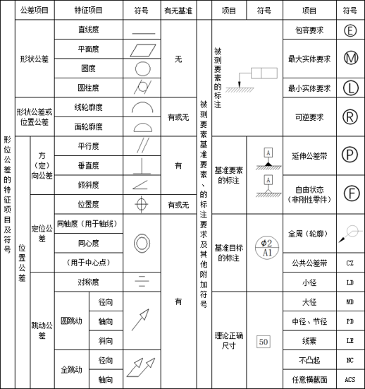

具体标注参照《公差符号及用法》

## 3.文件管理

​         接收项目设计任务后，机械工程师需根据项目号建立如图所示层级文件夹，所有文件必须按照规定放置在指定文件夹。

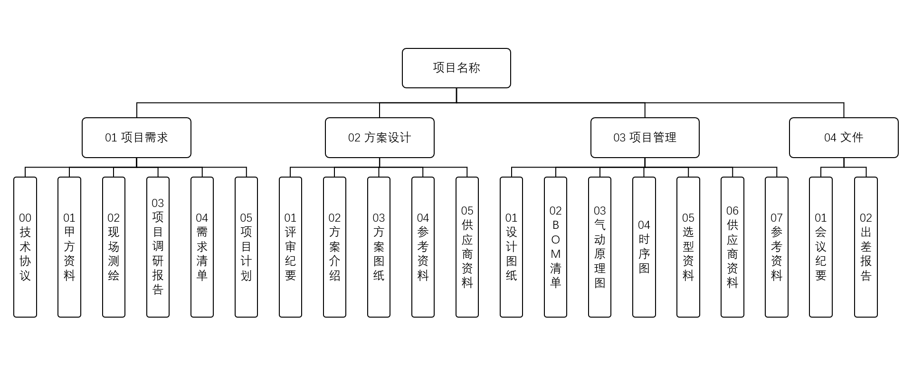

- 设计任务开始前认真阅读《机械设计流程》，确保设计全过程符合规范，避免造成不必要的麻烦。、