# 机械零部件设计禁忌-机械加工件结构设计

## 机械加工件结构设计

机械加工件结构设计概述
绝大多数金属材质的机械零件，均需经过机械加工方可装配至机械设备中投入使用。机械加工通常作为零件装配前的最终加工工序，其质量与成本直接对零件乃至整台设备的质量、成本产生重要影响。此外，机械加工工艺体系繁杂，所涉及的机床、刀具、夹具、量具等装备类型多样，且各类装备的性能、特点、精度及生产率存在显著差异。部分零件在机械加工流程中，还需穿插开展热处理、人工时效等辅助工序。因此，在零件设计阶段，必须充分考量机械加工工艺的适配性。
对于尺寸/重量超大、精度要求极高、尺寸极小、使用工况特殊、生产量极大等类型的特殊机械零件，其制造工艺往往具备极强的特殊性，设计时需重点关注。零件的可制造性，甚至可能成为决定某一设计方案是否可行的关键因素。
针对机械加工件的结构设计，本书着重提醒需关注以下要点：

1. 便于节约材料的零件结构设计；
2. 可减少机械加工工作量的结构设计；
3. 能减少手工加工及补充加工的结构设计；
4. 简化被加工面的形状及技术要求；
5.  便于夹持与测量的零件结构设计；
6.  避免刀具处于不利切削工况；
7.  合理设计轴与孔（含内、外表面）的配合结构。

### 1.节约材料的零件结构设计

注意减小毛坯尺寸

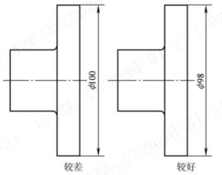

说明：凸缘结构采用圆钢直接车削加工成型。若凸缘设计最大直径为 Φ100mm，需选用 Φ105mm 或 Φ110mm 规格的圆钢作为坯料；若凸缘设计最大直径为 Φ98mm，则直接采用 Φ100mm 规格的圆钢即可满足加工需求，此举可显著提升钢材利用率，大幅降低原材料损耗。

### 2  减少机械加工工作量的结构设计

需考虑到铸造误差的影响

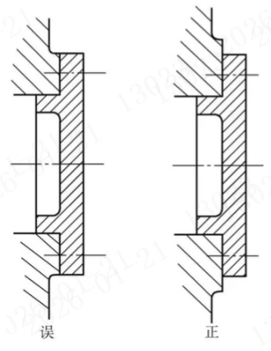

说明：铸造零件的尺寸误差相对较大，在设计铸件加工面时，需充分考量该因素对装配精度的影响。以轴承端盖与箱体凸台的配合装配为例，箱体凸台的加工位置难以保证极高的精度，若将端盖凸缘与凸台的设计直径设定为完全一致，受铸件误差的影响，装配后极易出现端盖凸缘凸出至凸台外缘的干涉问题。基于此，铸造箱体凸台的设计直径应适当增大，以此抵消铸件误差带来的装配风险。

不同加工精度表面需要分开

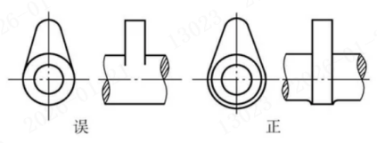

说明:当两个表面的粗糙度要求存在差异时，二者之间需设置清晰的分界结构。这种设计既便于后续加工工序的精准实施，又能使零件的外观形态更为规整美观。以凸轮零件为例，其工作表面需进行精加工处理，因此必须与轴身表面划分出明确的界限。

加工面与不加工面不应该平齐

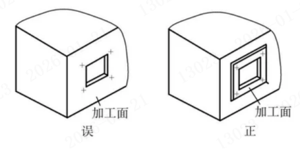

说明：当平面整体尺寸较大、仅局部区域需要加工时，应将待加工的局部区域设计为突出于非加工表面的结构形式，以此缩减机械加工的工作量。

需减小加工面的长度

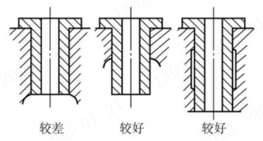

说明：当两个表面形成配合关系时，配合面需进行精密加工以保障配合精度；为在保证配合精度的前提下减小加工工作量，应合理缩短配合面长度。若配合面设计较长，为兼顾配合的稳定性与可靠性，可采用加大中间孔的结构设计，中间非配合区域无需进行精密加工。这种设计既简化了加工流程、降低了加工成本，又能有效保障配合效果。

在一次走刀中切出相对的两个沟槽能

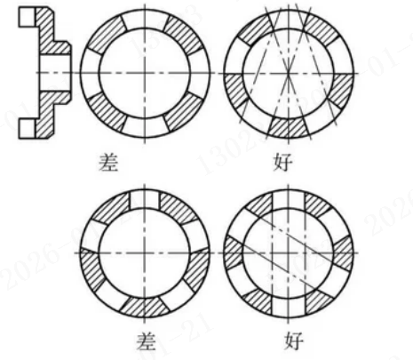

说明：图中所示零件表面开设有4～6道沟槽，若相对布置的两道沟槽可通过一次切削进给同步加工成型，便能有效提升加工效率、精简工艺流程。下文针对图中不同结构形式的沟槽，分别剖析其在设计合理性与加工可行性层面的优缺点，为后续方案比对及选型提供参考依据。

减少走刀次数

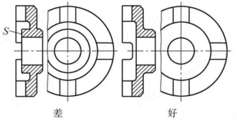

说明：右图所示零件表面开设有四道沟槽，相对布置的两道沟槽可通过一次切削进给同步加工成型，大幅提升加工效率。相比之下，左图零件因其中间轮毂凸起高度较大，无法实现成对沟槽的同步加工，需对每一道沟槽分别进行单独切削。

减少加工同一零件所用刀具数

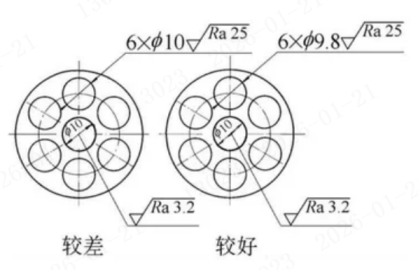

说明：加工一个零件所用刀具数应少，以提高效率。图示为一阀座，中间孔p10H7阀杆与之相配，表面粗糙度Ra3.2μm。周围六孔为液体流动通道，Φ10粗糙度Ra25μm。加工时要用不同的钻头。如将周围的孔改为p9.8，不影响使用性能，则中间孔同样用9.8钻
头钻孔后，再铰制即可

避免加工中的多次固定

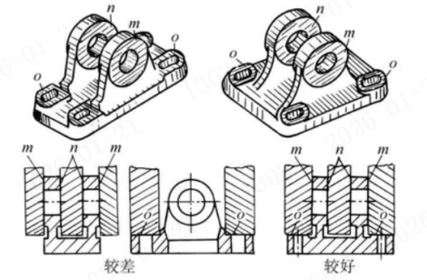

说明：加工机械零件的不同表面时，应尽量避免多次装夹，力求在一次装夹固定中完成尽可能多的表面加工。这种方式不仅能有效缩短加工周期、节约工时，更能减少多次定位带来的误差，显著提升零件整体加工精度。以图中所示机座为例，其原设计方案需先加工孔端面，再将零件翻转90°重新装夹，才能加工地脚螺钉凸台面；经结构优化后，两道工序可在一次装夹中同步完成，大幅提升了加工效率与精度稳定性。

减少加工同一零件所用刀具数（二）

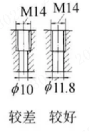

说明：图中所示 M14 螺纹孔，其下方配套加工有 Φ10 光孔。若将该光孔直径调整为与 M14 螺纹底孔尺寸（11.8 mm）一致，可显著提升加工操作的便捷性。

### 3.简化被加工面的形状和要求

避免复杂形状零件倒角

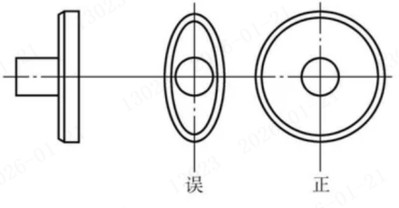

说明：箱形零件表面设有凸缘结构，用于与适配端盖形成配合。为确保端盖定位精准，除采用螺钉紧固外，特设计止口配合结构；该止口配合孔优先采用圆形结构，不建议选用矩形、正方形、椭圆形等其他异形结构，以保障配合精度与加工便利性。

必须避免非圆形零件的止口配合

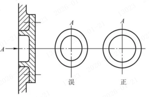

说明：在箱形零件表面有一凸缘与之相配。为使配上之盖定位准确，除用螺钉固定外，设计有止口配合，此配合孔宜用圆形，不宜用矩形、正方形、椭圆形等其他形状

避免采用方形凸缘

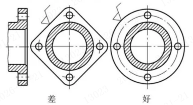

说明：左图所示凸缘外形呈方形结构，若需对其进行切削加工，需先完成车削工序，再转至铣床等其他类型设备上进行后续加工。与之不同，右图对应的凸缘结构可在车床上一次性完成全部形状的切削加工。

外圆上不宜有凸起

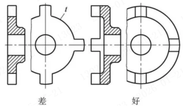

说明：左图凸缘的外圆表面存在凸起结构，致使外圆无法采用车削工序进行加工，进而造成整体加工效率下降。相较之下，右图的结构设计更为合理，可直接通过车削工序完成加工，操作便捷性显著提升。

将形状复杂零件改为组个合件以便于加工

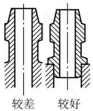

说明：大规格机座上需集成薄壁管状零件，该零件与机座主体尺寸差异显著，给加工工序带来诸多不便。对此，可采用装配式结构设计，将管状零件单独加工后再装配于机座之上，此改进方案更为合理，能有效改善加工工艺性。

将形状复杂的零件改为组合件以便于加工（一）

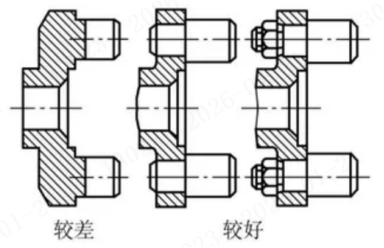

说明：带轴凸缘上设有两个偏心圆柱小轴，该结构的加工难度较大。若将此零件优化为组合式结构，采用装配式工艺对小轴进行单独加工后再装配，可有效提升零件的工艺性，降低加工难度。

避免多个零件组合加工

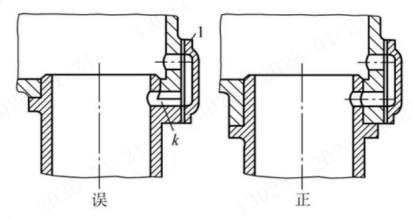

说明：如图所示，待加工零件由两部分组合而成，需在该组合件上完成钻孔与平面加工工序。原设计要求生产中必须将两零件配装后同步加工，导致零件无法实现互换性，工艺灵活性较差。经结构改进后，零件的工艺性得到明显改善，有效解决了互换性不足的问题。需明确的是，仅在特殊工况下选用组合零件加工方案才具备合理性，例如减速箱剖分式箱体、镶装式蜗轮等结构，其组合设计可适配复杂装配需求与加工场景。

避免采用多个加工工序

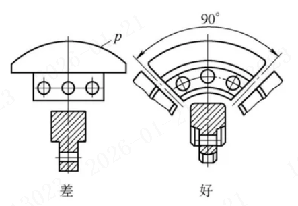

说明：左图所示结构需加工圆弧、平面、圆孔等多种形态特征，需经多道工序分步加工，且单次仅能完成一件零件的加工，效率偏低。相较之下，右图优化结构的加工流程更为高效，经车削加工后，依次完成钻孔、切割工序，单次加工可同步产出四件零件，大幅提升生产效率。

免不必要的补充加工

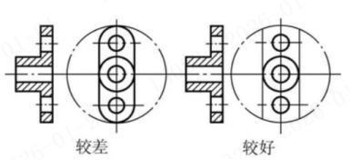

说明：部分零件的外形结构调整并不会对其使用性能产生影响，因此在设计阶段应优先选用加工难度更低的结构形式。以图中所示凸缘为例，其传统加工流程为：先通过车床加工成整圆结构，经铣削去除两侧余量后，再对两端进行圆弧加工。经实践验证，即便省去两端圆弧的后续加工工序，该凸缘的使用性能也可得到充分保障。

避免不必要的精度要求

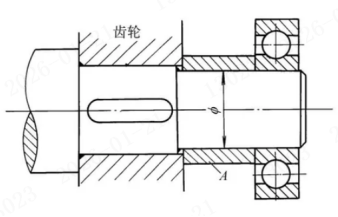

说明：图中所示轴系结构内，套筒 A 被用作齿轮与滚动轴承之间的定位元件。若套筒内孔与轴颈采用高精度紧配合方案，则不仅要求套筒两端端面具备良好的平行度，还需严格保证内孔轴线与端面的垂直度，以满足装配精度要求；若采用套筒内孔与轴颈大间隙配合的设计方案，则仅需确保套筒两端端面的平行度达到使用标准即可。

### 4.便于夹持、测量的零件结构设计

避免无测量基面的零件结构

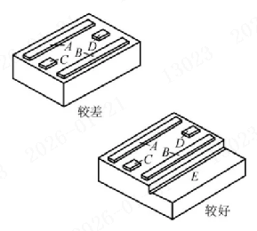

说明：零件的尺寸精度与几何公差设计，需兼顾测量作业所需的基准面。以图中铸铁底座为例，其 A、B 两处凸台表面需保证平行度（用于安装滚动导轨），C、D 两处凸台则需满足等高要求，且需与 A、B 面保持平行（用于安装丝杠轴承座）。但上述凸台表面宽度均仅为 20mm，导致各平面间的平行度测量作业难度较大；若在底座上增设测量基准面 E，则可显著降低测量操作难度，提升测量精度。

注意使零件有一次加工多个零件的可能性（一）

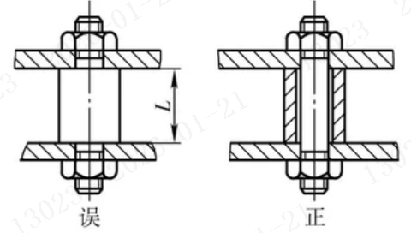

说明：图中定位轴的关键尺寸L需保证高精度。若将原有一体式结构拆分为定位套与固定螺柱两个独立零件，则定位套可通过平面磨床实现大批量高精度加工，更适配规模化生产需求。

注意使零件有一次加工多个零件的可能性（二）

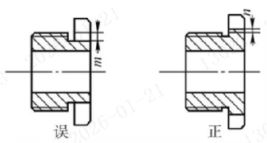

说明：图中所示螺母的扳手槽槽底相较于螺纹牙顶存在尺寸差值m，受结构限制，该槽道需采用插削等低效率加工工艺逐个加工。若对螺母结构进行优化改进，即可将多个螺母串装后批量加工，大幅提升生产效率。

避免无法夹持的零件结构

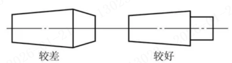

说明：机械零件进行切削加工（如车削工序）时，需装夹固定于机床夹具之上，因此零件结构上需具备便于装夹的部位。同时，装夹机构需提供足够的夹紧力，确保零件在切削力作用下不会出现松动、晃动等问题。基于此，零件需具备足够的结构刚度，避免因装夹受力而产生变形，影响加工精度。

### 5.避免刀具切削工作处于不利条件

合的零件结构形状不能采用与刀具形状不适

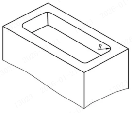

说明：如图所示矩形槽采用立铣刀加工，槽体四角的圆角半径需与铣刀半径保持一致。若设计要求的圆角半径过小，不仅会导致加工效率低下，还易造成刀具磨损或损坏。通常槽体深度越大，对应的圆角半径R应适当增大，以优化加工工况；同时应尽量避免设计需加工凹下方形孔的结构。

刀具容易进入或退出加工面

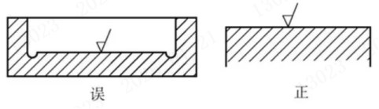

说明：刀具切入或退出加工表面时，均需预留一定的运动余量以保障作业顺畅。因此在零件结构设计阶段，需合理规划并预留充足避让间隙，避免刀具与零件非加工部位发生干涉，确保加工工序稳定开展。

避免刀具不能接近工件

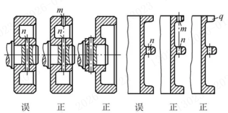

说明：机械加工所用的刀具与机床均有固定的结构及尺寸参数。若加工部位周围存在较长侧壁或上下凸起结构，可能会阻碍刀具运动，甚至导致无法完成加工。针对此类问题，需合理设置工艺孔、工艺槽，或优化零件结构形态，为加工操作预留足够空间。

避免刀具不能接近工件

说明：机械加工所用的刀具与机床均有固定的结构及尺寸参数。若加工部位周围存在较长侧壁或上下凸起结构，可能会阻碍刀具运动，甚至导致无法完成加工。针对此类问题，需合理设置工艺孔、工艺槽，或优化零件结构形态，为加工操作预留足够空间。

避免在斜面上钻孔

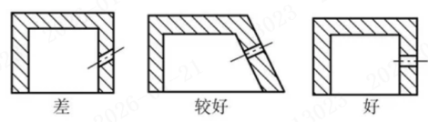

说明：避免在斜面上直接钻孔，此类操作不仅易导致孔位精度偏差，还会加剧刀具损耗。可通过调整孔的开设位置，或优化零件表面形态，使钻孔部位表面与孔中心线保持垂直，以此规避上述问题。

通孔的底部不要产生局部未钻透

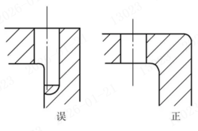

说明：如图所示通孔结构，若底部存在未钻透区域，钻孔过程中会产生不平衡力，极易造成钻头损坏，此类结构设计应尽量避免。

避免加工中的冲击和振动

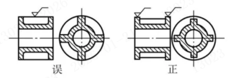

说明：车削、磨削等加工工艺属于连续切削，作业过程中不易产生振动，便于获得光洁度优良的工件表面。但若零件结构设计不合理，会引发断续切削现象，进而产生振动，既影响加工质量，又会缩短刀具使用寿命。例如图中所示肋板结构，在车削外圆时易产生切削冲击，适当降低肋板高度，可有效避免加工过程中的冲击与振动。

### 6.正确处理车轴与孔（内外表面）的结构

复杂加工表面要设计在外表面而不要设计在内表面上

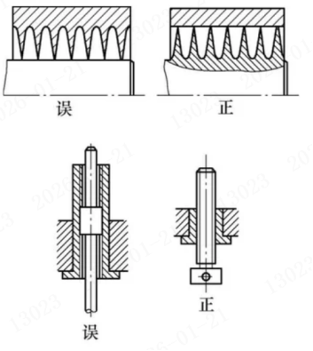

说明：轴类零件的加工难度低于孔类零件。因此当两个轴、孔配合件之间存在复杂结构时，将这些复杂结构设计在轴件上，相较于设计在孔的内表面，更利于降低加工难度、提升加工效率。

对中表面直径应该小

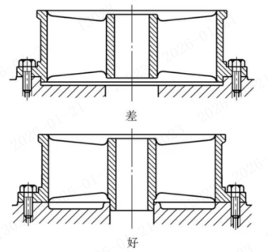

说明：图示为两款采用圆柱面对中定位的零件结构，上图对中面直径较大，下图对中面直径较小。由于小直径的轴与孔更易加工达到较高精度，因此下图的结构设计更具合理性。

用外圆和通孔作为对中面更好

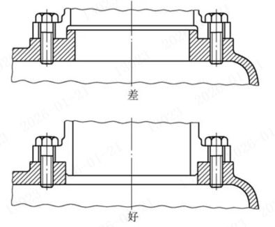

说明：上图所示的对中孔与对中轴加工难度较高，工艺性较差；而下图对应的对中结构加工流程更为简便，更适配批量生产需求。

在一次加工中得到的孔作为对中面效果更好

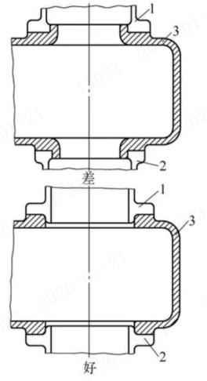

说明：零件1与零件2装配于零件3上方，要求两者中心线精准对中。上图中零件3的两个对中面需从双向进行加工，不仅操作繁琐，且难以保证对中精度；下图中零件3的两个对中孔可通过一次走刀镗削完成加工，既简化了工序，又能显著提升对中精度。