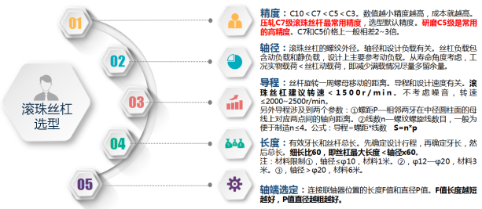
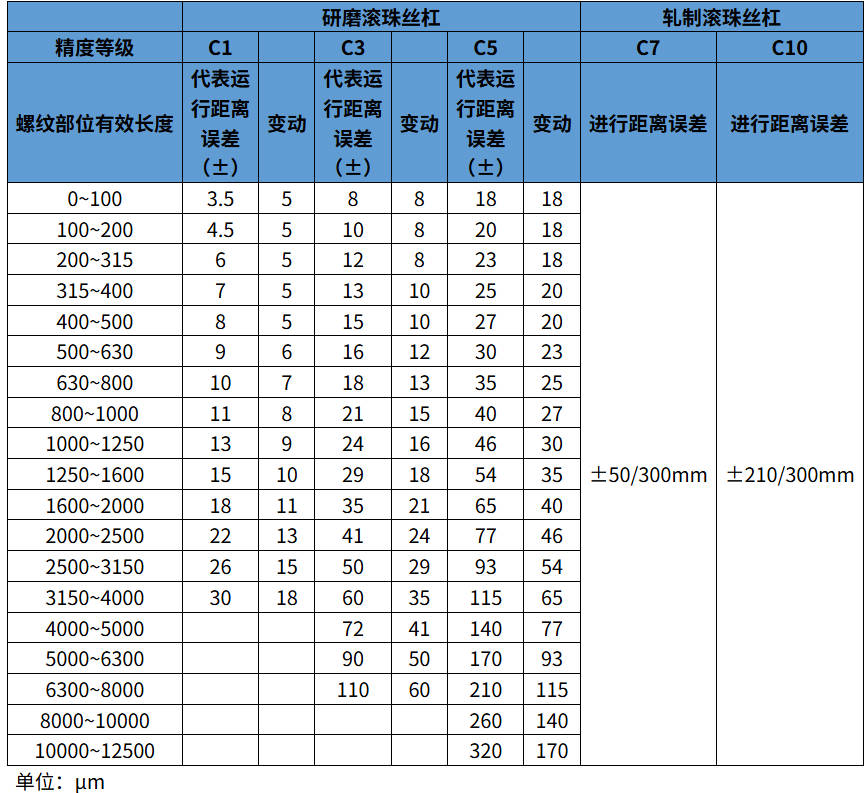

# 滚珠丝杠产品小知识

## 一、滚珠丝杠结构/定义

​        滚珠丝杠是一种传动部件，可以将旋转运动转换为轴向运动，或者进行相反的转换。滚珠丝杠包括一个滚珠丝杠轴、一个滚珠丝杠螺母(带有一个循环器)以及滚珠本身。 

## 二、滚珠丝杠的细长比

滚珠丝杠的细长比是指丝杠的轴长与其轴径的比值。

1.一般情况下，转速在1500~2000时，单旋滚珠丝杠的可选细长比不超过60，左右旋滚珠丝杠的细长比不超过40。

2.细长比过大，除了会导致丝杠使用精度下降之外，若不适当降低转速，还会使得丝杠产生危险共振而异响增大和寿命下降，严重的甚至直接变形，损坏报废。

3.推荐的细长比只是以往计算的经验总结，可以让工程师在工况要求基本相同的情况下做到快速选型，但是如若有更高的转速要求或者复杂工况，还是需要把相应的工况参数代入容许转速公式对轴径、容许载荷和寿命进行精确计算。

4.滚珠丝杠的运行噪声情况

滚珠丝杠作为传动零件，在运行时会不可避免地产生一些噪声。在相同载荷和转速下，不同精度等级和不同制作工艺的滚珠丝杠的噪声情况是不一样的：

5.容许载荷范围内，转速在1500~2000时，C7轧制丝杠噪声约为75分贝，C10等级丝杠噪声会在80分贝以上，而研磨丝杠噪声则在60分贝左右；

6.噪声情况会随着载荷和转速的增大而增大，所以在控制精度要求并不严格的情况下，如若需要较快的运行速度，可以通过选用更大导程的丝杠来改善整体结构运行的平稳性和噪声环境。

## 三、滚珠丝杠选型小知识

## 四、导程、精度说明

a、滚珠丝杠的导程精度,以JIS规格（JIS B 1192-1997）为标准进行精度管理。

b、精度等级C1～C5用直线性及方向性表示精度,C7～C10用有效行程长度300mm运行距离误差表示其精度。（以下为精度等级误差值）

