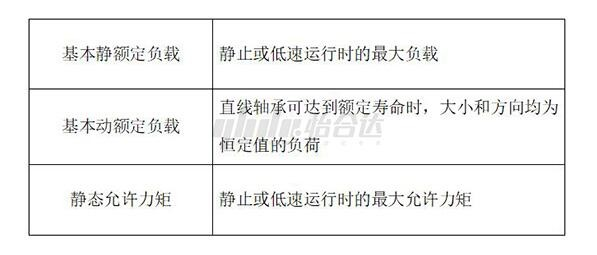
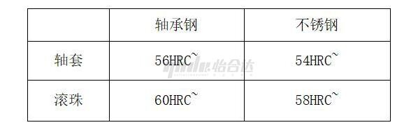
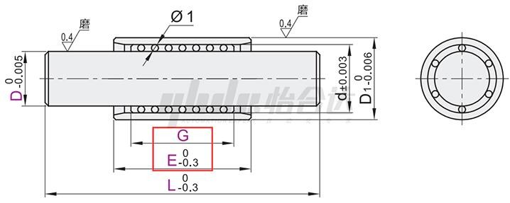

# 直线轴承介绍

## **1、直线轴承的负载与静态允许力矩**

为保证直线轴承的精度及寿命，通过实验确认了直线轴承的负载能力，并规定了直线轴承的基本静额定负载、基本动额定负载和静态允许力矩，其含义如下：

为保证直线轴承的寿命，在计算系统允许负载时，直线轴承取基本动额定负载计算。

由于短型，单衬型等直线轴承长度过短，实际使用过程中不建议承受力矩。在直线轴承选型表中，中型长度以上直线轴承才会给出允许静态力矩参数。

## **2、直线轴承的硬度**

直线轴承受力部分是轴套和滚珠，这两部分的硬度会影响到直线轴承的使用，其硬度如下：

一般与直线轴承配合的轴表面硬度58HRC左右，由于导向轴表面硬度低于滚珠硬度，如直线轴承安装不当造成轴承与轴磨损的情况，轴表面会先出现明显划痕。

## **3.线性滚珠衬套**

产品特性：线性滚珠衬套作为特殊形式的直线轴承，结构上可以满足同时做直线运动和旋转运动的条件，但轴向行程有限线性滚珠运行。

线性滚珠衬套内部的保持架与普通直线轴承不同，保持架上的每一个滚珠都有独立的滚珠槽，滚珠槽比滚珠稍大，留有间隙给滚珠自由滚动，滚珠滚动时，会带动轴套和轴的相对运动，由于轴套长度有限，保持器必须在轴套的范围内运动，所以线性滚珠衬套的轴向运动行程有限。

若线性滚珠衬套直线运动超过行程继续运行，滚珠将会在轴面滑动，与轴面摩擦，最后造成滚珠磨损脱落，轴面出现划痕的结果。最大行程可参考线性滚珠衬套选型表。

产品特性：微型滚珠衬套导向组件结构与运动原理与线性滚珠衬套类似，区别在于微型滚珠衬套导向组件将各个结构独立成配件，各配件定制化程度高，可根据实际情况选用。另外，该类产品比线性滚珠衬套精度更高，由于精度及工艺原因，整体制作成本比同轴径的线性滚珠衬套更高。

衬套可根据需求定制结构尺寸，滑套可定制尺寸，因此存在行程计算问题：

设衬套长度E，滑套长度G；完美行程L：L=（E-G）2，E＞G时才会存在完美行程（滚珠滑套完全保持在衬套范围内）完美行程示意，极限行程L：L=（E-G）2+2G  （两倍衬套距离），极限行程时，滑套最低需留在衬套的长度为1/2G 。