# 聚氨酯类-产品知识介绍

## **一、什么是聚氨酯**

​        聚氨酯（PU），全名为聚氨基甲酸酯，是一种高分子化合物。1937年由奥托·拜耳等制出此物。聚氨酯有聚酯型和聚醚型二大类。他们可制成聚氨酯塑料（以泡沫塑料为主）、聚氨酯纤维（中国称为氨纶）、聚氨酯橡胶及弹性体。

​        **软质聚氨酯**主要是具有热塑性的线性结构，它比PVC发泡材料有更好的稳定性、耐化学性、回弹性和力学性能，具有更小的压缩变型性。隔热、隔音、抗震、防毒性能良好。因此用作包装、隔音、过滤材料。

硬质聚氨酯塑料质轻、隔音、绝热性能优越、耐化学药品，电性能好，易加工，吸水率低。它主要用于建筑、汽车、航空工业、保温隔热的结构材料。

​        **聚氨酯弹性体性能介于塑料和橡胶之间，耐油，耐磨，耐低温，耐老化，硬度高，有弹性。**主要用于制鞋工业和医疗业。聚氨酯还可以制作粘合剂、涂料、合成革等。

（注：以上出自百度百科https://baike.baidu.com/item/%E8%81%9A%E6%B0%A8%E9%85%AF）

## **二、什么是聚氨酯弹性体**

​        **聚氨酯弹性体**由于其结构具有软、硬2个链段，因此可以通过对分子链的设计，赋予材料**高强度、韧性好、耐磨、耐油**等优异性能，被称为“耐磨橡胶”的聚氨酯同时具备了橡胶的高弹性和塑料的刚性。

​        聚氨酯弹性体用的原料主要有三大类，即**低聚物多元醇、多异氰酸酯和扩链交联剂**。除此只外，有时为了提高反应速率，改善加工性能剂制品性能，降低成本等目的，还需加入某些配合剂（催化剂、水解稳定剂、阻燃剂、溶剂、脱模剂、抗静电剂、着色剂、防霉剂等）。

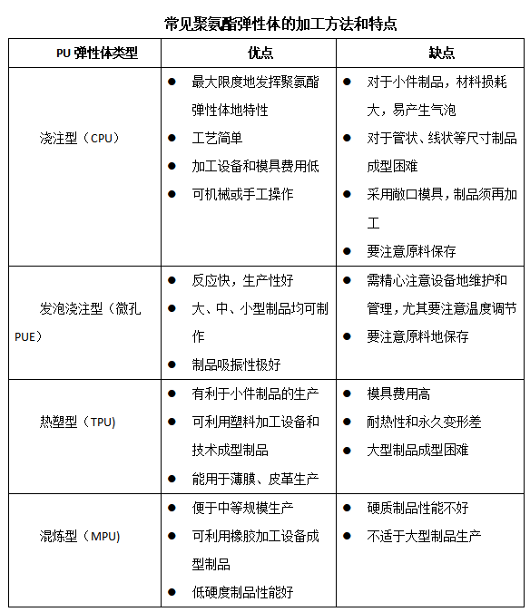

## **三、什么是浇注型聚氨酯弹性体（CPU）**

​         其中浇注型聚氨酯弹性体（CPUE），简称浇注型聚氨酯（CPU）或聚氨酯浇注胶。“浇注型”是指制品在成型前物料体系为液体，可浇注，反应固化直接成型制品的一种化学加工方法，而且该物料体系中原则上不含挥发性液体。因为成型前该物料体系为液体，而TPU和MPU制品在成型前为固体，所以也可把CPU称为液体橡胶或液体弹性体。与TPU和MPU相比，CPU的原材料选择范围更大，产品硬度范围更宽（邵氏5A到邵氏85D),特别适用于大中型制品的生产，弥补了TPU和MPU制品工艺的局限和不足，可最大限度发挥聚氨酯弹性体的性能优势，拓宽聚氨酯弹性体的应用领域。（注：以上出自《聚氨酯弹性体手册》第二版，或者http：//www.cip.com.cn）

## **四、CPU弹性体的分类**

​         CPU弹性体是将液体反应混合物浇注到模腔中成型的化学体系。按期所用原料体系和加工工艺的不同而有不同的分类。

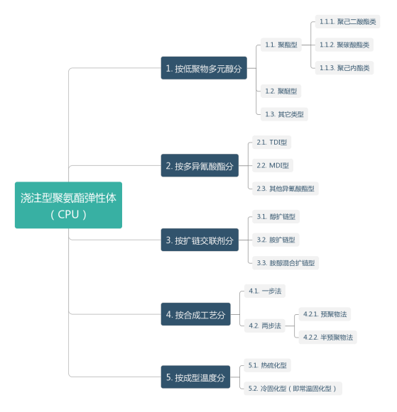

​                                                          （注：以上图片出自《聚氨酯弹性体手册》第二版，或者http：//www.cip.com.cn）

## **五、CPU弹性体的主要工艺路线**

​        目前最常用的工艺为预聚物法，所谓的预聚物法就是将低预聚物多元醇和二异氰酸酯在一定条件下合成预聚物，然后再将预聚物与扩链交联剂混合浇注而成型的方法。

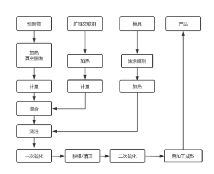

## **六、聚氨酯弹性体的特性**

​        聚氮酯弹性体综合性能出众，其他橡胶和塑料都无与伦比。而且聚氨醋弹性体几乎能用高分子材料的任何一种常规工艺加工，所以应用十分广泛，它的产品几乎遍及所有领域。

​        聚氨酯弹性体的原材料、配方和成型方法选择空间大，综合性能好，能兼备橡胶、塑料、涂料、胶黏剂、纤维的诸多特性。

1.  硬度范围宽，低至邵尔A0以下，高至邵尔D90。而且在高硬度下仍具有良好的橡胶弹性和扯断伸长率，在低硬度下具有较好的力学性能。

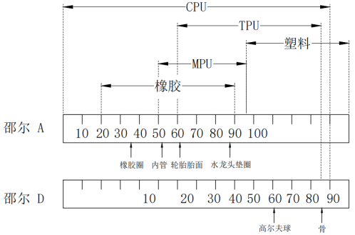

​                                                                                                            （聚氨酯弹性体硬度范围图）

2. 力学性能好。在橡胶硬度下拉伸强度和撕裂强度比通用橡胶高；在塑料硬度下，它们的冲击强度和弯曲强度又比塑料高得多。

   3. 耐磨。享有“耐磨橡胶”的佳称。

   4. 耐油。聚酯型聚氨酯弹性体的耐油性能不低于丁腈橡胶，与聚硫橡胶相当。

   5. 粘接性能好。与金属、木材、陶瓷、极性高分子等材料粘接良好。

   6. 抗辐射、耐臭氧性能优良。

   7. 聚醚型聚氨酯耐水、耐霉菌性能好。

   一般 聚氨酯弹性体性能的不足方面是内生热大，耐热性特别是耐湿热性能不好，原材料成本较高。

   （注：以上图片出自《聚氨酯弹性体手册》（第二版），或者http：//www.cip.com.cn）

## **七、聚氨酯弹性体的应用**

聚氨酯弹性体具有许多宝贵的性能，应用领域极广。在应用研究中除了根据使用环境正确选用胶种外，也要根据制品在使用中的受力情况选择合适的硬度。

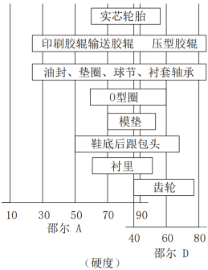

​                                                                                                         （聚氨酯弹性体硬度与应用的关系图）

​                                                                （注：以上图片出自《聚氨酯弹性体手册》第二版，或者http：//www.cip.com.cn）

 常见的FA工厂自动化聚氨酯相关的零部件如下：

1. 聚氨酯减震材料

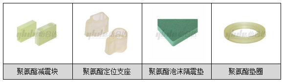

2. 聚氨酯气动用管

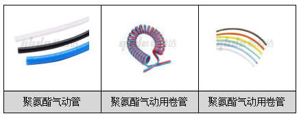

3. 聚氨酯同步带

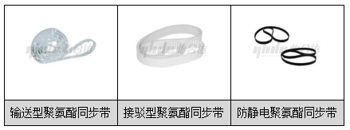

4. 气动配件类

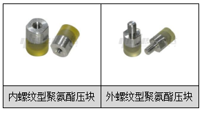

5. 聚氨酯脚轮

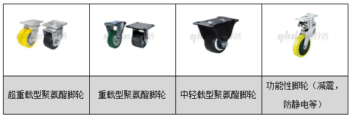

6. 聚氨酯滚轮类

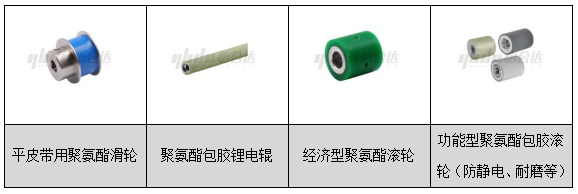

  7.聚氨酯包胶轴承类

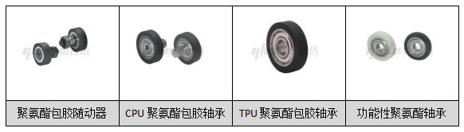

8. 聚氨酯包胶紧固件

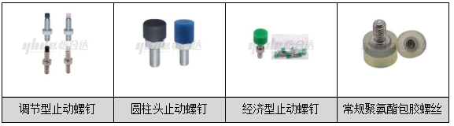

## **八、聚氨酯弹性体的相关注意事项**

1. 聚氨酯产品无毒，对人体、大气、水质和土壤几乎没有危害和污染；

聚氨酯弹性体废品和边角料自身无毒，对人体无害，可以碎成颗粒压制成地面铺装材；

   2. 关于聚氨酯的颜色问题，由于聚氨酯颜色受使用的不同扩链交联剂影响，制品会呈现不同的颜色，常见的聚氨酯本色为透明浅绿色（也可叫做绿色、透明或者自然色），也有一些交联剂做成的制品为无色透明或者乳白色等；

   由于聚氨酯会受到紫外线的影响，长时间曝光照射会出现颜色变黄，这是属于正常现象，对制品的性能几乎没有影响，当然也可以添加一些光稳定剂延长出现黄变出现的时间；

（注：以上出自《聚氨酯弹性体手册》第二版，或者http：//www.cip.com.cn）