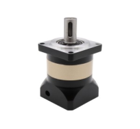
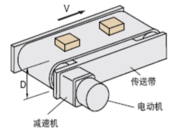

# 行星减速机-产品知识介绍

## **一、行星减速机**简介

​        行星减速机是一种用途广泛的工业产品，通过行星齿轮传动原理来实现减速功能，也被称为行星齿轮减速机，其工作原理和结构使其在诸多领域具有重要应用价值。

## 二、行星减速机结构组成(ZJU系列）

| 组成结构 | **说明**                                                     |
| -------- | ------------------------------------------------------------ |
| ● 太阳轮 | 位于减速机的中心位置，是动力输入的关键部件。它与电机轴相连，接收电机传递的高速旋转动力，并将其传递给周围的行星轮。 |
| ● 行星轮 | 通常有多个，均匀分布在太阳轮周围，并与太阳轮和内齿圈同时啮合。行星轮在太阳轮的带动下，既围绕自身轴线自转，又围绕太阳轮公转。 |
| ● 内齿圈 | 固定在减速机的外壳上，为行星轮提供了一个稳定的旋转轨道。它与行星轮相互作用，共同实现减速和扭矩传递的功能。 |
| ● 行星架 | 用于支撑行星轮，使其能够稳定地进行自转和公转运动。行星架通常与输出轴相连，将经过减速后的动力传递给外部设备。 |
| ● 润滑脂 | 润滑采用润滑脂，免维护。                                     |

## 三、**行星减速机特点**

| 特点   | 说明                                                         |
| ------ | ------------------------------------------------------------ |
| 高精度 | 传动精度较高，可以实现精确的运动控制，适用于对精度要求较高的场合。 |
| 高刚性 | 内部结构紧凑，行星齿轮与各部件之间的啮合紧密，能够承受较大的负载和冲击力，确保在重载工况下稳定运行。 |
| 高效率 | 行星齿轮传动系统的传动效率较高，一般可达到90%以上，能够有效减少能量损失，提高能源利用效率。 |
| 高扭矩 | 通过合理的齿轮传动比设计，可以在输出端获得较大的扭矩，满足不同设备对扭矩的需求。 |
| 体积小 | 相较于其他类型的减速机，行星减速机的结构更加紧凑，体积更小、重量更轻，便于安装和使用。 |

## 四、**产品典型应用场景**

| **行业**   | **应用案例**                 |
| ---------- | ---------------------------- |
| 工业自动化 | 工业机器人、自动化生产线     |
| 输送线     | 丝杠模组，同步轮同步带动力源 |
| 3C行业     | 转盘结构                     |
| 包装机械   | 瓶盖旋盖机、贴标机等设备     |

​        适用于不同尺寸，位置确认的产品，以同步轮，齿轮，联轴器等为转接载体，减速增大力矩，提供控制旋转定位，到达固定位置，进行下一步工作，如下图所示为传送带结构。

​                                                                                                                   图示1 传送带结构模型图

## 五、**选型计算**

选型需综合考虑旋转惯量、产品负载输出扭矩等参数，主要计算步骤如下：

### （1）行星减速机选型示例计算：

案例：客户现场使用一个传送带的传送装置，了解得知，客户现场需要承载100kg的重物运行，每分钟持续运行20M距离，一共两个滚轮，单个滚轮直径200mm，重量6kg，需求是一个动力源，准备用伺服电机加行星减速机的方式，但不确定需要多大的电机，是否需要减速机。

计算过程：

需要确定三点：1.输入端的转速(得满足运动速度和有调整的空间)

​                2.输入端的扭矩（满足动力，并有安全的空间）

​                3.电机的惯量倍数（满足电机情况，超过电机运行抖动）

1. 输入端1min最少需要转动的圈数=20000/3.14/200=31.85

2. 输入端的扭矩（持续运行仅考虑摩擦力乘以安全系数2，其余力暂且忽略）2*重量*g摩擦系数半径F=2*100*10*0.1*0.2/2=20NM

3. 负载的运行惯量

皮带和工作物的惯量：重量乘以半径的平方：100*0.1*0.1=1kgm2

单个滚筒的惯量：重量乘以半径的平方/2：6*0.1*0.1/2=0.03kgm2

总的惯量：皮带和工作物的惯量+两个滚筒的惯量：1+0.03*2=1.06kgm2

简单确认后，开始根据电机进行确认，惯量和扭矩的匹配，选定400w伺服电机，加一个50比减速机。反过来验算一遍，输入端接近32转/min，50比，电机转速1600符合要求（3000转/min）

20NM/50=0.4NM，在400w电机扭矩范围内

惯量倍数：1.06*10000/50/50/0.27=15.7（电机推荐惯量倍数30内，常规使用建议惯量接近一半）

注：若有其他搭配满足惯量，扭矩和转速的也可以，根据电机与减速机的相关参数进行确认，挑选满足条件的组合，从而确认使用哪一款减速机和电机适配。

### (2) 关键参数说明

| **参数**     | **说明**                                         |
| ------------ | ------------------------------------------------ |
| 额定扭矩     | 不同规格，不同速比的行星减速机可承载的扭矩不同。 |
| 工作温度     | -20℃~80℃                                         |
| 平均使用寿命 | 20000h                                           |
| 防护等级     | IP65                                             |
| 工作环境     | 干燥，通风良好、高温等特殊需求需添加特定润滑脂。 |

###  (3)行星减速机安装说明

1.确认电机与减速机安装尺寸无误后，清理表面异物。

2.取下减速机上的防尘塞，调整位置可以看到锁紧环螺丝，并拧松螺丝。

3.将减速机放置桌面固定，电机轴水平对准安装孔装入。

4.先锁任意对角螺丝（请勿拧紧），再锁另外两个螺丝，最后依次拧紧四颗螺丝。

5.锁紧锁紧环螺丝，并将防尘盖安装上，减少灰尘进入。

## 六、**注意事项**

**严禁超载：**不得超过额定扭矩和轴向/径向负载（参考图纸说明）。

**散热要求：**环境温度超过40℃时，需增加散热装置（如风扇）。续工作时应监控油温（一般≤80℃）是属于正常工作范围。

**密封保护：**避免水、粉尘进入壳体，定期检查密封圈是否老化。

**试运行：**空载运行10分钟，检查是否有异响、振动或过热。逐步加载至额定负载，观察运行状态。