# 轴的强度计算

- 按扭转强度或刚度计算
- 按弯扭合成强度计算
- 精确强度校核计算

## 按扭转强度或刚度计算

**按扭转强度及刚度计算轴径的公式**

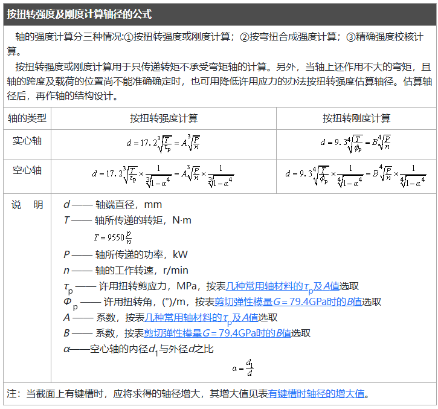

### 几种常用轴材料的τρ及A值

|          |            |                      |         |            |                                              |
| -------- | ---------- | -------------------- | ------- | ---------- | -------------------------------------------- |
| 轴的材料 | Q235-A、20 | Q275、35(1Cr18Ni9Ti) | 45      | 1Cr18Ni9Ti | 40Cr、35SiMn、42SiMn、40MnB、38SiMnMo、3Cr13 |
| *τ*p/MPa | 15~25      | 20~35                | 25~45   | 15~25      | 35~55                                        |
| *A*      | 149~126    | 135~112              | 126~103 | 148~125    | 112~97                                       |

注：1．表中所给出的*τ*p值是考虑了弯曲影响而降低的许用扭转切应力。

​        2．在下列情况下*τ*p取较大值、*A* 取较小值：弯矩较小或只受扭矩作用、载荷较平稳、无轴向载荷或只有较小的轴向载荷、减速器的低速轴、轴单向旋转。反     之，*τ*p取较小值、*A*取较大值。

​        3．在计算减速器中间轴的危险截面处(安装小齿轮处)的直径时，若轴的材料为45钢，可取 *A*＝130~165。其中二级减速器的中间轴及三级减速器的高速中间轴取 *A*＝155~165，三级减速器的低速中间轴取 *A*＝130。

#### 剪切弹性模量G=79.4GPa时的B值

|           |      |      |      |      |      |      |
| --------- | ---- | ---- | ---- | ---- | ---- | ---- |
| *Φ*p(°)/m | 0.25 | 0.5  | 1    | 1.5  | 2    | 2.5  |
| *B*       | 129  | 109  | 91.5 | 82.7 | 77   | 72.8 |

注：1.表中*Φ*p值为每米轴长允许的扭转角。

​        2.许用扭转角的选用，应按实际情况而定。推荐供参考的范围如下：对于要求精密、稳定的传动，可取*Φ*p＝0.25~0.5(°)/m；对于一般传动，可取*Φ*p＝0.5~1(°)/m；对于要求不高的传动，可取*Φ*p大于1(°)/m，起重机传动轴，*Φ*p＝15'~20'/m；重型机床走刀轴，*Φ*p＝5'/m。

## 按弯扭合成强度计算

当作用在轴上载荷的大小及位置已确定，轴的结构设计也已基本确定时，可按弯扭合成法进行计算，一般转轴用这种计算方法即可，是偏于安全的。计算步骤如下。

① 画出轴的受力简图。当轴的跨度相对较大时，作用在轴上的载荷(如齿轮传动或带传动作用在轴上的力)均按集中载荷考虑，力的作用点取轮缘宽度的中点；轴传递的转矩则从轮毂宽度的中点算起。如果作用在轴上的载荷不在同一平面内时，则将其分解到相互垂直的两个平面内。

通常把轴视为置于铰链支座上。当采用滚动轴承或滑动轴承支承时，支点位置可参考下图确定，图b中a值见“滚动轴承”。

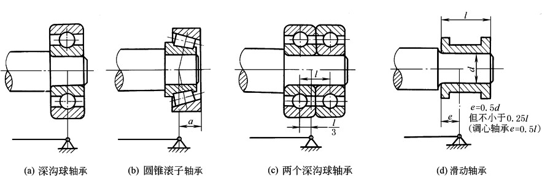

② 作出垂直面和水平面内的受力图及相应的弯矩图，再按矢量法求得合成弯矩。当轴上的轴向力较大时，还应计算由此引起的正应力。

③ 画出转矩图。

④ 确定危险截面。危险截面应取承受弯矩、转矩大，截面尺寸较小，应力集中较严重的截面。

⑤ 按“轴的常用材料”节选择轴的材料，并根据表轴的许用弯曲应力选取许用弯曲应力。

⑥ 按表按弯扭合成强度计算轴径的公式所列公式进行弯扭合成强度计算。

⑦ 将计算出的轴径圆整成标准直径。

#### 轴的许用弯曲应力

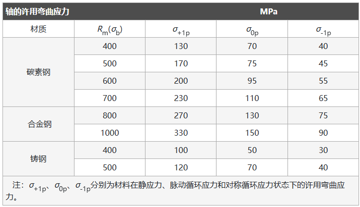

#### 按弯扭合成强度计算轴径的公式

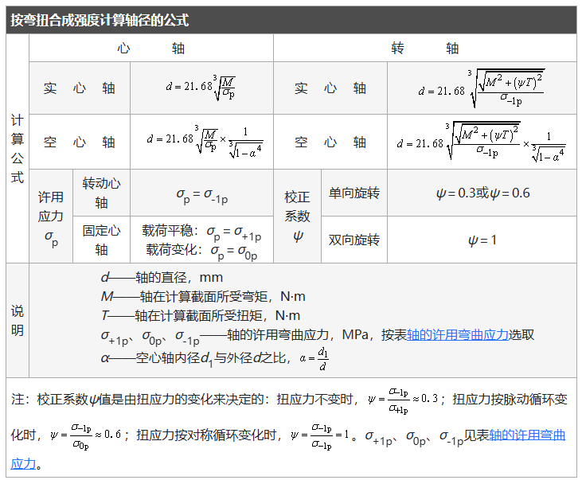

#### 有键槽时轴径的增大值

如果同一截面上有键槽，应将求得的轴径增大，其增大值见本表。

如果轴端装有补偿式联轴器或弹性联轴器，由于安装误差和弹性元件的不均匀磨损，将会使轴及轴承受到附加载荷，附加载荷的方向不定。附加载荷计算公式见表附加载荷计算公式。

| 轴　　　 径　 /mm              | ＜30 | 30~100 | ＞100 |
| ------------------------------ | ---- | ------ | ----- |
| 有一个键槽时的增大值/%         | 7    | 5      | 3     |
| 有两个相隔180°键槽时的增大值/% | 15   | 10     | 7     |

#### 附加载荷计算公式

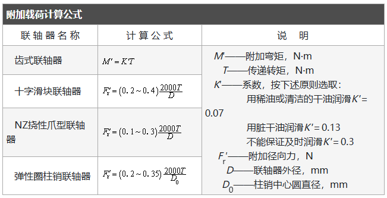

## 精确强度校核计算

### 疲劳强度安全系数校核

主要的轴和批量生产的轴通常采用安全系数法进行校核计算，包括疲劳强度安全系数校核和静强度安全系数校核。

疲劳强度安全系数校核，是在轴经过初步计算和结构设计后，根据轴的实际尺寸，考虑零件的表面质量、应力集中、尺寸影响以及材料的疲劳极限等因素，验算轴的危险截面处的疲劳安全系数。校核公式见表危险截面安全系数*S*的校核公式。

如果计算结果不能满足*S*≥[*S*]，应改进轴的结构，降低应力集中，提高轴的表面质量，采用热处理或表面强化处理等措施或改用强度较高的材质以及加大轴径的方法解决。

一般，轴的疲劳强度是根据长期作用在轴上的最大变载荷进行校核计算的，即按无限疲劳进行设计。其材料的疲劳极限*σ*-1和*τ*-1是应力循环数为107(即循环基数*N*0)时的数值，如果轴在全服务期内，其应力循环数*N*＜*N*0，则按有限寿命设计轴的结构，详细内容可参考有关抗疲劳专著。

### 危险截面安全系数S的校核公式

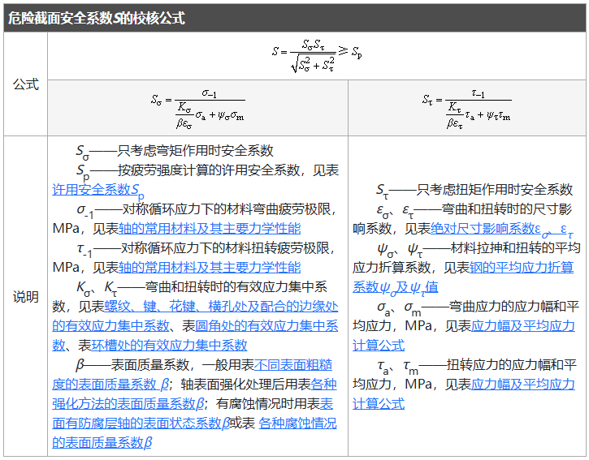

### 应力幅及平均应力计算公式

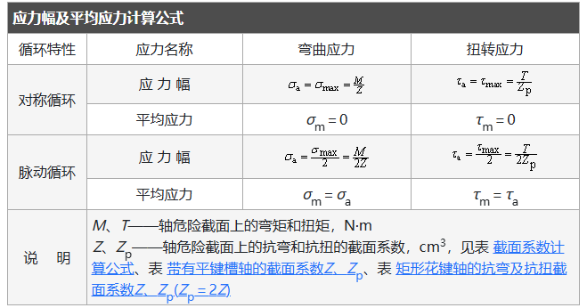

### 许用安全系数Sp

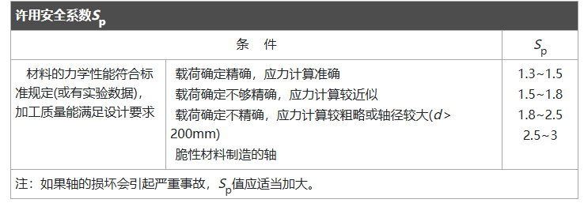

### 截面系数计算公式

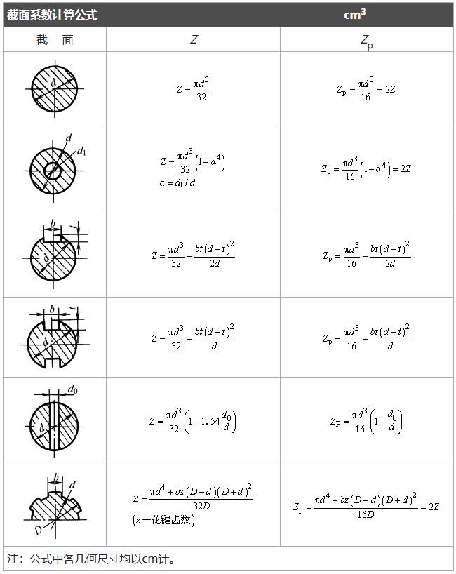

### 带有平键槽轴的截面系数Z、Zp

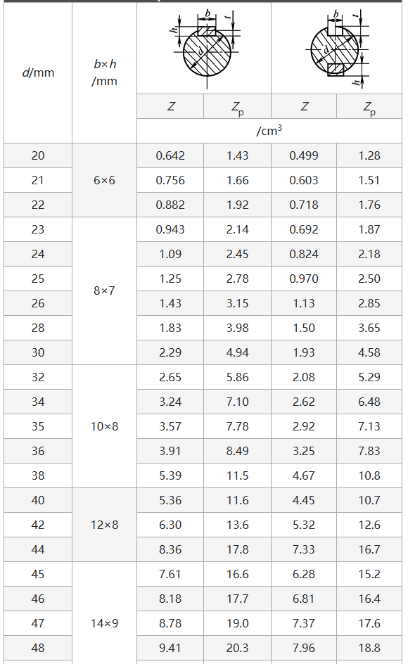

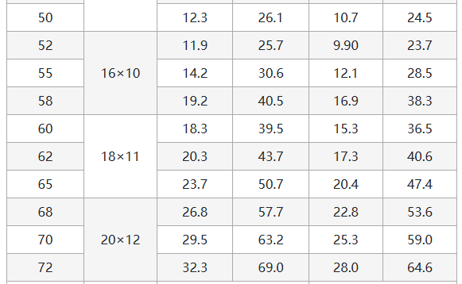

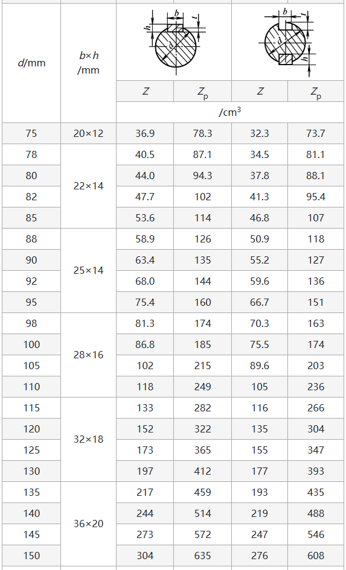

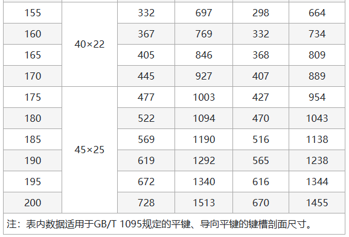

### 矩形花键轴的抗弯及抗扭截面系数Z、Zp(Zp＝2Z)

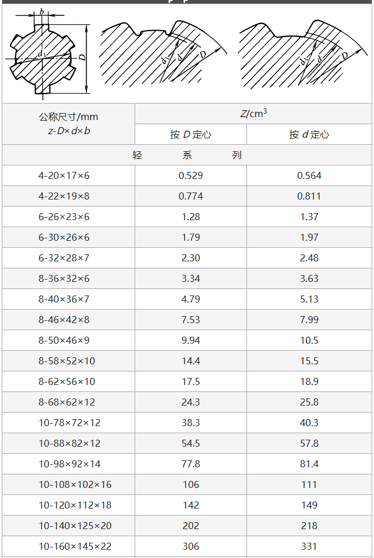

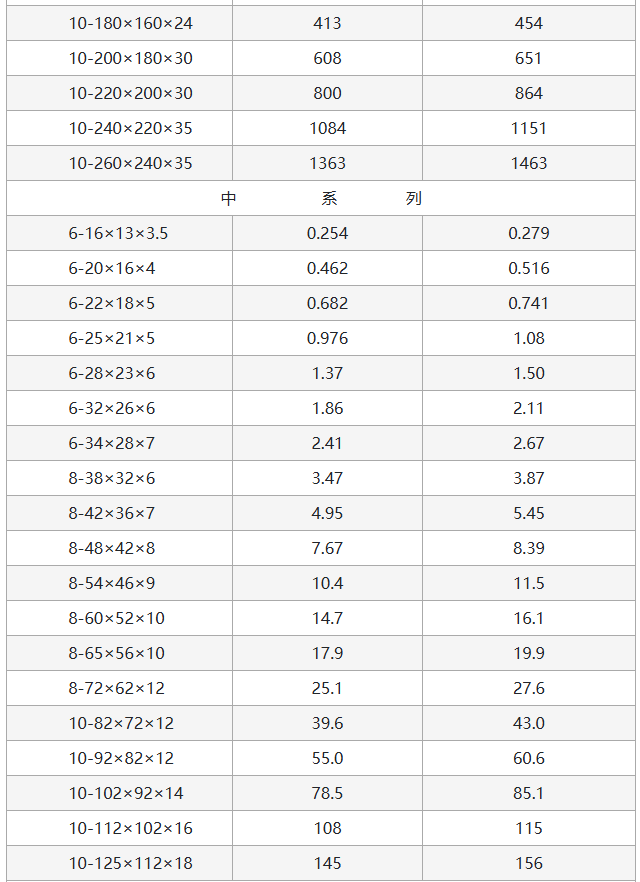

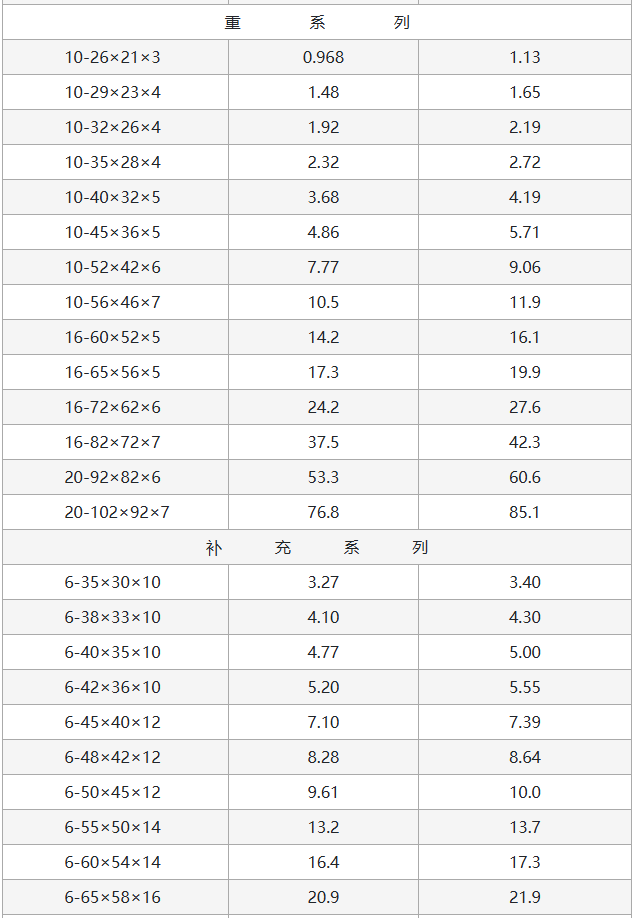

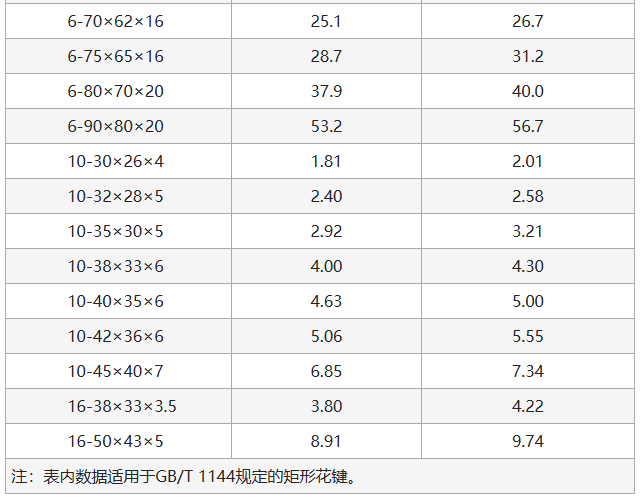

### 螺纹、键、花键、横孔处及配合的边缘处的有效应力集中系数

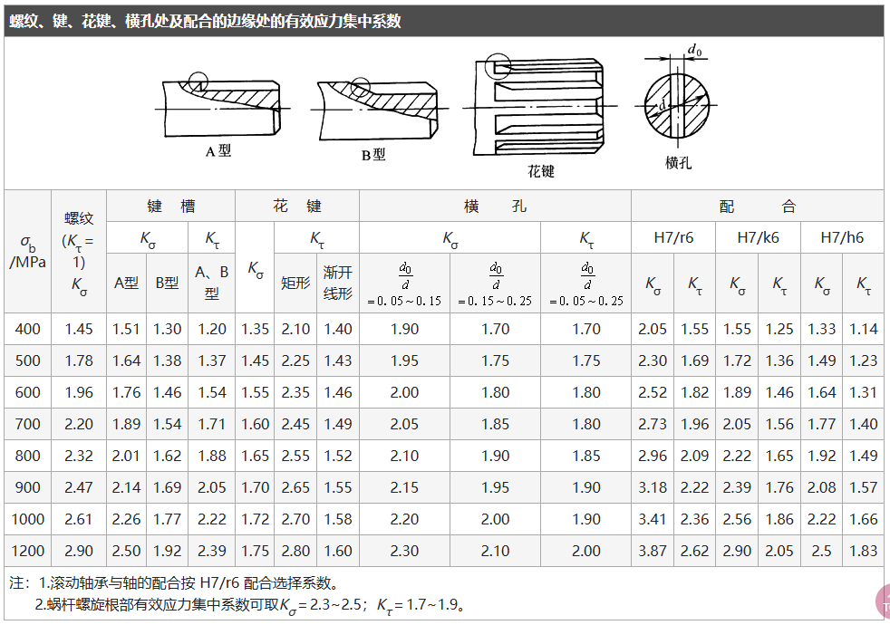

### 圆角处的有效应力集中系数

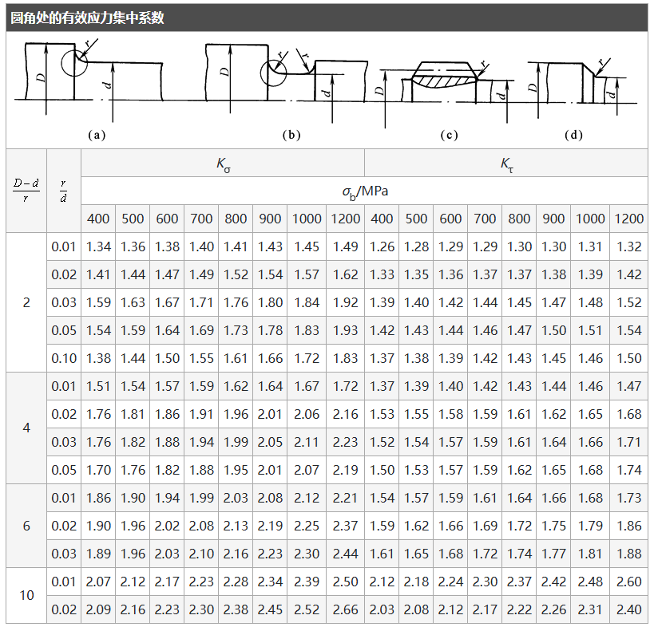

### 环槽处的有效应力集中系数

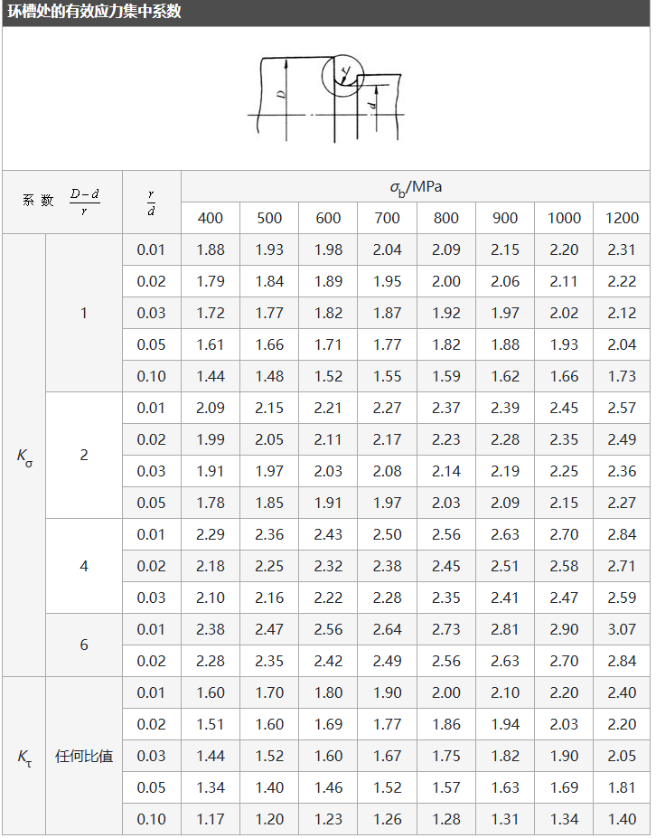

### 钢的平均应力折算系数ψσ及ψτ值

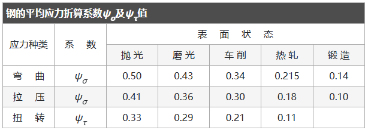

### 绝对尺寸影响系数εσ、ετ

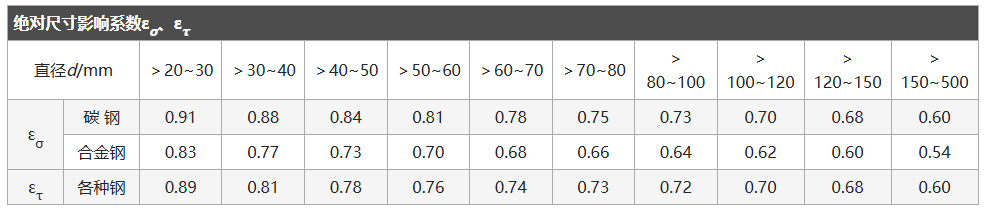

### 表面有防腐层轴的表面状态系数β

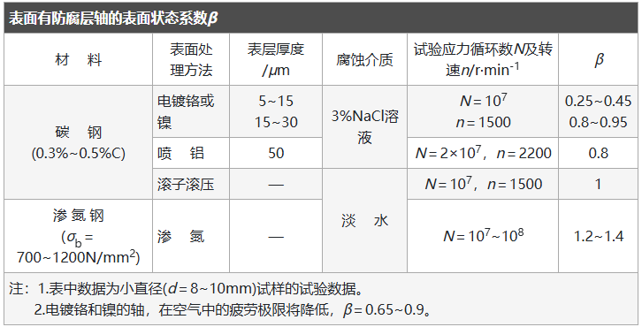

### 不同表面粗糙度的表面质量系数β

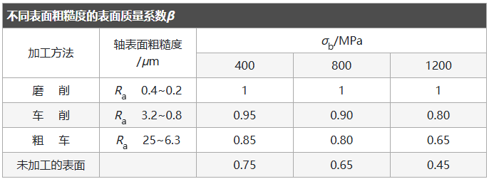

### 各种腐蚀情况的表面质量系数β

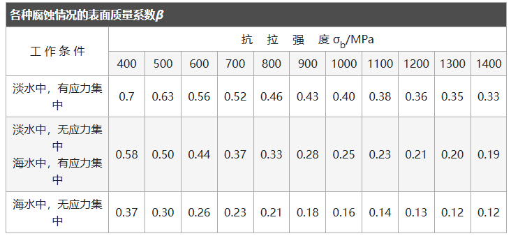

### 各种强化方法的表面质量系数β

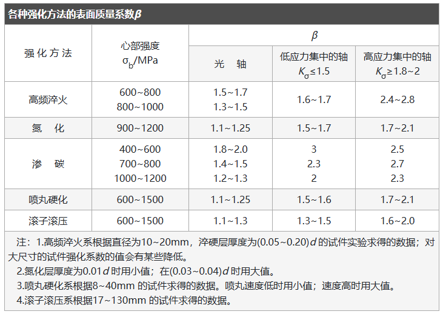

### 静强度安全系数校核

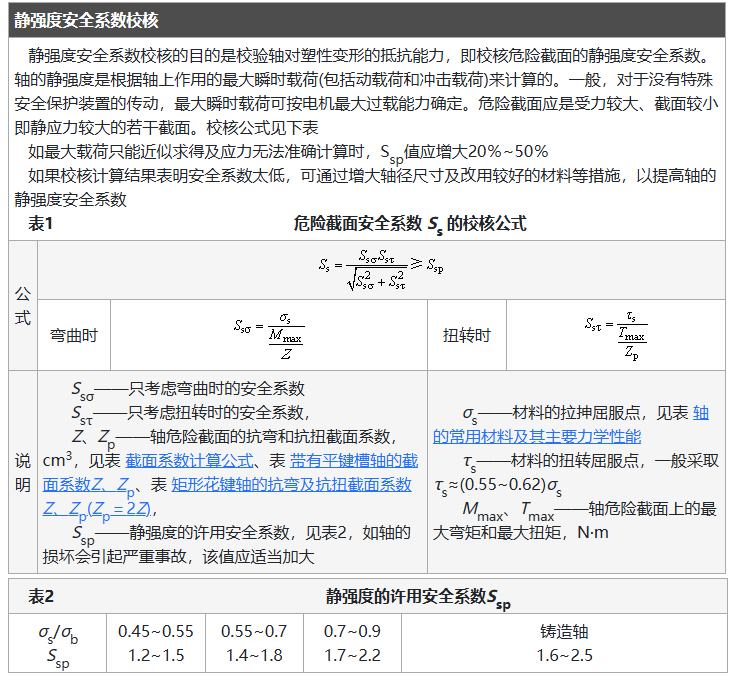