# 轴的结构设计

零件在轴上的定位与固定

提高轴疲劳强度的结构措施

轴颈及轴伸结构

轴的结构示例

## 零件在轴上的定位与固定

### 轴的结构设计

轴的结构设计主要是定出轴的合理外形和轴各段的直径、长度和局部结构。

轴的结构取决于轴的承载性质、大小、方向以及传动布置方案，轴上零件的布置与固定方式，轴承的类型与尺寸，轴毛坯的型式，制造工艺与装配工艺，安装运输条件及制造经济性等。设计轴的合理结构，要考虑的主要因素如下。

① 使轴受力合理，使扭矩合理分流，弯矩合理分配；

② 应尽量减质量，节约材料，尽量采用等强度外形尺寸；

③ 轴上零、部件定位应可靠(如轮毂应长出相关轴段2～3mm等)，(见“零件在轴上的定位与固定”节)；

④ 尽量减少应力集中，提高疲劳强度，(见“轴颈及轴伸结构”节)；

⑤ 要考虑加工工艺所必需的结构要素(如中心孔、螺尾退刀槽、砂轮越程槽等)，尽量减少加工刀具的种类，轴上的倒角、圆角、键槽等应尽可能取相同尺寸，键槽应尽量开在一条线上，以减少装卡次数；

⑥ 要便于装拆和维修，要留有装拆或调整所需的空间和零件所需的滑动距离，轴端或轴的台阶处应有方便装拆的倒角，轴上所有零件应无过盈地装配到位，可采用锥套等易装拆的结构；

⑦ 对于要求刚度大的轴，要考虑减少变形的措施；

⑧ 在满足使用要求的条件下，合理确定轴的加工精度和表面粗糙度，合理确定轴与轴上零件的配合性质；

⑨ 要符合标准零、部件及标准尺寸的规定。

### 轴向定位与固定方法

| 方法       | 简　　 图                                                    | 特 点 与 应 用                                               |
| ---------- | ------------------------------------------------------------ | ------------------------------------------------------------ |
| 轴肩、轴环 | 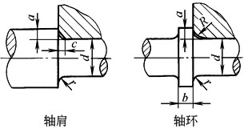 | 结构简单、定位可靠，可承受较大轴向力。常用于齿轮、带轮、链轮、联轴器、轴承等的轴向定位为保证零件紧靠定位面，应使*r*＜*c* 或 *r*＜*R*轴肩高度 *a* 应大于 *R* 或 *c*，通常可取 *a*＝(0.07～0.1)*d*轴环宽度 *b*≈1.4*a*与滚动轴承相配合处的 *a* 与 *r* 值应根据滚动轴承的类型与尺寸确定(见滚动轴承章)，轴肩及轴环将增大轴的坯料直径，增加切削量 |
| 套筒       | 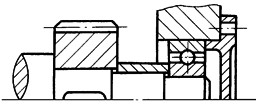 | 结构简单、定位可靠，轴上不需开槽、钻孔和切制螺纹，因而不影响轴的疲劳强度，一般用于零件间距离较小的场合，以免增加结构重量。轴的转速很高时不宜采用套筒两端面的表面粗糙度要与配合面匹配 |
| 轴端挡板   | 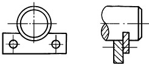 | 适用于心轴的轴端固定，见GB/T 892(单孔)及JB/ZQ 4348(双孔)，既可轴向定位又可周向定位，只能承受小的轴向力 |
| 弹性挡圈   | 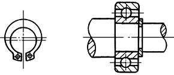 | 结构简单紧凑，只能承受很小的轴向力，常用于固定滚动轴承轴用弹性挡圈的结构尺寸见GB/T 894.1～GB/T 894.2，轴上需开槽，强度被削弱 |
| 紧定螺钉   | 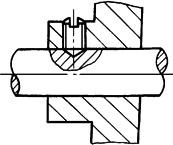 | 适用于轴向力很小、转速很低或仅为防止零件偶然沿轴向滑动的场合。为防止螺钉松动，可加锁圈。紧定螺钉同时亦可起周向固定作用紧定螺钉用孔的结构尺寸见GB/T 71 |
| 锁紧挡圈   | 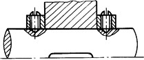 | 结构简单，但不能承受大的轴向力。常用于光轴上零件的固定，有冲击、振动时应有防松措施。螺钉锁紧挡圈的结构尺寸见GB/T 884 |
| 圆锥面     | 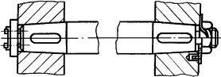 | 能消除轴与轮毂间的径向间隙，装拆较方便，可兼作周向固定，能承受冲击载荷。大多用于轴端零件固定，常于轴端压板或螺母联合使用，使零件获得双向轴向固定。轮毂要长出锥轴段2mm左右，以确保压紧。锥轴及孔加工较难，轴向定位不很准确。高速轻载时可不用键圆锥形轴伸见GB/T 1570 |
| 圆螺母     | 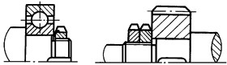 | 固定可靠，装拆方便，可承受较大的轴向力。由于轴上切制螺纹，使轴的疲劳强度有所降低。常用双圆螺母或圆螺母与止动垫圈固定轴端零件，当零件间距离较大时，亦可采用圆螺母代替套筒，以减小结构重量，与轴肩配合达到双向定位。见GB/T 810、GB/T 812及GB/T 858 |
| 轴端挡圈   | 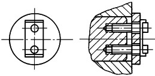 | 常用于固定轴端零件。可以承受剧烈的振动和冲击载荷螺栓紧固轴端挡圈的结构尺寸见GB/T 892(单孔)及JB/ZQ 4347(双孔) |
| 胀紧连接套 | 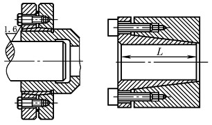 | 既用于轴向定位也用于周向定位轴不需加工键槽，提高了轴的强度。对中性好，压紧力可调整，多次拆卸能保持良好的配合性质。轴的加工精度要求不高可方便地在轴向和周向调整安装位置，拆装方便 |

#### 周向定位与固定方法

| 方法     | 简  图                                                       | 特 点 与 应 用                                               |
| -------- | ------------------------------------------------------------ | ------------------------------------------------------------ |
| 平键     | 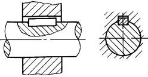 | 制造简单，装拆方便，对中性好。可用于较高精度、高转速及受冲击或变载荷作用下的固定连接中，还可用于一般要求的导向连接中齿轮、蜗轮、带轮与轴的连接常用此形式平键剖面及键槽见GB/T 1096，导向平键见GB/T 1097 |
| 楔键     | 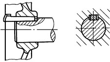 | 在传递扭矩的同时，还能承受单向的轴向力。由于装配后造成轴上零件的偏心或偏斜，故不适用于要求严格对中、有冲击载荷及高速传动的连接。键的钩头长出轴外，供拆卸用，应加保护罩楔键及键槽见GB/T 1563~GB/T 1565 |
| 切向键   | 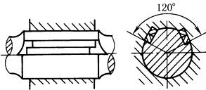 | 可传递较大的扭矩，但对中性较差，对轴的削弱较大，常用于重型机械中一个切向键只能传递一个方向的转矩，传递双向转矩时，要用两个，互成120°，见GB/T 1974 |
| 半圆键   | 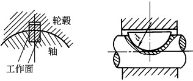 | 键在轴上键槽中能绕其几何中心摆动，故便于轮毂往轴上装配，但轴上键槽很深，削弱了轴的强度用于载荷较小的连接或作为辅助性连接，也用于锥形轴及轮毂连接，见GB/T 1098~GB/T 1099 |
| 滑键     | 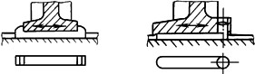 | 键固定在轮毂上，键随轮毂一同沿轴上键槽作轴向移动常用于轴向移动距离较大的场合 |
| 花键     | 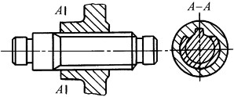 | 有矩形、渐开线及三角形花键之分承载能力高，定心性及导向性好，但制造困难，成本较高。适用于载荷较大和对定心精度要求较高的滑动连接或固定连接三角形齿细小，适于轴径小、轻载或薄壁套筒的连接见GB/T 1144 |
| 圆柱销   | 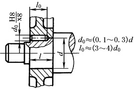 | 适用于轮毂宽度较小(例如l/d＜0.6)，用键连接难以保证轮毂和轴可靠固定的场合。这种连接一般采用过盈配合，并可同时采用几个圆柱销。为避免钻孔时钻头偏斜，要求轴和轮毂的硬度差不能太大 |
| 圆锥销   | 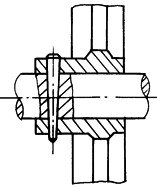 | 用于固定不太重要、受力不大但同时需要轴向固定的零件，或作安全装置用。由于在轴上钻孔，对强度削弱较大，故对重载的轴不宜采用。有冲击或振动时，可采用开尾圆锥销以防松脱 |
| 过盈配合 | 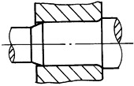 | 结构简单，对中性好，承载能力高，可同时起周向和轴向固定作用，但不宜用于经常拆卸的场合。对于过盈量在中等以下的配合常与平键连接同时采用，以承受较大的交变、振动和冲击载荷过盈配合轴的倒角尺寸见连接与紧固章 |

#### 轴上固定螺钉用孔(JB/ZQ4251-1997)

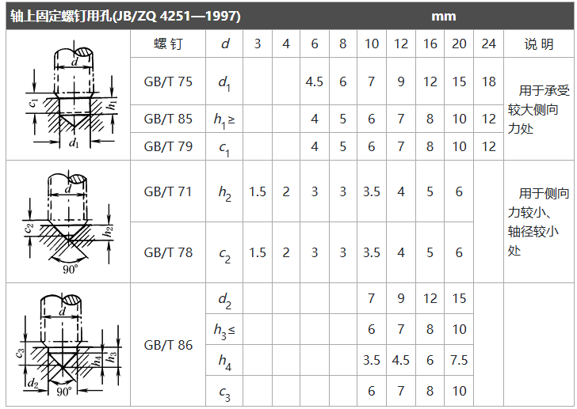

## 提高轴疲劳强度的结构措施

​        在轴截面变化处(如台阶、横孔、键槽等)，会产生应力集中、引起轴的疲劳破坏，所以设计轴的结构时，应考虑降低应力集中的措施。下表提供的主要措施可供参考。由于轴的表面工作应力最大，所以提高轴的表面质量也是提高轴的疲劳强度的重要措施。提高轴的表面质量包括降低轴表面粗糙度值、对轴进行表面处理(如表面热处理、化学处理、机械处理等)，均能提高轴的疲劳强度。

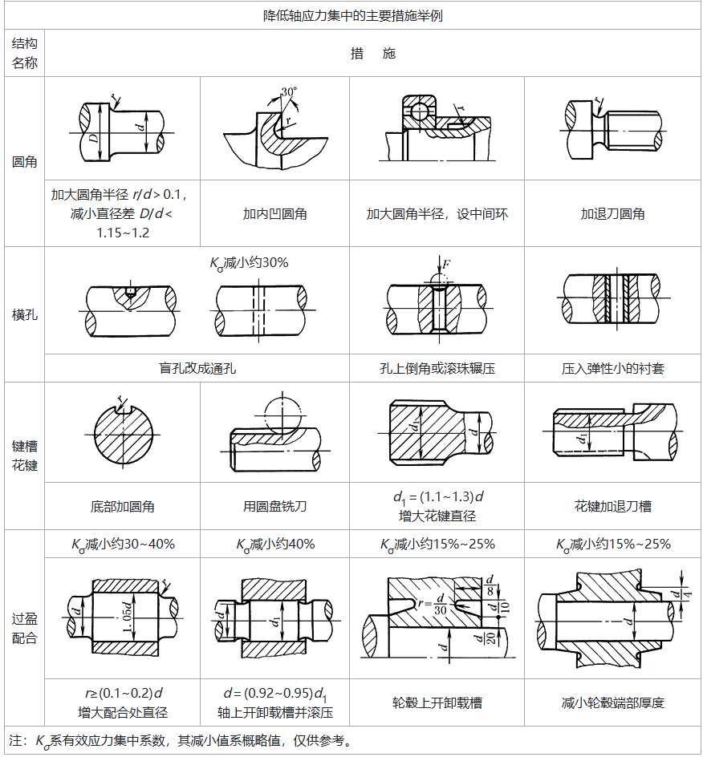

## 轴颈及轴伸结构

### 滑动轴承的轴颈结构尺寸及轴端润滑油孔

#### 向心轴颈

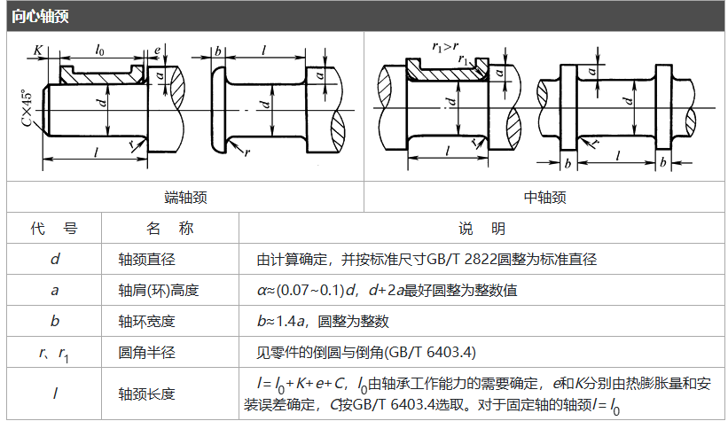

​                                                                                                                                     

#### 止推轴颈

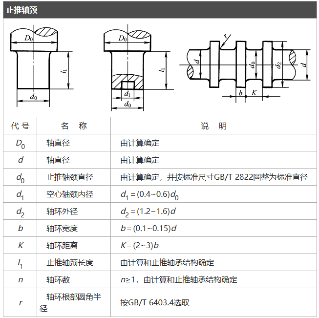

#### 轴端润滑油孔

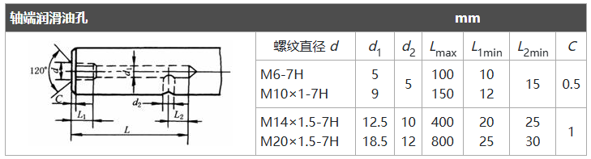

## 轴的结构示例

图为滚动轴承支承的轴的典型结构，各部分结构尺寸及公差等的确定请参阅滚动轴承章有关部分。

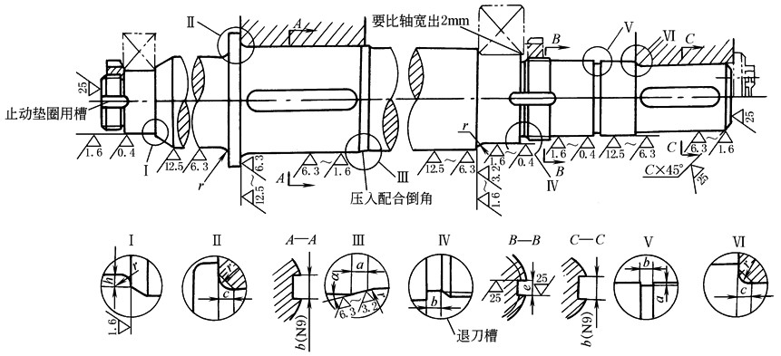

​                                                                                                                       滚动轴承支承的轴的典型结构