# 轴承技术资料说明：配合与游隙

## 一、概述

轴承的配合与游隙是决定其安装可靠性、运行性能及寿命的核心参数。 

配合：指轴承与轴、轴承座之间的公差匹配关系，影响载荷传递和定位精度。 

游隙：轴承内部滚动体与滚道之间的间隙，直接影响轴承的刚性、温升及振动特性。 

科学选择配合与游隙，是优化轴承性能的关键环节。

## 二、配合（Fit）

1. 定义与分类

配合指轴承内圈与轴、外圈与轴承座之间的过盈或间隙量，分为三类： 

过盈配合：轴径 > 轴承内径，外径 < 轴承座孔径（紧配合）。  

间隙配合：轴径 < 轴承内径，外径 > 轴承座孔径（松配合）。  

过渡配合：介于过盈与间隙配合之间，需精确控制公差。 

2. 配合选择原则

| 载荷类型             | 推荐配合                             |
| -------------------- | ------------------------------------ |
| 旋转内圈承受径向载荷 | 内圈过盈配合（轴公差：k5, m6）       |
| 旋转外圈承受径向载荷 | 外圈过盈配合（座孔公差：H7, J7）     |
| 复合载荷或振动工况   | 内外圈均需适当过盈（如轴m6、座孔M7） |

3. 国际标准参考

ISO 286：轴与孔的极限偏差标准。  

JIS B 0401：日本工业标准公差与配合。  

4. 影响因素

负荷方向与大小：冲击载荷需更紧的配合。 

温度变化：高温工况需补偿材料热膨胀差异。 

轴承类型：圆柱滚子轴承对过盈敏感，需谨慎选择。 

##  三、游隙(Clearance)

1. 定义与分类

游隙指无载荷状态下，轴承内部可自由移动的间隙，分为： 

径向游隙：内外圈在径向的相对位移量。 

轴向游隙：内外圈在轴向的相对位移量。 

工作游隙：轴承在安装、温升及负载下的实际间隙（通常小于原始游隙）。

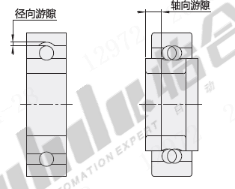

​                                                                                                                        轴承游隙示意图

2. 标准游隙等级  

根据ISO 5753标准，常见游隙组别（以径向游隙为例）：  

| 游隙组别 | 代号     | 适用场景                   |
| -------- | -------- | -------------------------- |
| 标准游隙 | C0       | 普通工况，常温轻载         |
| 小游隙   | C2       | 精密定位，低振动需求       |
| 大游隙   | C3/C4/C5 | 高温、重载或长轴热膨胀补偿 |

3. 游隙选择原则

负载性质：冲击载荷需增大游隙（如C3）。  

转速要求：高速轴承需减小游隙（如C2）以降低振动。  

预紧需求：角接触轴承可通过预紧消除游隙，提高刚性。 

4. 影响因素

安装配合：过盈配合会减少原始游隙（通常减少量≈过盈量的70%）。  

温度变化：内外圈温差每升高10°C，游隙减少约0.01mm（钢制轴承）。  

润滑剂填充量：过量润滑脂可能导致工作游隙异常。 

## 四、配合与游隙的关联性 

1. 动态平衡：过盈配合会压缩游隙，需在设计中同步计算。  

公式参考：实际工作游隙 = 原始游隙 - 过盈量 × 0.7 - 温升导致的游隙变化  

2. 矛盾与协调：  

高刚性需求（如机床主轴）需紧配合+小游隙+预紧。  

高温长轴（如风机）需松配合+大游隙（C4）补偿热膨胀。

## 五、应用建议 

1. 典型场景选型  

| 设备类型     | 推荐配合          | 推荐游隙 | 说明               |
| ------------ | ----------------- | -------- | ------------------ |
| 普通电机     | 轴g6 / 座H7       | C0       | 平衡成本与可靠性   |
| 机床主轴     | 轴m5 / 座J6       | C2       | 高刚性+低振动      |
| 汽车轮毂轴承 | 轴过盈+座过渡配合 | C3       | 补偿冲击与温度变化 |

2. 检测与调整  

游隙测量：塞尺法、轴向推拉法（需专用仪表）。 

配合检测：过盈量可用气动量仪或激光扫描。 

现场修正：通过研磨轴颈或轴承座微调配合。 

3. 维护注意事项  

避免敲击安装导致游隙不可逆损失。 

定期监测温升与振动，判断游隙是否异常。

## 六、结语

轴承的配合与游隙设计需综合考虑载荷、转速、温度及安装条件，二者共同决定了轴承的静态承载能力与动态运行品质。

参考文献

ISO 5753:2015《滚动轴承—径向游隙》  

ISO 286-1:2010《产品几何技术规范（GPS）—线性尺寸公差》  

《滚动轴承应用手册》（机械工业出版社）

附件：轴承内部游隙查询表：

深沟球轴承径向游隙 单位um

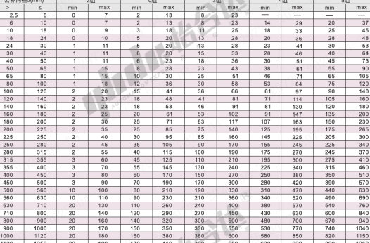

圆柱孔调心球轴承径向游隙 单位um

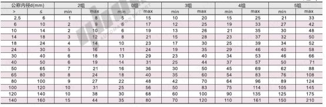

圆锥孔调心球轴承径向游隙 单位um

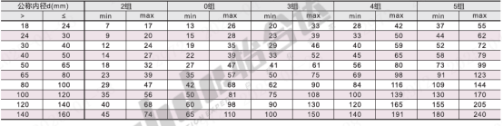

圆柱孔调心滚子轴承径向游隙 单位um

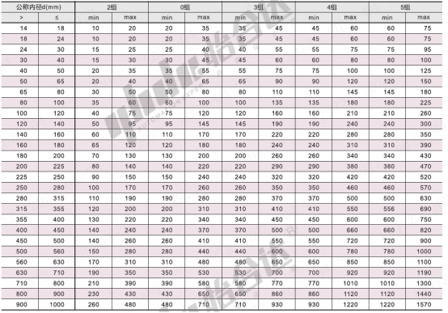

圆锥孔调心滚子轴承径向游隙 单位um

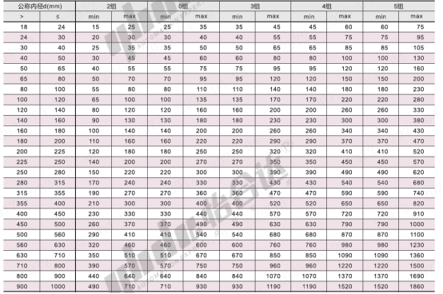

圆柱孔滚子轴承径向游隙 单位um

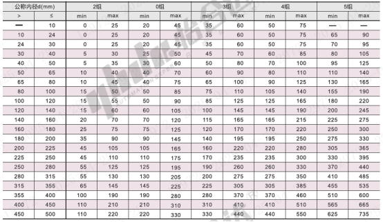

圆柱孔双列滚子轴承径向游隙 单位um

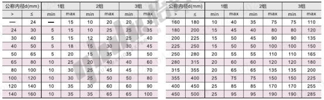

圆锥孔双列滚子轴承径向游隙 单位um

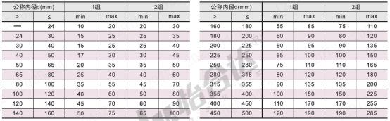

角接触球轴承轴向游隙

单列角接触球轴承轴向游隙取决于接触要求，双列角接触球轴承游隙如下表所示：

双列角接触球轴承轴向游隙 单位um

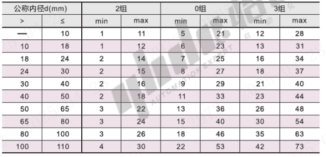

圆锥滚子轴承的径向游隙 单位um

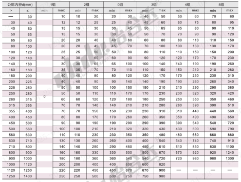