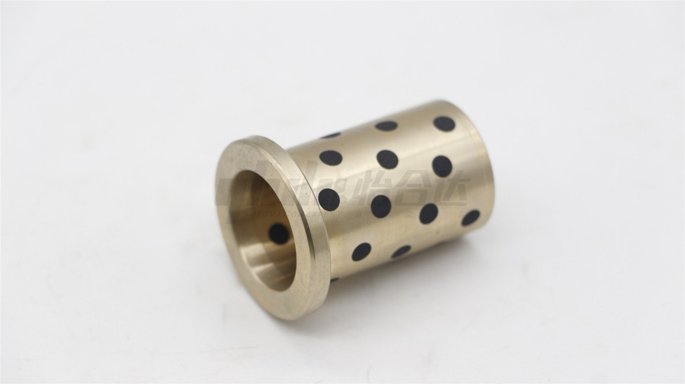
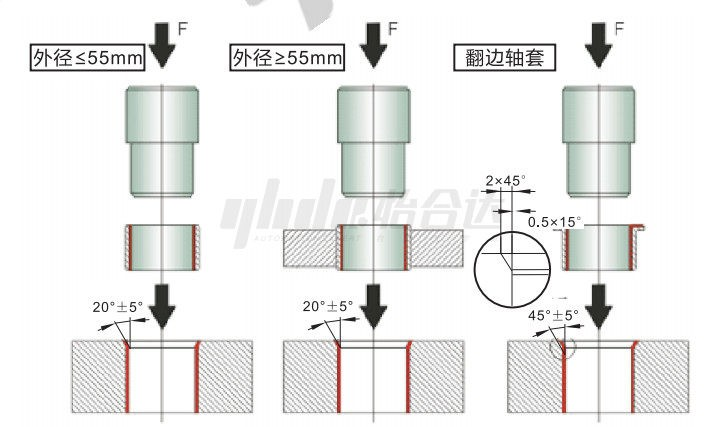

# 铜合金无油衬套-产品知识介绍

## 一、什么是铜合金无油衬套

用高力黄铜做基体材料，石墨作为润滑材料制作而成的自润滑轴承。

## **二、产品组成**

基体材料是高力黄铜（SP2），润滑材料为石墨。

## **三、使用场合**

适用于要求相对重载低速或者直线旋转等多种复合运动的场合。

## **四、产品特点**

（1）维护频率低。

（2）承载高，抗冲击性强。

（3）衬套厚度薄、结构设计紧凑。

（4）既可用于直线运动又可用于旋转运动等多种复合运动。

（5）适用于“高温”、“低温”的严苛温度条件和液体等特殊环境。

## **五、产品选用原则**

（1）使用环境：工作温度、负载、运行速度、使用频率、是否加油。

（2）选择衬套规格尺寸、形状。

（3）确认轴承的使用寿命和可靠性要求。

## **六、产品安装**

（1）装配前应确保衬套、座孔表面无异物,座孔表面应尽可能光洁以免在装配时划伤。

（2）装配时可在衬套外表面适当涂上少量润滑油，采用治具慢慢压入(建议使用油压机或台钳)禁止直接敲打轴套以免发生变形。

（3）衬套在高承载、往复运动时，建议使用螺钉固定。

## **七、产品保养**

保养：建议定期加油润滑、检查磨损度

## **八、使用注意事项**

1）铜合金无油衬套的工作温度范围是多少？

​    工作温度范围是：无加油-40～200℃ / 定期加油-40～150℃

（2）配套轴公差如何选择？

​    内径F7型配套轴推荐公差：d8：一般用（高载荷）

​                            e7：一般用（轻载荷）

​                            f8：高精度用

​                            g6：高精度用（间歇运动）

​    内径G6型配套轴推荐公差：g6：高精度用

## **九、示例案例**

（1）汽车（油漆，装配输送线的衣架、焊接工装治夹具等）

（2）食品/医疗产品/化妆品（贴标机，灌装机，封盖机，包装机，检验机，称重机）

（3）工厂设备（零件进给器，切割机，加工机，装配机等）

（4）物流设备（叉车、AGV车、输送线等）

（5）其他（新能源，模具，检测设备，工业机器人，卡盘机构，提升机构，各种导向/链接等）（5）其他（新能源，模具，检测设备，工业机器人，卡盘机构，提升机构，各种导向/链接等）